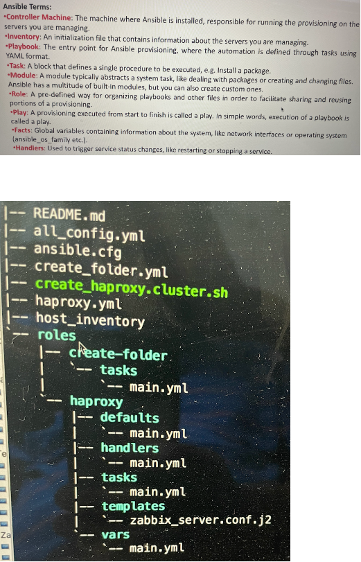
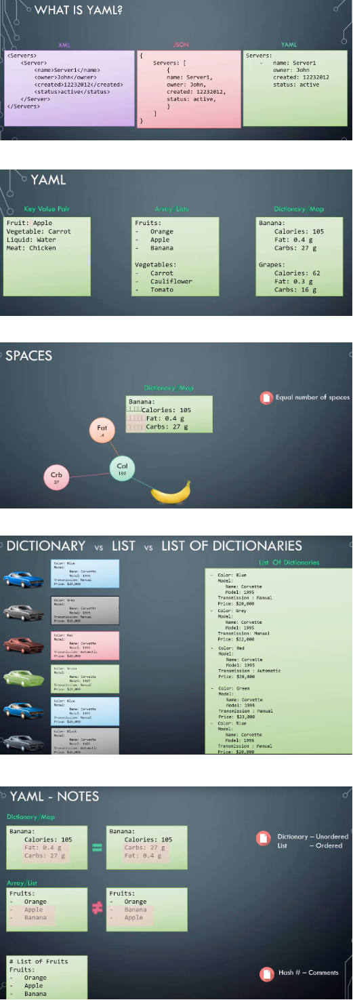

# Ansible

### What is Ansible
Ansible is a powerful IT automation/orchestration tool that we can learn quickly. It's simple enough for everyone in IT, yet powerful enough to automate even the most complex deployments. In the past, something that took developing a complex script, now takes just a few lines of instruction in an Ansible automation playbook.

Ansible is a software tool that provides simple but powerful automation for cross-platform computer support. It is primarily intended for IT professionals, who use it for application deployment, updates on workstations and servers, cloud provisioning, configuration management, intra-service orchestration, and nearly anything a systems administrator does on a weekly or daily basis. Ansible doesn't depend on agent software and has no additional security infrastructure, so it's easy to deploy.

Because Ansible is all about automation, it requires instructions to accomplish each job. With everything written down in simple script form, it's easy to do version control. The practical result of this is a major contribution to the "infrastructure as code" movement in IT: the idea that the maintenance of server and client infrastructure can and should be treated the same as software development, with repositories of self-documenting, proven, and executable solutions capable of running an organization regardless of staff changes.

While Ansible may be at the forefront of automation, systems administration, and DevOps, it's also useful to everyday users. Ansible allows you to configure not just one computer, but potentially a whole network of computers at once, and using it requires no programming skills. Instructions written for Ansible are human-readable. Whether you're entirely new to computers or an expert, Ansible files are easy to understand.


### Why Ansible
- Virtual Machine Provisioning
- Configuration management
- Continuous delivery
- Application deployment
- Security compliance
If we write any  script like bash to perfrom any of the above mentioned operations it takes lot of time, coding skills and maintenance. But Ansible is simple, powerfull and agentless.

### How Ansible Works
In Ansible, there are two categories of computers: the **control node and managed nodes**. The control node is a computer that runs Ansible. There must be at least one control node, although a backup control node may also exist. A managed node is any device being managed by the control node.

Ansible works by connecting to nodes (clients, servers, or whatever you're configuring) on a network, and then sending a small program called an Ansible module to that node. Ansible executes these modules over SSH and removes them when finished. The only requirement for this interaction is that your Ansible control node has login access to the managed nodes. SSH keys are the most common way to provide access, but other forms of authentication are also supported.

### What Ansible does
The term Ansible modules sounds complex, but most of the complexity is handled by Ansible and not the user. An Ansible module is written to be a model of the desired state of a system, meaning that each module defines what should be true on any given managed node. For instance, if a systems administrator decides that all workstations in an organization should have LibreOffice version X.Z installed, then it's up to Ansible's packaging module to determine whether each node has LibreOffice X.Z on it. Should Ansible find a managed node with LibreOffice X.Y installed, then it detects the operating system and runs the necessary routine to update it to LibreOffice X.Z. In this way, every workstation in an organization can be updated overnight with the software supported by the IT department.

Maintaining infrastructure is about more than just checking versions of software, though. When people talk about using Ansible, what they're really referring to is using Ansible modules, because those are the parts of Ansible that perform specific tasks. Should you need to automate something across several computers, take a look at Ansible modules to find the one that handles the task you need to be performed, and then install Ansible so you can configure and invoke that module. If you are a programmer, you can also write your own custom modules to perform specialized tasks. If your module is generally useful, you can also submit it to the Ansible project for inclusion so others can benefit from your work.

### Ansible use cases

Imagine you have a number of hosts in your environment that you would like to restart in a particular order. Some of them are web servers and others are database servers so you would like to power down the web servers first, followed by the database servers, and then power up the database servers and then the web servers. You could write an Ansible playbook to get this done in a matter of minutes and simply invoke the Ansible playbook every time you wish to restart your application.

Lets consider another example where we are setting up a complex infrastructure that spans across public and private clouds and that includes hundreds of VMs. With Ansible, you could provision VMs on public clouds like Amazon and as well as private cloud environments like VMware, and move on to configuring applications on those and setting up communication between them, such as modifying configuration files, installing applications on them, configuring firewall rules, etc. There are a lot of built-in modules available
in Ansible that supports these kind of operations.

--- 

## Understanding Ansible terms and directory structure



---

## Configuring and running inventory file (inventory.txt file)

Ansible can work with one or multiple systems in your infrastructure at the same time. In order to work with multiple servers Ansible needs to establish connectivity to those servers. This is done using SSH
for Linux and PowerShell Remoting for Windows. That's what makes Ansible Agentless. Agentless means that you don't need to install any additional software on the target machines to be able to work with Ansible. A simple SSH connectivity would suffice Ansible's needs. One of the major disadvantages of most other orchestration tools is that you are required to configure an agent on the target systems before you can invoke any kind of automation.

Now, information about these target systems is stored in an inventory file. If you don't create a new inventory file Ansible uses the default inventory file located at etc/Ansible/hosts location.

The inventory file is in an INI like format. It's simply a number of servers listed, one after the other. You can also group different servers together by defining it under the name of the group within square brackets, and define the list of servers part of that group in the lines below. You can have multiple groups defined in a single inventory file.

```
server1.company.com
server2.company.com

[mail]
server3.company.com
server4.company.com

[db]
server5.company.com
server6.company.com

[web]
server7.company.com
server8.company.com
```

We can refer these servers in Ansible using an alias such as web server or database server. We could do this by adding an alias for each server at the beginning of the line and assigning the address of that server to `ansible_host` parameter.

```
web ansible_host=server1.company.com
db ansible_host=server2.company.com
mail ansible_host=server3.company.com
web2 ansible_host=server14.company.com
```

We could also set it to local host to indicate that we would like to work with the local host and not connect to any remote hosts. If we don't have multiple servers to play around with we could simply start with a local host in your inventory file.
```
localhost ansible_connection=localhost
```

### Ansible inventory parameters
There are many parameters which we can define in inventory file like below:

- `ansible_host`: is an inventory parameter used to specify the FQDN or IP address of a server.
- `ansible_connection`: defines how Ansible connects to the target server. It can be either ssh, winrm, or localhost to work with local system.
- `ansible_port`: Defines which part to connect to. By default, it is set to port 22 for SSH, but if you need to change, you can set it differently using this.
- `ansible_user`: Defines the user used to make remote connections. By default this is set to root for Linux machines.
- `ansible_ssh_pass`: Defines the ssh password for Linux. 

### Run inventory file
- Create a file inventory.txt with below content
```
target1 ansible_host=192.168.1.114 ansible_ssh_pass=password
```

- Run the inventory.txt file
```
ansible target1 -m ping -i inventory.txt

target1: alias for ansible host
-m: name of the Ansible module
-i: inventory file name
```

When we run the above command, it will perform a ping test, through Aasible and make sure that it can establish a successful connectivity to target machine. In this case, it says it's success and it comes back with a pong message. And so, that confirms that ansible controller can successfully communicate or connect to the target machine.

---

## YAML Files
A YAML file is used to represent data, in this case, configuration data. Ansible Playbooks are text files or configuration files rather, that are written in a particular format called YAML. 



---

## Ansible Playbooks

Ansible Playbooks are Ansible's orchestration language. It is in Playbooks where we define what we want Ansible to do. It is a set of instructions you provide Ansible to work its magic.

For example, it can be as simple as running a series of commands on different servers in a sequence, and restarting those servers in a particular order. Or it could be as complex as deploying hundreds of VMs in a public and private cloud infrastructure, provisioning storage to VMs, setting up their network and cluster configurations, configuring applications on them such as web server or a database server, setting up load balancing, setting up monitoring components, installing and configuring backup clients and updating configuration database with information.

```
Run command1 on server1
Run command2 on server2
Run command3 on server3
Restarting server1
Restarting server2
Restarting server3
```

- Playbook: A playbook is a single YAML file(playbook.yml) containing a set of plays.
- Play: A play defines a set of activities or tasks to be run on a single or a group of hosts.
- Tasks: A task is a single action to be performed on a host. We can define list of tasks which will be executed ony after the other in the same defined order.
    - Some examples of a task are executing a command or run a script on the host, installing a package on the host, or performing a shutdown or a restart operation.
- module: The different actions run by tasks are called modules.    

Simple playbook.yml
```
-
    name: Play1
    hosts: localhost (This could be any alias from inventory file)
    tasks:
        - name: Test connectivity
          ping: (ping module does not need any attribute)
        - name: Execute command `date`
          command: date (Module name followed by attribute and value if it has any means)

        - name: Execute script on server
          script: test_script.sh (Module name followed by attribute)

-
    name: Play2
    hosts: localhost
    tasks:
        - name: Install httpd service
          yum: 
            name: httpd
            state: present

        - name: Start web server
          service: 
            name: httpd
            state: started

```

Remember, the host you want to perform these operations against is always set at a play level. If you specify a group, the listed tasks will be executed on all the hosts listed under that group simultaneously.  In the above example command, script, yum and service are all Ansible modules. There are hundreds of other modules available out of the box. Information about these modules is available in the Ansible documentation website, or you could simply run the `ansible-doc -l` command.

To run or execute ansible playbook, run the command `ansible-playbook <playbook file name>` or `ansible-playbook <playbook file name> -i <inventory file>`
Run `ansible-playbook --help` command to see additional available commands.

We can Run ansible in two ways. First using the ansible command and then using the ansible-playbook command.
- Ansible command: Sometimes you may want to use ansible for a one-off task such as to test connectivity between the ansible controller and the targets, or to run a command, say for example to shut down a set of servers. In that case, you can get away without writing a playbook by running the ansible command followed by the host and the command to reboot the host. We also use this ansible command to use the ping module to test connectivity to the target servers.
- Ansible Playbook Command: Ansible playbook is used to run some series of tasks.

---

## Ansible Modules

Ansible modules are categorized, into various groups based on their functionality. Some of them are:

- System: System modules are actions to be performed, at a system level such as modifying the users and groups on the system, modifying IP tables, firewall configurations on the system, working with logical volume groups, mounting operations or working with services. For example, starting, stopping or restarting services in a system.
- Commands/Scripts: Command modules are used to execute commands or scripts on a host. This could be simple commands using the command module or an interactive execution using the expect module, by responding to prompts. You could also run a script on the host, using the script module. Script module runs a local script on a remote node after transferring it. Example:
```
- 
    name: Play1
    host: localhost
    tasks:
        - name: Display resolv.conf content
          command: cat resolv.conf chdir=/etc (This will ensure that Ansible changes directory,
to /etc before executing the command.)
        - name: Create a folder if it does not exist
          command: mkdir /folder creates=/folder (this command will only run if the folder does not exist)
        - name: Copy a file
          copy: src=/source_file dest=destination
        - name: Run a script on remote node
          script: /some/local/script.sh -arg1 -arg2
```
- Files: File modules help work with files. For example, use the ACL module, to set and retrieve ACL information on files. Use the archive and un-archive modules to compress and unpack files. Use find, lineinfile and replace modules, to modify the contents of an existing file.
- Database: Database modules help in working with databases, such as MongoDB, MySQL, MSSQL or PostgreSQL, to add or remove databases or modify database configurations.
- Cloud: The cloud section has a vast collection of modules, for various different cloud providers, like Amazon, Azure, Docker, Google, Openstack and VMware being just a few of them. There are a number of modules available for each of these, that allow you to perform various tasks, such as creating and destroying instances, performing configuration changes in networking and security, managing containers, data centers, clusters, virtual networking, VSAN and a lot more.
- Windows: Windows module help you use Ansible in a Windows environment.
- Service: The service module is used to maintain services, on a system such as starting, stopping or restarting a service. Example:
```
- 
    name: Start servcies in the order
    host: localhost
    tasks:
        - name: Start the database service
          service: name=postgresql state=started
          (OR)
          service:
            name: postgresql
            state: started (expected state. If its not started, then start it. If its already running, then do nothing)
```

**lineinfile**
Search for a line in a file and replace it or add it if it does not exist.
playbook.yml
```
-
    name: Add DNS server to resolv.conf
    hosts: localhost
    tasks:
        - lineinfile:
              path: /etc/resolv.conf
              line: 'nameserver 10.1.255.10'
```
If we run the Ansible playbook multiple times, it will ensure there's only a single entry of the above line in the file.

---

## Ansible Variables
Just like any other scripting or programming language, variables are used to store values that varies with different items. For example, let's say we are trying to perform the same operation of applying patches to hundreds of servers, we only need a single playbook for all hundred servers. However, it's the variables that store information about the different host names, usernames, or passwords that are different for each server.

For example in the below inventory file ansible_host and ansible_ssh_pass are example for variables
```
target1 ansible_host=192.168.1.114 ansible_ssh_pass=password
```

We could define and use variables inside the playbook. For example:
```
-
    name: Add DNS server to resolv.conf
    hosts: localhost
    vars:
        dns_server: 10.1.250.10 (define variables)
    tasks:
        - lineinfile:
            path: /etc/resolv.conf
            line: 'nameserver {{ dns_server }}' (Use the variable name with curly braces always within quotes)    

```
Also, we can define some separate file for all the variables and use it.

---

## Ansible Conditionals

Lets say we want to install nginx in debian and redhat systems. For that we can write 2 different playbooks one for each like below:
```
-
    name: Insatll NGINX
    hosts: debian_hosts
    tasks:
    - name: Install NGINX on Debian
      apt: (apt is the package manager in Debian)
        name: nginx
        state: present
```

```
-
    name: Insatll NGINX
    hosts: redhat_hosts
    tasks:
    - name: Install NGINX on Redhat
      yum: (yum is the package manager in Redhat)
        name: nginx
        state: present
```

Now instaed of writing 2 different playbooks, we can write a single playbook by using conditional statement.

```
-
    name: Insatll NGINX
    hosts: all
    tasks:
    - name: Install NGINX on Debian
      apt: (apt is the package manager in Debian)
        name: nginx
        state: present
      when: ansible_os_family == "Debian"  (use conditional when statement with == operator)
    - name: Install NGINX on Redhat
      yum: (yum is the package manager in Redhat)
        name: nginx
        state: present    
      when: ansible_os_family == "Redhat" or (and)
            ansible_os_family == "SUSE" 
```

### Conditinals

We can use conditinal statement (when) in the loop statements also as shown below:

```
-
    name: Insatll list pf SOFTWARES
    hosts: all
    vars:
        packages:
            - name: nginx
              required: True
            - name: mysql
              required: True
            - name: apache
              required: False
    tasks:
    - name: Install "{{ item.name }}" on Debian
      apt: (apt is the package manager in Debian)
        name: "{{ item.name }}"
        state: present
      when: item.required == True
      loop: " {{packages}} "
```

COnsider another example below, where it checks if httpd service is down or not, and if it is down it will send an email. We could use the registered directive to record the output of one task and pass it to the other task.

```
-
    name: Check status of a service and email if its down
    hosts: localhost
    tasks:
        - command: service httpd status
          register: result (register the output to the result variable)
        - mail:
            to: admin@company.com
            subject: Service Alert
            body: Httpd service is down
            when: result.stdout.find('down') != -1
```

---

## Ansible Loop

Loop is a looping directive that executes the same task multiple number of times. Each time it runs, it stores the value of each item in the loop in a variable named `item`.

Below is the example for the loop:

```
-
    name: Create users
    hosts: localhost
    tasks:
        - user: 
            name: "{{item.name}}"
            state: present
            uid: "{{item.uid}}"
          loop:
            - { name: joe, uid: 101 }
            - { name: ravi, uid: 102 }
            - { name: mani uid: 103 }
            - { name: mike, uid: 104 }     
```

### with_*

There's another way to create loops in playbooks. And that is using the **with_items** directives. In the past we just had the with_items directive instead of loop in Ansible.

We have other directives such as, **with_files** that iterate over multiple files, **with_url** that connects to multiple urls, **with_mongodb** that connects to multiple mongodb data bases.

---

## Ansible Roles

Just like how we would assign roles to different people in the real world, making them doctors engineers, astronauts, policemen, or chef. In the Ansible world, you would assign roles to blank servers to make them a database server or a web server or a Redis messaging server or a backup server.

In the automation world assigning a role means doing everything you need to do to make a blank server a database server such as installing the prerequisites required for MySQL, installing MySQL packages themselves, configuring the MySQL service and finally configuring database with our users.

With a web server it would be, again, installing the prerequisites for Nginx, installing Nginx packages, configuring Nginx services and configuring the custom webpages.

We know how to get these tasks done using Ansible playbooks. We can write a simple playbook with multiple tasks for each of these. But then, if you can do this in a playbook why do you need roles? This set of tasks, to install and perform basic configurations on a MySQL database is going to remain mostly common.

Once a person develops this Ansible playbook it can be shared with hundreds of thousands of others trying to do the same thing, install MySQL. Instead of all of them rewriting this piece of code you could package it into a role and reuse it later. 

Next time, you could simply assign the role you created and in a playbook like below, be it a single server
or hundreds of servers, that's all you need. So that's the primary purpose of roles to make your work reusable be it for other tasks or projects within your organization or outside for others globally.

To summarize, roles make it really easy to develop, reuse and share Ansible playbooks.

```
MySQL-Role

tasks:
    - name: Install Pre-Requisites
      yum: name=pre-req-packages state=present
    - name: Install MySQL Packages
      yum: name=mysql state=present
    - name: Start MySQL Service
      yum: name=mysql state=started
    - name: Configure Database
      yum: name=db1 state=present    
```

```
- name: Install and Configure MySQL
  hosts: db-server1, db-server2 .... db-server100
  roles:
    - mysql
```

Roles also help in organizing your code within Ansible. Roles introduce a set of best practices that must be followed:
- tasks: All tasks into a task directory.
- vars: All variables used by these tasks in the vars directory.
- defaults: Any default values goes into the default directory.
- handlers: All handlers go into the handlers directory.
- templates: Any templates used by the playbooks go into the templates directory.

**Ansible Galaxy** is one community where you can find thousands of roles for almost any task you can think of.

### How do you get started with roles?
We create the directory structure required for a role but you don't have to do that manually. Ansible Galaxy has a neat tool that can create a skeleton for you. Use the `ansible-galaxy init mysql` command to initialize and create a directory structure. This will creates the following structure:
```
mysql
    README.md
    templates (configuration file of any service)
    tasks (list of tasks)
    handlers (to start, stop or restart any service)
    vars
    defaults
    meta
```

### How do you use your role within your playbook?
Say I have my simple playbook within a directory called `my-playbook`.
`playbook.yml` file contains a simple play to install and configure MySQL on my TP server.

```
playbook.yml
- name: Install and Configure MySQL
  hosts: db-server
  roles:   
    - mysql
```

I would like to assign the role I created using the roles directive like above, but if I were to do that
how does my playbook know where that role is?

There are different ways to do that.

- I could create a directory called `roles` within `my-playbook` folder and move the role `mysql` I created under it.
- Or you can move the roles to a common directory designated for roles on your system at `/etc/ansible/roles` location. That's the default location where Ansible searches for roles if it can't be found in your playbooks directory. Of course, that's defined in the Ansible configuration file as roles path, which you can modify if required.

Once you have created your role and placed it in your roles directory and used it in a playbook you may share it with the community by uploading it to Ansible Galaxy through a GitHub repository. 

To use a role from ansible galaxy, run the `ansible-galaxy install` command with the name of the role. for example: `ansible-galaxy install geerlingguy.mysql`. The role is extracted to the default roles directory at `/etc/ansible/roles` location. The roles can now be used in your playbook by specifying the same name.

Another way to specify roles, as an array of dictionaries. This will allow you to pass in additional options
to the role, such as to execute the role by escalating privileges, by specifying the become directive or to pass in additional parameters like the MySQL_user_name option etc.
```
- name: Install and Configure MySQL
  hosts: db-server
  roles:   
    - role: geerlingguy.mysql
      become: yes
      vars:
        mysql_user_name: db_user
```

To configure a single server with both database and web application on it assign both roles to it.
```
- name: Install and Configure MySQL and NGInx
  hosts: db-and-webserver
  roles: 
    - geerlingguy.mysql
    - nginx
```
To configure it separately on separate servers create two plays in the playbook, one for each server and assign the respective roles to them.

To view a list of roles currently installed on the Ansible Galaxy use list command `ansible-galaxy list`

---

## Steps to install and configure HaProxy Load Balancer through Ansible

Refer this GitHub Repo: https://github.com/myusufe/haproxy/tree/master/ansible
Refer this Udemy course: https://ibm-learning.udemy.com/course/become-haproxy-load-balancer-expert

In the Inventory file we define 2 VM IP address for the HAProxy cluster.

We have below mentioned tasks for installing HAProxy:
- Create VMWare Guest Virtual Machine
- Create local repo
- Install HAProxy
- Copy haproxy.cfg file
- Copy haproxy error files

We use below Ansible Modules:
- VMWare Guest Virtual Machine
- apt


