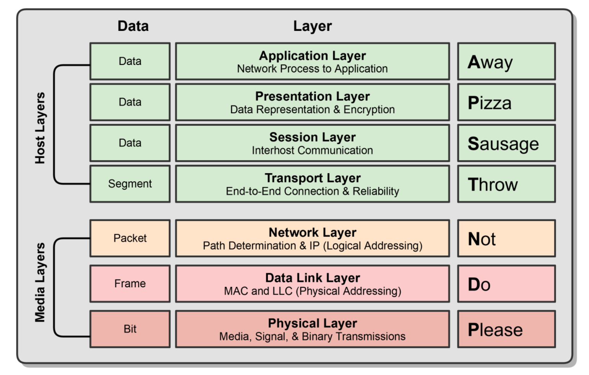
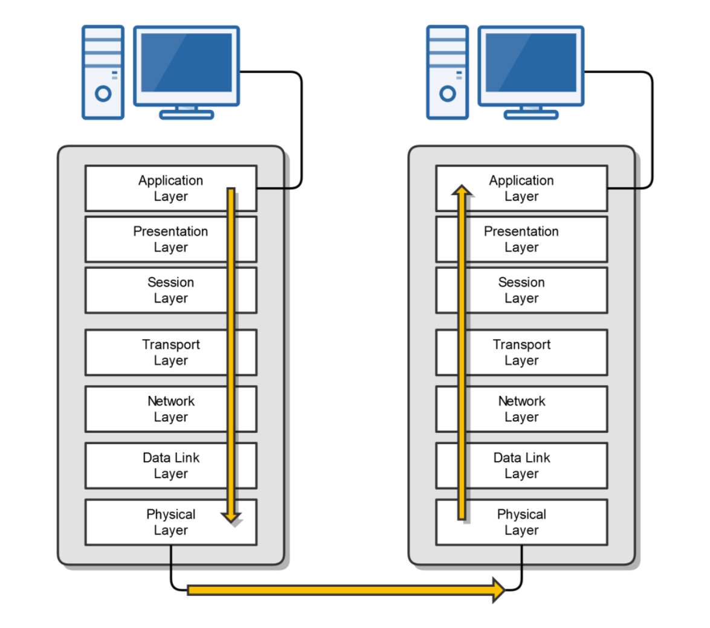
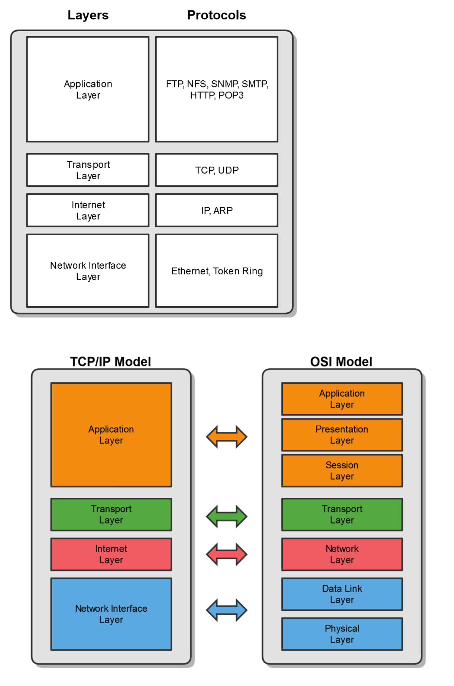
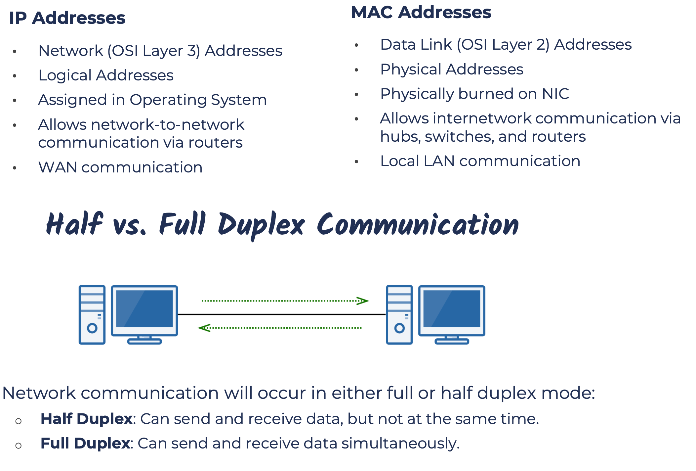
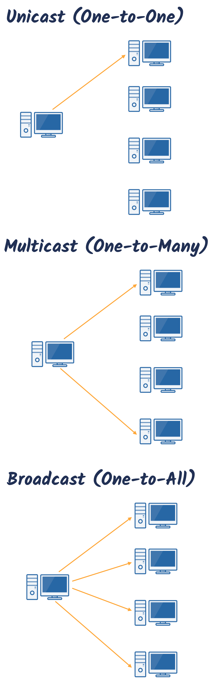

# How compute network works

## Computer Networking Protocols
- Computers communicate with each other with network protocols.
- Protocols are rules governing how machines exchange data and enable effective communication.
- Some Everyday Examples
    - When you call somebody, you pick up the phone, ensure there is a dial tone, and if there is, you dial the number.
    - When you drive your car, you obey the rules of the road.
- Physical Protocols: describe the medium (wiring), the connections (RJ-45 port), and the signal (voltage level on a wire).
- Logical Protocols: software controlling how and when data is sent and received to computers, supporting physical protocols.
- Computer networks depend on many different types of protocols in order to work properly.   
- Example Common TCP/IP Suite of Protocols:
    - Web Communication: HTTP 
    - E-mail: POP3, SMTP, IMAP
    - File Transfers: FTP 

## OSI Model
### What is it?
The Open Systems Interconnection (OSI) Reference Model
- A conceptual framework or a reference model, showing us how data moves throughout different part of a network.
- Developed by the International Organization for Standardization (ISO) in 1977.    

### It’s Purpose
- Gives us a guide to understanding how networks operate.
- It’s only a reference model, so don’t get wrapped up in the details. 
- Wasn’t implemented in the real world, TCP/IP is implemented in the real world.

### The OSI Model Stack
The OSI Model breaks down the complex task of computer-to-computer network communications into seven layers.

Upper Layers (Host Layers)
- Handled by the host computer and performs application-specific functions, such as data formatting, encryption, and connection management.

Lower Layers (Media Layers)
- Provide network-specific functions, such as routing, addressing, and flow control.

### OSI Model Visualization

### OSI Communication

- Physical layer: wires, cables or wifi
- Data link layer: Switches with MAC address
- Network layer: Routers with IP address

## TCP/IP Model
- TCP/IP is the implementation of the OSI model
- The TCP/IP suite is the most commonly used protocol suite in the networking world.
- It’s essentially the protocol suite in which the Internet was built.
- It’s the standard for computer networking.
- It is based on a 4-layer model that is similar to the OSI model.
- History of TCP/IP:
    - Developed by the United States Department of Defense (DoD) in the early 1970s.
    - In 1982, the DOD declared TCP/IP as the standard for all military computer networking.
    - In 1984, broad adoption of TCP/IP began (IBM, AT&T, etc.).

    

## MAC Addresses
Media Access Control (MAC)
- Mac address is a physical address which is burnt on NIC to uniquely identify a device on a physical layer.
- OSI Layer 2 (Data Link) Layer Address
- TCP/IP Layer 1 (Network Interface) Layer Address
- Six bytes (48 bits), Usually Represented Hexadecimal
    - First three bytes (24 bits) are assigned by the IEEE to the manufacturer
        - Organizationally Unique Identifier (OUI) assigned by IEEE (ex: Dell or HP)
    - Last three bytes (24 bits) are usually assigned sequentially: 
        - Unique Numbers

00:21:70:6f:06:f2 00-21-70-6F-06-F2 224 = ~16.7 Million Unique Addresses

## IP Addresses
- An IP Address is a logical address used in order to uniquely identify a device on an IP network.
- It’s a Network Layer address associated with routing.
    - OSI Layer 3: Network Layer
    - TCP/IP Layer 2: Internet Layer
- There are two versions: 
    - IP version 4 (IPv4)
        - Example:192.168.0.1 
    - IP version 6 (IPv6)
        - Example:2001:DB8:85A3:0:0:8A2E:370:7334 

 

- IP addresses are used in Wide Area Network(WAN), which allows network to network communication via routers. For example to receive an email from distant server onto a mobile
- Mac addresses are used in Loacl Area Network(LAN), which alllows inter-network communication via hubs, switches, cables and routers. For example in a home network where all devices connected via LAN/WLAN.

## Network Transmission Types

- Unicast
- Multicast
- Broadcast

 

## Introduction to Ethernet

- The most popular networking technology in the world!
- Refers to a family of standards that define the physical and logical aspects of the world's most popular type of LAN.
- The standard communications protocol for building a local area network (LAN).

- Physical
    - Cabling, Connectors, Equipment, etc.
- Logical
    - Network Access Method, i.e., Carrier Sense Multiple Access (CSMA)

