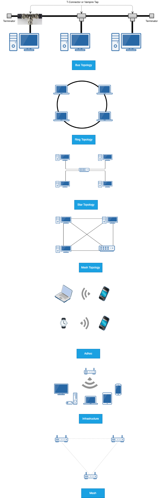

# Network Topology

Physical topologies describe the placement of network devices and how they are physically connected.
Logical topologies describe how data flows throughout a network.

## Wired Network Topologies
### Bus Topology

- All devices are connected to a single coaxial network cable.
    - Devices are connected via a vampire tap or T-Connector.
    - Terminators are required at both ends of the cable to prevent signal bounce.
    - Antiquated technology.
- Only one end device can be active on the network at a time.
    - Data signals travel in both directions and are received by all devices on the network.
- A single break in the cable can take down the entire network.

### Ring Topology
- All devices are connected in a circular fashion.
- Each computer is connected to two other computers.
- Data travels from node-to-node with each computer handling data, either unidirectional or bidirectional.
- Each device (node) in the ring regenerates the signal, acting as a repeater.
- Failure of a single node can take down the entire network.
- Fiber Distributed Data Interface (FDDI) uses two counter-rotating ring topologies for redundancy.

### Star Topology
- All devices are connected to a central connecting device, which is usually a switch.
- Devices send data to the switch, which forwards it to the appropriate destination device.
- Popular topology in today’s networks.
- Used in most large and small networks.
- Central device is a single point of failure.

### Mesh Topology
- Each device is connected to every other device by separate cabling.
- Highly redundant and fault-tolerance.
- Expensive to install.
- Commonly used in Enterprise Networks & WANs.
- Two Types:
    - Partial Mesh
    - Full Mesh

## Wireless Network Topologies
Wireless networks utilize radio frequencies (RF) to communicate.
- Three Specific Topologies: 
    - Adhoc
    - Infrastructure
    - Mesh    

### Adhoc
- Peer-to-peer (P2P) wireless network where no wireless access point (WAP) infrastructure exits.
- The devices communicate directly with one another.
- Personal area networks (PANs) are a common example of Ad hoc wireless networks.

### Infrastructure
- Wireless network that uses a wireless access point (WAP) as its central connecting device.
- Infrastructure wireless networks (WLANs) are commonly used in homes and small offices.

### Mesh
- Just like a wired mesh design, wireless mesh networks utilize several wireless access points (nodes) to create a robust wireless network that is:
    - Scalable
    - Self-Healing
    - Reliable (redundancy)
- Common in larger homes and businesses.

 