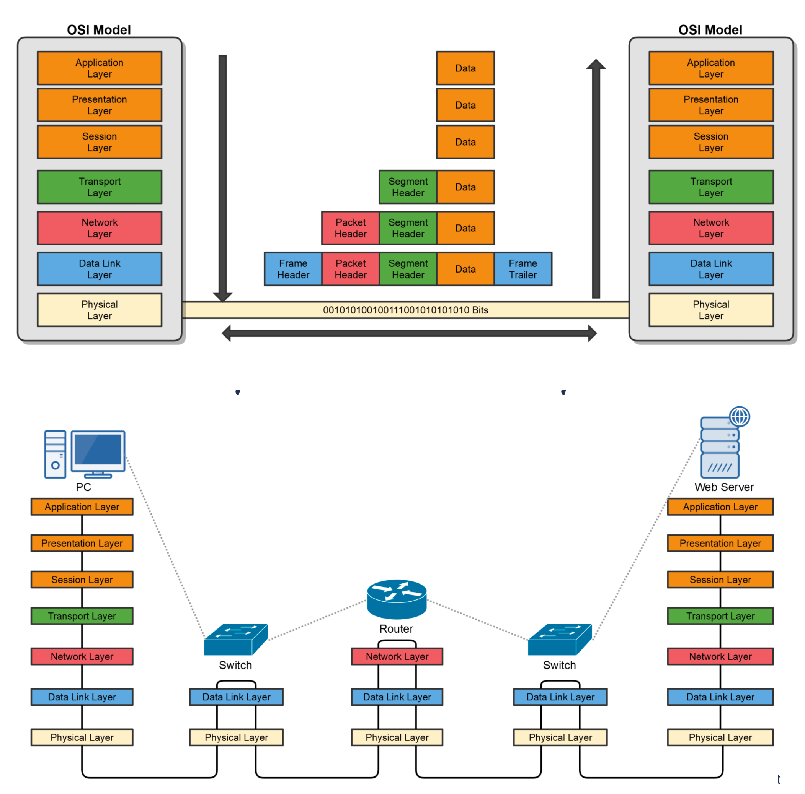
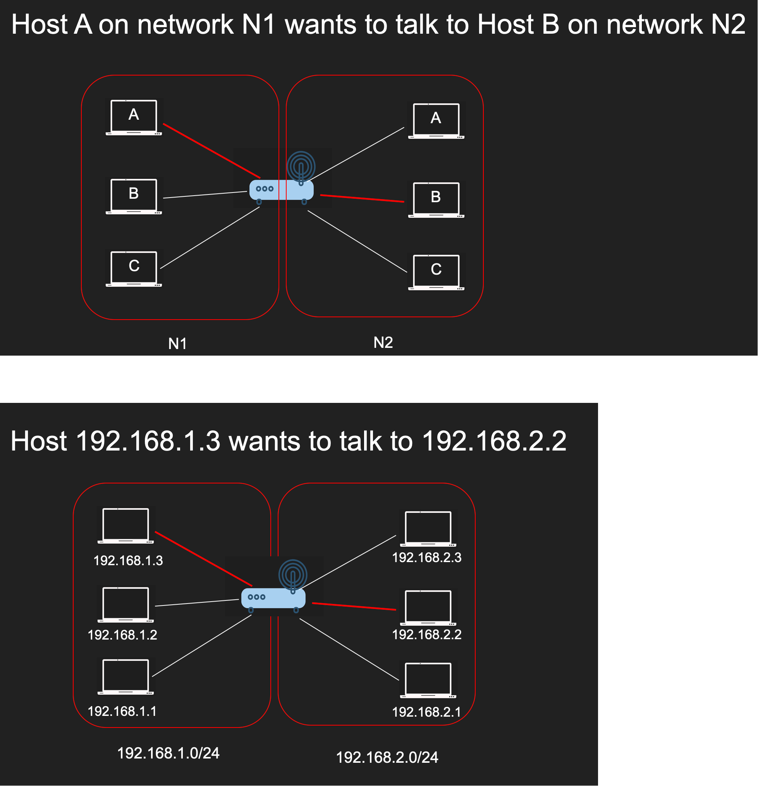

# Open Systems Interconnection (OSI) Model

## Layer 7 - Application Layer
- Where users interact with the computer.
- Acts as an interface between an application and end-user protocols.
- Provides an interface to communicate with the network (Outlook, Chrome, etc.).
- Applications don’t reside in the application layer but instead interfaces with application- layer protocols.
- Example Application Layer Protocols:
    - E-Mail: IMAP4, POP3, SMTP o Web Browsers: HTTP, HTTPS o Remote Access: SSH, Telnet

## Layer 6 – Presentation Laye
- Ensures that data transferred from one system’s Application Layer can be read by the Application Layer on another one.
- Provides character code conversion, data compression, seriallization/de-seriallization and data encryption/decryption.
- Example: Google Chrome HTML converted to ASCII Format.    
- Example Layer 6 File Formats:
    - Web Browser: HTML, XML, JavaScript o Graphics Files: JPEG, GIF, PNG
    - Audio/Video: MPEG, MP3
    - Encryption: TLS, SSL
    - Text/Data: ASCII, EBCDIC

## Layer 5 - Session Layer
- Responsible for setting up, managing, and then tearing down sessions/connections between network devices.
- Ensures data from different application sessions are kept separate.
- Utilizes Application Program Interfaces (APIs) to communicate with TCP/IP protocols.
- Coordinates communication between systems.
    - Start, Stop, Restart
- Can provide three different methods of communication between devices:
    - Simplex: One-way communication between two devices, like listening to a radio station.
    - Half Duplex: Two-way communication between two devices, but only one device can communicate at a time.
    - Full Duplex: Two-way communication between two devices, where both sides can communicate at the same time.        

## Layer 4 - Transport Layer
- Ensures data is delivered error-free and in sequence.
- Segments data and reassembles correctly.
- Can be connection-oriented or connectionless.
- Considered the “Post Office” Layer
    - TCP (Transmission Control Protocol) (connection oriented)
    - UDP (User Datagram Protocol) (connectionless)
- Responsible for two data flow control measures:
    - Buffering
        - Stores data in memory buffers until destination device is available.
    - Windowing
        - Allows devices in session to determine the “window” size of data segments sent.

## Layer 3 - Network Layer
- The “Routing” Layer
- Provides logical addressing (IP Addressing) and routing services.
- Places two IP addresses into a packet:
    - Source Address & Destination IP Address 
- Internet Protocol (IP)
    - The primary network protocol used on the Internet, IPv4, IPv6 Logical Addresses
- Types of Packets at Network Layer:
    - Data Packets
        - Routed Internet Protocol (IP) data packets.
            - IPv4 & IPv6
    - Route-Update Packets
        - Routing protocols designed to update neighboring routers with router information for path determination.
            - RIP, OSPF, EIGRP, etc.
- Layer 3 Devices & Protocols:
    - Routers & Multi-Layer Switches
    - IPv4 & IPv6
    - Internet Control Message Protocol (ICMP), i.e., Ping

## Layer 2 – Data Link Layer
- The “Switching” Layer
- Ensures that messages are delivered to the proper device on a LAN using hardware addresses.
    - MAC (Media Access Control) Address
    - Only concerned with the local delivery of frames on the same network.
- Responsible for packaging the data into frames for the physical layer.
- Translates messages from the Network layer into bits for the Physical layer.    
- Has two Sub-Layers
    - Logical Link Control (LLC) Layer 
        - Error Control and Flow Control
            - Detect and correct corrupted data frames.
            - Limits amount of data sent so devices aren’t overwhelmed.
    - Media Access Control (MAC) Layer 
        - Physical Addressing (MAC Address)
            - 48-Bit MAC Address burned on NIC. 
        - Logical Topology and Media Access
            - Ethernet, Token Ring, etc. 
            - CSMA/CD & CSMA/CA
## Layer 1 – Physical Layer
Defines the physical and electrical medium for network communication:
- Sending and receiving bits (1 or 0)
- Encoding Signal Types
    - Electricity, radio waves, light
- Network Cabling, Jacks, Patch Panels, etc.
    - Copper or Fiber
- Physical Network Topology
    - Star, Mesh, Ring, etc.
- Ethernet IEEE 802.3 Standard
- Layer 1 Equipment
    - Hubs, Media Converters, Modems
It’s responsible for the network hardware and physical topology.

## Host to host communication
- A sends a message to B specifying the MAC address 
- Everyone in the network will “get” the message but only B will accept it
- Imagine millions of machines?
- We need a way to eliminate the need to send it to everyone 
- The address needs to get better
- We need routability, meet the IP Address
- The IP Address is built in two parts
- One part to identify the network, the other is the host
- We use the network portion to eliminate many networks
- The host part is used to find the host
- Still needs MAC addresses!
- It's not enough just to address the host
- The host is runnings many apps each with different requirements Meet ports
- You can send an HTTP request on port 80, a DNS request on port 53 and an SSH request on port 22 all running on the same server!
- Host needs addresses
- MAC Addresses are great but not scalable in the Internet
- Internet Protocol Address solves this by routing 
- Layer 4 ports help create finer addressability to the process level

