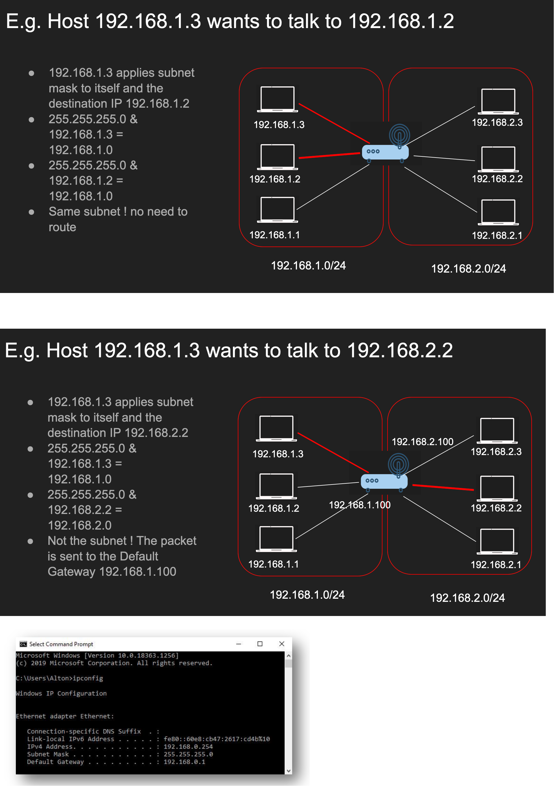
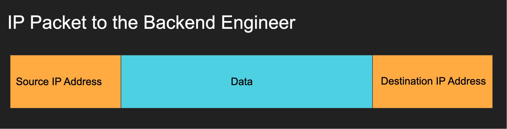
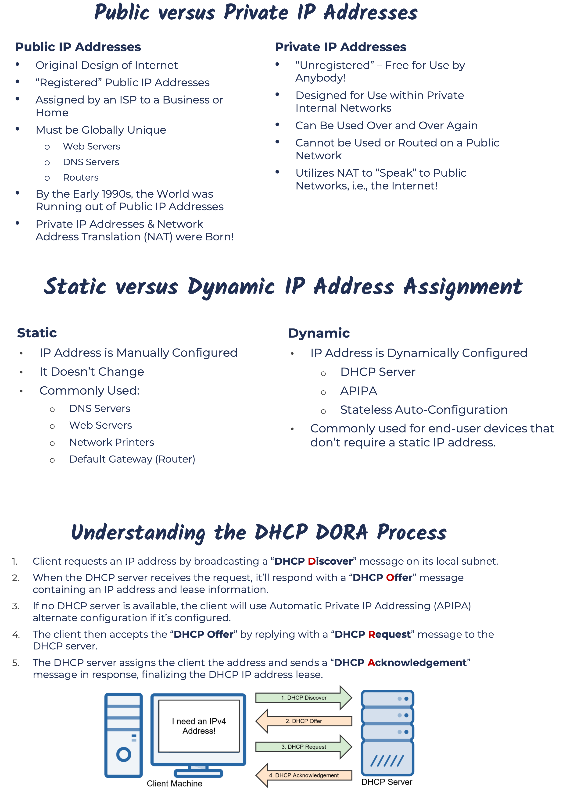

# IP Building Block

## IP Address
- An IP Address is a logical address used in order to uniquely identify a device on an IP network.
- It’s a Network Layer Address
- There are Two Versions:
    - IP version 4 (IPv4)
    - IP version 6 (IPv6)
- Layer 3 property
- Can be set automatically or statically 
- It has Network and Host portion
- 4 bytes in IPv4 - 32 bits
- Made up of 32 binary bits, which can be divided into a network portion and a host portion with the help of a subnet mask.
- The 32 binary bits are broken into four octets (1 octet = 8 bits).
- Each octet is converted to decimal and separated by a period (dot).
- For this reason, an IP address is said to be expressed in dotted decimal format.
- An IP address is broken down into two parts:
    - Network Address
        - Uniquely identifies each network
        - Your Street Name: 7682 Wilshire Drive
    - Host Address
        - Uniquely identifies each machine on a network
        - Your House Address: 7682 Wilshire Drive
- Network Address + Host Address = IP Address
    - Wilshire Drive 7682

## Network vs Host
- a.b.c.d/x (a.b.c.d are integers) x is the network bits and remains are host bits
- Example 192.168.254.0/24
- The first 24 bits (3 bytes) are network the rest 8 are for host 
- This means we can have 2^24 (16777216) networks and each network has 2^8 (255) hosts
- This is Also called a subnet
- Router bsically connects multiple networks together so that it cna transfer the data

## Subnet Mask
- 192.168.254.0/24 is also called a subnet
- The subnet has a mask 255.255.255.0
- Subnet mask is used to determine whether an IP is in the same subnet or not

## Default gateway
- Most networks consists of hosts and a Default Gateway
- Host A can talk to B directly if both are in the same subnet
- Otherwise A sends it to someone who might know, the gateway
- The Gateway has an IP Address and each host should know its gateway

Each device on a network is assigned an IP address, subnet mask and default gateway:
- IP Address: Unique logical address assigned to each device on a network.
- Subnet Mask: Used by the device to determine what subnet it’s on, specifically the network and host portions of the IP address.
- Default Gateway: The IP address of a network’s router that allows devices on the local network to communicate with other networks.

   

## IP Packet

- The IP Packet has headers and data sections
- IP Packet header is 20 bytes (can go up to 60 bytes if options are enabled)
- Data section can go up to 65536
- It also has protocol, source IP address and destination IP address

 

## Public VS Private IP addresses

- If we need any IPV4 address, we can query a DHCP server which will generate a IP address dynamically and provide it back

 