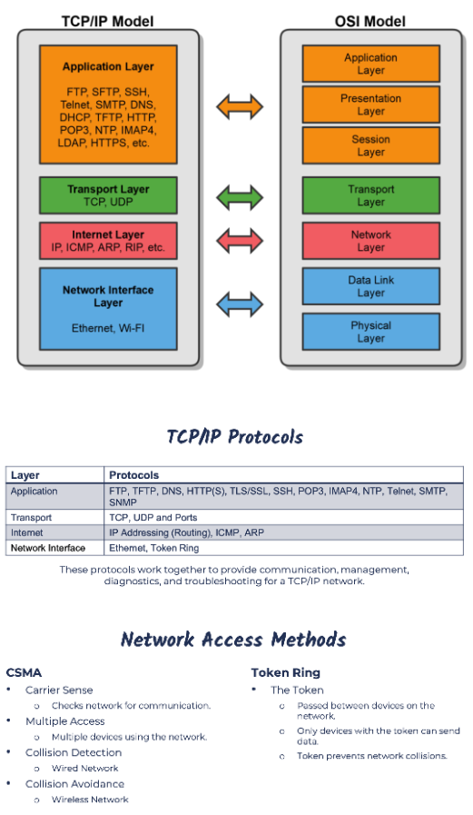

# TCP IP Model

## What is TCP/IP?
- Transmission Control Protocol/Internet Protocol
- Commonly called the Internet Protocol suite because it was designed for the Internet, but LANs use it too.
- First Two Protocols Defined in the Suite Were:
    - TCP & IP, hence TCP/IP
- Similar to the OSI Model, but Simpler:
    - OSI is Conceptual
    - TCP/IP was Implemented

    

## Address Resolution Protocol (ARP)
- Resolves IP address to MAC Addresses
- Finds the hardware address of a host from a know IP address
    - And vice versa (RARP)

