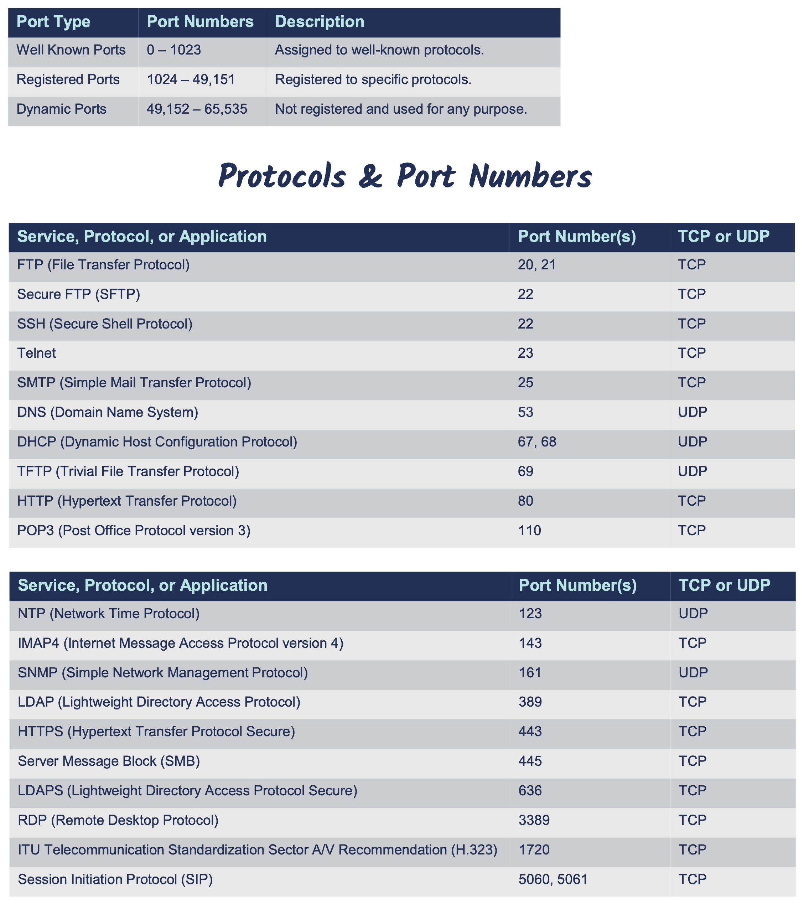
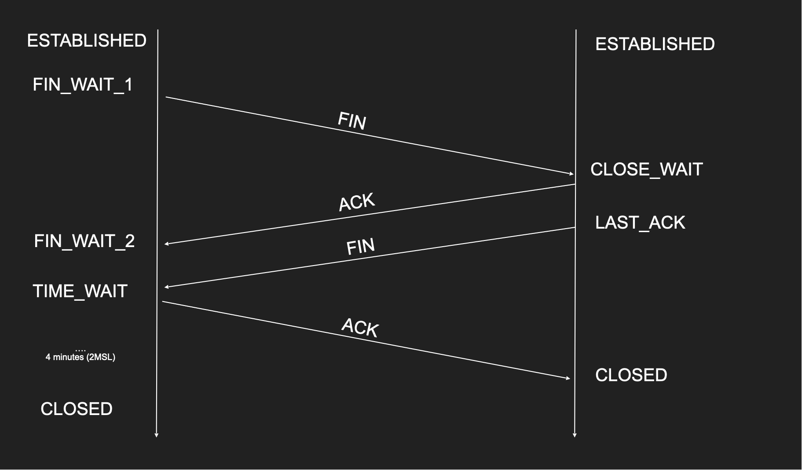

# TCP/IP Model

## What is TCP/IP?
- Transmission Control Protocol/Internet Protocol
- Commonly called the Internet Protocol suite because it was designed for the Internet, but LANs use it too.
- First Two Protocols Defined in the Suite Were:
    - TCP & IP, hence TCP/IP
- Similar to the OSI Model, but Simpler:
    - OSI is Conceptual
    - TCP/IP was Implemented
- TCP/IP has many different protocls like
    - Application layer: HTTP, HTTPS, SSL/TLS, SSH, FTP, DNS, DHCP, LDAP, SMTP, Telnet etc 
    - Transport layer: TCP and UDP
    - Internet layer: IP, ARP, ICMP
    - Network interface layer: Ethernet, WiFi

    


## Protocols, Ports and Sockets

### Protocols
- Computers communicate with each other by exchanging different kind of data with network protocols.
- Protocols are rules governing how machines exchange data and enable effective communication.
- In an operating system (OS), a protocol runs as a process or service.

### Protocols Properties
- Data format
    - Text based (plain text, JSON, XML)
    - Binary (Protobuf, RESP)
- Transfer mode
    - Message based (UDP, HTTP)
    - Stream (TCP, WebRTC)
- Addressing system
    - DNS name, IP, MAC
- State
    - Statefull(TCP, gRPC)
    - Stateless(UDP, HTTP)
- Routing
    - Proxies, Gateway        


### Ports
- Ports are logical constructs that bind a unique port number to a protocol process or service.

### Sockets
- Sockets are a combination of an IP address and a port number, for example, 192.168.1.1:80.

### Why We Need Ports and Sockets
- Computers require ports because of network application multitasking.
- Because a computer may have only one IP address, it needs ports to differentiate network protocols and services running on it.
- TCP/IP has 65,536 ports available

 

## Routing example
How IP Packets are routed in switches and routers

 

### Send packet from `A` to `B`
- All the hosts A, B, C, D and router connected to a single switch through one of the ports of the switch. While connecting each of these hosts register its IP and MAC address to switch. 
- So Switch which is a layer 2 protocol, knows which device is connected at its each port so internally switch knows MAC address of each hosts.
- Now A wants to communicate with B, so it will send the data packets(layer 3) to Switch. Switch which is layer 2 knows the MAC address of B already, so it sends the data packets through layer 1 physical layer to host B.
- Swicth does now send the data packets to any of the other hosts. But HUB which was used earluer to Switch used to send data to all hosts.

### Send packet from `D` to `X`
- With subnet mask D knows that IP of X is not in the same subnet. So traffic has to send to gateway that is nothing but the router. D already knows the IP address of gateway because it runs a DHCP protocol before. But what is the MAC address of gateway? It will send ARP broadcast request to all hosts in the network and then gateway/router will reply back with its MAC address to D. Now D send its data packets to router. Now router sends the same packet to destination IP address that is X, since router already knows the router on the other side. 
- SO from layer to perspective D sends request to Router through its MAC address, but from layer 3 perspective router will send the data packets to X through its IP address.

### Send packet from `B` to `G`
- Same process repeats as mentioned in the previous scenario. Router will receives the data from B.
- Now since router will not find this IP address in its network it will broadcast the packets to internet.
- After that same process will repeats, thousands of other switches and router come into play in identifying actual destination network and MAc address before delivering the data.


## TCP/IP Internet Layer Protocols

### 1. Address Resolution Protocol (ARP)
- Resolves IP address to MAC Addresses
- Can resolve Mac address to IP address by using ReverseARP protocol(RARP)
- Finds the hardware address of a host from a know IP address
    - And vice versa (RARP)
- We can use the command `arp -a`, which will give the mac address of the corresponding IP address for which we asked.    


### 2. Internet Protocol(IP)
- An OSI Layer 3 protocol that defines **routing and logical addressing of packets that allow data to traverse WANs and the Internet.**
- It specifies the formatting of packets and the logical addressing schema
    - IP addresses: IPv4 and IPv6
- Its job is to connect different OSI Layer 2 (switched) networks together.
- Provides end-to-end connectivity from one Layer 2 network to another via routers.
- It’s connectionless and, therefore, unreliable (similar to UDP). 
    - No continued connection.
- Each packet sent is independent of each other packet.
    - TCP and other protocols provide a means to reassemble them properly.
- Packets don’t always follow the same path to their destination. 
    - They’re sent via the most efficient route.
- Doesn’t provide any error recovery or sequencing functionality. 
    - That’s the job of other protocols.
- **So IP protocols just routes the  data packets and try to deliver them unsequencially, unreliably, through a different path to a destination logical addresses.**

 

### 3. Internet Control Message Protocol (ICMP) protocol

- OSI Layer 3 Internet Protocol (IP) companion “error reporting” protocol within the TCP/IP suite of protocols.
- Just like IP, it’s connectionless.
- Used to generate error messages to the source IP address when network issues prevent the delivery of a packet.
- Typically used by routers to report packet delivery issues, and, most importantly, it can report errors but not correct them.
- Commonly used by IT administrators to troubleshoot network connections with command-line utilities, including ping, pathping, and traceroute.
- Designed for informational messages Host unreachable, port unreachable, fragmentation needed Packet expired (infinite loop in routers)
- Uses IP directly
- PING and traceroute use it
- Doesn’t require listeners or ports to be opened
- We can set Time To Leave(TTL) time in the ping request. If it expires then the ping response we will not get
- It works with ICMP echo request and ICMP echo reply within the mentioned ttl.
- Some firewalls block ICMP for security reasons. That is why PING might not work in those cases
- **So ICMP is typically used by routers to report any issues related to packet delivery. This protocol is mainly used by IT admin to troubleshoot network connection between any source to destination.**

#### TraceRoute
- Can you identify the entire path your IP Packet takes?
- Clever use of TTL
- Increment TTL slowly and you will get the router IP address for each hop
- Doesn’t always work as path changes and ICMP might be blocked

#### ICMP error message types (more than 40 types)
- Echo Request, Echo Reply: Tests destination accessibility and status. A host sends an Echo Request and listens for a corresponding Echo Reply. Commonly done using the ping command.
- Destination Unreachable: Sent by a router when it can’t deliver an IP packet.
- Source Quench: Sent by a host or router if it’s receiving too much data than it can handle.
The message requests that the source reduces its rate of data transmission.
- Redirect Message: Sent by a router if it receives a packet that should have been sent to a different router. The message includes the IP address to which future packets should be sent and is used to optimize the routing.
- Time Exceeded: Sent by a router if a packet has reached the maximum limit of routers through which it can travel.
- Router Advertisement, Router Solicitation (IPv6): Allow hosts to discover the existence of routers. Routers periodically multicast their IP addresses via Router Advertisement messages. Hosts may also request a router IP address by broadcasting a Router Solicitation message, then wait for a router to reply with a Router Advertisement.

 


## TCP/IP Transport Layer Protocols

### 1. User Datagram Protocol (UDP)

- Stands for User Datagram Protocol 
- Layer 4 protocol
- Sits on top of IP protocol
- Ability to address processes in a host using ports. **With IP we address host, but with UDP with the help of ports we can address a specific process/application/service.**
- Simple protocol to send and receive data
- Prior communication not required (double edge sword)
- Stateless no knowledge is stored on the host
- 8 byte header Datagram
- UDP, being connectionless, is considered to be unreliable; however, it is more lightweight than TCP and often used for streaming or real-time data.
- A scaled-down, economic version of TCP 
    - Connectionless & Unreliable
    - No Data Retransmissions
    - “Best Effort”
- Faster than TCP
    - Smaller Header & Connectionless
- Primarily used for protocols that favor:
    - Low-Latency, i.e., Faster Speeds
    - Can Tolerate Data Loss
- Example UDP Use-Cases o VoIP Phone Calls
    - Live Video Streams
    - Live Audio Streams
    - Online Gaming
    - Certain Network Management Protocols
        - DNS
        - VPN
        - DHCP 
        - NTP

#### Multiplexing and demultiplexing
- IP target only hosts
- Hosts run many apps each with different requirements
- Each Ports identify a single “app” or “process”
- Sender multiplexes all its apps into UDP
- Receiver demultiplex UDP datagrams to each app       

#### Source and Destination Port
- App1 on 10.0.0.1 sends data to AppX on 10.0.0.2 
- Destination Port = 53
- AppX responds back to App1 
- We need Source Port so we know how to send back data
- Source Port = 5555

#### UDP Pros
- Simple protocol
- Header size is small so datagrams are small
- Uses less bandwidth
- Stateless
- Consumes less memory (no state stored in the server/client)  
- Low latency - no handshake , order, retransmission or guaranteed delivery

#### UDP Cons
- No acknowledgement
- No guarantee delivery
- Connection-less - anyone can send data without prior knowledge
- No flow control
- No congestion control
- No ordered packets
- Security - can be easily spoofed

#### UDP implementation by using nodejs

```
import dgram from 'dgram'

const socket = dgram.createSocket("udp4");
socket.bind(5500, "127.0.0.1")
socket.on("message", (msg, info) => {
    console.log(`my server got a datagram ${msg}, from: ${info.address}:${info.port}`)
})
)
O/P: my server got a datagram Hi Hello!, from: 127.0.0.1:53618
```

Open a terminal and type the netcat(nc) command
```
nc -u 127.0.0.1 5500 //-u flag tells to use udp protocol
Hi Hello!
```

We can test this with NetCat command from command prompt like `nc -u 127.0.0.0.1 5500` hi hello
and then can send multiple messages which will be sent to the UDP server


 


### 2. Transmission Control Protocol (TCP)
- Stands for Transmission Control Protocol
- Layer 4 protocol
- Ability to address processes/services/applications in a host using ports
- “Controls” the transmission of data unlike UDP which is a firehose 
- Introduces Connection concept. Connection Requires handshake
- 20 bytes headers Segment (can go to 60)
- Retransmission, acknowledgement, guaranteed delivery
- Stateful and connection oriented. Connection has a state
- TCP utilizes the following features to ensure reliable delivery of data. 
    - 3-Way Handshake creates a virtual connection between the source and destination before data is sent.
    - Acknowledgment is required before the next segment is sent.
    - Checksum that detects corrupted data.
    - Sequence Numbers that detect missing data and reassemble them in the correct order.
    - Retransmission that will retransmit lost or corrupt data.

#### TCP Use Cases
- Reliable communication
- Remote shell 
- Database connections
- Web communications 
- Any bidirectional communication

#### TCP Connection
- TCP Connection is a Layer 5 (session). Once the connection is established store the corresponding session in session layer, so that all the data coming from the same source is validated. If there is no connection/session info, then the destination will drops the incoming data.
- This connection provides security for the data, kind of mini authenticate. 
- TCP Connection is an agreement between client and server
- Must create a connection to send data
- Connection is identified by 4 properties
    - SourceIP-SourcePort
    - DestinationIP-DestinationPort
- All these four pairs which are both from layer four and layer three are taken, the operating system hash
it and preserve one hash. And that hash is locked up in a lookup in the operating system and that matches something called a file descriptor in the operating system. And this file descriptor contains the session effectively the state in the memory. So that's how you know, if there's a connection or not, you hash it and you look up. If it's there, if it's there, you have a connection. If it's not there, fail or drop the segment or return ICMP message saying, Hey, who are you?
- Can’t send data outside of a connection
- Sometimes called socket or file descriptor
- Requires a 3-way TCP handshake
- Segments are sequenced and ordered
- Segments are acknowledged
- Lost segments are retransmitted 

#### 3 way handshake
- Client sends `SYN` packet with source and destination port and IP to destination
- Destination looks up its file descriptor for the session info for this client. If not it creates a new one with source/destination IP and ports
- And then destination server will send back `SYN/ACK` signal back to client
- Now client will sends the `ACK` signal to server
- After that client can send `single ot many sequence of data`` in segments
- Destination server then can reply `ACK` for one/many of those segments or to all of those segments.
- Client will retransmit the segments for which it didnt receive ACK
- CLosing the cinnection is 4 way handshake. Client sends `FIN` signal for which server checks whether there is a session in its file descriptor and if so it will send `ACK` back to client. And then server sends `FIN` signal for which client sends `ACK`

#### Flow control (How much the receiver can handle?)
- A want to send 10 segments to B
- A sends segment 1 to B
- B acknowledges segment 1
- A sends segment 2 to B 
- B acknowledges segment 2
- This is VERY SLOW!
- A can send multiple segments and B can acknowledge all in 1 ACK
- The question is … how much A can send?
- This is called flow control
- When TCP segments arrive they are put in receiver’s buffer
- If we kept sending data the receiver will be overwhelmed 
- Segments will be dropped 
- Solution? Let the sender know how much you can handle through **Flow Control Window Size**(Receiver Window or RWND)
- Window Size is 16 bit - Up to 64KB
- It is Updated with each acknowledgment 
- Tells the sender how much to send before waiting for ACK
- Receiver can decide to decrease the Window Size (out of memory) more important stuff

#### Congestion control (How much the network can handle?)
- The receiver might handle the load but the middle boxes might not
- The routers in the middle have limit
- We don’t want to congest the network with data
- We need to avoid congestion
- A new window: **Congestion Window (CWND)**


 

#### TCP Connection States
Stateful protocol must have states

- TCP is a stateful protocol
- Both client and server need to maintain all sorts of state
- Window sizes, sequences and the state of the connection
- The connection goes through many states

 

#### TCP Pros
- Guarantee delivery
- No one can send data without prior knowledge
- Flow Control and Congestion Control
- Ordered Packets no corruption or app level work
- Secure and can’t be easily spoofed

#### TCP Cons
- Large header overhead compared to UDP
- More bandwidth
- Stateful - consumes memory on server and client 
- Considered high latency for certain workloads (Slow start/ congestion/ acks)
- Does too much at a low level (hence QUIC)
    - Single connection to send multiple streams of data (HTTP requests)
    - Stream 1 has nothing to do with Stream 2
    - Both Stream 1 and Stream 2 packets must arrive
- TCP Meltdown
    - Not a good candidate for VPN

#### TCP Example (By using NodeJS)

```
import net from 'net'

const server =  net.createServer( socket => {

    console.log("TCP handshake successfull with " + socket.remoteAddress + ":" + socket.remotePort);
    socket.write(Hello client!);
    socket.on("data", data=> {
        console.log(Received data " + data.toString())
    })
})

server.listen(8000, "127.0.0.1")

O/P:
TCP handshake successfull with 127.0.0.1:64409
Received data Message from client1

TCP handshake successfull with 127.0.0.1:64428
Received data Message from client2
```

Now open 2 separate command prompt and make a below netcat(nc) commands

```
nc 127.0.0.1 8000
Hello client!
Message from client1
```


```
nc 127.0.0.1 8000
Hello client!
Message from client2
```

### TCP vs UDP

 

**Note:** Any other protocol out there has to be built on top of these protocols IP, TCP and UDP
- HTTP built on top of TCP whcih is built on top of IP 
- HTTP2 built on top of TCP whcih is built on top of IP
- SSH built on top of TCP whcih is built on top of IP
- HTTPS built on top of TLS built on top of TCP whcih is built on top of IP
- DNS built on top of UDP which is built on top of IP

## Application Layer Management Protocols

### 1. Domain Name System (DNS) Protocol

#### Why DNS
- People cant remember IPs
- A domain is a text points to an IP or collection of IPs
- IP can change while domain remains same
- We can serve the closest IP to a client requesting the same domain. Lets say someone is accessing www.google.com from India, the dns server whch is residing in India will serve the IP addresses of this domain which is in India. 
- Client side Load balancing
- Example: www.google.com, where www is the sub-domain, google is the actual domain and com is the top level domain.
- If you have an IP and you need MAC, we use ARP
- If you have a name and you need IP, we use DNS
- Built on top of UDP and default port is 53
- DNS has many kinds of records like
    - A: Resolves a domain name to an IPv4 address.
    - AAAA: Resolves a domain name to an IPv6 address
    - PTR: Resolves an IP address to a domain name.
    - CNAME: Resolves one domain name to another domain name, allowing multiple domain names to be resolved to the same IP address.

#### How DNS works
- DNS server has a frontend resolver named **DNS Resolver**. 1.1.1.1(cloudflare) or 8.8.8.8(google) which are popular dns resolver. Most of the time these reolver will have the IP address of a particular domain in their Cache. But sometime they dont. Every device must be knowing one of these popular resolver's IP address which is hardcoded in the devices, since resolver does not have any domian name. Each client will make an UDP call to resolver on port 53. So resolver first check its cache for the domain Ip address. 
- When a request comes, if resolver does not have the IP address for that domain, then it will send the request to **Root Hanlder**, which has the host IPs of different Top Level Domain(TLD) server like .com, .net, .org. 
- **Top Level Domain(TLD)** servers has the host IP addresses of different Authoritive Name Server(ANS) and the domain name will be forwarded to it
- Finally one of the **Authoritive Name Server** which will be having the IP addresses of the domain will return the IPs. Sometime ANS might also does not have the IP addresses, if the domain is not registered.


### 2. Dynamic Host Configuration (DHCP) Protocol
### 3. Lightweight Directory Access Protocol (LDAP)
### 4. Simple Network Management Protocol (SNMP)


## Application Layer Communication Protocols

- Telnet Protocol
- Secure Shell Protocol (SSH)
- Remote Desktop Protocol (RDP)


## Application Layer File Transfer Protocols

- File transfer protocol (FTP)
- Secure File Transfer Protocol (SFTP)
- Trivial File Transfer Protocol (TFTP)


## Application Layer EMail Protocols
- Simple Mail Transfer Protocol (SMTP)
- Post Office Protocol Version 3 (POP3)
- Internet Message Access Protocol (IMAP)


## Application Layer Web Browser Protocols
### Hypertext Transfer Protocol (HTTP)
### HTTP Secure (HTTPS)
### SSL/TLS(Transport Layer Security)

- Transport layer security or TLS is one of the basic, fundamental way to encrypt communication between
any two party. We have to build a standard for encryption because we can't send just IP packets with data that is plain text that everybody in the crowd can read. 
- In HTTPS We encrypt with symmetric key algorithm which generates 2 keys of same kind. These key we need to share one to client to encrypt the data and other one to server to decrypt the same data.
- Problem is We need to exchange these keys one to client and another one to server
- Key exchange uses asymmetric key(PKI) algorithm
- In TLS1.2 we use RSA algorithm which is one of the popular asymmetric key algorithm. In RSA we have a public key which needs to be shared with client and private keys which are nver shared. 
- Client will make intial request by saying I want to encrypt. And I'm going to use let's use **RSA** as a **key exchange algorithm**(To exhange the key) and let's use SHA as as a **symmetric key algorithm**(to encrypt the key). 


