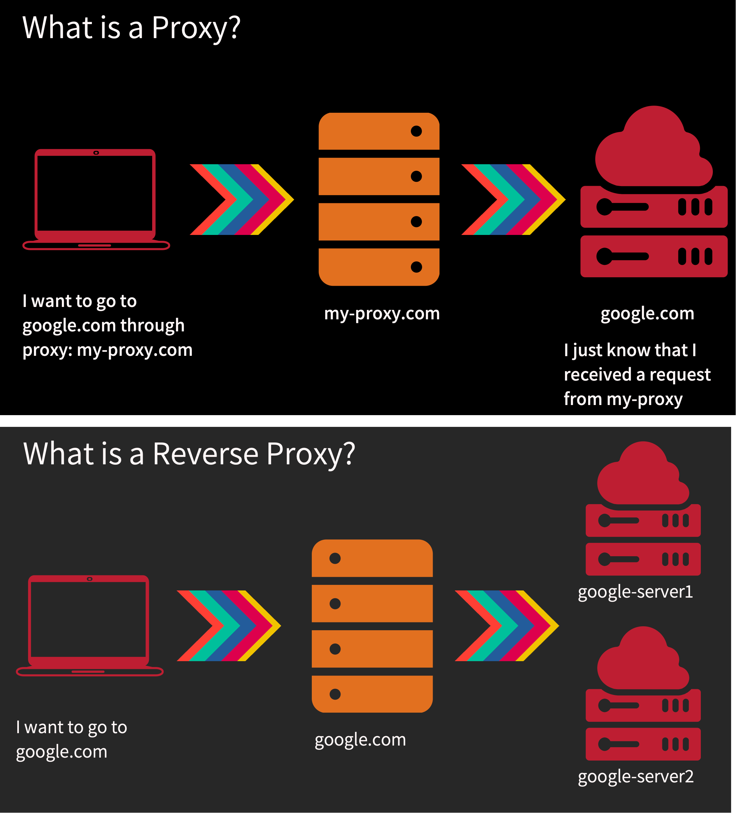

# The Cost of Connections

- Connection establishment is costly
- TCP three way handshake 
- The further apart the peers, the slower it is to send segments
- Slow start keeps the connection from reaching its potential right away
- Congestion control and flow control limit that further
- Delayed and Nigel algorithm can further slow down
- Destroying the connection is also expensive

## Connection Pooling
- Most implementation database backends and reverse proxies use pooling
- Establish a bunch of TCP connection to the backend and keep them running! 
- Any request that comes to the backend use an already opened connection 
- This way your connections will be “warm” and slow start would have already kicked in
- Don’t close the connection unless you absolutely don’t need it

## Eager vs Lazy loading
- Depending on what paradigm you take you can save on resources
- Eager loading -> Load everything and keep it ready 
    - Start up is slow but requests will be served immediately 
    - Some apps send warm up data to kick in the slow start but be careful of bandwidth and scalability 
- Lazy Loading -> only load things on demand
    - Start up is fast but requests will suffer initially 

# TCP head of line blocking
- TCP orders packets in the order they are sent
- The segments are not acknowledged or delivered to the app until they are in order
- This is great! But what if multiple clients are using the same connection
- HTTP requests may use the same connection to send multiple requests
- Request 1 is segments 1,2
- Request 2 is segments 3,4
- Segments 2,3,4 arrive but 1 is lost?
- Request 2 technically was delivered but TCP is blocking it
- Huge latency in apps, big problem in HTTP/2 with streams
- HTTP/3 solves this

# Proxy vs Reverse Proxy

## What is a proxy
- So the definition of a proxy is it's a server that makes request on your behalf. By that definition, it means that you as a client want to go to a certain destination. That's your final goal. You want, for example, to go to Google.com, but if you use a proxy, the proxy will go there for you.
- If I want to go to a Google.com, what happens here is I know my final destination, Google.com. But I also know in that client machine that I have a proxy configured. And you can look at that if to check if you have a proxy configured and if you have a proxy configured, what happens here from a layer four perspective, your TCP connection is being established not with Google, but with a proxy first, so you can establish a tipping action between you and the proxy. And the content of layer seven will go to Google.com.
- So the proxy would receive that get get slash google.com and it will turn around and establish a brand new TCP connection between itself and google.com. So Google.com knows the IP address of the proxy. It never sees you right?
- So the content as you transmitted, It is completely rewritten and written to the new connection from proxy. So any application seven data is sent as is some proxies and in the case of HTTP, they add their
own headers, things like ex forwarded from and stuff like that. And if those headers are added right, the original client can be known from layer seven, but from layer four, Google only sees the proxy.
- So in a proxy configuration, the client knows the server but the server doesn't know their client. Yes, there are there are exceptions when the proxy adds a header that obviously identifies the client. But that's kind of cheating.

## Proxy use cases
- Caching
    - Cache the request/response 
- Logging
    - This software is installed as a proxy next to the application as a sidecar, as they call it. And the application is configured to use this as a proxy then means if you want to connect to service A or service B or service C, all these request goes through the proxy.
- Block sites
- Microservices

## What is reverse proxy
- In case of proxy client knows about the server but server does not know anything about the client.
- In reverse proxy client does not know the final true destination. 
- Lets say client talks to google.com, but google.com could be a reverse proxy. It turns out it talks to another Google server that you have no idea that you talking to.
- So you as a client, you just know that reverse proxy. That's your final destination. But Google.com turns around and sends that request to an actual back end server. 
- The reverse proxy server sometime they call front end server and sometime they call **Edge Sever**
- One of the example use case of reverse proxy is load balancing. 
- In proxy client knows the server but in case of reverse proxy client does not know the actual destination server.
- So you can have configuration where, where you are using a proxy and a reverse proxy at the same time.
Like client makes a call to google.com through a proxy and in turn google.com make a call to the actual instance through reverse proxy.
- In case of proxy, from layer 4 perspective, proxy is the final destination but from layer 7 perspective google.com is the final destination. But in case of reverse proxy both from layer 4 and layer 7 google.com is the final destination.

## Reversy Proxy use cases
- Caching
    - CDN is one of the example. Each clinet connect to the regional CDN instance which in turn can connect to the different insatnces to serve the data.
- Load Balancing
- Ingress
    - Configurations like any API gateway authentication happens in this application
- Canary deployment
    - We can deploy our new version of application in one of the server where rest of the server still running old version. Now we can test this single instance, by configuring the reverse proxy so that 10% of request goes to this new instance.     
- Microservices     

# Layer 4 vs Layer 7 Load balancers (Fault tolerant)
(layer 4 vs layer 7 reverse proxies)

## Layer 4 Load Balancer
- Every load balancer are a reverse proxy but every reverse proxy may not be a load balancer.
- When a layer 4/7 load balancer starts up, it makes a TCP connection with its back end servers which are healthy and keep this tcp connection alive, so that each request can use this connection immediately.
- When a client connects to the L4 load balancer, the LB chooses one server and all segments for that connections go to that same server, instead of multiple other existing servers. Otherwise data would be corrupted. LB will have 2 tcp connection one is between client and itslef and another one is between itself and with back end server. So it has to rewrite all the segments from one connection to other one completely.
- Load balancer will know where to send the respone back to which client. 
- When a LB receives the segments from client it immediatley write it on to the destined server. And when a new segment arrives it also immediately writes it.

### Layer 4 protocol Pros
- Simpler load balancing. Just uses port, ip addresses and data.
- Efficient (no data lookup)
- More secure. No need to read the content to decrypt.
- Works with any protocol
- Can work with only One TCP connection if we use NAT

### Layer 4 protocol Cons
- No smart load balancing
- NA microservices
- Sticky per connection. all data goes through only one connection.
- No caching
- Protocol unaware (can be dangerous) bypass rules

## Layer 7 Load Balancer
- Works same way as layer 4
- When a client connects to the L7 load balancer, it becomes protocol specific. Any logical “request” will be forwarded to a new backend server. This could be one or more segments. Layer 7 LB reads the incoming http request's header and then can decide to which backend server to send. If the data is encrypt, LB needs to decrypt it so that there should be a secure connection between client and LB.
- LB buffers the incoming segments and parses it to understand the data to identify which backend server to redirect. So all these segments becomes one request unit and goes to one backend server. 
- Now the client sends a second request on the same connection. Since its a complete distinct request, LB will collect all the segments and can send to a different back end server. In case of layer 4 the one connection we can not reuse for other client data. 

### Layer 7 protocol Pros
- Smart load balancing
- Caching
- Great for microservices
- API Gateway logic
- Authentication

### Layer 7 protocol Cons
- Expensive (looks at data)
- Decrypts (terminates TLS)
- Two TCP Connections
- Must share TLS certificate
- Needs to buffer
- Needs to understand protocol

# Software Defined Network(SDN)

- Its a network architecture that uses the combination of software controllers and APIs to more efficiently manage our network traffic and infrastructur. Rather than utilizing the hardware and specifically going to each devices and configuring it, we are utilizing software that centralize the control and optimize our network.
- SDN separates the control plane from data plane. Control plane is where we control and configure everything. Data plane is where the data actually moves on the network. 
- In our traditional design we have management plane, control plane and data plane. Through management plane we connect to a device and then through control plane we configure it and then the data plane where actually data moves. We uses this in our switches and routers. This is our infrastructure layer.
- Now SDN will brings software defined networking on top of this layer. This will have application layer where SDN softwares runs and control layer where we will have centralized sdn control for the entire network and down below that we will have traditional infrastructure layer.
- Now with sdn in place we move the control plane layer from infrstructure layer to control layer and move the management plane from infrstructure layer application layer. And the data plane stays in the infrstructure layer. 

