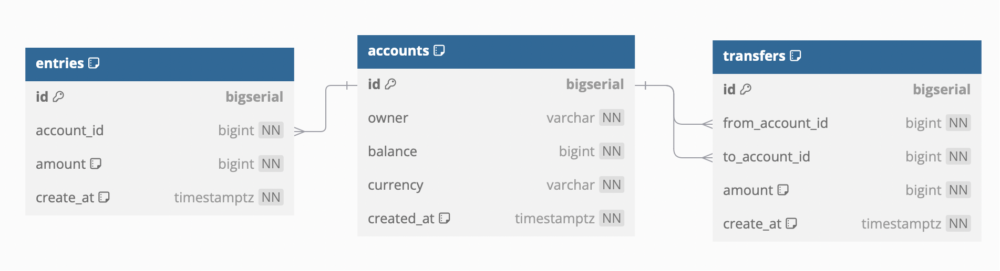

Referance: https://github.com/PrasannaAdiga/go-simplebank

# DB Design

- Use the link `dbdiagram.io` to design DB with various tables, indexes etc
- For example below is the design created for the simple banking application

```
Table accounts as A {
  id bigserial [pk]
  owner varchar [not null]
  balance bigint [not null]
  currency varchar [not null]
  created_at timestamptz [not null, default: `now()`]

  indexes {
    owner //search account by owner
  }
}

Table entries {
  id bigserial [pk]
  account_id bigint [ref: > A.id, not null]
  amount bigint [not null, note: 'can be negative or positive']
  create_at timestamptz [not null, default: `now()`]

  indexes {
    account_id // search all entries by account_id
  }
}

Table transfers {
  id bigserial [pk]
  from_account_id bigint [ref: > A.id, not null]
  to_account_id bigint [ref: > A.id, not null]
  amount bigint [not null, note: 'must be positive']
  create_at timestamptz [not null, default: `now()`]

  indexes {
    from_account_id // all transactions going out of from_account_id
    to_account_id // all transactions coming in to_account_id
    (from_account_id, to_account_id) // all transactions between from_account_id to to_account_id
  }
}


```



- From `dbdiagram.io` we can even export this design as `postgreSQL` db script and import them into postgreSQL DB.