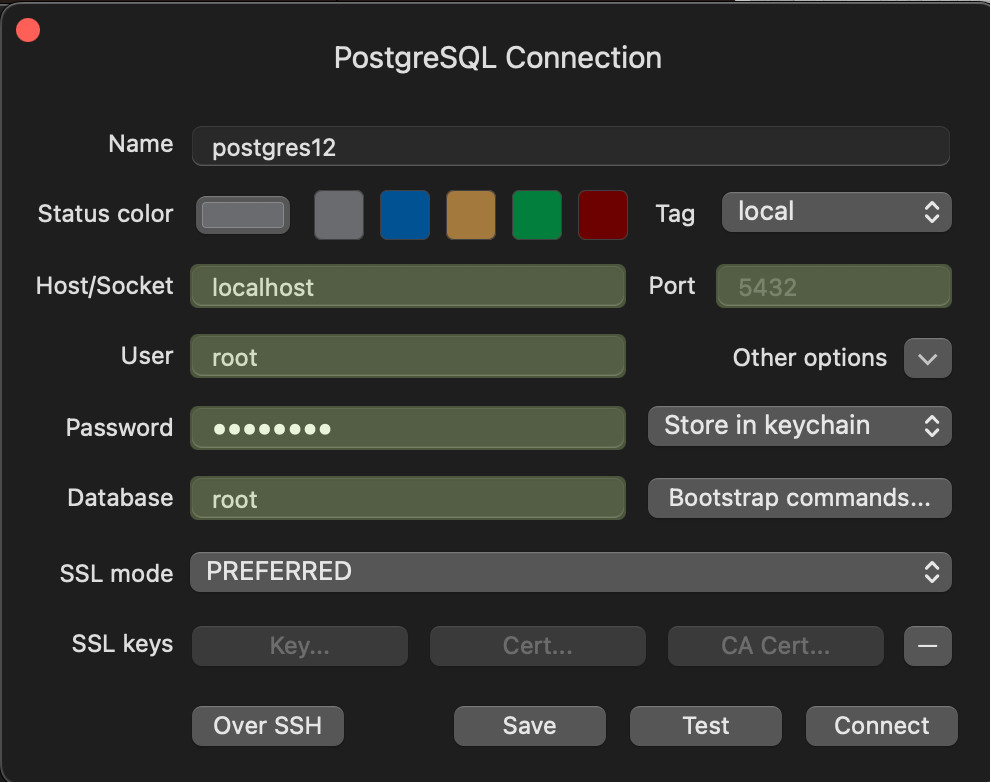

# Running PostgreSQL inside docker, connect to it through TablePlus and create tables

Download and install docker desktop in Mac: https://www.docker.com/products/docker-desktop/

Go to `hub.docker.com` and search for `psotgresql` image https://hub.docker.com/search?q=postgreSQL

There will be several images, but select the official postgresql image https://hub.docker.com/_/postgres

### Download the postgres light version image
Go to terminal and pull the latest alpine image: `docker pull postgres:16-alpine` (docker pull image_name:tag_name). Alpine are the light version of postgres.

### Start the postgres container

docker run --name <container_name> -e <environment_variable> -p <host_port:container_port> -d <image_name>:<tag_name> (-d runs it in background)

`docker run --name postgres16 -e POSTGRES_USER=root -e POSTGRES_PASSWORD=password -p 5432:5432 -d postgres:16-alpine`

### To login to postgres container

docker exec -it <container_name_or_id> <command> [args]

`docker exec -it postgres16 /bin/bash`

### To run `psql` command in postgres container

`docker exec -it postgres16 psql -U root`

This will open the postgres console by logging into the container. Postgress does not ask for password while running in local.

```
~/go/src  docker exec -it postgres16 psql -U root                                                   ✔  11:03:52 am 
psql (16.4)
Type "help" for help.

root=#
root=#
root=#
root=#
root=# select now();
              now
-------------------------------
 2024-09-04 05:42:25.300594+00
(1 row)

root=#
root=#
root=#
root=# q
root-# q!
root-# \q
 ~/go/src 
```

### View postgres container logs

`docker logs -f <container_name_or_id>` (-f to follow the logs)


## TablePlus

Download TablePlus for Mac https://tableplus.com

Open and connect to postgres which is running inside the docker container



Default database is root which is similar to username since we did not configure it while running docker

Once connected, open the sql file which is downloaded from dbdiagram.io in the previous section and run it.

Use `cmd+enter` to run all the query, `cmd+r` to refresh the table and `cmd+s` to save the query


