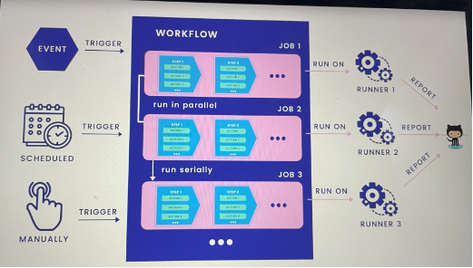

# Continuous Integration with Github actions tool

The idea is to run all of our unit tests, to make sure none of the code breaks, whenever new commit is merged to master branch through github actions. 

Some of the keywords used in Github Actions or any other similar CI tool

### Workflow
We need to define a workflow which is an automated procedure and made up of several `jobs`. It can be triggered by either any events, sceduler or manually. We need to define a .yml files which contains these workflow definitions

### Runner
In order to run a job, we must specify `runner` for each of them. Its simply a server which will run jobs one at a time. We can use Github hosted runner or our own self hosted runner. These runner can report the progress, logs and result to github so that we can checkit on the UI of the repository

### Jobs
Job is a set of steps execute on the same runner. Normally all jobs in worker run in parallel, except some jobs which are depend on each other. 

### Steps

Step is an individual task, run serially within a job. It can contain one or multiple actions. 

### Action 
It is basically a standalone command. It runs serially within a step. It can be reused in other steps. If someone written any github action, we can just reuse it. 




## How to implement Github actions?

- GO to `actions` tab in your github project repository.
- Click on `Configure` option for a Go project 
- This will create a default `go.yml` workflow file under the path `/.github/workflows`
- But instead of using this approach, it is better to manaully create this yml file under the same path, with name something like `ci.yml` locally with the needed configurations and push it.

We also need to write github action for postgres, so that these unit tests can connect to postgres. We can search for this pre-built action for postgres and use the same

```
	# Service containers to run with `container-job`
    services:
      # Label used to access the service container
      postgres:
        # Docker Hub image
        image: postgres
        # Provide the password for postgres
        env:
          POSTGRES_PASSWORD: postgres
        # Set health checks to wait until postgres has started
		ports:
		  - 5432:5432
        options: >-
          --health-cmd pg_isready
          --health-interval 10s
          --health-timeout 5s
          --health-retries 5
```

The final ci.yml file looks like below

```
# This Workflow runs all the unit tests as soon as code is merged o=to master
name: Run unit tests # this name will be displayed in github repo action UI page

on:  # define event that trigger this workflow
  push:
    branches: [ main ]
  pull_request:
    branches: [ main ]

jobs:

  test:
    name: Test
    runs-on: ubuntu-latest

    services: # We use services keyword to run any external services
      postgres:
        image: postgres:14-alpine
        env:
          POSTGRES_USER: root
          POSTGRES_PASSWORD: password
          POSTGRES_DB: simple_bank
        ports:
          - 5432:5432
        options: >-
          --health-cmd pg_isready
          --health-interval 10s
          --health-timeout 5s
          --health-retries 5

    steps: # define multiple steps under each job

    - name: Set up Go 1.x
      uses: actions/setup-go@v2
      with:
        go-version: ^1.22
      id: go

    - name: Check out code into the Go module directory
      uses: actions/checkout@v2 # uses predefined actions

    - name: Install golang-migrate 
      run: |
        curl -L https://github.com/golang-migrate/migrate/releases/download/v4.14.1/migrate.linux-amd64.tar.gz | tar xvz
        sudo mv migrate.linux-amd64 /usr/bin/migrate
        which migrate

    - name: Run migrations # create all the postgres db schema and tables
      run: make migrateup

    - name: Test
      run: make test # we are running make test command which we have already added in Makefile

```
