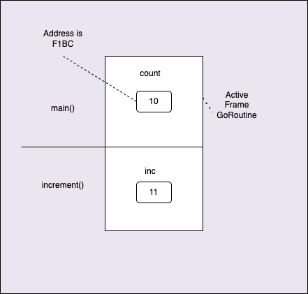

# Pointers
https://github.com/ardanlabs/gotraining/tree/master/topics/go/language/pointers

Pointers provide a way to share data across program boundaries. Having the ability to share and reference data with a pointer provides the benefit of efficiency. There is only one copy of the data and everyone can see it changing. The cost is that anyone can change the data which can cause side effects in running programs.

- Use pointers to share data.
- Values in Go are always pass by value.
- "Value of", what's in the box. "Address of" ( & ), where is the box.
- The (*) operator declares a pointer variable and the "Value that the pointer points to".

## Pass By Value
Everything in Go is pass by value.

Three areas of memeory which are important when Goroutine start executing functions one by one.
### 1. Data segments
Reserved for global variables and read-only values

### 2. Stacks
- A stack is a data structure or stack of memory that every OS level or Goroutine level threads are given. 
- At OS level 1 meg memory will be allocated for a Stack, where as 2K memory is allocated for each Goroutines. 
- When a Go program starts up, we get a Goroutine or a new path of execution for the main() function, which start executing every single instruction one by one.
- Everytime when a function is called, it takes a frame of memory off the stack and start executing the code written inside that function. 
- At any time, the goroutine only has direct access to the memory for the frame that it is opertaing on, it means all of the data that the goroutine needs to perform this data transforamtion has to be in here.
- Each of these stack frames creates a sandbox, a layer of isolation or a sense of immutibilty that the goroutine only mutate or cause problems in the same stack frame and nowhere else in our code.


Consider the below program:
```
// Sample program to show the basic concept of pass by value.
package main

func main() {

	// Declare variable of type int with a value of 10.
	count := 10

	// Display the "value of" and "address of" count.
	println("count:\tValue Of[", count, "]\tAddr Of[", &count, "]")

	// Pass the "value of" the count.
	increment(count)

	println("count:\tValue Of[", count, "]\tAddr Of[", &count, "]")
}

// increment declares count as a pointer variable whose value is
// always an address and points to values of type int.
//
//go:noinline
func increment(inc int) {

	// Increment the "value of" inc.
	inc++
	println("inc:\tValue Of[", inc, "]\tAddr Of[", &inc, "]")
}
```

- In the above code, when we call the function `increment` we copy the value of `count` and pass it to that function as a parameter. 
- Hence, even though we increment the value of this count inside the function increment, the value of this count variable inside the main stack frame does not change.
- Note that once the increment function is executed, we remove this stack frame and it's corresponding local variable and values. Then the goroutine will go back to the main stack frame and start continuing the execution until it completes.



### Value Semantics
- In case of value Semantics(What is there inside the box) we copy the value of a variable. It provides isolation, mutability, reduce side effects and better performance. But one of the cost of this semantics is, we will be having multiple copies of the same data throughout the program. It is difficult to update a data everywhere it needs to be. 

## Sharing Data 

### Pointer Semantics
Pointer Semantics are used to share the data across a program boundary. We can copy and pass the address of a variable across the program boundary, so that the value available in this address can be changed which will be visible in other places in the code.

To store these addresses we use the pointer variables.  We use the operator `*` infront of the variable's type. And to pass address of a variable we use the operator `&`.

This allows us to point to any piece of data outside of the current stack frame and use or change it. 

- Use the variable by itself which gives its value, whats in the box.
- Use the variable along with `&` which gives its address, where is the box?
- Use the pointer variable to get the value that the pointer points to.

Pointers has its own cost from our mutation, isolation and immutability which is nothing but side effect. Mutating through value semantics does not have any side effect, but mutating through pointer semantics will have side effect and we need to handle it carefully.
```
// Sample program to show the basic concept of using a pointer
// to share data.
package main

func main() {

	// Declare variable of type int with a value of 10.
	count := 10

	// Display the "value of" and "address of" count.
	println("count:\tValue Of[", count, "]\t\tAddr Of[", &count, "]")

	// Pass the "address of" count.
	increment(&count)

	println("count:\tValue Of[", count, "]\t\tAddr Of[", &count, "]")
}

// increment declares count as a pointer variable whose value is
// always an address and points to values of type int.
//go:noinline
func increment(inc *int) {

	// Increment the "value of" count that the "pointer points to".
	*inc++

	println("inc:\tValue Of[", inc, "]\tAddr Of[", &inc, "]\tValue Points To[", *inc, "]")
}

O/P:
count:	Value Of[ 10 ]		Addr Of[ 0xc000040768 ]
inc:	Value Of[ 0xc000040768 ]	Addr Of[ 0xc000040758 ]	Value Points To[ 11 ]
count:	Value Of[ 11 ]		Addr Of[ 0xc000040768 ]
```

So basically as we make function calls we are going deeper into the stack. As we return we are coming back up the stack.

### 3. Heaps
We use Heap memory to store values, thats going to be shared across Go routine boundaries or any value that casting on the frame beacause there is an integrity issue, or any value where we do not know the size at the compile time.

## Escape Analysis

- When a value could be referenced after the function that constructs the value returns.
- When the compiler determines a value is too large to fit on the stack.
- When the compiler doesn’t know the size of a value at compile time.
- When a value is decoupled through the use of function or interface values.

Go does not have any constructor, instead it has what we can call is factory functions that creates a value, initialize it for use and returns it to the caller. 
```
// Sample program to teach the mechanics of escape analysis.
package main

// user represents a user in the system.
type user struct {
	name  string
	email string
}

// main is the entry point for the application.
func main() {
	u1 := createUserV1()
	u2 := createUserV2()

	println("u1", &u1, "u2", u2)
}

// createUserV1 creates a user value and passed
// a copy back to the caller.
//
//go:noinline
func createUserV1() user {
	u := user{
		name:  "Bill",
		email: "bill@ardanlabs.com",
	}

	println("V1", &u)

	return u
}

// createUserV2 creates a user value and shares
// the value with the caller.
//
//go:noinline
func createUserV2() *user {
	u := user{
		name:  "Bill",
		email: "bill@ardanlabs.com",
	}

	println("V2", &u)

	return &u
}

O/P:
V1 0xc000040708
V2 0xc000060020
u1 0xc000040750 u2 0xc000060020
```

In the above code, the createUserV1() function uses the value semantics and returns copy of user back to the caller.
But createUserV2() function uses the pointer semantics and returns copy of the address of user up the call stack. 

This will create a pointer down the call stack. At any point in time, all the stack frames below the active frame are inactive, any memory allocated in there will eventually garbage collected. But in this situation we need to store the value of user somewhere so that the active frame or the main function can still use it.

During this situation, Go compiler will perform the static code analysis which is called Escape Analysis. This Escape analysis will determine whether a value gets to be placed on the stack or it escapes to the heap which is called **allocation**. If a value can not be stays on the stack, compiler will store it in the heap memory and returns an address of the same to the caller function(main function here).

Stacks are self cleaning. Garabge collector will not get involved here. But any value which escapes to the heap has to be cleaned by Garabge Collector in th heap. So memomry is left alone on the stack as we go up, and cleaned on the way down, so that GC does not have to get involved. The stack can give us tremondous amount of performance because the memory is already allocated and it is self-cleaning.

So we really want to try our best to leverage our value semantics and to keep the values on the stack because of many benifits we already seen above. Becasue once something is allocated in heap, then GC has to get involved.

**Note** Be carefull not to mix value and pointer semantics together.

## Stack Growth
Allocation on heap is determined by how something is shared, whether its through value semantics or pointer semantics.
There is another part of allocation in Go, and that is if compiler does not know the size of a value at compile time, it must immediately construct it on the heap. For example collections, whose size is based on a variable, which gives compiler no idea what the size of that is and we are going to have automatic allocations immediately in the heap. 

The size of Goroutine stacks is 2K, and when a goroutine makes a lot of function calls and eventually it should get run out of stack space. We just cant terminate the goroutine if it reaches out of stack error, which we basically do in case of OS threads.

How Go address this stack space issue is, it will immediately creates a new stack which is called as contiguous stacks. It allocates a larger stack, 25% larger than the original one and then it copy all the frames from the previous stack along with its values/pointer data.  

Note: Stack memomry can not be shared across goroutines. Each stack memomry belongs to only one goroutine.

### Stack vs Heap
The stack is for data that needs to persist only for the lifetime of the function that constructs it, and is reclaimed without any cost when the function exits. The heap is for data that needs to persist after the function that constructs it exits, and is reclaimed by a sometimes costly garbage collection.

### Pointers Examples:

- Pass by Value: https://go.dev/play/p/9kxh18hd_BT
- Sharing data I: https://go.dev/play/p/mJz5RINaimn
- Sharing data II: https://go.dev/play/p/GpmPICMGMre
- Escape Analysis: https://go.dev/play/p/BCtJrNRJGun
- Stack grow: https://go.dev/play/p/vBKF2hXvKBb