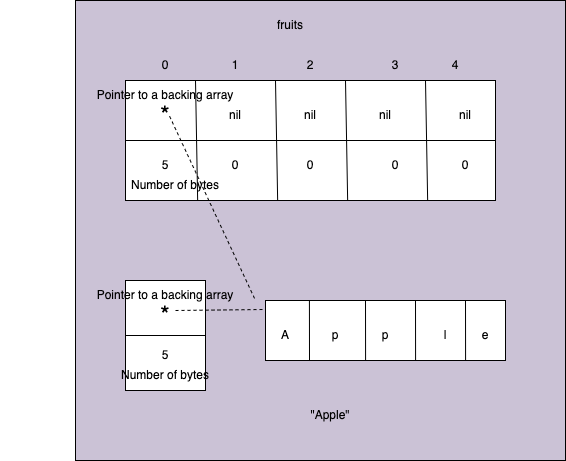
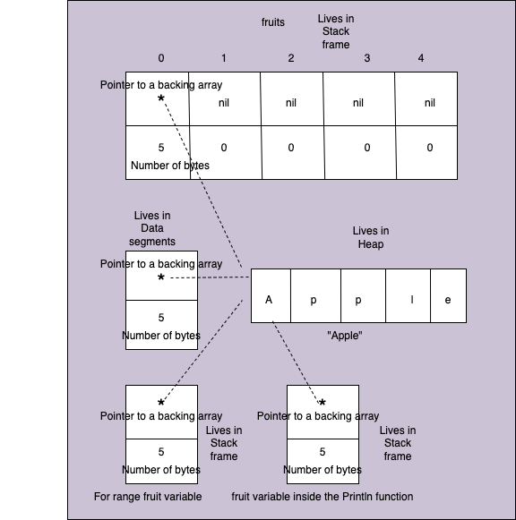

# Arrays
https://github.com/ardanlabs/gotraining/tree/master/topics/go/language/arrays

Go prefers data-oriented design principles over object-orienetd design principles.
Go has only Arrays, Slices and Maps as data structure. It does not have any other data structures like Lists, Stacks, Queues ect
- Arrays are copied by value
- Arrays are comparable by each of its values 

## CPU Cache
Hardware loves `Array` data structure because of its continuous memory location.

- Each core processors will have its own L1 and L2 Caches, where as L3 caches will be shared across all the available cores. Along with these Cache, there is also a main memory.
-  All the programs which we write will basically loaded from disk to this main memory. Then these data/instructions will be loaded onto these L1, L2 and L3 caches before it has been used by the Hardware threads.
- The hardware threads will start reading these data/instructions from L1,L2,L3 or main memory and start processing it by using the CPU. Reading the data from main memory is too slow, where as reading from L1 cache is very fast.
- Because of these CPU Caches abd main memory, the performance will vary depending on the Processors.
- There is concept called **Predictable Acces Pattern** which can pre-load the cache lines from main memory to all these Caches by using **Prefetchers**. In order to have the better efficiency of this Prefetchers hardware loves the `Array` data structure since in Array memory is allocated continuoulsy and this Prefetchers can pre-load those continuous cache lines more efficiently.

More details can be found here: https://github.com/ardanlabs/gotraining/tree/master/topics/go/language/arrays#cpu-cache-notes

In case of Java, JVM can handle all these pre-load of data to Caches, but since Go works directly on a Machine, it supports data structures only Array, Slice and Map which are basically support very well for this Predictable Acces Pattern/Prefetchers.

Arrays are a special data structure in Go that allow us to allocate contiguous blocks of fixed size memory whose size can not be changed. Arrays of different sizes are considered to be of different types.

Do not try to share the array values, It is designed to stay on stack, designed to use value semantics and we should be making copy of it. 

```
// Sample program to show how to declare and iterate over
// arrays of different types.
package main

import "fmt"

func main() {

	// Declare an array of five strings that is initialized
	// to its zero value.
	var fruits [5]string
	fruits[0] = "Apple"
	fruits[1] = "Orange"
	fruits[2] = "Banana"
	fruits[3] = "Grape"
	fruits[4] = "Plum"

	// Iterate over the array of strings
	for i, fruit := range fruits {
		fmt.Println(i, fruit)
	}

	// Declare an array of 4 integers that is initialized
	// with some values.
	numbers := [4]int{10, 20, 30, 40}

	// Iterate over the array of numbers.
	for i := 0; i < len(numbers); i++ {
		fmt.Println(i, numbers[i])
	}
}
```

We can declare and initialize an array to its zero value or declare and initialize by using short variable declaration operator as shown in the above code.

```
var fruits [5]string
fruits[0] = "Apple"
```
When the above lines are executed, we have a memory allocation as shown below:



## For-range
We can use the for range operator to itertae over the Array. It comes in 2 semantics. Value semantics and Pointer semantics.

- Value semantics: every piece of code is operating on its own copy of the data, as we transition across program boundaries, in between functions, as we do things, we are operating on our own copy of the data.
- Pointer semantics: every piece of cide is operating on the same shared data, for which it will have a direct access so that it read/modify it. We are gonna get efficiencies. But we have to deal with isolation/mutation either through synchronization, orchestartion.

### Value semantics of for range
```
for i, fruit := range fruits {
	fmt.Println(i, fruit)
}
```
Here `fruits` gets its own copy first and then the local varible `fruit` of the for loop gets its own copy of the every value that we are iterating over the local copy of `fruits`.
Also, this local `fruit` variable also points the same backing array as shown below efficiently:

Now in the code `fmt.Println(i, fruit)` again we are passing the copy of this `fruit` value to the Println() function. Now this local `fruit` variable also points to the same backing array, thus all of the values share the same backing array efficiently.



Now from the memory allocation point of view, the actual pointer to the string "Apple" lives in the data segments and rest of all values lives in its own stack frame. The only thing which is created in the Heap is "Apple" string itself. So GC needs to deel with only one value here which lives in Heap. 

### Pointer semantics of for range
```
// Sample program to show how the for range has both value and pointer semantics.
package main

import "fmt"

func main() {

	// Using the pointer semantic form of the for range.
	friends := [5]string{"Annie", "Betty", "Charley", "Doug", "Edward"}
	fmt.Printf("Bfr[%s] : ", friends[1])

	for i := range friends {
		friends[1] = "Jack"

		if i == 1 {
			fmt.Printf("Aft[%s]\n", friends[1])
		}
	}

	// Using the value semantic form of the for range.
	friends = [5]string{"Annie", "Betty", "Charley", "Doug", "Edward"}
	fmt.Printf("Bfr[%s] : ", friends[1])

	for i, v := range friends {
		friends[1] = "Jack"

		if i == 1 {
			fmt.Printf("v[%s]\n", v)
		}
	}

	// Using the value semantic form of the for range but with pointer
	// semantic access. DON'T DO THIS.
	friends = [5]string{"Annie", "Betty", "Charley", "Doug", "Edward"}
	fmt.Printf("Bfr[%s] : ", friends[1])

	for i, v := range &friends {
		friends[1] = "Jack"

		if i == 1 {
			fmt.Printf("v[%s]\n", v)
		}
	}
}

O/P:
Bfr[Betty] : Aft[Jack]
Bfr[Betty] : v[Betty]
Bfr[Betty] : v[Jack]
```

Notice the below piece of codes, which uses the Pointer semantics of for-range
```
for i := range friends {
    friends[1] = "Jack"

    if i == 1 {
        fmt.Printf("Aft[%s]\n", friends[1])
    }
}
```
Here we do not use the value semantic format `for i, v`. Because of this the `friends` does not get any copy of its own and it directly work on the friends array and change it directly.

### Arrays examples:

- Declare, initialize and iterate: https://go.dev/play/p/OIh-XVdDSZb
- Different type arrays: https://go.dev/play/p/KmXH8Z9F3Rh
- Contiguous memory allocations: https://go.dev/play/p/guj-ZvSF0qS
- Range mechanics: https://go.dev/play/p/cx4GEViWjC7
