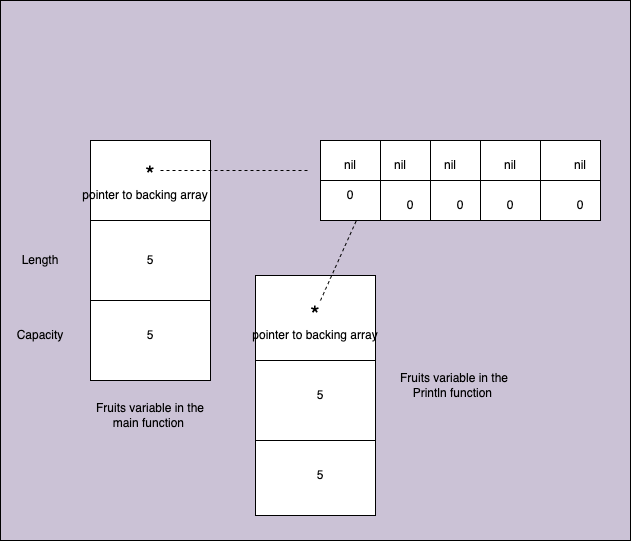
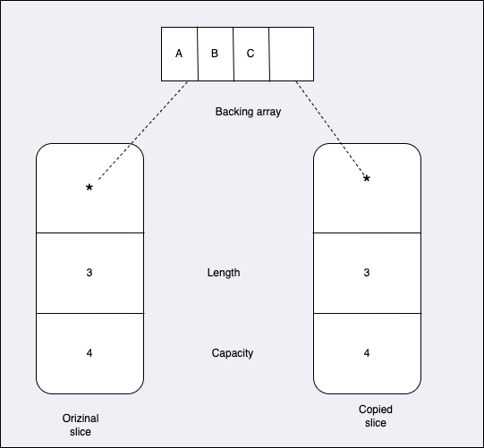
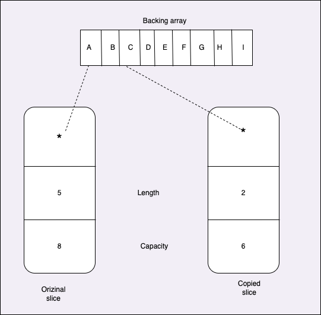

# Slices
https://github.com/ardanlabs/gotraining/tree/master/topics/go/language/slices

Slice in Go is one of the reference type. When we set slice to a zero value, it is considered to be nil. 

Slices are an incredibly important data structure in Go. They form the basis for how we manage and manipulate data in a flexible, performant and dynamic way

- Slices are like dynamic arrays with special and built-in functionality.
- There is a difference between a slices length and capacity and they each service a purpose.
- Slices allow for multiple "views" of the same underlying array.
- Slices can grow through the use of the built-in function append.
- Do not try to share the slice values, It is designed to stay on stack, designed to use value semantics and we should be making copy of it. 
- Slices are copied by reference hence it is not comparable with other slices.

There are 2 kinds of slices:
- Nil slice: When we create a slice and set it to a zero value we get nil slice. Ex: `var data []string`. This is used along with while returning an error.

  nil | 
  --- |
  0 |
  0|

- Empty slice: When we create a slice and set it to an empty struct literal we get empty slice not the zero value or nil slice. This is used when there are no errors. Ex: data := []string{}

  * |
  --- |
  0 |
  0 |
   
   Here pointer points to an empty struct `struct{}`

## Declaration
```
// Sample program to show how the capacity of the slice
// is not available for use.
package main

import "fmt"

func main() {

	// Create a slice with a length of 5 elements.
	fruits := make([]string, 5)
	fruits[0] = "Apple"
	fruits[1] = "Orange"
	fruits[2] = "Banana"
	fruits[3] = "Grape"
	fruits[4] = "Plum"

	// You can't access an index of a slice beyond its length.
	fruits[5] = "Runtime error"

	// Error: panic: runtime error: index out of range

	fmt.Println(fruits)
}
```

Slices are created using the make function, when we know how much size we need to allocated for the backing array. If we do not know this then we can create it through zero value syntax like `var data []string`. We can call this zero value slice as `nil slice`. 

Slice is a 3 word or 24 bytes data structure.  The first word is a pointer to the backing array. Second word for the Length and third word for the Capacity.

- Length means total number of elements we can access from the pointer position. This will sets the bounds just like an array. Length is what we have access for today. 
- Capacity is the total number of elements period that exists in the backing array from that pointer position. It can be larger than length. It is used for growth of slices. 
- In Nil slice the pointer will be `nil` and lenth and capacity will be `0`

In the line `fmt.Println(fruits)` we are using value semantics, which means we are copying the value of fruits to another variable and pass it to teh Println function. This will creates another variable which also points to the same backing array just like how it works in String.



Here only the backing array will get created in the Heap and rest all will created in the stack frame or in data segmants which can get cleaned without GC in action.

## Appending slices
We use the function append to add a new value to slices, and helps slice to grow by its own. this function uses the value semantics. It gets its own copy of the slice value, mutates it and returns it back. Note that whenever the length and capacity of a slice becomes same, the append function will create a brand new slice and returns it. So that it does not refer to previous backing array. If there are any other reference on this previous backing array then there will be go memory leak which we need to be careful about.

How append works?
- It first gets its own copy of slice value
- Then it check whether length and capacity values are same. 
- If its same, which means there is no enough capacity for the append and it will create a new backing array
- It then mutates its own copy of the slice value, with a pointer points to the backing array
- And finally returns a copy of this slice back to the orizinal slice
- Now caller gets a new slice value with a pointer points to the same backing array
- If we call another append function, the same steps will repeat but it doubles the size of the previous backing array
- And it copyies all the contents from the previous backing array to this new doubled backing array. This will make the capacity of the slice greater than its capacity
- Later GC will clean all these previous backing array for which no pointer is referred

Note: Before 100 elements the backing array doubles its size. But after that the backing array grows every time by 25%.

Now if we know the capacity of this slice in advance then instead of using zero value slice, we can use the make function to create the slice with length as `0` and capacity as lets say `1000`. This will creates a backing array with capacity of 1000 in advance, so that wehen we call append function on this slice, we never need to create any new backing array and do all those copy values. This will makes slice performance better.




### What is memory leak in Go?
Memory leak in Go is when you maintain a reference to a value which exist in the heap, and that reference never goes away.
- One way of memory leak is, we are not terminating goroutine, which is continuously running and anything that goroutine was holding onto does never gets releases because it never terminates. 
- Another place where memory leak can happen is in append call. If the slice value being copied is not same that we are gonna replace on a return, then it can cause a memory leak. Because this can hold references to the old backing arrays, which can not be cleaned by GC.
- Another place is in some APIs where we forget to call close

## taking slices of slices
Take any existing slice value and create a new slice value, sharing the same backing array for efficiency. 
```
// Sample program to show how to takes slices of slices to create different
// views of and make changes to the underlying array.
package main

import "fmt"

func main() {

	// Create a slice with a length of 5 elements and a capacity of 8.
	slice1 := make([]string, 5, 8)
	slice1[0] = "Apple"
	slice1[1] = "Orange"
	slice1[2] = "Banana"
	slice1[3] = "Grape"
	slice1[4] = "Plum"

	inspectSlice(slice1)

	// Take a slice of slice1. We want just indexes 2 and 3.
	// Parameters are [starting_index : (starting_index + length)]
	slice2 := slice1[2:4]
	inspectSlice(slice2)

	fmt.Println("*************************")

	// Change the value of the index 0 of slice2.
	slice2[0] = "CHANGED"

	// Display the change across all existing slices.
	inspectSlice(slice1)
	inspectSlice(slice2)

	fmt.Println("*************************")

	// Make a new slice big enough to hold elements of slice 1 and copy the
	// values over using the builtin copy function.
	slice3 := make([]string, len(slice1))
	copy(slice3, slice1)
	inspectSlice(slice3)
}

// inspectSlice exposes the slice header for review.
func inspectSlice(slice []string) {
	fmt.Printf("Length[%d] Capacity[%d]\n", len(slice), cap(slice))
	for i, s := range slice {
		fmt.Printf("[%d] %p %s\n",
			i,
			&slice[i],
			s)
	}
}

O/P:
Length[5] Capacity[8]
[0] 0xc0000a0000 Apple
[1] 0xc0000a0010 Orange
[2] 0xc0000a0020 Banana
[3] 0xc0000a0030 Grape
[4] 0xc0000a0040 Plum
Length[2] Capacity[6]
[0] 0xc0000a0020 Banana
[1] 0xc0000a0030 Grape
*************************
Length[5] Capacity[8]
[0] 0xc0000a0000 Apple
[1] 0xc0000a0010 Orange
[2] 0xc0000a0020 CHANGED
[3] 0xc0000a0030 Grape
[4] 0xc0000a0040 Plum
Length[2] Capacity[6]
[0] 0xc0000a0020 CHANGED
[1] 0xc0000a0030 Grape
*************************
Length[5] Capacity[5]
[0] 0xc0000aa000 Apple
[1] 0xc0000aa010 Orange
[2] 0xc0000aa020 CHANGED
[3] 0xc0000aa030 Grape
[4] 0xc0000aa040 Plum
```
### 2 index slices

slice[starting point + (staring point + length)]

In the above example the code `slice2 := slice1[2:4]` does the slice operation.
It takes the same backing array to which the original slice points to, and then creates a new slice which points to index 2 of the backing array as its starting index and index 3(4-1) as its ending index. So that its total length will become 2 and total capacity become 6(number of elements from starting index to end index)



We know that sharing/pointer is dangerous, which can cause side effects.
The same backing array here can be accessed from both slice1 and slice2 thorugh its corresponding index positions.
In the above code example the line `slice2[0] = "CHANGED"` makes such side effects.
It writes the new value "CHANGED" into the backing array at index position 2 through slice2.
This change reflect in slice1 also.
If we try append a new value to slice2, the same kind of side effects may appear, because the append function will add new value to the same backing array, replacing any existing value.

### 3 index slices

But we can eliminate such side effects by using 3 index slice.
slice[low: high: max]
- low: starting position including low index
- high: end position excluding high index
- max: capacity value (max-low)

When we adjust the capacity to be same as length value, then the append function will see these length and capacity values as same and hence it will create a new backing array by copying all the existing values and append the new values to that new backing array. 

Because of this other slices will not get effected because it still points to the previous old backing array.

### Manual copy
```
// Make a new slice big enough to hold elements of slice 1 and copy the
// values over using the builtin copy function.
slice3 := make([]string, len(slice1))
copy(slice3, slice1)
inspectSlice(slice3)
```
We can also create a new slice of some length and manualy copy the values from one slice to another one. 
This will creates 2 diffrent backing arrays or memory location for each of the slices, thus eliminates the side effects.


## Slices and References
```
// Sample program to show how one needs to be careful when appending
// to a slice when you have a reference to an element.
package main

import "fmt"

type user struct {
	likes int
}

func main() {

	// Declare a slice of 3 users.
	users := make([]user, 3)

	// Share the user at index 1.
	shareUser := &users[1]

	// Add a like for the user that was shared.
	shareUser.likes++

	// Display the number of likes for all users.
	for i := range users {
		fmt.Printf("User: %d Likes: %d\n", i, users[i].likes)
	}

	// Add a new user.
	users = append(users, user{})

	// Add another like for the user that was shared.
	shareUser.likes++

	// Display the number of likes for all users.
	fmt.Println("*************************")
	for i := range users {
		fmt.Printf("User: %d Likes: %d\n", i, users[i].likes)
	}

	// Notice the last like has not been recorded.
}

O/P:
User: 0 Likes: 0
User: 1 Likes: 1
User: 2 Likes: 0
*************************
User: 0 Likes: 0
User: 1 Likes: 1
User: 2 Likes: 0
User: 3 Likes: 0
```

Since here length and capacity of a slice are same, the new append function `users = append(users, user{})` will create a new backing array and copy everything from old backing array to this new one.
So now if we do any changes in the old backing array, this will not be notified in the new slices. 
Or if we do any chnages in the new backing array, this will not be notified in the old slices.
We have to be carefull about this kind of side effects.
This kind of scenarios will also results in memory leak because of references into old backing arrays.
So we need to very carefull about append calls in slices.

## Strings and Slices
We can range over strings also. It range over through code point by code point.
We can convert an array to slice with `[:]` operation
Copy function works only with strings and slices.
```
// Sample program to show how strings have a UTF-8 encoded byte array.
package main

import (
	"fmt"
	"unicode/utf8"
)

func main() {

	// Declare a string with both chinese and english characters.
	s := "世界 means world"

	// UTFMax is 4 -- up to 4 bytes per encoded rune.
	var buf [utf8.UTFMax]byte

	// Iterate over the string.
	for i, r := range s {

		// Capture the number of bytes for this rune.
		rl := utf8.RuneLen(r)

		// Calculate the slice offset for the bytes associated
		// with this rune.
		si := i + rl

		// Copy of rune from the string to our buffer.
		copy(buf[:], s[i:si])

		// Display the details.
		fmt.Printf("%2d: %q; codepoint: %#6x; encoded bytes: %#v\n", i, r, r, buf[:rl])
	}
}

O/P:
'世'; codepoint: 0x4e16; encoded bytes: []byte{0xe4, 0xb8, 0x96}
 3: '界'; codepoint: 0x754c; encoded bytes: []byte{0xe7, 0x95, 0x8c}
 6: ' '; codepoint:   0x20; encoded bytes: []byte{0x20}
 7: 'm'; codepoint:   0x6d; encoded bytes: []byte{0x6d}
 8: 'e'; codepoint:   0x65; encoded bytes: []byte{0x65}
 9: 'a'; codepoint:   0x61; encoded bytes: []byte{0x61}
10: 'n'; codepoint:   0x6e; encoded bytes: []byte{0x6e}
11: 's'; codepoint:   0x73; encoded bytes: []byte{0x73}
12: ' '; codepoint:   0x20; encoded bytes: []byte{0x20}
13: 'w'; codepoint:   0x77; encoded bytes: []byte{0x77}
14: 'o'; codepoint:   0x6f; encoded bytes: []byte{0x6f}
15: 'r'; codepoint:   0x72; encoded bytes: []byte{0x72}
16: 'l'; codepoint:   0x6c; encoded bytes: []byte{0x6c}
17: 'd'; codepoint:   0x64; encoded bytes: []byte{0x64}
```

## Range Mechanism for the slices
```
// Sample program to show how the for range has both value and pointer semantics.
package main

import "fmt"

func main() {

	// Using the value semantic form of the for range.
	friends := []string{"Annie", "Betty", "Charley", "Doug", "Edward"}
	for _, v := range friends {
		friends = friends[:2]
		fmt.Printf("v[%s]\n", v)
	}

	// Using the pointer semantic form of the for range.
	friends = []string{"Annie", "Betty", "Charley", "Doug", "Edward"}
	for i := range friends {
		friends = friends[:2]
		fmt.Printf("v[%s]\n", friends[i])
	}
}

O/P:
v[Annie]
v[Betty]
v[Charley]
v[Doug]
v[Edward]
v[Annie]
v[Betty]
panic: runtime error: index out of range [2] with length 2

goroutine 1 [running]:
main.main()
	/tmp/sandbox328898250/prog.go:22 +0x2a5
```
In the pointer semantics the code `friends = friends[:2]` will mutate the orizinal backing array and change its length from 5 to 2 because of which we get the index out of range error in the for loop.

### Slice Examples:

```
package main

import "fmt"

func main() {
	prices := [4]float64{10.99, 20.99, 30.99, 40.99}
	fmt.Println(prices)

	featuredPrices := prices[1:] // This is a slice from array pricess, which have the elements from index 1 to end
	fmt.Println("Length and capacity of first slice ", len(featuredPrices), cap(featuredPrices))

	highlightedPrice := featuredPrices[:1]
	fmt.Println(highlightedPrice)
	fmt.Println("Length and capacity of second slice ", len(highlightedPrice), cap(highlightedPrice))
	fmt.Println(len(highlightedPrice), cap(highlightedPrice))

	highlightedPrice = highlightedPrice[:3] // We can always select more towrds end of slice, till its capacity
	fmt.Println(highlightedPrice)
	fmt.Println("Length and capacity of second slice after reassign ", len(highlightedPrice), cap(highlightedPrice))
	fmt.Println(len(highlightedPrice), cap(highlightedPrice))

    ============================================
	a := []int{1,2,3}
	b := []int{10,11,12}

	a = append(a,4,5,6)
	b := append{b,13,14,15}

	c := append(a, b...)
	fmt.Println(c)
	O/P: [1,2,3,4,5,6,10,11,12,13,14,15]
}

O/P:
Length and capacity of first slice  3 3
[20.99]
Length and capacity of second slice  1 3
1 3
[20.99 30.99 40.99]
Length and capacity of second slice after reassign  3 3
3 3

   
```

### Slices utility functions
- To compare two slices for the equality: `slices.Equal(slice1, slice2)`


- Declare and Length: https://go.dev/play/p/ydOJ1GHgR_Y
- Reference Types: https://go.dev/play/p/WqDnss06_9E
- Appending slices: https://go.dev/play/p/E-NTGM6daAA
- Taking slices of slices: https://go.dev/play/p/rUP9grCot8J
- Slices and References: https://go.dev/play/p/D88zzGYanvX
- Strings and slices: https://go.dev/play/p/1RntHk6UPA5
- Variadic functions: https://go.dev/play/p/rUjWVBMmxgP
- Range mechanics: https://go.dev/play/p/d1wToBg6oUu
- Efficient Traversals: https://go.dev/play/p/xPL8U_bD4kD