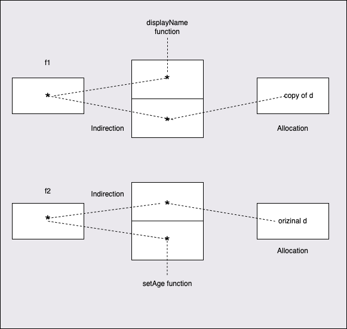

# Methods
https://github.com/ardanlabs/gotraining/tree/master/topics/go/language/methods

Methods are functions that give data the ability to exhibit behavior. Methods allows data to have some behavior. 

- Methods are functions that declare a receiver variable with some name.
- Receivers bind a method to a type and it can use either value semantics or pointer semantics.
- Value semantics mean a copy of the value is passed across program boundaries.
- Pointer semantics mean a copy of the values address is passed across program boundaries.
- Stick to a single semantic for a given type and be consistent.
- A method in Go starts with custom types. Like `type myInt int`. Then we define a method to this type by using method receiver. Method indicates a tighter coupling between a function, type and variable.
```
func (i myInt) isEven() bool {
	return int(i)%2 == 0
}
```

```
// Sample program to show how to declare methods and how the Go
// compiler supports them.
package main

import (
	"fmt"
)

// user defines a user in the program.
type user struct {
	name  string
	email string
}

// notify implements a method with a value receiver.
func (u user) notify() {
	fmt.Printf("Sending User Email To %s<%s>\n",
		u.name,
		u.email)
}

// changeEmail implements a method with a pointer receiver.
func (u *user) changeEmail(email string) {
	u.email = email
}

func main() {

	// Values of type user can be used to call methods
	// declared with both value and pointer receivers.
	bill := user{"Bill", "bill@email.com"}
	bill.changeEmail("bill@hotmail.com")
	bill.notify()

	// Pointers of type user can also be used to call methods
	// declared with both value and pointer receiver.
	joan := &user{"Joan", "joan@email.com"}
	joan.changeEmail("joan@hotmail.com")
	joan.notify()
}

O/P:
Sending User Email To Bill<bill@hotmail.com>
Sending User Email To Joan<joan@hotmail.com>
```

- Values of specific type can be used to call methods declared with both value and pointer receivers. 
- Same way, pointers of specific type can be used to call methods declared with both value and pointer receivers.
- Go will automatically converts these value or address semantics to the needed semantic and calls the method.
- For example if we call a method with value semantics where method expects a pointer semantics, then Go will change this value semantics `user` to pinter semantic `&user` and calls the method

### When to use a value semantics and when to use a pointer semantics?
- If you are working with built-in types like numeric, float, string, bool then use Value Semantics. Even fields in the struct, use Value semantics.
- If you are working with reference types like slices, maps, interfaces, functions, channels then use Value Semantics. There is one execpetion to this, A slice and a Map, you may take the address of a slice or a map only if you are sharing it down the call stack and to a function thats either named decode or un-marshal. Since maps and channels anayway are pointers there is not reason to take the address of the address. 
- For the user defined type like struct, we need to choose what semantics is going to in play. If we are not sure what to use, then we can use the pointer semantics. 
- Also ask few of these questions before choosing a particular semantics. Lets assume I have a user defined struct data which is `Time`. Now if I add 5 seconds to this value, is it the same value just slightly mutated, or is it a new value? We can say here it will be brand new Time if I add 5 seconds to the existing data. This is a good indication that value semantics in play here.
- What if I am dealing with a user struct type, should we making copy of user? Or just mutating existing user data? We can say here it will be the same user with slightly mutated so that pointer semantics in play.
- When we are not sure, it is always good to use pointer semantics because it is alwasy safer to share than making copies because not all data can be copied. 
- It is always good to have factory functions to create value of our own user defined types. And we will decide what kind of semantics should be used to these user defined types in the factory function. 
```
func Now() Time {
    sec, nsec := now()
    return Time{sec + unixToInternal, nsec, local}
}
```
- Once we choose the semantic for a type, we should maintain the same semantic for that type everywhere in the code.

### How Go calls method underneath?
```
// data is a struct to bind methods to.
type data struct {
	name string
	age  int
}
// displayName provides a pretty print view of the name.
func (d data) displayName() {
	fmt.Println("My Name Is", d.name)
}
// setAge sets the age and displays the value.
func (d *data) setAge(age int) {
	d.age = age
	fmt.Println(d.name, "Is Age", d.age)
}
// How we actually call methods in Go.
d.displayName()
d.setAge(45)

// This is what Go is doing underneath.
data.displayName(d)
(*data).setAge(&d, 45)
```

## Decoupling
Decoupling separates concrete data and behaviors. The concrete data can be defined as an object data structure such as struct. The behaviors are defined as a set of methods.

Call Value/Pointer receiver methods with variables
```
// Sample program to show how to declare function variables.
package main

import "fmt"

// data is a struct to bind methods to.
type data struct {
	name string
	age  int
}

// displayName provides a pretty print view of the name.
func (d data) displayName() {
	fmt.Println("My Name Is", d.name)
}

// setAge sets the age and displays the value.
func (d *data) setAge(age int) {
	d.age = age
	fmt.Println(d.name, "Is Age", d.age)
}

func main() {

	// Declare a variable of type data.
	d := data{
		name: "Bill",
	}

	// =========================================================================

	fmt.Println("\nCall Value Receiver Methods with Variable:")

	// Declare a function variable for the method bound to the d variable.
	// The function variable will get its own copy of d because the method
	// is using a value receiver.
	f1 := d.displayName

	// Call the method via the variable.
	f1()

	// Change the value of d.
	d.name = "Joan"

	// Call the method via the variable. We don't see the change.
	f1()

	// =========================================================================

	fmt.Println("\nCall Pointer Receiver Method with Variable:")

	// Declare a function variable for the method bound to the d variable.
	// The function variable will get the address of d because the method
	// is using a pointer receiver.
	f2 := d.setAge

	// Call the method via the variable.
	f2(45)

	// Change the value of d.
	d.name = "Sammy"

	// Call the method via the variable. We see the change.
	f2(45)

    O/P: 
    Call Value Receiver Methods with Variable:
    My Name Is Bill
    My Name Is Bill

    Call Pointer Receiver Method with Variable:
    Joan Is Age 45
    Sammy Is Age 45
}
```
In the above code f1 variable will gets its own copy of `d` since the method `displayName` uses value semantics
And f2 variable will get an existing value of `d` since the method `setAge` uses pointer semantics



-Here both f1 and f2 points to a 2 word data staructure, where the first word points to its corresponding function in the memory and second word points to either the newly created copy of `d` or the orizinal `d` value.

Since we do not know about this copy of value `d` during compile time, the memory has to be allocated during the runtime for this new copy of `d` value in the heap through allocation mechanism.

Also because of double indirection, the escape analysis algorithm can not track whetehr or not the value of orizinal d can stay on a stack or not, and ended up creating it newly in the heap through allocation.

Here both f1 and f2 are decoupling not only the code that we want to execute, but the data we need to execute against it through lots of indirections. Also it allocates new values in heap.

So when we decouple a piece of concrete data in Go, we are going to have the cost of indirection and allocation. So we have to make sure that if we are decoupling, that the cost of indirection and allocation is worth it. 

We have got to learn when should data have behaviour and when it shoud not and data having behaviour is the exceptional cases and it is not a rule.

## Method Receivers
Consider the below example:

```
type user struct {
	id int
	username string
}

func (u user) string() string {
	return fmt.Sprintf("%v (%v)\n", u.username, u.id)  // value receiver
}

func (u *user) UpdateName(name string) {
	u.username = name // pointer receiver
}
```
In the value reciever mmode, we are not going to change the user object at all. So here we copy the user object and work on that copy.

In the pointer receiver mmode, we are changing the username field of the actual user object and hence we are sharing the existing user object instead of working on a copy of the user object. So we generally want that change to be reflected in caller as well, which means we need to share the data between the caller and the method. So pointer receiver are used to share the variable between caller and method.  

### Method examples:
Declare and receiver behavior: https://go.dev/play/p/-rK206XfGaV
Value and Pointer semantics: https://go.dev/play/p/QmKfZAnZ6FQ
Named typed methods: https://go.dev/play/p/9g1PIjyA2YQ
Function/Method variables: https://go.dev/play/p/iRkiczvcHiH
Function Types: https://go.dev/play/p/4TRrKs0-mTR
