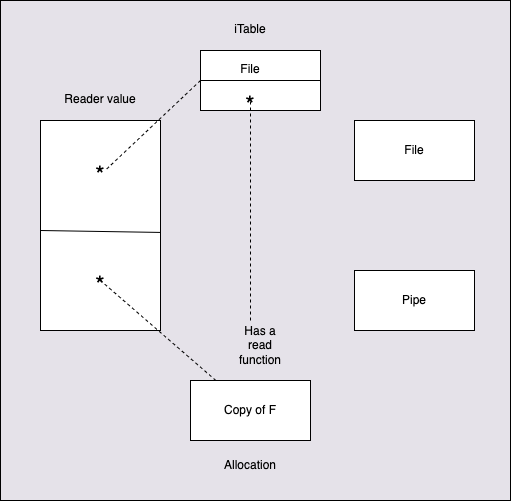
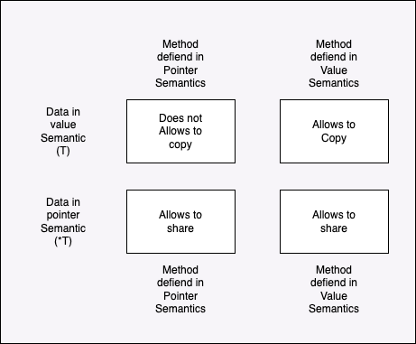
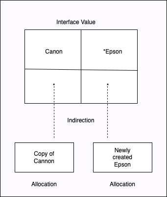

# Interfaces
https://github.com/ardanlabs/gotraining/tree/master/topics/go/language/interfaces

Interfaces provide a way to declare types that define only behavior. This behavior can be implemented by concrete types, such as struct or named types, via methods. When a concrete type implements the set of methods for an interface, values of the concrete type can be assigned to variables of the interface type. Then method calls against the interface value actually call into the equivalent method of the concrete value. Since any concrete type can implement any interface, method calls against an interface value are polymorphic in nature.

Interfaces gives us the ability to have Polymorphism. Polymorphism means that you write a certain program and it behaves differently depending on the data that it operates on. Its a piece of code which changes its behaviour depending on the concrete data that it is operating on. 

So when should a piece of data should have behaviour? one good reason is when we need to implement Polymorphism and this Polymorphism will gives us that level of decoupling. 

- All the behaviour defined in an interface is called its method set
- The method set for a value, only includes methods implemented with a value receiver.
- The method set for a pointer, includes methods implemented with both pointer and value receivers.
- Methods declared with a pointer receiver, only implement the interface with pointer values.
- Methods declared with a value receiver, implement the interface with both a value and pointer receiver.
- The rules of method sets apply to interface types.
- Interfaces are reference types, don't share with a pointer.
- Through interfaces we create polymorphic behavior in go.


Interface types are not real, or it is not a concrete data. So we can not create any variable whose type is interface.
They only defines method set of behaviour. They define a contract of behaviour.
Interfaces usually looks like verbs which does some work, but its not noun or things.
```
type reader interface {
	read(b []byte) (int, error)
}
var d reader => We can not create this.
```

### Bad API design in an interface
Lets consider the below API which we could have defined in an interface:
```
type reader interface {
	read(n int) ([]byte, error)
}
```
This wil be a bad behaviour, since while implementing this behaviour we have to create a slice with `n` length which is unknown and escape analysis will create this slice in the heap during the runtime.
```
read(n int) ([]byte, error) {
    s := make([]byte, n)
}
```
Or another way of defining API is not to take any int like below
```
read() ([]byte, error) {
    s := make([]byte, n)
    return s
}
```
This also a bad design since we are returning slice back up the call stack which will result in allocation of this slice in the heap.

So the best way to design an API is to create this slice of byte in the caller which will allocate the memory in its stack and send it down the call stack.


## Polymorphism in action
```
// Sample program to show how polymorphic behavior with interfaces.
package main

import "fmt"

// reader is an interface that defines the act of reading data.
type reader interface {
	read(b []byte) (int, error)
}

// file defines a system file.
type file struct {
	name string
}

// read implements the reader interface for a file.
func (file) read(b []byte) (int, error) {
	s := "<rss><channel><title>Going Go Programming</title></channel></rss>"
	copy(b, s)
	return len(s), nil
}

// pipe defines a named pipe network connection.
type pipe struct {
	name string
}

// read implements the reader interface for a network connection.
func (pipe) read(b []byte) (int, error) {
	s := `{name: "bill", title: "developer"}`
	copy(b, s)
	return len(s), nil
}

func main() {

	// Create two values one of type file and one of type pipe.
	f := file{"data.json"}
	p := pipe{"cfg_service"}

	// Call the retrieve function for each concrete type.
	retrieve(f)
	retrieve(p)
}

// retrieve can read any device and process the data.
func retrieve(r reader) error {
	data := make([]byte, 100)

	len, err := r.read(data)
	if err != nil {
		return err
	}

	fmt.Println(string(data[:len]))
	return nil
}

O/P:
<rss><channel><title>Going Go Programming</title></channel></rss>
{name: "bill", title: "developer"}
```

In the above code we defined an interface, 2 structs and 1 method for each of these struct, and method is having the same signature as the interface.
**Because of this same signature, the concret type file and pipe implements the reader interface using value semantics** and satisfies the entire method set of the interface.
Go is abour convention over configuration. We do not configure an interface to the concrete type like in other languages where we use the keyword `implement` like in java. Compiler during comile time identifies this interface compliance. 

We also define a retrieve function, which can take any value of type reader. But in reality we can not have any value of type reader since its an interface and are not real. But in reality, what retrieve function is saying is, **please pass me any piece of concrete data, any value or any pointer, that satisfies, that contains the behaviour of reader, the full method sets of reader**.

In the retrieve function the variable `r` is an interface value. Its a 2 word data structure and initially it will be set to its zero value where both word's pointer set to `nil`. When we pass this concrete data to this function, we create an relationship between interface values and concrete data and that is one of storage. We store concrete data inside of interface values and when we store the data inside of interface values, that finally makes the interface value concrete. So interfaces are really valueless, but through the mechanism of storing, we have something thats concrete. So the second word of the interface value that we are using for storage will point to the copied value of concrete data. 

Since read method uses value semantics we pass the copy of these concrete data to retrieve function, there will allocation happens for this copied concrete data in Heap. 

The first word of the interface value points to a special internal table that we call the `iTable`. The first word of the iTable will always describe the type of value taht we are storing inside the interface. In this case it is `File`.The rest of teh itable will be the function pointer, which will basically points to the concreate implemenattion of `read` for file. 

So now when we do `r.read()`, we do an iTable lookup to find out where the implementation of the actual read is and then we call that implementaion. Samething will repeat when we call this retreive function with Pipe concrete data. This is nothing but the Polymorphism. 



## Method Sets and Address of Value
```
// notifier is an interface that defines notification
// type behavior.
type notifier interface {
	notify()
}

// user defines a user in the program.
type user struct {
	name  string
	email string
}

// notify implements the notifier interface with a pointer receiver.
func (u *user) notify() {
	fmt.Printf("Sending User Email To %s<%s>\n",
		u.name,
		u.email)
}

func main() {

	// Create a value of type User and send a notification.
	u := user{"Bill", "bill@email.com"}

	// Values of type user do not implement the interface because pointer
	// receivers don't belong to the method set of a value.

	sendNotification(u)

	// ./example1.go:36: cannot use u (type user) as type notifier in argument to sendNotification:
	//   user does not implement notifier (notify method has pointer receiver)
}

// sendNotification accepts values that implement the notifier
// interface and sends notifications.
func sendNotification(n notifier) {
	n.notify()
}
```

Here the concrete type `user` implements the `notifier` full method sets by using the pointer semantics.
Then we pass value semantics of this user to the function sendNotification, for which compiler will thow an error by saying this user does not implement the notifier! Why?

- If you are working with a value(value semantics) of Type `T`, then only those methods which uses the value semantics belong to the method set for this value.
- If you are working with a pointer(pointer semantics) of Type `T`, then methods which uses both value semantics or pointer semantics belong to the method set for this value.

Method Set Details

T | - | Value Receiver |
--- | --- | --- |
*T | Pointer Receiver  | Value Receiver  |

In the above problem, we pass the value semantics to sendNotification function, but the method defined for this value uses Pointer semantics. So for this combination, no method set defiened so we get the above error.

But why is this so? There are 2 integrity issues here. 
- Every value may not be having address and if we can not get the address then we can use the pointer semantics
- If you have choosen your pointer semantics, then the only thing you allowed to do is share. If we choose value semantics, then we want to make copies. Sometime it is absolutely safe to share a value even if you are working in value semantics. But it is never safe to make a copy of a value that a pointer points to.

**So if you are in pointer semantics mode, you are only allowed to share, you are never allowed to make a copy of the value that the pointer points to. So we should never ever go from pointer semantics to value semantics.** 

**Means if we define a method which has poniter semantics, then we should only share the data with the interface but never send copy of the data to interface**



## Storage by Value
```
// Sample program to show how the concrete value assigned to
// the interface is what is stored inside the interface.
package main

import "fmt"

// printer displays information.
type printer interface {
	print()
}

// cannon defines a cannon printer.
type cannon struct {
	name string
}

// print displays the printer's name.
func (c cannon) print() {
	fmt.Printf("Printer Name: %s\n", c.name)
}

// epson defines a epson printer.
type epson struct {
	name string
}

// print displays the printer's name.
func (e *epson) print() {
	fmt.Printf("Printer Name: %s\n", e.name)
}

func main() {

	// Create a cannon and epson printer.
	c := cannon{"PIXMA TR4520"}
	e := epson{"WorkForce Pro WF-3720"}

	// Add the printers to the collection using both
	// value and pointer semantics.
	printers := []printer{

		// Store a copy of the cannon printer value.
		c,

		// Store a copy of the epson printer value's address.
		&e,
	}

	// Change the name field for both printers.
	c.name = "PROGRAF PRO-1000"
	e.name = "Home XP-4100"	
}

O/P:
Printer Name: PIXMA TR4520
Printer Name: Home XP-4100
```
- When we store a value, the interface value has its own copy of the value. Changes to the original value will not be seen.
- When we store a pointer, the interface value has its own copy of the address. Changes to the original value will be seen.



## Type Assertions
Consider the below example
```
type Reader interface {
	Read([]byte) (int, error)
}

type File struct {...}
func (f File) Read(b []byte) (int, error) {...}

var f File
var r Reader = f

var f2 File =  r //error, Go cant be sure this will work
f2 = r.(File) // type assertion, panics upon failure, Here we say r is containing a concreete type File. If it does not contains the concrete type File, then program will panic out.

// If we are not sure what is the underlying type, then we can use the type assertion with comma syntax.
f2, ok := r.(File)
```

## Type Switch
We can use special form of switch statement called type switch, if we have multiple different types. 
```
var f File
var r Reader = f

switch v := r.(type)
case File:
	// v is not File object
case TCPConn:
	// v is now TCPConn object
default:
	// this is selected if no types were matched	
```

## Generic Programming
Whenver we assign a concrete type to an interface it looses its identity. For example File or TCPConn object to that Reader to an interface, it looses its identity. We no longer know for sure what concrete type we are working with. But by using Type Assertion and Type Switch we can get those concrete type, but those tend to be fairly heavy options for us to use. 

But there are many times when we want our types to work polymorphically, but only for a specific period of time and after we are done with that polymorphic behaviour, we would like to get back to that concrete type. For this we use generic or Generic Programming.

When we pass any concrete type through the interface, Go is going to convert it to an interface for example File concrete type will be converted to io.Reader. We no longer know what type we started with. With Generic Programming we are going to chage the model a little bit. We are going to start with the concrete type, we are going to have what is called a Generic Function. Within that generic function, we are going to allow our type to act as an io.Reader, but when its done we are going to get that File object back out. So that the Generic function is going to be able to work with Files and TCPConns, but at the end its going to return that concrete type back out. So we are going to know what we start with and know what we end with. 
```
func main() {
	testScores := []float64 { // Or here we can use float32 type also
		87.3,
		10.2,
		63.5,
		78,
	}

	c := clone(testScores) // We can pass testScores of type []float64 or []float32 here

	fmt.Println(&testScores[0], &c[0], c)
}

func clone[V any](s []V) []V {
	result := make([]float64, len(s))
	for i, v := range s {
		result[i] = v
	}
	return result
}
```

## Interface examples:

**main package**
```
package main

import (
	"bufio"
	"fmt"
	"os"
	"strings"

	"example.com/note/note"
	"example.com/note/todo"
)

type saver interface {
	Save() error
}

// type displayer interface {
// 	Display()
// }

// type outputtable interface {
// 	Display()
// 	Save() error
// }

type outputtable interface {
	saver // Enbedded interfaces
	Display()
}

func main() {
	title, content := getNoteData()
	todoText := getUserInput("Todo text:")

	userNote, err := note.New(title, content)
	if err != nil {
		fmt.Println(err)
		return
	}

	todo, err := todo.New(todoText)
	if err != nil {
		fmt.Println(err)
		return
	}

	err = OutputData(userNote)
	if err != nil {
		return
	}
	OutputData(todo)
}

func OutputData(data outputtable) error {
	data.Display()
	return saveData(data)
}

func saveData(data saver) error {
	err := data.Save()

	if err != nil {
		fmt.Println("Saving the todo failed.")
		return err
	}

	fmt.Println("Saving the todo succeeded!")
	return nil
}

func getNoteData() (string, string) {
	title := getUserInput("Note title:")
	content := getUserInput("Note content:")

	return title, content
}

func getUserInput(prompt string) string {
	fmt.Printf("%v ", prompt)

	reader := bufio.NewReader(os.Stdin)

	text, err := reader.ReadString('\n')

	if err != nil {
		return ""
	}

	text = strings.TrimSuffix(text, "\n")
	text = strings.TrimSuffix(text, "\r")

	return text
}

```

**note package**
```
package note

import (
	"encoding/json"
	"errors"
	"fmt"
	"os"
	"strings"
	"time"
)

type Note struct {
	Title     string    `json:"title"`
	Content   string    `json:"content"`
	CreatedAt time.Time `json:"created_at"`
}

func (note Note) Display() {
	fmt.Printf("Your note titled %v has the following content:\n\n%v\n\n", note.Title, note.Content)
}

func (note Note) Save() error {
	fileName := strings.ReplaceAll(note.Title, " ", "_")
	fileName = strings.ToLower(fileName) + ".json"

	json, err := json.Marshal(note)

	if err != nil {
		return err
	}

	return os.WriteFile(fileName, json, 0644)
}

func New(title, content string) (Note, error) {
	if title == "" || content == "" {
		return Note{}, errors.New("Invalid input.")
	}

	return Note{
		Title:     title,
		Content:   content,
		CreatedAt: time.Now(),
	}, nil
}

```

**todo package**
```
package todo

import (
	"encoding/json"
	"errors"
	"fmt"
	"os"
)

type Todo struct {
	Text string `json:"text"`
}

func (todo Todo) Display() {
	fmt.Println(todo.Text)
}

func (todo Todo) Save() error {
	fileName := "todo.json"
	json, err := json.Marshal(todo)

	if err != nil {
		return err
	}

	return os.WriteFile(fileName, json, 0644)
}

func New(text string) (Todo, error) {
	if text == "" {
		return Todo{}, errors.New("invalid input")
	}

	return Todo{
		Text: text,
	}, nil
}

```

- Repetitive Code That Needs Polymorphism: https://go.dev/play/p/Txsuzcpdran
- Polymorphism: https://go.dev/play/p/J7OWzPzV40w
- Method Sets: https://go.dev/play/p/N50ocjUekf3
- Address Of Value: https://go.dev/play/p/w981JSUcVZ2
- Storage By Value: https://go.dev/play/p/6KE5b1EwovK
- Type Assertions: https://go.dev/play/p/f47JMTj2eId
- Conditional Type Assertions: https://go.dev/play/p/9fYc5RyyvVG
- The Empty Interface and Type Switches: https://go.dev/play/p/iyDfKCIQ4S9

## Any value and type switch in Go
In the above example we can have below function to accept any data and work differently depending on the type of the input data.
A function can also return any type value.

```
printSomething(1)
printSomething(1.0)
printSomething("1")

func printSomething(data any) {
	switch data.(type) {
	case int:
		fmt.Println("Integer: ", data)
	case float64:
		fmt.Println("Float: ", data)
	case string:
		fmt.Println("String: ", data)
	}
}

Also we can use below approach

if intValue, ok := data.(int); ok {
	fmt.Println("integer: ", intValue)
}
```