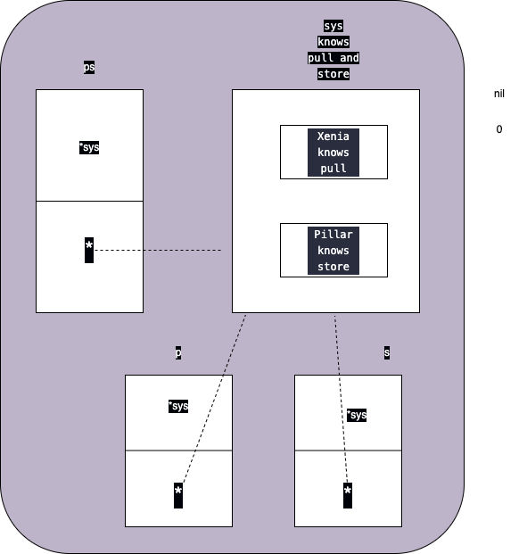

# Composition
https://github.com/ardanlabs/gotraining/tree/master/topics/go/design/composition

Composition goes beyond the mechanics of type embedding and is more than just a paradigm. It is the key for maintaining stability in your software by having the ability to adapt to the data and transformation changes that are coming.

- This is much more than the mechanics of type embedding.
- Declare types and implement workflows with composition in mind.
- Understand the problem you are trying to solve first. This means understanding the data.
- The goal is to reduce and minimize cascading changes across your software.
- Interfaces provide the highest form of composition.
- Don't group types by a common DNA but by a common behavior.
- Everyone can work together when we focus on what we do and not what we are.

## Grouping Types
Basically we can group concrete data based on their type or behaviour.

Consider the below code where we grouped based on the type
```
// This is an example of using type hierarchies with a OOP pattern.
// This is not something we want to do in Go. Go does not have the
// concept of sub-typing. All types are their own and the concepts of
// base and derived types do not exist in Go. This pattern does not
// provide a good design principle in a Go program.
package main

import "fmt"

// Animal contains all the base fields for animals.
type Animal struct {
	Name     string
	IsMammal bool
}

// Speak provides generic behavior for all animals and
// how they speak.
func (a *Animal) Speak() {
	fmt.Printf(
		"UGH! My name is %s, it is %t I am a mammal\n",
		a.Name,
		a.IsMammal,
	)
}

// Dog contains everything an Animal is but specific
// attributes that only a Dog has.
type Dog struct {
	Animal
	PackFactor int
}

// Speak knows how to speak like a dog.
func (d *Dog) Speak() {
	fmt.Printf(
		"Woof! My name is %s, it is %t I am a mammal with a pack factor of %d.\n",
		d.Name,
		d.IsMammal,
		d.PackFactor,
	)
}

// Cat contains everything an Animal is but specific
// attributes that only a Cat has.
type Cat struct {
	Animal
	ClimbFactor int
}

// Speak knows how to speak like a cat.
func (c *Cat) Speak() {
	fmt.Printf(
		"Meow! My name is %s, it is %t I am a mammal with a climb factor of %d.\n",
		c.Name,
		c.IsMammal,
		c.ClimbFactor,
	)
}

func main() {

	// Create a list of Animals that know how to speak.
	animals := []Animal{

		// Create a Dog by initializing its Animal parts
		// and then its specific Dog attributes.
		Dog{
			Animal: Animal{
				Name:     "Fido",
				IsMammal: true,
			},
			PackFactor: 5,
		},

		// Create a Cat by initializing its Animal parts
		// and then its specific Cat attributes.
		Cat{
			Animal: Animal{
				Name:     "Milo",
				IsMammal: true,
			},
			ClimbFactor: 4,
		},
	}

	// Have the Animals speak.
	for _, animal := range animals {
		animal.Speak()
	}
}

O/P:
./prog.go:70:3: cannot use Dog{…} (value of type Dog) as Animal value in array or slice literal
./prog.go:80:3: cannot use Cat{…} (value of type Cat) as Animal value in array or slice literal
```

**Always embed types for behavior, not for state which we are doing in the above code.**

code smells
- The Animal type is providing an abstraction layer of reusable state.
- The program never needs to create or solely use a value of type Animal.
- The implementation of the Speak method for the Animal type is a generalization.
- The Speak method for the Animal type is never going to be called.


Here we embedded Animal into Dog and Cat. But there is no subtyping or subclassing in Go. Animals are animals, dogs are dogs and cats are cats. **Go is not about who we are(state), but Go is about what we do(behaviour)**. Go is really about diversity. If we look and group things by what we do, and not by who we are, then we have high level of diversity. 

In the above code, we have the behaviour we are looking for. Its speak, dogs know how to spaek, cats know how to speak. Stop thinking about what cats and dogs are, and start focusing on what cats and dogs do. 

Consider the below code:
```
// This is an example of using composition and interfaces. This is
// something we want to do in Go. We will group common types by
// their behavior and not by their state. This pattern does
// provide a good design principle in a Go program.
package main

import "fmt"

// Speaker provide a common behavior for all concrete types
// to follow if they want to be a part of this group. This
// is a contract for these concrete types to follow.
type Speaker interface {
	Speak()
}

// Dog contains everything a Dog needs.
type Dog struct {
	Name       string
	IsMammal   bool
	PackFactor int
}

// Speak knows how to speak like a dog.
// This makes a Dog now part of a group of concrete
// types that know how to speak.
func (d *Dog) Speak() {
	fmt.Printf(
		"Woof! My name is %s, it is %t I am a mammal with a pack factor of %d.\n",
		d.Name,
		d.IsMammal,
		d.PackFactor,
	)
}

// Cat contains everything a Cat needs.
type Cat struct {
	Name        string
	IsMammal    bool
	ClimbFactor int
}

// Speak knows how to speak like a cat.
// This makes a Cat now part of a group of concrete
// types that know how to speak.
func (c *Cat) Speak() {
	fmt.Printf(
		"Meow! My name is %s, it is %t I am a mammal with a climb factor of %d.\n",
		c.Name,
		c.IsMammal,
		c.ClimbFactor,
	)
}

func main() {

	// Create a list of Animals that know how to speak.
	speakers := []Speaker{

		// Create a Dog by initializing its Animal parts
		// and then its specific Dog attributes.
		&Dog{
			Name:       "Fido",
			IsMammal:   true,
			PackFactor: 5,
		},

		// Create a Cat by initializing its Animal parts
		// and then its specific Cat attributes.
		&Cat{
			Name:        "Milo",
			IsMammal:    true,
			ClimbFactor: 4,
		},
	}

	// Have the Animals speak.
	for _, spkr := range speakers {
		spkr.Speak()
	}
}

O/P:
Woof! My name is Fido, it is true I am a mammal with a pack factor of 5.
Meow! My name is Milo, it is true I am a mammal with a climb factor of 4.
```

- Declare types that represent something new or unique.
- Validate that a value of any type is created or used on its own.
- Embed types to reuse existing behaviors you need to satisfy.
- Question types that are an alias or abstraction for an existing type.
- Question types whose sole purpose is to share common state.

--- 
## Decoupling

In Go, we have to solve the problem in cocrete data first, not in the abstract or behavior. Also, we need to see is the concrete data decoupled from the change we expect to happen? So we solve the problem in concrete first and then we refector into the decoupling. 

It is better to solve a problem in a layered approach. Initially 3 layears we are going to need. 
- Primitive Layer: We can have our primitive layer and this layer knows how to do one thing and one thing very well. We write out code for this layer, and write unit tests for this layer. This layer is testable. When we say testable, this does not mean interfaces, we are working in the concrete and interfaces, decoupling happens through a refactoring. In short, this layer tells that, can I write a function, where I can give it a set of data, and get a set of data back out and we can validate it and test it. Lot of time this layer is unexported. 
- Lower Level Layer: This is the layer sits on top of the primitive layer or API, that does some raw things, little higher level than the primitive thing layer, and again we are going to write unit tests and this layer should be testable on its own. Lot of time this layes is unexported, but sometime it is nice to export this layer so that we can reuse the functionalities.
- High Level Layer: This is where you are trying to do as much as you can for the user, to make thier life better. In this layer we are really thinking  about, an ease of use for the developer. Hopefully we can unit test this well. Sometime this layer needs integration kind of tests.

High Level Layer |
--- |
Lower Level Layer |
Primitive Layer | 

**Consider the below cases where we are trying to solve the problem in concrete first and then try to do decoupling.**

### Solving the problem at concrete data level
```
// Sample program demonstrating struct composition.
package main

import (
	"errors"
	"fmt"
	"io"
	"math/rand"
	"time"
)

func init() {
	rand.Seed(time.Now().UnixNano())
}

// =============================================================================

// Data is the structure of the data we are copying.
type Data struct {
	Line string
}

// =============================== PRIMITIVE LAYER (One piece at a time ) ========================================

// Xenia is a system we need to pull data from.
type Xenia struct {
	Host    string
	Timeout time.Duration
}

// Pull knows how to pull data out of Xenia.
func (*Xenia) Pull(d *Data) error {
	switch rand.Intn(10) {
	case 1, 9:
		return io.EOF

	case 5:
		return errors.New("Error reading data from Xenia")

	default:
		d.Line = "Data"
		fmt.Println("In:", d.Line)
		return nil
	}
}

// Pillar is a system we need to store data into.
type Pillar struct {
	Host    string
	Timeout time.Duration
}

// Store knows how to store data into Pillar.
func (*Pillar) Store(d *Data) error {
	fmt.Println("Out:", d.Line)
	return nil
}

// ================================ LOWER LAYER LEVEL (batch of data at a time) ====================================

// System wraps Xenia and Pillar together into a single system. 
type System struct {
	Xenia // EMBEDDING
	Pillar // EMBEDDING
}

// pull knows how to pull bulks of data from Xenia.
func pull(x *Xenia, data []Data) (int, error) {
	for i := range data {
		if err := x.Pull(&data[i]); err != nil {
			return i, err
		}
	}

	return len(data), nil
}

// store knows how to store bulks of data into Pillar.
func store(p *Pillar, data []Data) (int, error) {
	for i := range data {
		if err := p.Store(&data[i]); err != nil {
			return i, err
		}
	}

	return len(data), nil
}

// ==================================== HIGH LAYER LEVEL (Single API ) =========================================

// Copy knows how to pull and store data from the System.
func Copy(sys *System, batch int) error {
	data := make([]Data, batch)

	for {
		i, err := pull(&sys.Xenia, data)
		if i > 0 {
			if _, err := store(&sys.Pillar, data[:i]); err != nil {
				return err
			}
		}

		if err != nil {
			return err
		}
	}
}

// =============================================================================

func main() {
	sys := System{
		Xenia: Xenia{
			Host:    "localhost:8000",
			Timeout: time.Second,
		},
		Pillar: Pillar{
			Host:    "localhost:9000",
			Timeout: time.Second,
		},
	}

	if err := Copy(&sys, 3); err != io.EOF {
		fmt.Println(err)
	}
}

O/P:
In: Data
In: Data
In: Data
Out: Data
Out: Data
Out: Data
In: Data
In: Data
Out: Data
Out: Data
```

In the above code, our primitive layer knows how to pull/store one piece of data, the next piece of data from Xenia. Our Lower Level Layer can worry about pulling batches of data or bunch of data in or bunch of data out. High Layer Level can make it all simple through a single API.

In the above code, System represents the full system which has both Xenia and Pillar through Embedding/Composition.
Here we are not Embedding because of state, but because of the behavior Pull and Store. Because of Embedding, now we have a concrete type System which knows how to Pull and Store. 

Remember, we need to use functions first, before we go ahead and use method set. Why we can say and believe that a function is always gonna be more precise than a method can ever be? because function requires you to pass in all of the input in order for it to be able to perfom its data transformation. Methods, when they are not designed properly, they hide information, and we start designing method based APIs, its little bit harder. We need to be carefull not to hide information, if we do hide things then we are setting up for fraud and misuse. 
Consider below code snippet
```
type user struct {
	name string
	email string
}

func (u *user) SendEmail() {
	....
}
```
The above SendEmail method is really a horific API, because this API does not tell us what that user value needs to have in terms of initialization for this method not to fail. Here the state of the user value is incomplete. Today SendEmail uses name and email to send a mail. But what if we change the SendEmail one day to require the use of the person's age. Now nobody calling the SendEmail, not even the compiler knows, that now we need to age to be set, which means that anybody who calls SendEmail, now moving forward will fail on SendEmail because they didnt know the age had to be initialized. We dont know this until production and when we have production bugs. 

Also function like this `func SendEmail(u *user)`are nothing mmore than methods, they are methods. We dont want this.

So how do we write an API that is more precise? The below function is more precise. We reduce any misuse or fraud because everyone knows it needs name and email during compilation time itself. It is more easier to test. If we need age tomorrow we can add one more parameter age to this function, which lets everybody to know during compilation. We can have a function which can take up to 8. 10 or 12 parameters. The more precise the better. Do not think like we need to abstract input, because it hurts with our testing, users, also hurt with debugging. 
```
func SendEmail(name string, email string) {

}
```

So this is why we need to go with function based API first.

In the above code, we have designed the code according to primitive, lower and high layer, sitting on top of each other, nice and clean. If there are problems, then we know, what layer the problem is probably going to be in. We can find it and solve it quickly. Now this program we can move to production. 

Next we can ask what can change? What can come to this program where we have got to do some coupling? The system itself can change or there are new system will come in and we need to do a lot of copy. Now we can ask, do we need to decouple our system today for this change and if answer is yes, then we are gonna take this concrete implementation and refactor it to deal with this change. 

### Refactoring and decoupling the code from change
One of the very first thing we want to look at is the lower level API pull and store. What we need to do is decouple pull and store from the concrete through interface. We already have the implementation of the lower level API. Xenia knows how to pull and Pillar knows how to store. Our concrete implemnattion has provided us the the behavior that we are going to use to decouple us from the code. 
```
// Sample program demonstrating decoupling with interfaces.
package main

import (
	"errors"
	"fmt"
	"io"
	"math/rand"
	"time"
)

func init() {
	rand.Seed(time.Now().UnixNano())
}

// =============================================================================

// Data is the structure of the data we are copying.
type Data struct {
	Line string
}

// =============================================================================

// Puller declares behavior for pulling data.
type Puller interface {
	Pull(d *Data) error
}

// Storer declares behavior for storing data.
type Storer interface {
	Store(d *Data) error
}

// =============================================================================

// Xenia is a system we need to pull data from.
type Xenia struct {
	Host    string
	Timeout time.Duration
}

// Pull knows how to pull data out of Xenia.
func (*Xenia) Pull(d *Data) error {
	switch rand.Intn(10) {
	case 1, 9:
		return io.EOF

	case 5:
		return errors.New("Error reading data from Xenia")

	default:
		d.Line = "Data"
		fmt.Println("In:", d.Line)
		return nil
	}
}

// Pillar is a system we need to store data into.
type Pillar struct {
	Host    string
	Timeout time.Duration
}

// Store knows how to store data into Pillar.
func (*Pillar) Store(d *Data) error {
	fmt.Println("Out:", d.Line)
	return nil
}

// =============================================================================

// System wraps Xenia and Pillar together into a single system.
type System struct {
	Xenia
	Pillar
}

// =============================================================================

// pull knows how to pull bulks of data from any Puller.
func pull(p Puller, data []Data) (int, error) {
	for i := range data {
		if err := p.Pull(&data[i]); err != nil {
			return i, err
		}
	}

	return len(data), nil
}

// store knows how to store bulks of data from any Storer.
func store(s Storer, data []Data) (int, error) {
	for i := range data {
		if err := s.Store(&data[i]); err != nil {
			return i, err
		}
	}

	return len(data), nil
}

// Copy knows how to pull and store data from the System.
func Copy(sys *System, batch int) error {
	data := make([]Data, batch)

	for {
		i, err := pull(&sys.Xenia, data)
		if i > 0 {
			if _, err := store(&sys.Pillar, data[:i]); err != nil {
				return err
			}
		}

		if err != nil {
			return err
		}
	}
}

// =============================================================================

func main() {
	sys := System{
		Xenia: Xenia{
			Host:    "localhost:8000",
			Timeout: time.Second,
		},
		Pillar: Pillar{
			Host:    "localhost:9000",
			Timeout: time.Second,
		},
	}

	if err := Copy(&sys, 3); err != io.EOF {
		fmt.Println(err)
	}
}

O/P:
In: Data
In: Data
In: Data
Out: Data
Out: Data
Out: Data
In: Data
In: Data
Out: Data
Out: Data
```

We created 2 interfaces puller and storer. Xenia implemnets puller and Pillar implements storer. 
Next we can decouple, in our lower level API, by replacing Xenia by puller and Pillar by storer. Now these lower level API, is asking for any piece of concrete data, any value or any pointer that knows how to pull or how to store. 
Now we can create other concrete type, for our other systems and that lower level API can work with those other systems. 

### Interface composition
Next it is good to decouple copy function also so that it can work with any system. Right now it works with System which just has Xenia and Pillar.

```
// Sample program demonstrating interface composition.
package main

import (
	"errors"
	"fmt"
	"io"
	"math/rand"
	"time"
)

func init() {
	rand.Seed(time.Now().UnixNano())
}

// =============================================================================

// Data is the structure of the data we are copying.
type Data struct {
	Line string
}

// =============================================================================

// Puller declares behavior for pulling data.
type Puller interface {
	Pull(d *Data) error
}

// Storer declares behavior for storing data.
type Storer interface {
	Store(d *Data) error
}

// PullStorer declares behavior for both pulling and storing.
type PullStorer interface {
	Puller
	Storer
}

// =============================================================================

// Xenia is a system we need to pull data from.
type Xenia struct {
	Host    string
	Timeout time.Duration
}

// Pull knows how to pull data out of Xenia.
func (*Xenia) Pull(d *Data) error {
	switch rand.Intn(10) {
	case 1, 9:
		return io.EOF

	case 5:
		return errors.New("Error reading data from Xenia")

	default:
		d.Line = "Data"
		fmt.Println("In:", d.Line)
		return nil
	}
}

// Pillar is a system we need to store data into.
type Pillar struct {
	Host    string
	Timeout time.Duration
}

// Store knows how to store data into Pillar.
func (*Pillar) Store(d *Data) error {
	fmt.Println("Out:", d.Line)
	return nil
}

// =============================================================================

// System wraps Xenia and Pillar together into a single system.
type System struct {
	Xenia
	Pillar
}

// =============================================================================

// pull knows how to pull bulks of data from any Puller.
func pull(p Puller, data []Data) (int, error) {
	for i := range data {
		if err := p.Pull(&data[i]); err != nil {
			return i, err
		}
	}

	return len(data), nil
}

// store knows how to store bulks of data from any Storer.
func store(s Storer, data []Data) (int, error) {
	for i := range data {
		if err := s.Store(&data[i]); err != nil {
			return i, err
		}
	}

	return len(data), nil
}

// Copy knows how to pull and store data from any System.
func Copy(ps PullStorer, batch int) error {
	data := make([]Data, batch)

	for {
		i, err := pull(ps, data)
		if i > 0 {
			if _, err := store(ps, data[:i]); err != nil {
				return err
			}
		}

		if err != nil {
			return err
		}
	}
}

// =============================================================================

func main() {
	sys := System{
		Xenia: Xenia{
			Host:    "localhost:8000",
			Timeout: time.Second,
		},
		Pillar: Pillar{
			Host:    "localhost:9000",
			Timeout: time.Second,
		},
	}

	if err := Copy(&sys, 3); err != io.EOF {
		fmt.Println(err)
	}
}
```
For this we added 3rd interface PullStorer which has behavior for both pulling and storing. 
Since System knows how to pull and store through composition/embedding, System implements PullStorer.
In the copy function, we can use the PullStorer interface and pass any piece of code which is a PullStorer.

One thing to notice here is, the store and pull API expect Storer or Puller, but here we pass PullStorer. Why this code is compiling and working?
We take the address of System on the call to copy, so the interfave `ps` will have a pointer to this System, which internally has Puller and Storer through composition. Now we are able to pass `ps` into pull and store, because pull is not asking for a value of type puller. value of type puller does not exist. It asks for any piece of concrete data that knows how to pull. Store is not asking for storer, any concrete piece of data that knows how to store. We are now passing PS to pull and PS to store, because they dont exist. PS is valueless since its an interface. What exist? the concrete data which it points to. So what we are really passing to pull is not PS, but what is stored inside of PS, which is the concrete data. So we are always moving and copying the concrete data. Whether the data directly passed by you, or it is being copied indirectly from the interface, the valueless interface. 




### Decoupling With Interface Composition

Now System is hardcoded to have Xenia and Pillar. If we want to add more systems then we need to break this System, which is not good or add a new system type like below
```
type System2 struct {
	Alice
	Bob
}
```
System2 is a PullStorer, but this is not scalable.

If System was not the embedding of Xenia and Pillar, but the embedding of our 2 interfaces, Puller and Storer, Then we are defining a System on the basis of behavior instead of concrete data. So we can just define a concrete data, where we can inject other concrete data based on that data's behavior. Now all we need is one system type, where we can inject other concrete data inside of it.
```
// Sample program demonstrating decoupling with interface composition.
package main

import (
	"errors"
	"fmt"
	"io"
	"math/rand"
	"time"
)

func init() {
	rand.Seed(time.Now().UnixNano())
}

// =============================================================================

// Data is the structure of the data we are copying.
type Data struct {
	Line string
}

// =============================================================================

// Puller declares behavior for pulling data.
type Puller interface {
	Pull(d *Data) error
}

// Storer declares behavior for storing data.
type Storer interface {
	Store(d *Data) error
}

// PullStorer declares behavior for both pulling and storing.
type PullStorer interface {
	Puller
	Storer
}

// =============================================================================

// Xenia is a system we need to pull data from.
type Xenia struct {
	Host    string
	Timeout time.Duration
}

// Pull knows how to pull data out of Xenia.
func (*Xenia) Pull(d *Data) error {
	switch rand.Intn(10) {
	case 1, 9:
		return io.EOF

	case 5:
		return errors.New("Error reading data from Xenia")

	default:
		d.Line = "Data"
		fmt.Println("In:", d.Line)
		return nil
	}
}

// Pillar is a system we need to store data into.
type Pillar struct {
	Host    string
	Timeout time.Duration
}

// Store knows how to store data into Pillar.
func (*Pillar) Store(d *Data) error {
	fmt.Println("Out:", d.Line)
	return nil
}

// =============================================================================

// System wraps Pullers and Stores together into a single system.
type System struct {
	Puller
	Storer
}

// =============================================================================

// pull knows how to pull bulks of data from any Puller.
func pull(p Puller, data []Data) (int, error) {
	for i := range data {
		if err := p.Pull(&data[i]); err != nil {
			return i, err
		}
	}

	return len(data), nil
}

// store knows how to store bulks of data from any Storer.
func store(s Storer, data []Data) (int, error) {
	for i := range data {
		if err := s.Store(&data[i]); err != nil {
			return i, err
		}
	}

	return len(data), nil
}

// Copy knows how to pull and store data from any System.
func Copy(ps PullStorer, batch int) error {
	data := make([]Data, batch)

	for {
		i, err := pull(ps, data)
		if i > 0 {
			if _, err := store(ps, data[:i]); err != nil {
				return err
			}
		}

		if err != nil {
			return err
		}
	}
}

// =============================================================================

func main() {
	sys := System{
		Puller: &Xenia{
			Host:    "localhost:8000",
			Timeout: time.Second,
		},
		Storer: &Pillar{
			Host:    "localhost:9000",
			Timeout: time.Second,
		},
	}

	if err := Copy(&sys, 3); err != io.EOF {
		fmt.Println(err)
	}
}
```

So now we can easily inject new systems into our System by doing just below code, all through one concrete type `System`
```
Puller: &Bob{
	Host:    "localhost:8000",
	Timeout: time.Second,
},
Storer: &Alice{
	Host:    "localhost:9000",
	Timeout: time.Second,
},
```

### All together

```
package main

import (
	"errors"
	"fmt"
	"io"
	"math/rand"
	"time"
)

// ================================ MODEL =============================================

// Data is the structure of the data we are copying.
type Data struct {
	Line string
}

// Puller declares behavior for pulling data.
type Puller interface {
	Pull(d *Data) error
}

// Storer declares behavior for storing data.
type Storer interface {
	Store(d *Data) error
}

// ============================= CORE LAVEL ================================================

// PullerMachine is a system we need to pull data from.
type PullerMachine struct {
	Host    string
	Timeout time.Duration
}

// Pull knows how to pull data out of Xenia.
func (*PullerMachine) Pull(d *Data) error {
	switch rand.Intn(10) {
	case 1, 9:
		return io.EOF

	case 5:
		return errors.New("Error reading data from Xenia")

	default:
		d.Line = "Data"
		fmt.Println("In:", d.Line)
		return nil
	}
}

// Pillar is a system we need to store data into.
type StorerMachine struct {
	Host    string
	Timeout time.Duration
}

// Store knows how to store data into Pillar.
func (*StorerMachine) Store(d *Data) error {
	fmt.Println("Out:", d.Line)
	return nil
}

// =============================== LOW LEVEL ==============================================

// pull knows how to pull bulks of data from any Puller.
func pull(p Puller, data []Data) (int, error) {
	for i := range data {
		if err := p.Pull(&data[i]); err != nil {
			return i, err
		}
	}

	return len(data), nil
}

// store knows how to store bulks of data from any Storer.
func store(s Storer, data []Data) (int, error) {
	for i := range data {
		if err := s.Store(&data[i]); err != nil {
			return i, err
		}
	}

	return len(data), nil
}

// =============================== HIGH LEVEL ==============================================

// Copy knows how to pull and store data from any System.
func Copy(p Puller, s Storer, batch int) error {
	data := make([]Data, batch)

	for {
		i, err := pull(p, data)
		if i > 0 {
			if _, err := store(s, data[:i]); err != nil {
				return err
			}
		}

		if err != nil {
			return err
		}
	}
}

// =============================================================================

func main() {
	x := PullerMachine{
		Host:    "localhost:8000",
		Timeout: time.Second,
	}

	p := StorerMachine{
		Host:    "localhost:9000",
		Timeout: time.Second,
	}

	if err := Copy(&x, &p, 3); err != nil {
		fmt.Println(err)
	}
}

O/P:
1st run
In: Data
Out: Data
EOF

2nd run
In: Data
Out: Data
Error reading data from Xenia
```

### Interface Pollution

Now if we see closely we have 2 interfaces `System` and `PullStorer`, both are embedding similar types. This is an interface pollution. So we can completely remove `PullStorer` and use `System` directly. 
```
// Sample program demonstrating removing interface pollution.
package main

import (
	"errors"
	"fmt"
	"io"
	"math/rand"
	"time"
)

func init() {
	rand.Seed(time.Now().UnixNano())
}

// =============================================================================

// Data is the structure of the data we are copying.
type Data struct {
	Line string
}

// =============================================================================

// Puller declares behavior for pulling data.
type Puller interface {
	Pull(d *Data) error
}

// Storer declares behavior for storing data.
type Storer interface {
	Store(d *Data) error
}

// =============================================================================

// Xenia is a system we need to pull data from.
type Xenia struct {
	Host    string
	Timeout time.Duration
}

// Pull knows how to pull data out of Xenia.
func (*Xenia) Pull(d *Data) error {
	switch rand.Intn(10) {
	case 1, 9:
		return io.EOF

	case 5:
		return errors.New("Error reading data from Xenia")

	default:
		d.Line = "Data"
		fmt.Println("In:", d.Line)
		return nil
	}
}

// Pillar is a system we need to store data into.
type Pillar struct {
	Host    string
	Timeout time.Duration
}

// Store knows how to store data into Pillar.
func (*Pillar) Store(d *Data) error {
	fmt.Println("Out:", d.Line)
	return nil
}

// =============================================================================

// System wraps Pullers and Stores together into a single system.
type System struct {
	Puller
	Storer
}

// =============================================================================

// pull knows how to pull bulks of data from any Puller.
func pull(p Puller, data []Data) (int, error) {
	for i := range data {
		if err := p.Pull(&data[i]); err != nil {
			return i, err
		}
	}

	return len(data), nil
}

// store knows how to store bulks of data from any Storer.
func store(s Storer, data []Data) (int, error) {
	for i := range data {
		if err := s.Store(&data[i]); err != nil {
			return i, err
		}
	}

	return len(data), nil
}

// Copy knows how to pull and store data from any System.
func Copy(sys *System, batch int) error {
	data := make([]Data, batch)

	for {
		i, err := pull(sys, data)
		if i > 0 {
			if _, err := store(sys, data[:i]); err != nil {
				return err
			}
		}

		if err != nil {
			return err
		}
	}
}

// =============================================================================

func main() {
	sys := System{
		Puller: &Xenia{
			Host:    "localhost:8000",
			Timeout: time.Second,
		},
		Storer: &Pillar{
			Host:    "localhost:9000",
			Timeout: time.Second,
		},
	}

	if err := Copy(&sys, 3); err != io.EOF {
		fmt.Println(err)
	}
}
```

### More Precise API
We can change our high level `copy` API to have a more prcise API, because System is really hiding the cost of initialization. We do not know what is System is when we look at Copy function. We dont know we need these behaviors.
```
// Sample program demonstrating being more precise with API design.
package main

import (
	"errors"
	"fmt"
	"io"
	"math/rand"
	"time"
)

func init() {
	rand.Seed(time.Now().UnixNano())
}

// =============================================================================

// Data is the structure of the data we are copying.
type Data struct {
	Line string
}

// =============================================================================

// Puller declares behavior for pulling data.
type Puller interface {
	Pull(d *Data) error
}

// Storer declares behavior for storing data.
type Storer interface {
	Store(d *Data) error
}

// =============================================================================

// Xenia is a system we need to pull data from.
type Xenia struct {
	Host    string
	Timeout time.Duration
}

// Pull knows how to pull data out of Xenia.
func (*Xenia) Pull(d *Data) error {
	switch rand.Intn(10) {
	case 1, 9:
		return io.EOF

	case 5:
		return errors.New("Error reading data from Xenia")

	default:
		d.Line = "Data"
		fmt.Println("In:", d.Line)
		return nil
	}
}

// Pillar is a system we need to store data into.
type Pillar struct {
	Host    string
	Timeout time.Duration
}

// Store knows how to store data into Pillar.
func (*Pillar) Store(d *Data) error {
	fmt.Println("Out:", d.Line)
	return nil
}

// =============================================================================

// pull knows how to pull bulks of data from any Puller.
func pull(p Puller, data []Data) (int, error) {
	for i := range data {
		if err := p.Pull(&data[i]); err != nil {
			return i, err
		}
	}

	return len(data), nil
}

// store knows how to store bulks of data from any Storer.
func store(s Storer, data []Data) (int, error) {
	for i := range data {
		if err := s.Store(&data[i]); err != nil {
			return i, err
		}
	}

	return len(data), nil
}

// Copy knows how to pull and store data from any System.
func Copy(p Puller, s Storer, batch int) error {
	data := make([]Data, batch)

	for {
		i, err := pull(p, data)
		if i > 0 {
			if _, err := store(s, data[:i]); err != nil {
				return err
			}
		}

		if err != nil {
			return err
		}
	}
}

// =============================================================================

func main() {
	x := Xenia{
		Host:    "localhost:8000",
		Timeout: time.Second,
	}

	p := Pillar{
		Host:    "localhost:9000",
		Timeout: time.Second,
	}

	if err := Copy(&x, &p, 3); err != io.EOF {
		fmt.Println(err)
	}
}
```

Now with this new `copy` API, we have reduced fraud, increased readability, easier to use and test, because it is exactly saying give me concrete data that implements puller, give me concrete data that implements storer.  This also helped us to rmeove the `System` interface. 

So here we focused on the concrete data, Xenia and Pillar are the problem. Then we pass xenia and pillar into Copy, a higher level API. Our higher level API is already decoupled now (give me anything that is Pullar and Storer). And then we have our lower level and primitive layer in place.

---

## Conversion and Assertion

Consider the below program:
```
/ Sample program demonstrating when implicit interface conversions
// are provided by the compiler.
package main

import "fmt"

// Mover provides support for moving things.
type Mover interface {
	Move()
}

// Locker provides support for locking and unlocking things.
type Locker interface {
	Lock()
	Unlock()
}

// MoveLocker provides support for moving and locking things.
type MoveLocker interface {
	Mover
	Locker
}

// bike represents a concrete type for the example.
type bike struct{}

// Move can change the position of a bike.
func (bike) Move() {
	fmt.Println("Moving the bike")
}

// Lock prevents a bike from moving.
func (bike) Lock() {
	fmt.Println("Locking the bike")
}

// Unlock allows a bike to be moved.
func (bike) Unlock() {
	fmt.Println("Unlocking the bike")
}

func main() {

	// Declare variables of the MoveLocker and Mover interfaces set to their
	// zero value.
	var ml MoveLocker
	var m Mover

	// Create a value of type bike and assign the value to the MoveLocker
	// interface value.
	ml = bike{}

	// An interface value of type MoveLocker can be implicitly converted into
	// a value of type Mover. They both declare a method named move.
	m = ml

	// prog.go:68: cannot use m (type Mover) as type MoveLocker in assignment:
	//	   Mover does not implement MoveLocker (missing Lock method)
	ml = m

	// Interface type Mover does not declare methods named lock and unlock.
	// Therefore, the compiler can't perform an implicit conversion to assign
	// a value of interface type Mover to an interface value of type MoveLocker.
	// It is irrelevant that the concrete type value of type bike that is stored
	// inside of the Mover interface value implements the MoveLocker interface.

	// We can perform a type assertion at runtime to support the assignment.

	// Perform a type assertion against the Mover interface value to access
	// a COPY of the concrete type value of type bike that was stored inside
	// of it. Then assign the COPY of the concrete type to the MoveLocker
	// interface.
	b := m.(bike)
	ml = b

	// It's important to note that the type assertion syntax provides a way
	// to state what type of value is stored inside the interface. This is
	// more powerful from a language and readability standpoint, than using
	// a casting syntax, like in other languages.
}

```

In the above code we are declaring 2 interface values ml and m, set to their zero values.
Then we construct an empty bike value and assign it move locker interface. Since bike is MoveLocker we can do this assignment. 

Next we are assigning ml to m and this also compiles fine because we actually store the concrete type bike inside of m.  We can not assign m to ml, because m does not know how to lock or unlock. 

**Type Assertion**: It allows us to ask a question about what is stored about the concrete data that is stored inside the interface.  Its syntax is `interface_value.(concrete_data)`. This type assertion happens at `runtime`. Here we check whetehr the concrete value that is sitting inside of `m` is `bike`. If it is true, then `b` will be a copy of the bike value that is stored. If it is wrong, then there will be a panic and we have an integrity issue. 
There is anothet version of Type Assertion in Go, that is `ok value`. And we want to use this when we may not necessarily have a concrete value of that type. By doing this type assertion, we can assign the COPY of the concrete type to the MoveLocker reference. 

---

## Interface Pollution
Interface pollution is the result of starting with interfaces instead of concrete implementation. 
```
// This is an example that creates interface pollution
// by improperly using an interface when one is not needed.
package main

// Server defines a contract for tcp servers.
type Server interface {
	Start() error
	Stop() error
	Wait() error
}

// server is our Server implementation.
type server struct {
	host string

	// PRETEND THERE ARE MORE FIELDS.
}

// NewServer returns an interface value of type Server
// with a server implementation.
func NewServer(host string) Server {

	// SMELL - Storing an unexported type pointer in the interface.
	return &server{host}
}

// Start allows the server to begin to accept requests.
func (s *server) Start() error {

	// PRETEND THERE IS A SPECIFIC IMPLEMENTATION.
	return nil
}

// Stop shuts the server down.
func (s *server) Stop() error {

	// PRETEND THERE IS A SPECIFIC IMPLEMENTATION.
	return nil
}

// Wait prevents the server from accepting new connections.
func (s *server) Wait() error {

	// PRETEND THERE IS A SPECIFIC IMPLEMENTATION.
	return nil
}

func main() {

	// Create a new Server.
	srv := NewServer("localhost")

	// Use the API.
	srv.Start()
	srv.Stop()
	srv.Wait()
}

// =============================================================================

// NOTES:

// Smells:
//  * The package declares an interface that matches the entire API of its own concrete type.
//  * The interface is exported but the concrete type is unexported.
//  * The factory function returns the interface value with the unexported concrete type value inside.
//  * The interface can be removed and nothing changes for the user of the API.
//  * The interface is not decoupling the API from change.
```
Here, some of the interface pollutions are:
- Server is not a behavir, its a thing.
- We have written an entire API set in this interface.
- User is not going to implement this behavior, or there are no multiple implementations of tcp server in the code base. We do not see anything that needs to be decoupled. Because of this, we do not need any interface here. Interfaces will add cost of indirection and allocation. 
- Factory function should initialize concrete type and should return conrete type instead of interface value and the caller will deal with the decoupling if its needed. 

Better code without interface pollution:
```
// This is an example that removes the interface pollution by
// removing the interface and using the concrete type directly.
package main

// Server is our Server implementation.
type Server struct {
	host string

	// PRETEND THERE ARE MORE FIELDS.
}

// NewServer returns an interface value of type Server
// with a server implementation.
func NewServer(host string) *Server {

	// SMELL - Storing an unexported type pointer in the interface.
	return &Server{host}
}

// Start allows the server to begin to accept requests.
func (s *Server) Start() error {

	// PRETEND THERE IS A SPECIFIC IMPLEMENTATION.
	return nil
}

// Stop shuts the server down.
func (s *Server) Stop() error {

	// PRETEND THERE IS A SPECIFIC IMPLEMENTATION.
	return nil
}

// Wait prevents the server from accepting new connections.
func (s *Server) Wait() error {

	// PRETEND THERE IS A SPECIFIC IMPLEMENTATION.
	return nil
}

func main() {

	// Create a new Server.
	srv := NewServer("localhost")

	// Use the API.
	srv.Start()
	srv.Stop()
	srv.Wait()
}

// =============================================================================

// NOTES:

// Here are some guidelines around interface pollution:
// * Use an interface:
//      * When users of the API need to provide an implementation detail.
//      * When API’s have multiple implementations that need to be maintained.
//      * When parts of the API that can change have been identified and require decoupling.
// * Question an interface:
//      * When its only purpose is for writing testable API’s (write usable API’s first).
//      * When it’s not providing support for the API to decouple from change.
//      * When it's not clear how the interface makes the code better.
```

## Mocking
We do not want to be using interfaces, anytime we have to think about mocking. 
```
// Package pubsub simulates a package that provides publication/subscription
// type services.
package pubsub

// PubSub provides access to a queue system.
type PubSub struct {
	host string

	// PRETEND THERE ARE MORE FIELDS.
}

// New creates a pubsub value for use.
func New(host string) *PubSub {
	ps := PubSub{
		host: host,
	}

	// PRETEND THERE IS A SPECIFIC IMPLEMENTATION.

	return &ps
}

// Publish sends the data for the specified key.
func (ps *PubSub) Publish(key string, v interface{}) error {

	// PRETEND THERE IS A SPECIFIC IMPLEMENTATION.
	return nil
}

// Subscribe sets up an request to receive messages for the specified key.
func (ps *PubSub) Subscribe(key string) error {

	// PRETEND THERE IS A SPECIFIC IMPLEMENTATION.
	return nil
}
```
We have a concrete type, a factory function for the same and few behaviors. 
Now to test this, we do not need to have any interface in place.

And if any client wants to use this package, they can define their own interface and write test for the same
```
// Sample program to show how you can personally mock concrete types when
// you need to for your own packages or tests.
package main

import (
	"github.com/ardanlabs/gotraining/topics/go/design/composition/mocking/example1/pubsub"
)

// publisher is an interface to allow this package to mock the pubsub
// package support.
type publisher interface {
	Publish(key string, v interface{}) error
	Subscribe(key string) error
}

// mock is a concrete type to help support the mocking of the pubsub package.
type mock struct{}

// Publish implements the publisher interface for the mock.
func (m *mock) Publish(key string, v interface{}) error {

	// ADD YOUR MOCK FOR THE PUBLISH CALL.
	return nil
}

// Subscribe implements the publisher interface for the mock.
func (m *mock) Subscribe(key string) error {

	// ADD YOUR MOCK FOR THE SUBSCRIBE CALL.
	return nil
}

func main() {

	// Create a slice of publisher interface values. Assign
	// the address of a pubsub.PubSub value and the address of
	// a mock value.
	pubs := []publisher{
		pubsub.New("localhost"),
		&mock{},
	}

	// Range over the interface value to see how the publisher
	// interface provides the level of decoupling the user needs.
	// The pubsub package did not need to provide the interface type.
	for _, p := range pubs {
		p.Publish("key", "value")
		p.Subscribe("key")
	}
}
```

---

## Interface And Composition Design

### Design Philosophy:

- Interfaces give programs structure.
- Interfaces encourage design by composition.
- Interfaces enable and enforce clean divisions between components.
	- The standardization of interfaces can set clear and consistent expectations.
- Decoupling means reducing the dependencies between components and the types they use.
	- This leads to correctness, quality and performance.
- Interfaces allow you to group concrete types by what they do.
	- Don't group types by a common DNA but by a common behavior.
	- Everyone can work together when we focus on what we do and not who we are.
- Interfaces help your code decouple itself from change.
	- You must do your best to understand what could change and use interfaces to decouple.
	- Interfaces with more than one method have more than one reason to change.
	- Uncertainty about change is not a license to guess but a directive to STOP and learn more.
- You must distinguish between code that:
	- defends against fraud vs protects against accidents
- Keep interfaces small. Compose interfaces as we need them. 

### Validation:

Use an interface when:

- users of the API need to provide an implementation detail.
- API’s have multiple implementations they need to maintain internally.
- parts of the API that can change have been identified and require decoupling.

Don't use an interface:

- for the sake of using an interface.
- to generalize an algorithm.
- when users can declare their own interfaces.
- if it's not clear how the interface makes the code better.