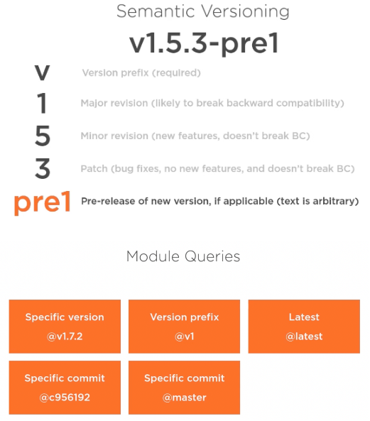

# Packaging
https://github.com/ardanlabs/gotraining/tree/master/topics/go/design/packaging

Package Oriented Design allows a developer to identify where a package belongs inside a Go project and the design guidelines the package must respect. It defines what a Go project is and how a Go project is structured. Finally, it improves communication between team members and promotes clean package design and project architecture that is discussable.

Every go files starts with package statemet, ususally package name will be should be same as the directory/folder name where the Go file is defined. After the package statement, we will have single or multiple package import statements where we need to provide the entire package path from the root module level. And then we can have multiple Package members like variables, constants, types, functions and methods.

If a member starts with capital latter then that particular member or field of a struct are visible to other packages. If it starts with lower case letter then those fields will not be visible to other packages but it will be visible to any files under that package. 

### Lifecycle of a package
- import required packages
- set variables and constants to initial values
- Call init() function if it is defined

### Using other packages
- We can alias a package like `lbmanager "github.com/libmanager/json"` and use it with `lbmanager.`
- We can just import a package for side effect so that it will just run init function of those package by using `_ "github.com/lib/pq"`

### Language Mechanics

- Packaging directly conflicts with how we have been taught to organize source code in other languages.
- In other languages, packaging is a feature that you can choose to use or ignore.
- You can think of packaging as applying the idea of microservices on a source tree.
- All packages are "first class," and the only hierarchy is what you define in the source tree for your project.
- There needs to be a way to “open” parts of the package to the outside world.
- Two packages can’t cross-import each other. Imports are a one way street.

### Design Philosophy

- To be purposeful, packages must provide, not contain.
- Packages must be named with the intent to describe what it provides.
- Packages must not become a dumping ground of disparate concerns.
- To be usable, packages must be designed with the user as their focus.
- Packages must be intuitive and simple to use.
- Packages must respect their impact on resources and performance.
- Packages must protect the user’s application from cascading changes.
- Packages must prevent the need for type assertions to the concrete.
- Packages must reduce, minimize and simplify its code base.
- To be portable, packages must be designed with reusability in mind.
- Packages must aspire for the highest level of portability.
- Packages must reduce setting policy when it’s reasonable and practical.
- Packages must not become a single point of dependency.

### Documenting Packages
- We add documentation for every package just above the package statement with `//`
- Each package level documenattion start with letter `package` followed by package name and some description about the package
- And the other place where we need to add documenation is on the public API which are nothing but any publicly exposed package members like variables, constants, types, functions or methods.


# Modules

**Create a Module**
- We can create a new modules in Go by using command `go mod init github.com/username/gomodules`. This will create a go.mod file with below content
```
module github.com/username/gomodules

go 1.21
```

**Download dependencies**
- We can download any of the other library or plugin by using the command `go get -u github.com/gorilla/mux`. This will create a new file named `go.sum` and adds the below entry in the go.mod file
```
require github.com/gorilla/mux v1.7.3
```

**List dependencies**
- If the above require statement has a comment `//indirect` at the end, that we have not used this dependency in our project yet. Once we use this dependency, the indirect comment will go away in the go.mod file.
- We can use `go list all` command to list down all the direct and indirect packages(packages of the libraries/modules which we are using) which our module has.
- We can use `go list -m all` which will list only the modules which we are using in our application.
- `go list -m -versions github.com/gorilla/mux` command will list all the versions avaiable for the provided module.

**Verify dependencies**
- Use the command `go mod verify`, which will verify all the modules used in the application. So at build time, we can be sure that since we verified our modules that everything is going to build with the same dependencies as what we originally developed this application with. 
- Go to the path `$GO_PATH/pkg/mod`, where all the modules cache and downloaded binaries are exist. We can modify any of the source file here and then try to run the command `go mod verify`, which will fail since we are working on the modified source file. But `go build` command will not be able to catch this change, so we have to run go mod verify command only. 

**Removing unused dependencies**
- Sometime we may have some references of module or package in our go.mod file but internally we wont be using those in our applications. 
- So to remove all the unused libraries/modules from our go.mod file we can run the command `go mod tidy`. This command will build the dependency graph of entire application, determines what modules are no longer needed and its going to pull them out. 

**Module Versioning**



**Other go mod commands**
- `go mod why`: To check whether a module is needed or not in our application
- `go mod graph`: To build entire dependency graph for your application
- `go mod edit`: Provides a command line interface for editing go.mod file
- `go mod download`: Used to prefill Go's build cache with a module. This will not update the go.mod file with the downloaded dependencie's details. If we want we can use it by editing the go.mod file.
- `go mod vendor`: Analyze our project, find all of the modules that our module relies upon, and its going to create a vendor directory and populate that. 