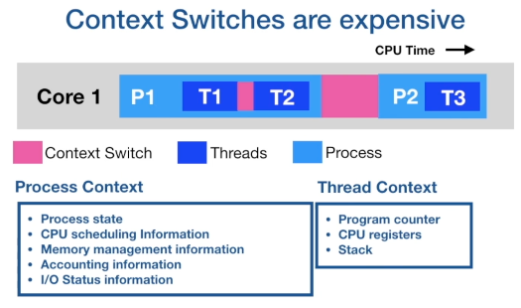
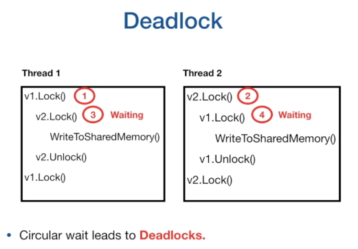
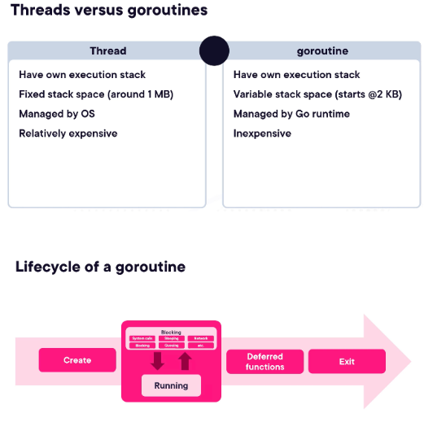
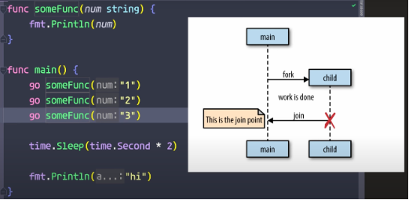
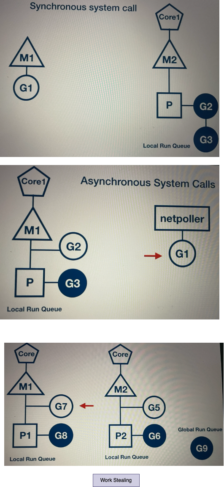

# Concurrency

The job of operating system is to give fair chance for all processes access to CPU, memory and other resources. 

Concurrency is not Parallelism. Concurrency means that our program can do more than one thing at a time. It does not necessarily decide to do more than one thing, but it can, it has multiple tasks that it can select from. Parallelism is the act of executing more than one task at the same time. So without Concurrency we cant have Parallelism. In Go we can write concurrent program, but we cant force the program to run in parallel. So if we have lets say 3 tasks, concurrent program will run task1 for some time and then task2 and then may be back to task1 and then task3 and so on. Where as Parallel program will run all of these 3 tasks at the same time. 

Concurrency is about dealing with lots of things at once. Parallelism is about doing lots of things at once.

### Communicating Sequential Processes (CSP)
In Go, one worker or Goroutine do its work and send the copy of the result to a channel, whereas another Goroutine reads the value from this channel, do its work and send a copy of the new result to another channel and so on. The idea of breaking a program up like this is called Communicating Sequential Processes. The idea here is that our processes, workers in this case, are communicating via these channels sequentially. Each one acts independently but they communicate with each other with the result of their work, and then they potentially take inputs in from other workers as well. So the worker can worj independently. 

## Process
- A process is an instance of a running program.
- A process, gives an environment for the program to execute.
- When the program is executed, the operating system creates a process and allocate memory in the virtual
address space.
- The virtual address space will contain, code segment, which is the compiled machine code.
- There is a data region which contains global variables.
- Heap segment is the one which is used for dynamic memory allocation, and the stack is used for storing
local variables of a function.

## Thread
- Threads are the smallest unit of execution that a CPU, accepts.
- Each process has at least one thread, that is the main thread.
- A process can have multiple threads. and threads share the same address space, and each thread has its own stack.
- Threads can run independent of each other.
- The operating systems scheduler, makes scheduling decisions at the thread level, not at the process level.
- Threads can run concurrently, with each thread taking turn on the individual core, or they can run in
parallel with each thread running at the same time on different cores.

## Thread States
- When the process is created, the main thread is put into the ready queue. It is in the runnable state.
- Once the CPU is available, the thread starts to execute and each thread is given a time slice. This is Running state
- If that time slice expires, then the thread gets preempted and placed back onto the queueor Runnable state
- If the thread gets blocked due to an I/O operation like read/write on disc or network operation
or waiting for the event from other processes, then it is placed in the waiting queue until the I/O
operation is complete. This is Blocked state. Once it is complete, it is placed back onto the ready queue.

## Context Switch
### Can we divide our application into processes and threads and achieve concurrency?
- Yes, you can, but there are limitations. Context switching.
- Context switches are considered expensive.
- CPU has to spend time copying the context of the current executing thread into memory and restoring
the context of the next chosen thread.
- And it does take thousands of CPU instructions to do context switching, and it is a wasted time as
CPU is not running your application, but doing context switching.
- In the below diagram, you might see the context switching between the threads of the same process is relatively cheap compared to the context switching between the threads of different processes.

### Can we scale the number of threads per process?
- Not much, actually. If we scale the number of threads in a process too high, then we hit C10k problem. Let us see what is that?
- The scheduler allocates a time slice for each process to execute on CPU core. This time slice is equally divided among the threads.
- So if we define scheduler period as 10 milliseconds and we have two threads, then each thread is
going to get five milliseconds separately for execution.
- If we have five threads, then each thread is going to get two milliseconds to execute. But what if there are a thousand threads? Then each thread will get 10 microseconds.
- This would be bad, as CPU will be spending more time in context switching than running the application.
- So to do any meaningful job, a thread needs at least a minimum of two milliseconds.
- If a minimum time for the thread is two milliseconds and accordingly we said this scheduler period then
to execute a thousand threads, the scheduler will take two seconds. If there are 10000 threads, then it will take 20 seconds to complete one cycle of the execution, each thread will have to wait for 20 seconds for its next execution. So the application is going to become less responsive.
- So other issue is the stack size, the operating system gives a fixed stack size for each thread, the actual size depends on the hardware.
- On my machine, it is 8MB. So if I have a 8GB of memory, then in theory I can only create 1000 threads.
So the fixed stack size limits the number of threads that we can create to the amount of memory we have.



### So what are the limitations of Thread?
- Fixed Stack size
- C10K problem, as we scale the number of threads the scheduler cycle is going to increase and the application can become less responsive.

### Why Concurency is hard?
- All the threads share the same address space. They share the heap and the data region of the process, and threads communicate between each other by sharing memory.
- But this sharing of memory creates a lot of complexity with concurrently executing threads.
- So if two threads are running concurrently and they try to access the same area of memory with one thread
trying to write to the memory, then there will be a data race and the outcome of the program will be
un-deterministic.
- Let us consider an example with thread 1 and thread 2 are running concurrently. and they are trying to increment the value of a global variable i.
- The increment operation is not atomic, at the code level it looks as a one statement, but in the context of the machine instructions, it involves retrieving the value of i from memory, incrementing the value of i and storing the value of i to the memory.
- So what happens if the thread gets preempted between these operations? So let us see some scenarios.
- Now, let us take two sequence of execution, in the first sequence, thread 1 and thread 2 are executing
sequentially, one after another.
- In second sequence, thread 1 and thread 2 are executed in interleaved fashion, where execution of one
thread is preempted by the other thread.
- Let us consider the first scenario, thread 1 starts the execution, it retrieves the value of i, which
will be zero, it increments it and then stores the value of i. then thread 2 to come along, it retrieves the value of i, which will be one, and it increments by one and it stores the value of i, which will be 2.
- This is fine, now let us consider the second scenario.
- Thread 1 starts the execution, it retrieves the value of i, which will be zero, then it increments
the value of i to one. But before thread 1 can write the value of i to memory, it gets preempted and thread 2 starts the execution. it retrieves the value of i, which will be zero, then it increments it and it stores the value of i as 1. Now, thread 1 comes along and it will store the value of i as 1.
- As you see, the value of i, can be 2 or it can be 1, depending on how the threads are executing.
So concurrent access to memory, leads to un-deterministic outcomes.

### Data Race
Example

```
i := 0
 
go func() {
    i++       
}()
 
go func() {
    i++
}()
```
Both the goroutines accessing a global variable and does a write operation on it.
Since `i++` is a 3 level opeartions read, update and assign, and because of context switches the value i can be corrupted.  A data race occurs when multiple goroutines simultaneously access the same memory location and at least one of them is writing. A data race means unexpected behavior.

A data-race-free application doesn’t necessarily mean deterministic results. An application can be free of data races but still have behavior that depends on uncontrolled events (such as goroutine execution, how fast a message is published to a channel, or how long a call to a database lasts). this is a race condition.

We can avoid data races by following three ways:
- Using atomic operations
- Protecting a critical section with a mutex
- Using communication and channels to ensure that a variable is updated by only one goroutine

### Race Condition
Example
```
i := 0
mutex := sync.Mutex{}
 
go func() {
    mutex.Lock()
    defer mutex.Unlock()
    i = 1                 
}()
 
go func() {
    mutex.Lock()
    defer mutex.Unlock()
    i = 2                 
}()
```

Here depending on the order of goroutine executions, the value i can be either 1 or 2. So this is not a data race but race condition issue. A race condition occurs when the behavior depends on the sequence or the timing of events that can’t be controlled. Here, the timing of events is the goroutines’ execution order.  If we want to ensure that we first go from state 0 to state 1, and then from state 1 to state 2, we should find a way to guarantee that the goroutines are executed in order. Channels can be a way to solve this problem.

### The Go memory model
The Go memory model is a specification that defines the conditions under which a read from a variable in one goroutine can be guaranteed to happen after a write to the same variable in a different goroutine. 
Below are the few cases where there will be or will not be data races:
- Creating a goroutine happens before the goroutine’s execution begins. Therefore, reading a variable and then spinning up a new goroutine that writes to this variable doesn’t lead to a data race:
```
i := 0
go func() {
    i++
}()
```
- The exit of a goroutine isn’t guaranteed to happen before any event. Thus, the following example has a data race:
```
i := 0
go func() {
    i++
}()
fmt.Println(i)
```
- A send on a channel happens before the corresponding receive from that channel completes. Thus the following example does not have a data race:
```
i := 0
ch := make(chan struct{})
go func() {
    <-ch
    fmt.Println(i)
}()
i++
ch <- struct{}{}
```
- Closing a channel happens before a receive of this closure. Therefore, this example is also free from data races.
```
i := 0
ch := make(chan struct{})
go func() {
    <-ch
    fmt.Println(i)
}()
i++
close(ch)
```
- A receive from an unbuffered channel happens before the send on that channel completes. Thus this will not have data races
```
i := 0
ch := make(chan struct{})  
go func() {
    i = 1
    <-ch
}()
ch <- struct{}{}
fmt.Println(i)
```
- A send on buffered channel happens before the receive on that channel completes. Thus this will have data race
```
i := 0
ch := make(chan struct{}, 1)
go func() {
    i = 1
    <-ch
}()
ch <- struct{}{}
fmt.Println(i)
```

### Memory Access Synchronization or Race Conditions
- So one way to handle the above concurency issue will be to use memory access synchronization tools.
- We need to guard the access to the shared memory so that a thread has exclusive access at a time. and we need to force thread 1 and thread 2 to run sequentially, to increment the value of i.
- We can do this by putting a lock on the increment operation.
- Putting a lock around a shared memory is a developer's convention, so any time a developer wants to access the shared memory, they need to acquire the lock and when they are done, they need to release the lock.
- If the developer does not follow this convention, then we have no guarantee of exclusive access and it can always happen that some code can always sneak in, which does not follow this convention. and we hitting the race condition at some time.
- There are other problems like locking actually reduces the parallelism. as locks force the threads to be executed sequentially.
- So the critical section where we access the shared memory becomes a bottleneck between the threads. The other problem is, coding mistakes, in-appropriate use of locks can lead to deadlocks.
- Race condition occurs when order of execution is not guaranteed. 

### Deadlock
- Lets say there are two threads executing concurrently.
- Thread1 starts the execution, it takes a lock on resource v1, it gets preempted by thread2 it takes a lock on resource v2.
- Now, thread1 comes along, it wants a lock on resource v2, but it is not available, so it goes into the waiting state.
- Now, thread2 comes along and it wants a lock on resource v1, but it is not available, so it also goes into
waiting state.
- So as you see, this is a circular wait, which leads to deadlock and the application will just hang.




## Concurrency in GO

In the previous module, we had seen that, there are limitations with threads, the actual number of threads
that we can create is limited, and sharing of memory leads to a lot of complexity with concurrently
executing threads.

Concurrency in Go is based on the paper written by Tony Hoare, communicating sequential processes or CSP. The beauty of CSP is that it is very simple, it is based on three core ideas.
- Each process is built for sequential execution.
- Every process has a local state and the process operates on that local state.
- If we have to transfer data from one process to another process, we do not share memory, but we communicate
the data, we send a copy of the data over to other process.
- Since there is no sharing of memory, there would be no race, condition or deadlocks, and we can scale easily, as each process can run independently.
- If the computation is taking more time, we can add more processes of the same type and run the computation
faster.

### So what tools Go provides for concurrency?
- Goroutines, goroutines are concurrently executing functions.
- Channels, channels are used to communicate data between the goroutines.
- Select, Select is used to multiplex the channels, sync package.
- Sync package provides classical synchronization tools like the mutex, conditional variables and others.

## Goroutines
https://github.com/ardanlabs/gotraining/tree/master/topics/go/concurrency/goroutines

A Goroutine is a function executing concurrenlty with other goroutines in the same address space(OS thread). It is lightweight, costing little more that the allocation of stack space. 

When we write a Go program, that program is going to interact with the Go runtime. And the specific part of the Go runtime which is called Go Scheduler. And this Go Scheduler will internally interact with the OS. Go routine sits between a Go program and Go scheduler. And between the Scheduler and OS the interactions happens through Threads. Threads are the tools used by OS to manage their Concurrency. Go Scheduler will map goroutines onto OS threads. 

**Goroutine States and Goroutine vs Threads**



- Goroutines are user space threads, managed by Go runtime, Go runtime is part of the executable, it is built into the executable of the application.
- Goroutines are extremely lightweight, goroutines starts with 2KB of stack, which can grow and shrink
as required.
- It has a very low CPU overhead, the amount of CPU instructions required to create a goroutine is very
less.
- This enables us to create hundreds of thousands of goroutines in the same address space.
- The data is communicated between the goroutines using channels, so sharing of memory can be avoided.
- The context switching is much cheaper than the thread context switching as goroutines have less state to
store.
- Go runtime can be more selective in what data is persisted, how it is persisted and when persisting needs
to occur.
- Go runtime creates OS threads, goroutines runs in the context of the OS thread. This is important.
Goroutines are running in the context of the OS threads. Many goroutines can execute in the context of the single OS thread. The operating system schedules, the OS threads and the Go runtime schedules, multiple goroutines on the OS thread.
- For the operating system, nothing has changed, it is still scheduling the threads, as it was.
- Go runtime manages the scheduling of the goroutines on the OS threads.

Goroutines are functions that are created and scheduled to be run independently by the Go scheduler. The Go scheduler is responsible for the management and execution of goroutines.

- Goroutines are functions that are scheduled to run independently.
- We must always maintain an account of running goroutines and shutdown cleanly.
- Concurrency is not parallelism.
    - Concurrency is about dealing with lots of things at once.
    - Parallelism is about doing lots of things at once.
- Parallelism is about physically doing two or more things at the same time. Concurrency is about undefined, out of order, execution.

## Fork-Join Model
Goroutines follows Fork-Join model



## Different ways to start a Go-routine
```
package main

import (
	"fmt"
	"time"
)

func fun(s string) {
	for i := 0; i < 3; i++ {
		fmt.Println(s)
		time.Sleep(1 * time.Millisecond)
	}
}

func main() {
	// Direct call
	fun("direct call")

	// TODO: write goroutine with different variants for function call.

	// goroutine function call
	go fun("goroutine-1)

	// goroutine with anonymous function
	go func() {
		fun("goroutine-2)
	}

	// goroutine with function value call
	fv := fun
	go fv("goroutine-3)

	// wait for goroutines to end
	time.Sleep(100 * time.Milliseconds)

	fmt.Println("done..")
}

```

## Goroutine client-server example

server.go

```
package main

import (
	"io"
	"net"
	"time"
)

func main() {
	// Create a listener object
	listener, err := net.Listen("tcp", "localhost:8000")
	if err != nil {
		log.Fatal(err)
	}
	// Continuously listen for client connection and accept it if there are any
	for {
		conn, err := listener.Accept()
		if err != nil {
			log.Fatal(err)
		}
	}
	// Call the handler concurrently for each client connection
    go handleConn(conn)
}

// handleConn - utility function
func handleConn(c net.Conn) {
	defer c.Close()
	for {
		_, err := io.WriteString(c, "response from server\n")
		if err != nil {
			return
		}
		time.Sleep(time.Second)
	}
}
```

client.go

```
package main

import (
	"io"
	"log"
)

func main() {
	conn, err := net.Dial("tcp", "localhost:8000")
	if err != nil {
		log.Fatal(err)
	}
	defer conn.close()
	mustCopy(os.Stdout, conn)
}

// mustCopy - utility function
func mustCopy(dst io.Writer, src io.Reader) {
	if _, err := io.Copy(dst, src); err != nil {
		log.Fatal(err)
	}
}
```

- Now we can create as many as client and each of them will continuously 

## Goroutine and Closure
- Goroutines executes within the same space they created in.
- They can directly modify the variables in the enclosing lexical block.
- This enables developers to write goroutines within the lexical block of the enclosing function as a sequential code. 
- Go compiler and the runtime takes care of pinning the variable, moving the variable from stack to heap, to facilitate goroutines, to have access to the variable even after the enclosing function has returned.

Example 1

```
package main

import (
	"fmt"
	"sync"
)

func main() {
	var wg sync.WaitGroup

	incr := func(wg *sync.WaitGroup) {
		// lexically scoped variable creates closure
		var i int
		wg.Add(1)
		go func() {
			defer wg.Done()
			i++
			fmt.Printf("value of i: %v\n", i)
		}()
		fmt.Println("return from function")
		return
	}

	incr(&wg)
	wg.Wait()
	fmt.Println("done..")
}
```

Example 2
```
package main

import (
	"fmt"
	"sync"
)

func main() {
	var wg sync.WaitGroup

	for i := 1; i <= 3; i++ {
		wg.Add(1)
		go func(i int) {
			defer wg.Done()
			fmt.Println(i)
		}()
	}
	wg.Wait(i)
}

```
## OS Scheduler Mechanism
When a program starts up on an operating system, the operating system create a process. Processes are the container for the resources that the running program is going to need. Processes maintains and managers all the resources which a running program needs. The 2 big key resources are memory and thread, which we call a main thread. When a main thread dies, the process will shut down. 

If a process is like a container for the resources, then the thread to be the path of execution. Our code turns into a machine code and that machine code is always gonna be executed in a linear fashion or in a linear path. And its the job of the thread to manage that linear path of execution. 

This path of execution can be in one of 3 states at any time. It can be in a **running(executing)** state, where it start executing instructions one by one until the OS decides to do context switch where it pull of the current running thread from the core and put a new thread on to it. The new thread which is on the core we call its in a **runnable** state. Now the Scheduler will select one of the thread from this runnable pool and assign it to the CPU which will make it to become running state. Context switch done by OS is really an expensive task. It needs to save and replace states of all these threads. Each of these OS threads will have 1 meg of stack space. The third state is called **Waiting** where thread is just created and it keeps wait for its turn to get it placed on a core by OS.

In the olden days, there were only one single core processor, where each of the core can execute one path of execution or thread at any given time. But to create a perception that everything is running at the same time, the OS Scheduler will provide a slice of time on the code for each of these thread. If there are less threads like 1K then each thread will get more CPU time. But if there are lots of thread like 10K then each thread will get less CPU time.

But now a days we have multi core processor, which means we wil be having multiple execution units where we can run not just one thread at a time but multiple threads. If its 2 core then 2 threads at a time and so. Which means we can run 2 thread parallely now and this brought parallelism in place. All the OS schedulers has been written again to take the advantages of these multi core processors. 

** program (our code) -> process (container for resources like memory and thread) -> thread (path of execution inside the process) **

## Go Scheduler Mechanism
When a Go program starts up, it is given a logical processor that we call `P`. This logical processor is given an `M` that stands for Machine, which represents a real-life operating system thread which the OS is still responsible to schedule on some core. Then there are 2 data structure here, there is the Global Run Queue(GRQ), and evry `P` has a Local Run Queue(LRQ). Now evry Goroutine also can be in any one of the state of runnable, running or waiting. 

When a Gorouitne like the main Goroutine when our Go program starts up, is start to executing in the above given logical processor `P` and other entire context. This main Goroutiine may have couple of more goroutines, which are ends up in a local run queue because they are in a runnable state. Sometimes a goroutine thats in a runnable state might find itself in the Global run queue, because a P has not taken in yet. If there are no other goroutine in the LRQ then `P` will take any available goroutine from the GRQ.

If there are multiple core in a system, then we need similar amout of thread to not to put more pressure on the OS, means single thread per core to executes thousands of goroutines. If we have 2 Core processor, then 2 goroutines can run in parallel. 

Go Scheduler is built into the the Go runtime, and the Go runtime is built into your Go application, the scheduler runs up in the user mode not the kernel mode. Since Go scheduler runs in user mode, it is called a cooperating sceduler not a preemptive scheduler, where the OS Scheduler are called preemptive scheduler. 

There are 3 classes of events that are gonna allow the scheduler to make a scheduling decision. First one is the use of keyword `go` infront of the function call, and this is how we create goroutine. Second one is the `GC`, anytime garbage collection kicks in there is lot of scheduling decision is been made. And the last one is `System calls`, which happens all the time in Go anytime we call log ot fmt.print thats a system call.

Lets say the above Goroutine makes a system call like open a file, it can take up few seconds of time. So if we allow this Goroutine to block its corresponding OS thread, then for that amout of time of latency, we are not getting any other work done. So Go has specail data structure here, that we call a `network poller`(it has its own thread as well), and when a goroutine wants to make a system call, what happens is, this goroutine context switched off of the M, and its placed over here in the network poller, and it will be in the waiting state, and we handle the system call asynchronously. This is great because we just freed up the `M`, to do more work. At this time, the other goroutine move from runnable to running state. Once the OS comes back with the system call, then the goroutine which was waiting, move back to the LRQ where it sits back into a runnable state through another context switch. 

There may be times when we are on an OS that does not support asynchronous system calls. When that happens the following things happens with the Scheduler. So a goroutine G1 which will get blocked on lets say M1, there is no way to do it asynchronously, there is no way to move it to the network poller, so the scheduler will detach this M1 and G1 off the P, and bring a new OS thread M2 where another goroutine will be scheduled to run by scheduler. We are continuing to process the goroutines from local run queue, even though that other thread is blocked. Once the blocking call is done, the goroutine M1 moves back to local run queue, and the thread M1 is put on the side for later use. 

If any of the P is idle at any time, it will search for goroutines from Global run queue and if it founds it will take it and start executing it. If other process is overloaded with goroutines in its local run queue, the idle processor can steal few of the goroutines from it and start executing it. This way we keep all the processor and OS threads busy all the times. 

Go Scheduler sits on top of OS Scheduler, and it turns I/O bound work(which OS thread does) into CPU bound work, so that from OS perceptive the OS thread always busy. Context switch in Go Scheduler are so fast compared to Context switch in OS. 


- Go scheduler is part of the Go runtime, Go runtime is part of the executable, it is built into the
executable of the application.
- Go scheduler is also known as M:N scheduler. It runs in the user space.
- Goroutines are scheduled on the OS threads by the Go scheduler. So a goroutine runs in the context of the OS thread.
- Go runtime creates a number of worker OS threads, equal to GOMAXPROCS environment variable value, the default value is the number of processors on the machine. So if we have 4 cores, then 4 OS threads will be created. If you have 8 cores, then 8 OS threads will be created. It is the responsibility of the Go scheduler to distribute runnable goroutines over multiple threads that are created. At any time N goroutines could be scheduled on M OS threads that runs on at most GOMAXPROCS number
- As of Go 1.14, the Go scheduler implements asynchronous preemption.
- It used to be co-operative scheduler, but then the question came, what happens when a long running routine
just hogs onto the CPU? other goroutine would just get blocked. So that's the reason why asynchronous pre-emption was implemented.
- So in asynchronous preemption, what happens is, a goroutine is given a time slice of ten milliseconds
for execution. When that time slice is over, Go scheduler will try to preempt it, this provides other goroutines the opportunity to run even when there are long running CPU bound goroutines scheduled.
- Similar to threads, goroutines also have states.
- When it is created, it will be in runnable state, waiting in the run queue. It moves to the executing state once the goroutine is scheduled on the OS thread. If the goroutine runs through its time twice, then it is preempted and placed back into the run queue. If the goroutine gets blocked on any condition, like blocked on channel, blocked on a syscall or waiting for the mutex lock, then they are moved to waiting state.
Once the I/O operation is complete, they are moved back to the runnable state.

### Context switching due to synchronous system call
- What happens in general when a goroutine makes a synchronous system call, like reading or writing to a file with sync flag set. There will be a disc I/O to be performed, so synchronous system call will block for I/O operation to complete. Due to which the OS thread can be moved out of the CPU and placed in the waiting queue for the disc I/O to complete. So we will not be able to schedule any other goroutine on that thread.
The implication is that synchronous system call can reduce parallelism.

So how does Go scheduler handle this scenario?
- Goroutine G1 is running on OS thread M1. G1 is going to make synchronous system call, like reading on a file, that will make the OS thread M1 to block.
- Go scheduler identifies that G1 has caused OS thread M1 to block, so it brings in a new OS thread, either
from the thread pool cache or it creates a new OS thread if a thread is not available in the thread pool.
cache.
- Then Go scheduler will detach the logical processor P from the OS thread M1, and moves it to the new OS
thread M2. G1 is still attached to the old OS thread M1.
- The logical processor P can now schedule other goroutines in its local run queue for execution on the OS
thread M2.
- Once the synchronous system call that was made by G1 is complete, then it is moved back to the end of the local run queue on the logical processor P. And M1 is put to sleep and placed in the thread pool cache. So that it can be utilized in the future when the same scenario needs to happen again.

### Context switching due to Asynchronous system call
- Asynchronous system calls(like the network system call or http api call.) happens when the file descriptor that is used for doing network I/O operation is set to non-blocking mode.
- If the file descriptor is not ready, for example, if the socket buffer is empty and we are trying to read from it, or if the socket buffer is full and we are trying to write to it, then the read or the write operation does not block, but returns an error. And the application will have to retry the operation again at a later point in time.
- So this is good, but it does increases the application complexity. The application will have to create any event loop and set up callbacks, or it has to maintain a table mapping the file descriptor and the function pointer, and it has to maintain a state to keep track of how much data was read last time or how much data was written last time. And all these things, does add up to the complexity of the application. And if it is not implemented properly, then it does make the application a bit inefficient.

So how does Go handle this scenario?
- Go uses netpoller. There is an abstraction built in syscall package.
- Syscall package uses netpoller to convert asynchronous system call to blocking system call.
- When a goroutine makes an asynchronized system call, and file descriptor is not ready, then the Go scheduler uses netpoller OS thread to park that goroutine.
- The netpoller uses the interface provided by the operating system, like epoll on Linux, kqueue on MacOS,
iocp on Windows, to poll on the file descriptor.
- Once the netpoller gets a notification from the operating system, it in-turn notifies the goroutine to
retry the I/O operation.
- In this way, the complexity of managing asynchronous system call is moved from the application to
go runtime. So the application need not have to make a call to select or poll and wait for the final descriptor to be ready, but instead it will be done by the netpoller in an efficient manner.

- Lets consider an example. G1 is executing on the OS thread M1. G1 opens an network connection with net.Dial
- The file descriptor used for the connection is set to non-blocking mode.
- When the goroutine tries to read or write to the connection. The networking code will do the operation until it receives an error.
- Then it calls into the netpoller, then the scheduler will move the goroutine G1 out of the OS thread
M1 to the netpoller thread.
- And another goroutine in the local run queue, in this case G2 gets scheduled to run on the OS thread M1.
- The netpoller uses the interface provided by the operating system to poll on the file descriptor. When the netpoller receives the notification from the operating system that it can perform an I/O operation on the file descriptor, then it will look through its internal data structure, to see if there are any goroutines that are blocked on that file descriptor.
- Then it notifies that goroutine, then that goroutine can retry the I/O operation. Once the I/O operation is
complete, the goroutine is moved back to the local run queue and it will be processed, by the OS thread M1 when it gets a chance to run.
- In this way to process an asynchronous system call, no extra OS thread is used, instead the netpoller
OS thread is used to process the Go routines.

### Work Stealing
- Work stealing helps to balance the goroutines across the logical processors. So that work gets better distributed and gets done more efficiently.
- Lets say we have a multithreaded go program, we have 2 OS threads and 2 logical processors, the goroutines are distributed among the logical processors. Now, what happens if one of the logical processor services all its goroutines quickly?
- We see that P1 has no more goroutines to execute, but there are goroutines in runnable state in
the global run queue and local run queue of P2.
- The work stealing rule says that, if there are no goroutines in the local run queue, then try to steal from other logical processors. If not found, check the global run queue for the goroutines. If not found, check the netpoller.
- In this case, P1 does not have any runnable goroutine in its local run queue, so it randomly picks
another logical processor, P2 in this case and steals half of its goroutines from its local run queue.
- We see P1 has picked up goroutines, G7 and G8 to its own local run queue. And P1 will be able to execute those goroutines.
- Now we are able to better utilize the CPU cores and the work is fairly distributed between multiple
logical processors.
- What happens when P2 finishes executing all its goroutines? And P1 one does not have any goroutine in its local run queue. Then, according to work stealing rule, P2 will look into the global run queue and finds goroutine G9. G9 get scheduled on OS thread M2.



## Goroutines and Concurrency
Way to implement concurrency in Go. 

### Synchronization and Orchestration
When we have multiple Goroutines, then we need to have Synchronization and Orchestration between all of them in order not to have data races and other issues. To understand what are these Synchronization and Orchestration, lets consider we went to a Starbucks coffe shop and standing in the line of queue to get some coffe. Now we are in line, we are waiting to get our turn to get upto the counter. Anytime goroutines have to get in line, that is a synchronization issue. But once we get to the counter and start talking to the person at the register, we now have an Orchestration issue. We are having conversation, we are exchanging money, there is data going back and forth. This is Orchestration.

So Synchronization is about getting in line and taking a turn to run a goroutine and Orchestration is about the interaction.

### Goroutine Orchestration by using WaitGroup
Below is the example code to show how to create goroutines in Go and how to deal with Goroutine Orchetsration by using WaitGroup

```
// Sample program to show how to create goroutines and
// how the scheduler behaves.
package main

import (
	"fmt"
	"runtime"
	"sync"
)

func init() {

	// Allocate one logical processor for the scheduler to use.
	runtime.GOMAXPROCS(1)
}

func main() {

	// wg is used to manage concurrency.
	var wg sync.WaitGroup
	wg.Add(2)

	fmt.Println("Start Goroutines")

	// Create a goroutine from the lowercase function.
	go func() {
		lowercase()
		wg.Done()
	}()

	// Create a goroutine from the uppercase function.
	go func() {
		uppercase()
		wg.Done()
	}()

	// Wait for the goroutines to finish.
	fmt.Println("Waiting To Finish")
	wg.Wait()

	fmt.Println("\nTerminating Program")
}

// lowercase displays the set of lowercase letters three times.
func lowercase() {

	// Display the alphabet three times
	for count := 0; count < 3; count++ {
		for r := 'a'; r <= 'z'; r++ {
			fmt.Printf("%c ", r)
		}
	}
}

// uppercase displays the set of uppercase letters three times.
func uppercase() {

	// Display the alphabet three times
	for count := 0; count < 3; count++ {
		for r := 'A'; r <= 'Z'; r++ {
			fmt.Printf("%c ", r)
		}
	}
}

O/P:
Start Goroutines
Waiting To Finish
A B C D E F G H I J K L M N O P Q R S T U V W X Y Z A B C D E F G H I J K L M N O P Q R S T U V W X Y Z A B C D E F G H I J K L M N O P Q R S T U V W X Y Z a b c d e f g h i j k l m n o p q r s t u v w x y z a b c d e f g h i j k l m n o p q r s t u v w x y z a b c d e f g h i j k l m n o p q r s t u v w x y z 
Terminating Program

```
We can use WaitGroup to wait for multiple goroutines to finish. So wait group is a great way to do Orchestration, when we dont need anything back from Go routine. Waitgroup provides 3 APIs Add, Wait and Done. 
In the above code we use the variable `wg` as a closure, both the inner gorouine functions remember this outer fuction variable. And we use the concept of IIFE (Immediately Invoked Function Expression) to declare and immediately run the unnamed function with `go` keyword infront of it. This will create a sepaarte path of execution or goroutine in Go. One thing to note here is, the order of the executions of these multiple goroutines are not predictable. It depends on the OS and Schedulers.

If we forget to add wg.wait() function call, then the main goroutine will terminate immediately without waiting for the sub goroutines to finish.

Built-in functions in the runtime package
- runtime.GOMAXPROCS(1): Allocate one logical processor for the scheduler to use, even though there are multiple cores available.
- runtime.Gosched() : Requesting a scheduler to move the running goroutine to wait state. Scheduler may accept this request and mmove the goroutine to wait state or it may reject it and continue it to run. Never use this in production.
- wg.Wait(): Demanding the Go Scheduler to move this running goroutine to wait state. Go Scheduler will move it to wait state immediately.

If we forget to add wg.Done() function call, then go runtime will through `fatal error: all goroutines are asleep - deadlock!`. The wait group no longer get to zero now, because we are not decrementing the counter which we set initially through wg.Add() function, the main goroutine has to wait continuously. But go runtime will detect this and through the above runtime error. Go runtime has a simple go deadlock detector, It can identify easily when every single goroutine is now in a waiting state and can never move back into a runnable state. 

If we do not set the counter value properly according to the number of goroutines, then there could be some unwanted things will happen. For example in the above code if we set counter to 1 (i.e wg.Add(1)), then only one goroutine will run and the other one will get skipped, since the main go routine will terminate before executing the second one.

## Goroutine time slicing
```
// Sample program to show how the goroutine scheduler
// will time slice goroutines on a single thread.
package main

import (
	"crypto/sha1"
	"fmt"
	"runtime"
	"strconv"
	"sync"
)

func init() {

	// Allocate one logical processor for the scheduler to use.
	runtime.GOMAXPROCS(1)
}

func main() {

	// wg is used to manage concurrency.
	var wg sync.WaitGroup
	wg.Add(2)

	fmt.Println("Create Goroutines")

	// Create the first goroutine and manage its lifecycle here.
	go func() {
		printHashes("A")
		wg.Done()
	}()

	// Create the second goroutine and manage its lifecycle here.
	go func() {
		printHashes("B")
		wg.Done()
	}()

	// Wait for the goroutines to finish.
	fmt.Println("Waiting To Finish")
	wg.Wait()

	fmt.Println("Terminating Program")
}

// printHashes calculates the sha1 hash for a range of
// numbers and prints each in hex encoding.
func printHashes(prefix string) {

	// print each has from 1 to 10. Change this to 50000 and
	// see how the scheduler behaves.
	for i := 1; i <= 10; i++ {

		// Convert i to a string.
		num := strconv.Itoa(i)

		// Calculate hash for string num.
		sum := sha1.Sum([]byte(num))

		// Print prefix: 5-digit-number: hex encoded hash
		fmt.Printf("%s: %05d: %x\n", prefix, i, sum)
	}

	fmt.Println("Completed", prefix)
}

O/P:
Create Goroutines
Waiting To Finish
B: 00001: 356a192b7913b04c54574d18c28d46e6395428ab
B: 00002: da4b9237bacccdf19c0760cab7aec4a8359010b0
B: 00003: 77de68daecd823babbb58edb1c8e14d7106e83bb
B: 00004: 1b6453892473a467d07372d45eb05abc2031647a
B: 00005: ac3478d69a3c81fa62e60f5c3696165a4e5e6ac4
B: 00006: c1dfd96eea8cc2b62785275bca38ac261256e278
B: 00007: 902ba3cda1883801594b6e1b452790cc53948fda
B: 00008: fe5dbbcea5ce7e2988b8c69bcfdfde8904aabc1f
B: 00009: 0ade7c2cf97f75d009975f4d720d1fa6c19f4897
B: 00010: b1d5781111d84f7b3fe45a0852e59758cd7a87e5
Completed B
A: 00001: 356a192b7913b04c54574d18c28d46e6395428ab
A: 00002: da4b9237bacccdf19c0760cab7aec4a8359010b0
A: 00003: 77de68daecd823babbb58edb1c8e14d7106e83bb
A: 00004: 1b6453892473a467d07372d45eb05abc2031647a
A: 00005: ac3478d69a3c81fa62e60f5c3696165a4e5e6ac4
A: 00006: c1dfd96eea8cc2b62785275bca38ac261256e278
A: 00007: 902ba3cda1883801594b6e1b452790cc53948fda
A: 00008: fe5dbbcea5ce7e2988b8c69bcfdfde8904aabc1f
A: 00009: 0ade7c2cf97f75d009975f4d720d1fa6c19f4897
A: 00010: b1d5781111d84f7b3fe45a0852e59758cd7a87e5
Completed A
Terminating Program
```

In the above code there are many context switch happens between A and B in the middle of A or B goroutine before they are completed, if we run the code with `i` value 50000. So Go scheduler will distributes the processor time between 2 goroutines, so that it gives a peception like both the goroutines are runnig at the same time. 

## Goroutines and parallelism
```
/ Sample program to show how to create goroutines and
// how the goroutine scheduler behaves with two contexts.
package main

import (
	"fmt"
	"runtime"
	"sync"
)

func init() {

	// Allocate two logical processors for the scheduler to use.
	runtime.GOMAXPROCS(2)
}

func main() {

	// wg is used to wait for the program to finish.
	// Add a count of two, one for each goroutine.
	var wg sync.WaitGroup
	wg.Add(2)

	fmt.Println("Start Goroutines")

	// Declare an anonymous function and create a goroutine.
	go func() {

		// Display the alphabet three times.
		for count := 0; count < 3; count++ {
			for r := 'a'; r <= 'z'; r++ {
				fmt.Printf("%c ", r)
			}
		}

		// Tell main we are done.
		wg.Done()
	}()

	// Declare an anonymous function and create a goroutine.
	go func() {

		// Display the alphabet three times.
		for count := 0; count < 3; count++ {
			for r := 'A'; r <= 'Z'; r++ {
				fmt.Printf("%c ", r)
			}
		}

		// Tell main we are done.
		wg.Done()
	}()

	// Wait for the goroutines to finish.
	fmt.Println("Waiting To Finish")
	wg.Wait()

	fmt.Println("\nTerminating Program")
}

O/P:
Start Goroutines
Waiting To Finish
a b c d e f g h i j k l m n o p q r s t u v w x y z a b c d e f g h i j k l m n A B C D E F G H I J K L M N O P Q R S T U V W X Y Z A B C D E F G H I J K L M N O P Q R S T U V W X Y Z A B C D E F G H I J K L M N O P Q R S T U V W X Y o p q r s t u v w x y z a b c d e f g h i j k l m n o p q r s t u v w x y z Z 
Terminating Program
```

In the above code we are using 2 core processor by setting the value to `runtime.GOMAXPROCS(2)`. So both of the goroutines run at the same time in the available 2 cores or 2 P's or 2 OS threads and we can see mix of output from both goroutines at the same time not one after the other. 

So now that we have went from one P(core) or thread to 2 thread or P, we are now a multi-threaded Go program. Go routines now can run in parallel and this is where synchronization, orchestration really become important.


## Goroutime Examples:
- Goroutines and concurrency: https://go.dev/play/p/4n6G3uRDc83
- Goroutine time slicing: https://go.dev/play/p/QtNVo1nb4uQ
- Goroutines and parallelism: https://go.dev/play/p/ybZ84UcLW81

