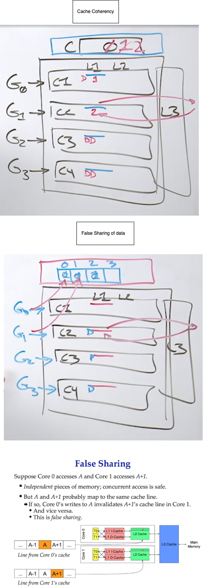
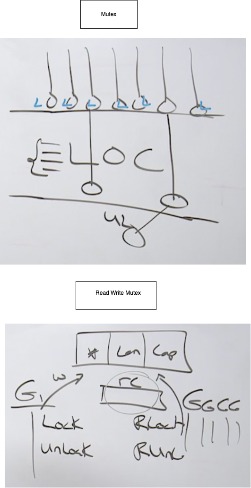

# Data Races
https://github.com/ardanlabs/gotraining/tree/master/topics/go/concurrency/data_race

A data race is when two or more goroutines attempt to read and write to the same resource at the same time. Multiple goroutines tries to mutate the same data at the same time. Race conditions can create bugs that appear totally random or can never surface as they corrupt data. We need a Synchronization for this. Atomic functions and mutexes are a way to synchronize the access of shared resources between goroutines.

- Goroutines need to be coordinated and synchronized.
- When two or more goroutines attempt to access the same resource, we have a data race.
- Atomic functions and mutexes can provide the support we need.

## Cache Coherency and False Sharing
Lets consider a 4 core processor system. Each of the core has its own L1, L2 and then the common L3 Caches. We also have a Global variable `c` which is counter and its value is initialized to `0`. Now we have 4 Goroutines where each of them are having its own `P`(processor) and `M`(OS thread) and running on each of the available core. Now all these Goroutines can run in parallel and if they want to remodifying and writing into the global variable `c` we have a synchronization issue. We need to make sure, there is only one goroutine reads, modifies, writes at the same time. This is where we gonna need things like `atomic` instructions, which are at the hardware level and `mutexes` which are just above that. 

If every Go routine is going to take an opportunity to read, modify and write C, then a copy of C has to be brought in to each core. When Go routine `0` decides to perform a read, modify, write to turn the global variable `c` value from zero to one, the value of `c` in goroutine `0` updated to 1 from 0. Now the same updated value will go and updated in the global `c` values which is sitting in the main memory. Then through the magic of hardware the hardware will mark the cache lines in other goroutines as `dirty`, since this value is updated in the goroutine `0`. So now when Goroutine `1` gets a chance, right, through synchronization, to modify C, it's gonna identify that the cache line that it has is dirty, it's not the true, it's gonna have to go out into main memory to go get a copy of the current one. And now this isn't gonna be dirty anymore, And then it's going to increment this from one to two. But once this is done, all other goroutines cache line will become dirty. We're gonna be constantly thrashing through memory on every single increment which is nothing but `Cache Coherency` problem. So we need to be very careful about global variables and global counters in a multi-threaded situation, because we're not really just referencing this one value and updating it. Remember we've got value semantics at the hardware level to reduce access to main memory costs, and therefore as we share data, right, accessing data again across these cores, we've got some other problems.

Now False sharing occurs when we dont really have a synchronization problem, but we still have the cache coherency problem. Consider the same context which is mentioned above, but now instead of one single global variable we have multiple variable for each of these goroutines. Goroutine `0` has its own address `0` index, goroutine `1` has its own address `1` index and so on. So now each goroutine can update its own address index value without any synchronization issues or data race. Just because we don't have a synchronization issue, again doesn't mean that our cache coherency problem doesn't exist. The array is going to fall on the same cache line. The cache line for the entire array is going to be duplicated across all of the cores. Now when G0 read, modify, write index `0`, it is still going to mark all of the other cache lines of other goroutine as dirty. So we are still going to taking the thrashing of the memory because these counters are sitting on the same cache lines. So we have got data access patterns to memory that is next to each other even though they are unique, but they fall on the same cache line and hence we essentially are sharing the data. This is `False Sharing`



## Data race example
```
// Sample program to show how to create race conditions in
// our programs. We don't want to do this.
package main

import (
	"fmt"
	"sync"
)

// counter is a variable incremented by all goroutines.
var counter int

func main() {

	// Number of goroutines to use.
	const grs = 2

	// wg is used to manage concurrency.
	var wg sync.WaitGroup
	wg.Add(grs)

	// Create two goroutines.
	for g := 0; g < grs; g++ {
		go func() {
			for i := 0; i < 2; i++ {

				// READ: Capture the value of Counter.
				value := counter

				// MODIFY: Increment our local value of Counter.
				value++

				// WRITE: Store the value back into Counter.
				counter = value
			}

			wg.Done()
		}()
	}

	// Wait for the goroutines to finish.
	wg.Wait()
	fmt.Println("Final Counter:", counter)
}

O/P:
Final Counter: 4
```

But now if we add a piece of code `fmt.Println(value)` after the line `value++`, we get the final counter value as `2` instead of `4`!
```
1
2
1
2
Final Counter: 2
```
Since Println is a system call, Scheduler will move it to waiting state from running and start bringing other goroutine to running state. So there will be multiple context switch happens here and each goroutines will operates on a corrupted data(old data), which makes the final result as 2. Print statement caused the context switch in the middle of these three lines of code. And therefore tehse 3 lines of code were no longer atomic the way they were before. We were just lucky before, there is no guarantee. We have to demand for synchronization and orchestration always and we can not just ask for it or hope it is going to happen. No line of code is atomic either, if we see this `++`, which is a read, modify and write operations together so there may context switch happens between these 3 operations. 


So next question is how can we demand for Synchronization so all the operations happens synchronously without any data race issues. We ahve 2 options here, either using atomic instructions or by using Mutexes. Atomic instructions works at hardware level so it could be more faster. But if we have mutiple lines of code which needs the synchronization then Mutexes will be helpfull. 

## Synchronization with Atomic Instructions

Example:

```
// Sample program to show how to use the atomic package to
// provide safe access to numeric types.
package main

import (
	"fmt"
	"sync"
	"sync/atomic"
)

// counter is a variable incremented by all goroutines.
var counter int64

func main() {

	// Number of goroutines to use.
	const grs = 2

	// wg is used to manage concurrency.
	var wg sync.WaitGroup
	wg.Add(grs)

	// Create two goroutines.
	for g := 0; g < grs; g++ {
		go func() {
			for i := 0; i < 2; i++ {
				atomic.AddInt64(&counter, 1)
			}

			wg.Done()
		}()
	}

	// Wait for the goroutines to finish.
	wg.Wait()

	// Display the final value.
	fmt.Println("Final Counter:", counter)
}

O/P:
Final Counter: 4
```
So here we provide the address of the memory, which the hardware is going to pick up on and then cause all the goroutines to go in line. 

But if we have multiple lines of code, similar like the above 3 lines of code and we want to nring synchronization in place then we should use Mutexes. 

## Synchronization with Mutexes
Mutex is going to allow us to create a block of code, or multiple lines of code, and treat that as one atomic operation.

```
// Sample program to show how to use a mutex to define critical
// sections of code that need synchronous access.
package main

import (
	"fmt"
	"sync"
)

// counter is a variable incremented by all goroutines.
var counter int

// mutex is used to define a critical section of code.
var mutex sync.Mutex

func main() {

	// Number of goroutines to use.
	const grs = 2

	// wg is used to manage concurrency.
	var wg sync.WaitGroup
	wg.Add(grs)

	// Create two goroutines.
	for g := 0; g < grs; g++ {
		go func() {
			for i := 0; i < 2; i++ {

				// Only allow one goroutine through this critical section at a time.
				mutex.Lock()
				{
					// Capture the value of counter.
					value := counter

					// Increment our local value of counter.
					value++

					// Store the value back into counter.
					counter = value
				}
				mutex.Unlock()
				// Release the lock and allow any waiting goroutine through.
			}

			wg.Done()
		}()
	}

	// Wait for the goroutines to finish.
	wg.Wait()
	fmt.Printf("Final Counter: %d\n", counter)
}

O/P:
Final Counter: 4
```
In above code we have a global variable mutex, which we use for synchronization. But usually we should not have Mutex as global variable, it should be a field of some struct. Once we have mutex as a field in a struct, that struct no longer be copied. A copy of mutex creates a new mutex. So make sure we never copy the values that have mutex inside of it. 

Mutext creates critical section of code that is atomic. Think mutexes as creating rooms in our code. Lets say we want to execute few lines of code automically always, one after the other with no interruption. We put these lines of code in a room and the scheduler kind of acts like a bouncer. All of the goroutines are like the people coming to the room, they all want in but only one goroutine, or person, is allowed inside of the room at any given time, because if we allow multiple people in the room we will have data race issue. When we get to the room, what we are going to do is ask the scheduler,`hey I want a lock, I want a lock`, And that lock call is going to be a blocking call, and only one goroutine can get the lock at any given time. And once we are in the room, get to do things and then we have to leave the room. Now, once you leave the room, this is what you call unlock. Thats gonna free the scheduler at that point, to come in and let another goroutine in. 

So mutex allows us to create critical section of code, to make sure this code executes atomically. But there is cost to mutexes, and thats latency. And more the goroutines waiting to get in, and the longer the running goroutine takes to get out, the longer the `latency` is. This is technically `back pressure` internally, inside our software. We are gonna be able to measure this back pressure, we have gotta reduce it. We have got to make sure we do the least amount of work that has to be atomic. If you do more work that needs to be atomic, then we create more back pressure or latency, inside the system. 

In the above code, we used mutex.Lock() and mutex.Unlock() API to enter and exit the critical piece of code.

### Read-Write Mutex
The read write mutex says the following. It is ok to read memory, reading memory does not cause a problem, Its only the writing or on the mutation which causes the problem. If there are 10 goroutines wants to read the same memroy at a given time, then there is no reason to synchronize it. That would be waste of latency or back pressure. We only need to stop the reading, if we wanna write. This is where the read-write mutex comes in.

```
// Sample program to show how to use a read/write mutex to define critical
// sections of code that needs synchronous access.
package main

import (
	"fmt"
	"math/rand"
	"sync"
	"sync/atomic"
	"time"
)

// data is a slice that will be shared.
var data []string

// rwMutex is used to define a critical section of code.
var rwMutex sync.RWMutex

// Number of reads occurring at ay given time.
var readCount int64

// init is called prior to main.
func init() {
	rand.Seed(time.Now().UnixNano())
}

func main() {

	// wg is used to manage concurrency.
	var wg sync.WaitGroup
	wg.Add(1)

	// Create a writer goroutine.
	go func() {
		for i := 0; i < 10; i++ {
			writer(i)
		}
		wg.Done()
	}()

	// Create eight reader goroutines.
	for i := 0; i < 8; i++ {
		go func(id int) {
			for {
				reader(id)
			}
		}(i)
	}

	// Wait for the write goroutine to finish.
	wg.Wait()
	fmt.Println("Program Complete")
}

// writer adds a new string to the slice in random intervals.
func writer(i int) {

	// Only allow one goroutine to read/write to the slice at a time.
	rwMutex.Lock()
	{
		// Capture the current read count.
		// Keep this safe though we can due without this call.
		rc := atomic.LoadInt64(&readCount)

		// Perform some work since we have a full lock.
		time.Sleep(time.Duration(rand.Intn(100)) * time.Millisecond)
		fmt.Printf("****> : Performing Write : RCount[%d]\n", rc)
		data = append(data, fmt.Sprintf("String: %d", i))
	}
	rwMutex.Unlock()
	// Release the lock.
}

// reader wakes up and iterates over the data slice.
func reader(id int) {

	// Any goroutine can read when no write operation is taking place.
	rwMutex.RLock()
	{
		// Increment the read count value by 1.
		rc := atomic.AddInt64(&readCount, 1)

		// Perform some read work and display values.
		time.Sleep(time.Duration(rand.Intn(10)) * time.Millisecond)
		fmt.Printf("%d : Performing Read : Length[%d] RCount[%d]\n", id, len(data), rc)

		// Decrement the read count value by 1.
		atomic.AddInt64(&readCount, -1)
	}
	rwMutex.RUnlock()
	// Release the read lock.
}
```

We use `sync.RWMutex` for this operation, and what it does is, it allows us to have multiple reads, across that one write. The single writer goroutine reads the read counter and its doing one append or writing operation on the slice by using Lock() and Unlock(). And there are 8 reader goroutines, which uses RLock() and RUnlock() and perform len() call on the slice at the same time, because its not modifying it. Also, all these 8 reader goroutines, perform write operation in the read counter by using atomic instruction. So the Scheduler is doing synchronization for us. When we wanna write, we ask for the Lock, and when we ask for the Lock, then that goroutine(writer goroutine here) is gonna have to wait for all the read locks to call read unlock. The scheduler will not give another read lock until the writing finishes. Once the write finishes, we can give out the read locks. 

below is the output with only 2 reader thread in place:
```
1 : Performing Read : Length[0] RCount[1]
****> : Performing Write : RCount[0]
0 : Performing Read : Length[1] RCount[2]
1 : Performing Read : Length[1] RCount[1]
****> : Performing Write : RCount[0]
0 : Performing Read : Length[2] RCount[2]
1 : Performing Read : Length[2] RCount[1]
****> : Performing Write : RCount[0]
0 : Performing Read : Length[3] RCount[2]
1 : Performing Read : Length[3] RCount[1]
****> : Performing Write : RCount[0]
1 : Performing Read : Length[4] RCount[1]
0 : Performing Read : Length[4] RCount[2]
****> : Performing Write : RCount[0]
1 : Performing Read : Length[5] RCount[2]
0 : Performing Read : Length[5] RCount[1]
****> : Performing Write : RCount[0]
1 : Performing Read : Length[6] RCount[2]
0 : Performing Read : Length[6] RCount[1]
****> : Performing Write : RCount[0]
0 : Performing Read : Length[7] RCount[1]
1 : Performing Read : Length[7] RCount[2]
****> : Performing Write : RCount[0]
0 : Performing Read : Length[8] RCount[2]
1 : Performing Read : Length[8] RCount[1]
****> : Performing Write : RCount[0]
0 : Performing Read : Length[9] RCount[2]
1 : Performing Read : Length[9] RCount[1]
****> : Performing Write : RCount[0]
Program Complete
```

So here we started off with a length of zero(Length[0]) on the slice, and we can see how many goroutines are reading (RCount[1]) the slice length at the same time. But eventually the writer goroutine comes and writes to the slice(****> : Performing Write : RCount[0]), notice that all the reads stops at this time(RCount[0]). We do write, so the length become 1(Length[1]), and then all the reads(RCount[2]) start up again. 

So every time we write, we stop all the reads, we modify, and we start reading again. This is a nice data structure, for dictionaries and things where you are doing multiple reads, and then eventually you have to stop on the write. 



## Synchronization with Conditional Varibale
- Conditional variable is one of the synchronization mechanisms, a conditional variable is basically a container of goroutines that are waiting for a certain condition.
- The question is, how can we make a goroutine wait till some event or condition occurs, one way could be
to wait in a loop for the condition to become true.
- In the code snippet as shown in the attached below first screenshot, we have a shared resource, a map that is being shared between the goroutines. And the consumer goroutine, needs to wait for the shared map to be populated before processing it.
- So first we will acquire a lock. We check for the condition whether the shared map is populated by checking the length of the map. If it is not populated, then we release the lock, sleep for an arbitrary duration of time and again acquire alock. And check for the condition again. This is quite inefficient, right?
- What we need is we need some way to make the goroutine suspend while waiting, and some way to signal
the suspended goroutine that, that particular event has occurred.
- Can we use channels? We can use channels to block the goroutine on receive and sender goroutine to indicate the occurrence of the event. But what if there are multiple goroutines waiting on multiple conditions?
- That's where conditional variables comes into the picture.
- Conditional variables are of type sync.Cond, we use the constructor method, NewCond() to create a conditional variable, and it takes a sync locker interface as input, which is usually a sync mutex.
- And this is what allows the conditional variable to facilitate the coordination between the goroutines
in a concurrent. safe way.
- sync cond package contains three methods. **wait, signal and broadcast**. 
- Wait method, suspends the execution of the calling thread, and it automatically releases the lock before suspending the goroutine. Wait does not return unless it is woken up by a broadcast or a signal.
- Once it is woken up, it acquires the lock again. And on resume, the caller should check for the condition again, as it is very much possible that another goroutine could get scheduled between the signal and the resumption of wait and change the state of the condition. So this is why we check for the condition in a for loop.
- Signal, signal wakes up one goroutine that was waiting on a condition.
- The signal finds a goroutine that was waiting the longest and notifies that goroutine. And it is allowed, but not required for the caller to hold the lock during this call.
- Broadcast, broadcast wakes up all the goroutine that were waiting on the condition, and again,
it is allowed, but it is not required for the caller to hold the lock during this call.


## Sync Once
- sync once is used to run one time initialization functions, the Do method accepts the initialization function as its argument.
- Sync once is useful in the creation of a singleton object or calling initialization functions, which multiple goroutines depends on, but we want the initialization function to run only once.

Example
```
package main

import (
	"fmt"
	"sync"
)

func main() {
	var wg sync.WaitGroup
	var once sync.Once

	load := func() {
		fmt.Println("Run only once initialization function")
	}

	wg.Add(10)
	for i := 0; i < 10; i++ {
		go func() {
			defer wg.Done()

			//load function gets called only once irrespective of how many goroutines are there.
			once.Do(load)
		}()
	}
	wg.Wait()
}
```

## Sync Pool
- Pool is commonly used to constrain the creation of expensive resources like the database connections network connections and memory.
- We will maintain a pool of fixed number of instances of the resource and those resources from the pool will
be reused rather than creating new instances each time whenever the caller requires them.
- The caller, calls the get method, whenever it wants access to the resource. And this method will first check, whether there is any available instance within the pool.
- If yes, then it returns that instance to the caller.
- If not, then a new instance is created which is returned to the caller.
- When finished with the usage, the caller, calls the put method, which places the instance back to
the pool, which can be reused by other processes.
- In this way, you can place a constraint on the creation of expensive resources.

Example:
```
package main

import (
	"bytes"
	"io"
	"os"
	"time"
)

//create pool of bytes.Buffers which can be reused, so that we can avoid creation of new instance of bytes.buffers by each goroutine

var bufPool := sync.Pool {
	New: func() interface{} {
		fmt.Println("Allocating new bytes.Buffer")
		return new(bytes.Buffer)
	},
}

func log(w io.Writer, val string) {
	b := bufPool.Get().(*bytes.Buffer)

	b.Reset()

	b.WriteString(time.Now().Format("15:04:05"))
	b.WriteString(" : ")
	b.WriteString(val)
	b.WriteString("\n")

	w.Write(b.Bytes())

	bufPool.Put(b)
}

func main() {
	log(os.Stdout, "debug-string1")
	log(os.Stdout, "debug-string2")
}
```

## Race Detection
Go's race detector tool is built-in in the `go build` or `go test` commands. 
Run the command `go build -race`, which will detect and show all the data race issues in the code.

## Map data race
Accessing a Map is not inherently synchronous and Go language now has build into the run time data race detection for map access. that means that we've added an extra code to our map access in order to detect races at run time? Yes. Go cares about integrity over everything. And there's a cost to integrity, which is performance. But they've really made sure that this little bit of race detection with map access isn't going to hurt you. 

```
// Sample program to show how maps are not safe for concurrent use by default.
// The runtime will detect concurrent writes and panic.
package main

import (
	"fmt"
	"sync"
)

// scores holds values incremented by multiple goroutines.
var scores = make(map[string]int)

func main() {
	var wg sync.WaitGroup
	wg.Add(2)

	go func() {
		for i := 0; i < 1000; i++ {
			scores["A"]++
		}
		wg.Done()
	}()

	go func() {
		for i := 0; i < 1000; i++ {
			scores["B"]++
		}
		wg.Done()
	}()

	wg.Wait()
	fmt.Println("Final scores:", scores)
}

O/P:
fatal error: concurrent map writes
```
The above code throwas an error `fatal error: concurrent map writes` during runtime because of write operation 

## Interface based race condition
```
// Sample program to show a more complicated race condition using
// an interface value. This produces a read to an inteface value after
// a partial write.
package main

import (
	"fmt"
	"os"
	"sync"
)

// Speaker allows for speaking behavior.
type Speaker interface {
	Speak() bool
}

// Ben is a person who can speak.
type Ben struct {
	name string
}

// Speak allows Ben to say hello. It returns false if the method is
// called through the interface value after a partial write.
func (b *Ben) Speak() bool {
	if b.name != "Ben" {
		fmt.Printf("Ben says, \"Hello my name is %s\"\n", b.name)
		return false
	}

	return true
}

// Jerry is a person who can speak.
type Jerry struct {
	name string
}

// Speak allows Jerry to say hello. It returns false if the method is
// called through the interface value after a partial write.
func (j *Jerry) Speak() bool {
	if j.name != "Jerry" {
		fmt.Printf("Jerry says, \"Hello my name is %s\"\n", j.name)
		return false
	}

	return true
}

func main() {

	// Create values of type Ben and Jerry.
	ben := Ben{"Ben"}
	jerry := Jerry{"Jerry"}

	// Assign the pointer to the Ben value to the interface value.
	person := Speaker(&ben)

	// Have a goroutine constantly assign the pointer of
	// the Ben value to the interface and then Speak.
	go func() {
		for {
			person = &ben
			if !person.Speak() {
				os.Exit(1)
			}
		}
	}()

	// Have a goroutine constantly assign the pointer of
	// the Jerry value to the interface and then Speak.
	go func() {
		for {
			person = &jerry
			if !person.Speak() {
				os.Exit(1)
			}
		}
	}()

	// Just hold main from returning. The data race will
	// cause the program to exit.
	var wg sync.WaitGroup
	wg.Add(1)
	wg.Wait()
}

O/P:
Ben says, "Hello my name is Jerry"
```

In the above code, 2 goroutines are trying to access the same interface value through read and write operation. This will cause data races, where one goroutine reads this inteface value after a partial write done by the other goroutine. Interfaces are 2 word data structure where first word will be pointer to the type of the value we store and the second word is the pointer to the actual concrete data. So while one goroutine tries to update the first pointer of this interface by a new type, the goroutine still reads the previous concrete data which is pointed in the interface. One way to indentify these race conditions are running build by -race command and then actually runnng the program by run command.
- go build -race
- go run
