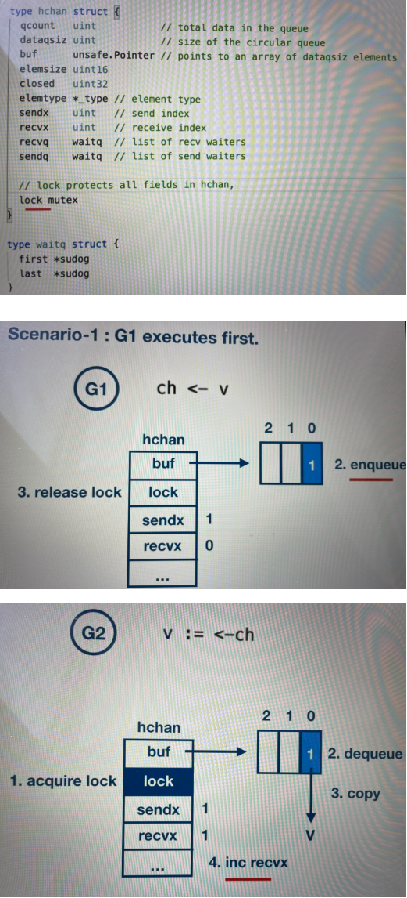
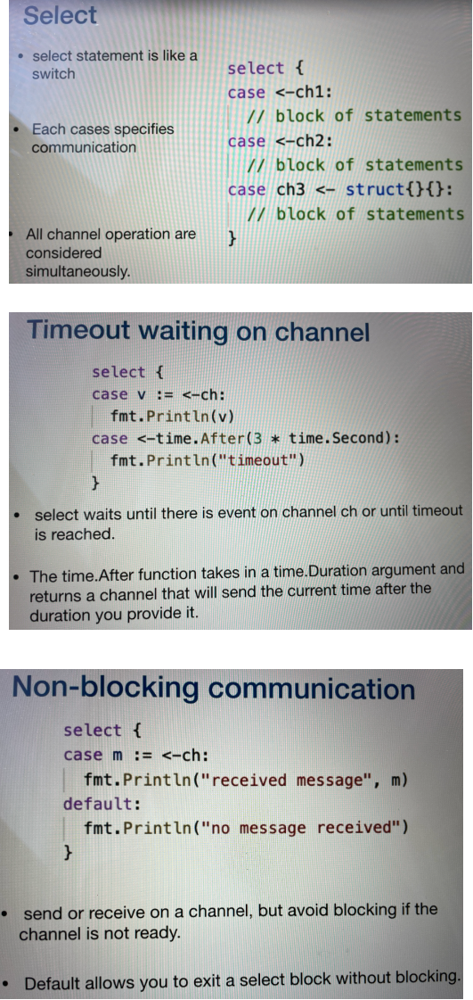
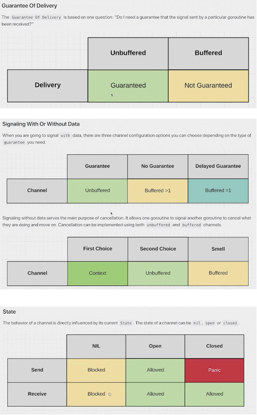
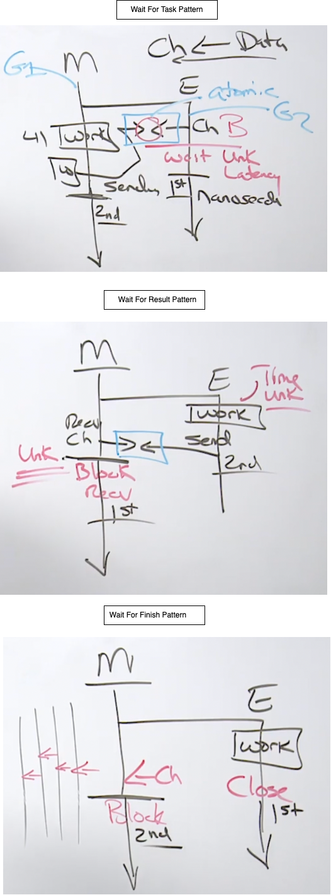

# Channels
https://github.com/ardanlabs/gotraining/tree/master/topics/go/concurrency/channels

Channels allow goroutines to communicate with each other through the use of signaling semantics. Channels accomplish this signaling through the use of sending/receiving data or by identifying state changes on individual channels. Don't architect software with the idea of channels being a queue, focus on signaling and the semantics that simplify the orchestration required.

Channels are way of doing Orchestration in a multi threaded software. Channels heps us to move the data across the goroutine boundaries. Channels are not a data structure like queue or synchronous queue, and do not use it as a data structure purpose. In channels we are gonna think about only one thing that is `signaling`. **Pointer are for Sharing and Channels are for Signaling.** 

- channels are used to communicate data between the goroutines.
- Channels can also help in synchronizing the execution of the goroutines, one goroutine can let know
another goroutine, in what stage of the computation they are in and synchronize their execution.
- Channels are typed, they are used to send and receive values of a particular type.
- They are thread safe, so the channel variables can be used to send and receive values concurrently
by multiple goroutines.
- It is very easy to create channels and we declare a variable with chan keyword, followed by the type.
- The default value of the channel is nil.
- So we need to use built-in function make, to allocate memory for the channel. And the make function returns a reference for the allocated memory. Or we can use a short variable declaration with make built-in function, which declares and allocates memory for the channel in one statement.
- Pointer operators can be used to send and receive values from the channel, and the arrow direction indicates the direction of the data flow. For send, the arrow direction indicates that the value is being written to the channel. And for receive, the arrow direction indicates that the value is being received from the channel and copied to the variable.
- Channels are blocking, the sending goroutine is going to block until there is a corresponding receiver goroutine ready to receive the value. Similarly, the receiver goroutine is going to block until there is a corresponding sender goroutine, sending the value. And it is the responsibility of the channel to make the goroutine, runnable again once it is ready to receive or send value.
- Closing of the channel is very useful for the sender goroutine to indicate to the receiver goroutine,
that the sender has no more values to send on the channel and the receiver can unblock and proceed with
its other computation.
- Receive returns two values, the first one is a received value from the channel. The second is a boolean value, which indicates whether the value that is being read from the channel is a value that is generated by a write or a default value that is being generated by a close of the channel.
- So the second return value will be true if the value is generated by write or it's going to be false,
If it is generated by close, and this is very useful to determine whether the value is from write or whether
the values from close.

**Example of Channel**
```
package main

func main() {
	ch := make(chan int)
	go func(a, b int) {
		c := a + b
		ch <- c
	}(1, 2)
	r := <- ch
	fmt.Printf("computed value %v\n", r)
}
```

### Range over the channel
- The receiver goroutine can use range to receive a sequence of values from the channel. Range over the channel will iterate over the values received from a channel.
- The loop automatically breaks when the channel is closed.
- So once the sender goroutine has sent all of its values, it will close the channel and the receiver goroutine will break out of the range loop.
- The range does not return the second boolean value. Normally the receive returns the second boolean value, but range just returns value, as on close, the range will automatically break out of the loop.
- Unbuffered channels, the channels that we have been creating till now are unbuffered channels. There is no buffer between the sender goroutine and the receiver goroutine. Since there is no buffer, the sender goroutine will block until there is a receiver, to receive the value, and the receiver goroutine will block until there is a sender, sending the value.
- In buffered channels, there is a buffer between the sender and the receiver goroutine, and we can specify the capacity, that is the buffer size, which indicates the number of elements that can be sent without the receiver being ready to receive the values. The sender can keep sending the values without blocking, till the buffer gets full, when the buffer gets full, the sender will block.
- The receiver can keep receiving the values without blocking till the buffer gets empty, when the buffer gets empty, the receiver will block.
- The buffered channels are in-memory FIFO queues, so the element that is sent first, will be the element
that will be read first.

Example:
```
package main

func main() {
	ch := make(chan, int)
	go func() {
		for i := 0; i < 6; i++ {
			// send iterator over channel
			ch <- i
		}
		close(ch)
	}()

	// range over channel to recv values
	for v := range ch { // Once the channel is closed, the range will exit.
		fmt.Println(v)
	}
}
```

**Buffered channel**
```
package main

import (
	"fmt"
)

func main() {
	ch := make(chan int, 2)

	go func() {
		defer close(ch)
		for i := 0; i < 2; i++ {
			fmt.Printf("Sending: %d\n", i)
			ch <- i
		}
	}()

	for v := range ch {
		fmt.Printf("Received: %v\n", v)
	}
}

O/P:
Sending: 0
Sending: 1
Received: 0
Received: 1
```

### Channel Direction
- When using channels as functional parameters, you can specify if the channel is meant only to send or only to receive values.
- This specificity will help us to increase the type safety of the programs, in the below example, in is a receive only channel, note the syntax, it's a pointer operator followed by the chan keyword, and out is a send only channel, and the syntax is, chan keyword followed by the pointer operator.
- In this example, the pong function can use in, only to receive values. It cannot use this channel to send values. If it tries to send values on this channel, the compiler is going to report an error.
- So in this way, we can control what operations that function can do with the channels that are
passed as parameters.

```
func pong(in <-chan string, out chan<- string) {}
```

**Example**
```
package main

import "fmt"

func producer(in chan<- int) {
	for i := range 5 {
		in <- i
	}
	close(in)
}

func filter(in <-chan int, out chan<- int) {
	for v := range in {
		if v%2 == 0 {
			out <- v
		}
	}
	close(out)
}

func main() {
	ch1 := make(chan int)
	ch2 := make(chan int)

	go producer(ch1)
	go filter(ch1, ch2)

	for val := range ch2 {
		fmt.Println(val)
	}
}

```

### Channel Ownership
- Default values, when a channel is declared, its default value is nil. So we should allocate memory by using the built-in function make.
- If that does not happen and we try to send or receive on that channel, then it's going to block forever. reading/writing to a nil channel will block forever
- Similarly, closing on the new nil channel will panic, so we should always make sure that the channels are initialized with the built-in function make.
- How we use the channels is important to avoid deadlocks and panics. We can follow some of the Go idioms.
- The best practice is that the goroutine that creates the channel will be the goroutine that will write to the channel and is also responsible for closing the channel.
- The goroutine that creates writes and closes the channel is the owner of the channel and the goroutine that
utilizes the channel will only read from the channel.
- So establishing the ownership of the channel will help us to avoid deadlocks and panics, and it will
help in avoiding scenarios like:
	- deadlocking by writing to nil channel, which will waits send and receive forever
	- closing a nil channel which will trigger a panning 
	- writing to a closed channel which will lead to panic
	- closing channel more than once which will lead to panic
```
package main

import "fmt"

func main() {
	// create channel owner goroutine which returns a receive only channel and
	// writes data into channel and
	// closes the channel when done.
	owner := func() <- chan int {
		ch := make(chan int)
		go func() {
			defer close(ch)
			for int i:=0; i<10; i++ {
				ch <- i
			}
		}()
		return ch
	}

	consumer := func(ch <-chan int) {
		// read values from channel
		for v := range ch {
			fmt.Printf("Received: %d\n", v)
		}
		fmt.Println("Done receiving!")
	}

	ch := owner()
	consumer(ch)
}
```

### Use channel as signaling
Use done channel for the signal

```
package main

import (
	"fmt"
	"time"
)

func main() {
	done := make(chan struct{})

	go func() {
		fmt.Println("Working...")
		time.Sleep(2 * time.Second)
		done <- struct{}{}
	}()

	<-done
	fmt.Println("Done")
}
```

### Synchronize between goroutines using signaling channel

```
package main

import (
	"fmt"
)

func main() {
	done := make(chan int)

	for i := range 3 {
		go func(num int) {
			fmt.Printf("goroutine %d\n", i)
			done <- 1
		}(i)
	}

	for range 3 {
		<-done
	}

	fmt.Println("Done")
}

```
### Synchronize between goroutines using range over channel

```
package main

import (
	"fmt"
	"time"
)

func main() {
	data := make(chan string)

	go func() {
		defer close(data)
		for i := range 5 {
			data <- "Hello " + string('0'+i)
			time.Sleep(1 * time.Second)
		}
	}()

	for v := range data {
		fmt.Println(v)
	}

	fmt.Println("Done")
}

```

### Channels deep dive - How it works underneath

- When we create a channel with built in make function, it inetrnally creats an instance of `hchan` struct which has multiple fields including mutex lock and circular ring buffer as shown in the below screenshot.

#### Send and Recieve on Buffered channel

Lets consider the below code snippet:
```
ch := make(chan int, 3)
// G1 go routine
func G1(ch chan<- int) {
	for _, v:= range []int {1, 2, 3, 4} {
		ch <- v
	}
}
//G2 go routine
func G2(ch <-chan int) {
	for v := range ch {
		fmt.Println(v)
	}
}
```

-  Here we have 2 goroutines goroutine G1 is sending a sequence of values into the channel, and goroutine G2 is receiving the sequence of values by ranging over the channel.
- Now, when we create a channel, this will be the representation of the `hachn` struct as shown in the below image.
- There is a circular queue with size three, which is currently empty.
- Let us now consider the scenario when the G1 executes first, G1 is trying to send a value on the channel, which has empty buffer.
- First, the goroutine has to acquire the lock on the hchan struct. It increments the send index by one. Then it enqueues the element into the circular ring buffer. Note that this is a memory copy. The element is copied into the buffer.
- Then it increments the value of the iendx to 1. Then it releases the lock on the channel and proceed with its other computation.
- Now G2 comes along and tries to receive the value from the channel.
- First, it has to acquire the lock on the hchan struct, then it dequeues the element from the buffer queue and copies the value to its variable, v. And it increments the receive index by one and releases the lock on the channel struct and proceeds with its other computation.
- This is a simple send and receive on a buffered channel.
- The points to note are, there is no memory sharing between the goroutines. The goroutines copy elements to and from hchan struct and hchan struct is protected by the mutex lock.



#### Buffer Full Scenario
- G1 sends 3 values so buffer will become full and it wants to send one more value. 
- Now, since the buffer is full, what will happen, it will get blocked and it needs to wait for the
receiver, right? Now, how does that happen? Refer the below screenshot

#### Buffer Empty Scenario
- What happens when a goroutine G2 executes first and tries to receive on an empty channel? Refer the below screenshot

#### Send and Recieve on Unbuffered channel
Refer the below screenshot


### Select
- Here is our scenario, goroutine G1 has spawned two goroutines, G2 and G3 and has given them a task
to do.
- Now, the question is, in what order are we going to receive the results from these two goroutines?
- Are we going to receive from G2 first and then G3 or G3 first and then G2. What if the G3 executes faster in some instances and returns the result faster and G2 executes faster in other instances and returns the results faster. So the question is, can we do the operation on the channel, whichever is ready and not worry about the order.
- And this is where select comes into play. Select is like a switch statement, each case statement specifies
a send or receive on some channel and it has an associated block of statements.
- Each case statement is not evaluated sequentially, but all channel operations are considered simultaneously
to see if any of them is ready. And each case has an equal chance of being selected.
- Select waits until some case is ready to proceed, if none of the channels are ready, the entire select statement is going to block, until some case is ready for the communication.
- When one channel is ready, then it performs the channel operation and executes the associated block
of statements.
- If multiple channels are ready, then it's going to pick one of them at random. So it is very helpful in implementing **timeouts and not blocking communication**.
- You can specify time out on the channel operation by using select and time after function. Select will
wait until there is a event on the channel or until the timeout is reached.
- The time after function will take a time duration as input, and it returns a channel. And it starts a goroutine in the background, and sends the value on the channel after the specified time duration. In this code snippet, the select will wait for a value to arrive on the channel ch for three seconds.
- If it does not arrive, then it's going to get timed out.
- You know, channels are blocking, right, you can achieve non-blocking operation with select
by specifying the default case. If none of the channel operation is ready, then the default case gets executed and the select does not wait for the channel.
- It just checks if the operation is ready, if it is, it performs the operation, if not, then the
default case gets executed.
- So in this code snippet, if some goroutine has already sent a value on the channel ch, then it will read the value. If there was no goroutine, which has sent a value, then it just executes the default case.
- Some scenarios to consider are, **the empty select statement will block forever and select on the nil channel will also block forever.**



Examples

#### Select

```
package main

import (
	"time"
)

func main() {
	ch1 := make(chan string)
	ch2 := make(chan string)

	go func() {
		time.Sleep(1 * time.Second)
		ch1 <- "one"
	}()

	go func() {
		time.Sleep(2 * time.Second)
		ch2 <- "two"
	}()

	// multiplex recv on channel - ch1, ch2

	for i:=0; i<2; i++ {
		select {
		case m1:= <-ch1:
			fmt.Println(m1)
		case m2:= <-ch2:
			fmt.Println(m2)
		}
	}
}
```

#### Timeout

```
package main

import (
	"fmt"
	"time"
)

func main() {
	ch := make(chan string, 1)

	go func() {
		time.Sleep(2 * time.Second)
		ch <- "one"
	}()

	// implement timeout for recv on channel ch
	select {
	case m := <-ch
		fmt.Println(m)
	case <-time.After(3 * time.Second):
		fmt.Println("Timeout")
	}
	
}
```

#### Ok channel

If the channel is closed we should stop reading the message. Else, we keep receive the zero value message from the closed channel. 

```
package main

import (
	"fmt"
	"time"
)

func main() {
	ch := make(chan string, 1)

	go func() {
		ch <- "one"
		close(ch)
	}()

	for {
		select {
		case m, ok := <-ch:
			if !ok {
				fmt.Println("Channel is closed")
				return // goes out of the surrouding function which is main function here
			}
			fmt.Println(m)
		case <-time.After(3 * time.Second):
			fmt.Println("Timeout")
		}
	}

	fmt.Println("Done") // Non reachable code

}

```

### Non blocking operations

#### Non blocking receive operation

```
package main

import "fmt"

func main() {
	ch := make(chan int)

	select { // If we do not have this select statement then code will block in the below channel recevice statement
	case msg := <-ch:
		fmt.Println("Msg ", msg)
	default:
		fmt.Println("No message available")

	}
}
```

#### Non blocking send operation

```
package main

import "fmt"

func main() {
	ch := make(chan int)

	select { // If we do not have this select statement then code will block in the below channel recevice statement
	case ch <- 1:
		fmt.Println("Sent message")
	default:
		fmt.Println("Channel is not ready to recive")

	}
}

```

#### Use quit channel to send stop signal

```
package main

import (
	"fmt"
	"time"
)

func main() {
	data := make(chan int)
	quit := make(chan bool)

	go func() {
		for {
			select { // Use for loop and selct statement in a sepaarte goroutine always so that we can stop it through quit channel
			case v := <-data:
				fmt.Println("Value received ", v)
			case <-quit:
				fmt.Println("Stopping...")
				return
			default:
				time.Sleep(1 * time.Second)
				fmt.Println("Waiting for the data...")
			}
		}
	}()

	for i := range 5 {
		data <- i
		time.Sleep(1 * time.Millisecond)
	}

	quit <- true

	fmt.Println("Done")
}

```

### Guarantee of Delivery 

A goroutine is going to send a signal to another goroutine which can receive this signal. Do we need a guarantee that a signal being sent by one goroutine has been received by another? Does the sending goroutine need a signal that that sent signal has been received? Now, if we need a guarantee, we are gonna be using the `unbuffered channel`. If we don't need guarantees, then we use `buffered channel`. 

The guarantee comes in the fact that the send and recieve should happen in the same time in case of `buffered channel`. In-fact here **receive happens before the send**. The send came in, the receive came in, and receiver pulls this woerk from sender. But this will have a cost and the cost with signaling will be unknown latency. 

Buffered channel helps for asynchronous communication where as unbuffered channel helps for synchronous communication.

If we can not deal with this unknown latency, where sender has to wait until the receiver finishes his task and send done signal back the sender, we can use buffered channel. In case of buffered channel it will have some pre-defined space, where sender can put some task and continue with ots own work without waiting, where as receiver comes and pick this work at any time and finish the work to send done signal back to sender. **Here the send happens before the receive.** But this does not have any quarantee here. Receiver might not take this work. or there are no receiver to receive this task. If the buffer is full, sender again has to wait until there are some room in the buffer to send the data. 

It is always good to use unbuffered channel which comes along with guarantee, but in some time we do not want the guarantee because of that unknown latency or back pressure which gonna cost us more. 


### Signaling with or without data

We can send/receive signal with or without data. 

When we get a signal with data, thats only a one-to-one exchange, between one goroutine to another. But we can do one-to-many exchange, if we use signaling without any data(usually for state changes), many goroutine receives a signal without data. 

### State
Behavior of a channel is directly influenced by its current stae. 
The state of a channel can be:
- nil
- open
- closed

A channel can be closed using the built-in function close. Closing a channel is a state change, it's not a memory cleanup situation. And so, we want it to close a channel when we wanna change the state from open to close. And that's how we're gonna do a signaling without data. Once a channel's closed it can't be opened up again.



So a channel can exist in two different ways. With signaling semantics, we can signal with data, we can signal without data. Signaling with data's a one-to-one. One goroutine to one goroutine. Signaling without data can be a one-to-one it can also be a one-to-many. We also wanna understand our guarantees. Does the goroutine sending the signal need a guarantee the that signal's been received? The answer is yes when we wanna get that kind of predictability in our software then we gotta live with unknown latency. If the answer is no, then we can reduce those latencies but without guarantees. There's always gonna be a little bit more risk. And buffers don't provide performance. We're not gonna use very large buffers to try to deal with performance. We want small buffers that are helping just reduce, reduce latencies, right? Just enough to keep the wheels moving. Big enough to keep the wheels moving, small enough to be able to identify when there's a problem upstream. So we don't continue to add to it. And then we're just gonna remember about our states, our nil, our open, and our closed. 

# Basic Patterns

## Wait for Task
Signaling with Guarantees(unbuffered channel) and Signaling with Data(of string type)

Think about being a manager and hiring a new employee. In this scenario, you want your new employee to perform a task but they need to wait until you are ready. This is because you need to hand them a piece of paper before they satrt.
So In this pattern, the parent goroutine sends a signal to a child goroutine waiting to be told what to do.

```
// waitForTask: In this pattern, the parent goroutine sends a signal to a
// child goroutine waiting to be told what to do.
func waitForTask() {
	ch := make(chan string)  

	go func() {
		p := <-ch   ----> Reading from channel
		fmt.Println("employee : recv'd signal :", p)
	}()

	time.Sleep(time.Duration(rand.Intn(500)) * time.Millisecond)
	ch <- "paper" ---> Writing to a channel
	fmt.Println("manager : sent signal")

	time.Sleep(time.Second)
	fmt.Println("-------------------------------------------------")
}

O/P:
employee : recv'd signal : paper
manager : sent signal
```

make(chan string): This will create a channel in Open state. This is the only way to create a channel by using make command. This is an unbuffered channel of type string data. This channel guarantees the send has been received. Also here we signal with the data where data is the string. **Here parent is the owner of channel.** Channel is nothing more than a pointer variable to a very complex data structure underneath. 

One thing to note here is, once both sender and receiver locked each other, then both of the goroutine will start running parallely. Hence the order of the print statements `fmt.Println("employee : recv'd signal :", p)` and `fmt.Println("manager : sent signal")` are not guaranteed. 

## Wait for Result
Signaling with Guarantees(unbuffered channel) and Signaling with Data(of string type)

This is the opposite of Wait for task. **Here child goroutine is the owner of the channel**


```
// waitForResult: In this pattern, the parent goroutine waits for the child
// goroutine to finish some work to signal the result.
func waitForResult() {
	ch := make(chan string)

	go func() {
		time.Sleep(time.Duration(rand.Intn(500)) * time.Millisecond)
		ch <- "paper"
		fmt.Println("employee : sent signal")
	}()

	p := <-ch
	fmt.Println("manager : recv'd signal :", p)

	time.Sleep(time.Second)
	fmt.Println("-------------------------------------------------")
}
O/P:
employee : sent signal
manager : recv'd signal : paper
```
Employee(child) already knows what work it needs to do here. 

## Wait for Finished
Signaling with Guarantees(unbuffered channel) and Signaling without Data. WaitGroup is also a type of signaling without data. So instead of using this wait for finished, it is better to use WaitGroup.

Think about being a manager and hiring a new employee. In this scenario, you want your new employee to perform a task immediately when they are hired and you need to wait for the result of their work. You need to wait because you can not move on until you know they are but you dont need anything from them.

```
func waitForFinished() {
	ch := make(chan struct{})

	go func() {
		time.Sleep(time.Duration(rand.Intn(500)) * time.Millisecond)
		close(ch)
		fmt.Println("employee : sent signal")
	}()

	data, wd := <-ch
	fmt.Println("manager : recv'd signal :", data, wd)

	time.Sleep(time.Second)
	fmt.Println("-------------------------------------------------")
}

O/P:
ployee : sent signal
manager : recv'd signal : {} false
```

We create a channel with empty struct `make(chan struct{})`, which is the way to create a signaling without data.
We use this channel without data, just to close the channel by using `close(ch)` which will send a signal to the receiver without any data.

In case of signaling without data, there is no data to receive. Thats why here we have second form of channel receive operator `data, flag := <-ch`, where the first variable is the actual data which we receives and second variable is the boolean flag. If we receive the data then this flag will be `true` and if we do not receive any data then this flag will be `false` which in case of signaling without data or channel close signal. 

If there are multiple parent goroutines which are waiting for the above child goroutine, then closing of the channel will unblock all of those multiple goroutines, so that they will run forward parallely.

