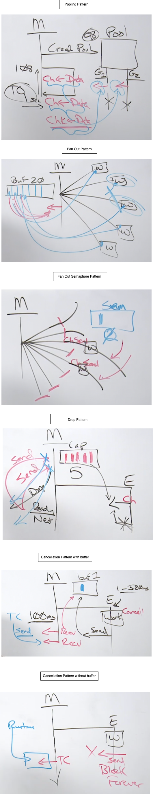

# Pipeline Pattern
- Go's concurrency primitives makes it easy to construct streaming pipelines. That enables us to make an efficient use of the I/O and the multiple CPU cores available on the machine, to run our computation faster. - Pipelines are often used to process streams or batches of data.
- Pipeline is a series of stages that are connected by the channels, where each stage is represented by
a goroutine.
- A goroutine takes the data from an in-bound channel, performs an operation on it and sends the data
on the out-bound channel, that can be used by the next stage.
- By using pipelines, we can separate the concerns of each stage, and process individual stages concurrently.
Stages could consume and return the same type.

Example:
```
package main

import "fmt"

func generator(nums ...int) <-chan int {
	out := make(chan int)

	go func() {
		for _, n := range nums {
			out <- n
		}
		close(out)
	}()
	return out
}

func square(in <-chan int) <-chan int {
	out := make(chan int)
	go func() {
		for n := range in {
			out <- n * n
		}
		close(out)
	}()
	return out
}

func main() {
	// set up the pipeline
	for n := range square(square(generator(2, 3))) {
		fmt.Println(n)
	}
}
```

# Pooling Pattern

In Go we usually no need to create any pools of goroutines, since Go schedule is very intelligent and those Ps are kind of like pools of Goroutines already. There may be times where you have a limited resource that has to require limited access to something and you might need to limit access to something through a pool.

Pooling pattern helps us to ditribute some amout of work between a pool of goroutines, where each goroutine takes some work and finishes it. We need to use wait for task as our base pattern to build this.

```
// pooling: In this pattern, the parent goroutine signals 100 pieces of work
// to a pool of child goroutines waiting for work to perform.
func pooling() {
	ch := make(chan string)

	const emps_pool = 2
	for e := 0; e < emps_pool; e++ {
		go func(emp int) {
			for p := range ch {
				fmt.Printf("employee %d: received signal: %s\n", emp, p)
			}
			fmt.Printf("employee %d: received shutdown signaln", emp)
		}(e)
	}

	const work = 10
	for w := 0; w < work; w++ {
		ch <- "paper"
		fmt.Println("manager: sent signal: ", w)
	}

	close(ch)
	fmt.Println("manager: sent shutdown signal")

	time.Sleep(time.Second)
	fmt.Println("-------------------------------------------------")
}

O/P:
employee 1: received signal: paper
manager: sent signal:  0
manager: sent signal:  1
manager: sent signal:  2
employee 1: received signal: paper
employee 1: received signal: paper
manager: sent signal:  3
manager: sent signal:  4
employee 0: received signal: paper
employee 0: received signal: paper
manager: sent signal:  5
manager: sent signal:  6
employee 1: received signal: paper
employee 1: received signal: paper
manager: sent signal:  7
manager: sent signal:  8
employee 0: received signal: paper
employee 0: received signal: paper
employee 1: received signal: paper
manager: sent signal:  9
manager: sent shutdown signal
employee 1: received shutdown signal
employee 0: received shutdown signal
```
Here when we range over a channel, we are basically in a channel receive. So here we have 2 Goroutines wwhich are blocked on the same `ch` channel until the main goroutine sends some data. How does the for range terminates? we have send close channel from the main thread, which will terminates the for range on the channel. The main goroutine created a poll with 2 goroutines in it. And then it has sent 10 works to this pool, where each of the work has taken by one goroutine and it executes it. Here we are signaling with data(by sending actual data) and without data(by closing the channel) to the channel. 

Now with only 2 goroutines, the main goroutine is going to have some latency, depending on how fast the child goroutines finishes the work. If we want to reduce that latency, we have to add more goroutines to the pool. We can also put a timeout here, where the main goroutine set some timeout lets say 1 sec, where it expects each of the child goroutine should complete their task in this 1 sec of timeout, else it will move on instead of waiting. This is one of the way to deal with back pressure an dlatencies in multi-threaded softwares. 

# Fan Out Pattern - Version 1
It allows to take a piece of work and distribute it across n number of goroutines that can run in parallel. We need to use wait for result as our base pattern to build this. 

This pattern is a dangerous pattern, especially in web services where you might already be having 10000 go routines already running in the service and suddenly you have some goroutine fan out another n number of go routines. These things can multiply very quickly. So fan out pattern is dangerous in long running apps like services, but for background apps that run on cron jobs and for CLI tool it is great. 

```
// fanOut: In this pattern, the parent goroutine creates 20 child goroutines
// and waits for them to signal their results.
func fanOut() {
	children := 20
	ch := make(chan string, children)

	for c := 0; c < children; c++ {
		go func(child int) {
			time.Sleep(time.Duration(rand.Intn(200)) * time.Millisecond)
			ch <- "data"
			fmt.Println("child : sent signal :", child)
		}(c)
	}

	for children > 0 {
		d := <-ch
		children--
		fmt.Println(d)
		fmt.Println("parent : recv'd signal :", children)
	}

	time.Sleep(time.Second)
	fmt.Println("-------------------------------------------------")
}

With children as 10 O/P:
data
parent : recv'd signal : 9
child : sent signal : 6
data
child : sent signal : 2
parent : recv'd signal : 8
child : sent signal : 0
data
parent : recv'd signal : 7
child : sent signal : 7
data
parent : recv'd signal : 6
child : sent signal : 4
data
parent : recv'd signal : 5
child : sent signal : 9
data
parent : recv'd signal : 4
child : sent signal : 3
data
parent : recv'd signal : 3
child : sent signal : 5
data
parent : recv'd signal : 2
child : sent signal : 1
data
parent : recv'd signal : 1
child : sent signal : 8
data
parent : recv'd signal : 0
```

Here we are using a buffered channel of 20 and we will create 20 go routines in fan out. This buffered channel of size 20 can reduce the latency between send and receive because each of the go routine has its own slot in the buffer where it can send the data and the main goroutine can receive the data without any latency. When you're using buffered channels, one of the other questions we're gonna ask is, can the sending go routine on this channel ever block? In other words, can the buffer ever get full? In a fan out pattern, we've sized it so there no signaling on the send side could ever block because we have a one to one, and any time a buffer channel can get full, we've got to ask ourselves what happens when this signaling I'm gonna send blocks? And if you can't, you've really put your server in a very, very bad place. 

Here each of the 20 goroutine has its own slot in the buffered channel whose size is also 20. So when a goroutine has the data, it will put its own slot in the buffered channel and then the main goroutine recieves it from the same buffer slot. So there is no latency between the send and receive here. However, two of the go routines could finish at the same time. Now there is blocking latency between the two sends because only one send can happen at a time. 

# Fan Out Pattern - Version 2 (Fan Out Semaphore)
What it says is, lets fan out n number of goroutines, but we dont necessarily want all of the go routines to be able to run at the same time. Lets limit how many go routines, in this kind of dynamic pool we created can literally run at the same time. This is another way of being able to reduce the latency in terms of goroutine creation, but at the same time limit the impact that these goroutines are having on another resource. 

```
// fanOutSem: In this pattern, a semaphore is added to the fan out pattern
// to restrict the number of child goroutines that can be schedule to run.
func fanOutSem() {
	children := 20
	ch := make(chan string, children)

	const g := 5
	sem := make(chan bool, g)

	for c := 0; c < children; c++ {
		go func(child int) {
			sem <- true
			{
				t := time.Duration(rand.Intn(200)) * time.Millisecond
				time.Sleep(t)
				ch <- "data"
				fmt.Println("child : sent signal :", child)
			}
			<-sem
		}(c)
	}

	for children > 0 {
		d := <-ch
		children--
		fmt.Println(d)
		fmt.Println("parent : recv'd signal :", children)
	}

	time.Sleep(time.Second)
	fmt.Println("-------------------------------------------------")
}

O/P:
data
parent : recv'd signal : 9
child : sent signal : 7
child : sent signal : 0
data
parent : recv'd signal : 8
child : sent signal : 6
data
parent : recv'd signal : 7
child : sent signal : 9
data
parent : recv'd signal : 6
data
parent : recv'd signal : 5
child : sent signal : 8
child : sent signal : 2
data
parent : recv'd signal : 4
child : sent signal : 4
data
parent : recv'd signal : 3
child : sent signal : 3
data
parent : recv'd signal : 2
child : sent signal : 5
data
parent : recv'd signal : 1
child : sent signal : 1
data
parent : recv'd signal : 0
```

Here we have 2 buffered channel, one is with size of 20 for the number of goroutines and other one is for the number of go routines(here it is 5) which can execute at the same time and rest of the others will be in runnable state. 

Initially all of the 20 goroutine starts and will be in runnable state, where each of them try to send a signal to buffered semaphore channel whose size is 5. So only 5 goroutine can send the signal to the semaphore channel and rest of other will be blocked. Once these 5 go routines finished their work, it will receive the data from the same semaphore channel, which will make other go routines to run. 

SO before a goroutine can actually do the physical work it has to, its gotta be able to send the piece of data into the semaphore channel. If it does, it gets to move on and when its done, its gotta go and pull it back out to give room for another go routine to come in and then do their work. We really wanna use this pattern when you might have a resource that is limited. If we have 20 goroutines hit at the same time, we could have a problem. But having five goroutines hit it, we wont have a problem. But this pattern is adding extra latency cost on the second buffer channel. 

# Drop Pattern
This is very powerfull pattern, helping us reducce back pressure when things are going bad. Good example of this pattern is writing a DNS Server, which can receives so many requests that it drowns itself trying to process everything. Drop pattern can identify what is the capacity of our service, and if there are any more load comes in, it can say no to it. This pattern can identify failures quickly.  

```
// drop: In this pattern, the parent goroutine signals 20 pieces of work to
// a single child goroutine that can't handle all the work. If the parent
// performs a send and the child is not ready, that work is discarded and dropped.
func drop() {
	const cap = 5
	ch := make(chan string, cap)

	go func() {
		for p := range ch {
			fmt.Println("child : recv'd signal :", p)
		}
	}()

	const work = 20
	for w := 0; w < work; w++ {
		select {
		case ch <- "data":
			fmt.Println("parent : sent signal :", w)
		default:
			fmt.Println("parent : dropped data :", w)
		}
	}

	close(ch)
	fmt.Println("parent : sent shutdown signal")

	time.Sleep(time.Second)
	fmt.Println("-------------------------------------------------")
}

O/P:
child : recv'd signal : data
parent : sent signal : 0
parent : sent signal : 1
parent : sent signal : 2
parent : sent signal : 3
parent : sent signal : 4
parent : sent signal : 5
parent : sent signal : 6
parent : dropped data : 7
parent : dropped data : 8
parent : dropped data : 9
parent : dropped data : 10
parent : dropped data : 11
parent : dropped data : 12
parent : dropped data : 13
child : recv'd signal : data
child : recv'd signal : data
child : recv'd signal : data
child : recv'd signal : data
child : recv'd signal : data
child : recv'd signal : data
parent : dropped data : 14
parent : sent signal : 15
parent : sent signal : 16
parent : sent signal : 17
parent : sent signal : 18
parent : sent signal : 19
parent : sent shutdown signal
child : recv'd signal : data
child : recv'd signal : data
child : recv'd signal : data
child : recv'd signal : data
child : recv'd signal : data
```

Here we have a buffered channel of capacity 5, which tells once we have at least five pending tasks waiting in this buffere channel, we are at our capacity. We are not going to go to six or taking anymore. 

If this is working fast enough, then the buffer never gets full and we do not have any issues. But if the child goroutine is not running fast enough, which has some problem, its not coming back to the receive and then the buffer will gets full and then we do not want to block the caller, we dont take blocking latencies here instead we just drop the request, so that main goroutine can continue running. 

What's powerful about the select statement, is it allows a single Go routine, to handle multiple channel operations, whether they're sends or receives, at exactly the same time. So you can create event loops here. 

We are doing send operation inside the select clause, and if the send is going to be blocked, then we do not want to take any latency cost, so that `default` clause will execute which will allow sender to move on to the enxt send operation instead of waiting in the current send. And, eventually, when this buffer begins to be processed again, the next set of send operation happens. 

# Cancellation Pattern
Cancellation deadlines are critical to software because a task or a request cannot take forever. Ideally we shouldn't use this code in production, instead we can use the context package for the cancellation.

```
// cancellation: In this pattern, the parent goroutine creates a child
// goroutine to perform some work. The parent goroutine is only willing to
// wait 150 milliseconds for that work to be completed. After 150 milliseconds
// the parent goroutine walks away.
func cancellation() {
	ch := make(chan string, 1)

	go func() {
		time.Sleep(time.Duration(rand.Intn(500)) * time.Millisecond)
		ch <- "data"
		fmt.Println("employee: sent signal")
	}()

	tc := time.After(100 * time.Millisecond)

	select {
	case d := <-ch:
		fmt.Println("manager: received signal: ", d)

	case t := <-tc:
		fmt.Println("manager: timedout: ", t)
	}

	time.Sleep(time.Second)
	fmt.Println("-------------------------------------------------")
}

O/P:
manager: timedout:  2023-06-16 16:23:20.183491 +0530 IST m=+0.101268168
employee: sent signal
```

Here the run time, the run time, okay, will come in, the run time will come in on our timer, and this is our timer here, the run time will come in on our timer, and then perform the send for us at 100 milliseconds. Or, this send right here will add data to the buffer, which will allow this receive to unblock. Which one's gonna happen first? I have no idea, that's the poin

Here in the select statememnt the main go routine is trying to receive the data from 2 channels, one is our buffer channel and the other one is timer channel. So timer will send the signal after 100 milli second to its channel, where as the goroutine send the data to its channel after 500 milli second. Since timer channel sends the data first, the corresponding select clause will be running, and then the main thread will continue instead of waiting for the child goroutine. 

If we use the unbuffered channel here instead of buffered, then this will have a goroutine leak where the child goroutine will continue to get blocked for the corresponding receive operation. 

