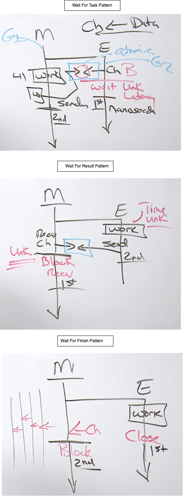

# Channels
https://github.com/ardanlabs/gotraining/tree/master/topics/go/concurrency/channels

Channels allow goroutines to communicate with each other through the use of signaling semantics. Channels accomplish this signaling through the use of sending/receiving data or by identifying state changes on individual channels. Don't architect software with the idea of channels being a queue, focus on signaling and the semantics that simplify the orchestration required.

Channels are way of doing Orchestration in a multi threaded software. Channels heps us to move the data across the goroutine boundaries. Channels are not a data structure like queue or synchronous queue, and do not use it as a data structure purpose. In channels we are gonna think about only one thing that is `signaling`. **Pointer are for Sharing and Channels are for Signaling.** 

### Guarantee of Delivery 

A goroutine is going to send a signal to another goroutine which can receive this signal. Do we need a guarantee that a signal being sent by one goroutine has been received by another? Does the sending goroutine need a signal that that sent signal has been received? Now, if we need a guarantee, we are gonna be using the `unbuffered channel`. If we don't need guarantees, then we use `buffered channel`. 

The guarantee comes in the fact that the send and recieve should happen in the same time in case of `buffered channel`. In-fact here **receive happens before the send**. The send came in, the receive came in, and receiver pulls this woerk from sender. But this will have a cost and the cost with signaling will be unknown latency. 

If we can not deal with this unknown latency, where sender has to wait until the receiver finishes his task and send done signal back the sender, we can use buffered channel. In case of buffered channel it will have some pre-defined space, where sender can put some task and continue with ots own work without waiting, where as receiver comes and pick this work at any time and finish the work to send done signal back to sender. **Here the send happens before the receive.** But this does not have any quarantee here. Receiver might not take this work. or there are no receiver to receive this task. If the buffer is full, sender again has to wait until there are some room in the buffer to send the data. 

It is always good to use unbuffered channel which comes along with guarantee, but in some time we do not want the guarantee because of that unknown latency or back pressure which gonna cost us more. 


### Signaling with or without data

We can send/receive signal with or without data. 

When we get a signal with data, thats only a one-to-one exchange, between one goroutine to another. But we can do one-to-many exchange, if we use signaling without any data(usually for state changes), many goroutine receives a signal without data. 

### State
Behavior of a channel is directly influenced by its current stae. 
The state of a channel can be:
- nil
- open
- closed

A channel can be closed using the built-in function close. Closing a channel is a state change, it's not a memory cleanup situation. And so, we want it to close a channel when we wanna change the state from open to close. And that's how we're gonna do a signaling without data. Once a channel's closed it can't be opened up again.


So a channel can exist in two different ways. With signaling semantics, we can signal with data, we can signal without data. Signaling with data's a one-to-one. One goroutine to one goroutine. Signaling without data can be a one-to-one it can also be a one-to-many. We also wanna understand our guarantees. Does the goroutine sending the signal need a guarantee the that signal's been received? The answer is yes when we wanna get that kind of predictability in our software then we gotta live with unknown latency. If the answer is no, then we can reduce those latencies but without guarantees. There's always gonna be a little bit more risk. And buffers don't provide performance. We're not gonna use very large buffers to try to deal with performance. We want small buffers that are helping just reduce, reduce latencies, right? Just enough to keep the wheels moving. Big enough to keep the wheels moving, small enough to be able to identify when there's a problem upstream. So we don't continue to add to it. And then we're just gonna remember about our states, our nil, our open, and our closed. 

# Basic Patterns

## Wait for Task
Signaling with Guarantees(unbuffered channel) and Signaling with Data(of string type)

Think about being a manager and hiring a new employee. In this scenario, you want your new employee to perform a task but they need to wait until you are ready. This is because you need to hand them a piece of paper before they satrt.
So In this pattern, the parent goroutine sends a signal to a child goroutine waiting to be told what to do.

```
// waitForTask: In this pattern, the parent goroutine sends a signal to a
// child goroutine waiting to be told what to do.
func waitForTask() {
	ch := make(chan string)  

	go func() {
		p := <-ch   ----> Reading from channel
		fmt.Println("employee : recv'd signal :", p)
	}()

	time.Sleep(time.Duration(rand.Intn(500)) * time.Millisecond)
	ch <- "paper" ---> Writing to a channel
	fmt.Println("manager : sent signal")

	time.Sleep(time.Second)
	fmt.Println("-------------------------------------------------")
}

O/P:
employee : recv'd signal : paper
manager : sent signal
```

make(chan string): This will create a channel in Open state. This is the only way to create a channel by using make command. This is an unbuffered channel of type string data. This channel guarantees the send has been received. Also here we signal with the data where data is the string. **Here parent is the owner of channel.** Channel is nothing more than a pointer variable to a very complex data structure underneath. 

One thing to note here is, once both sender and receiver locked each other, then both of the goroutine will start running parallely. Hence the order of the print statements `fmt.Println("employee : recv'd signal :", p)` and `fmt.Println("manager : sent signal")` are not guaranteed. 

## Wait for Result
Signaling with Guarantees(unbuffered channel) and Signaling with Data(of string type)

This is the opposite of Wait for task. **Here child goroutine is the owner of the channel**


```
// waitForResult: In this pattern, the parent goroutine waits for the child
// goroutine to finish some work to signal the result.
func waitForResult() {
	ch := make(chan string)

	go func() {
		time.Sleep(time.Duration(rand.Intn(500)) * time.Millisecond)
		ch <- "paper"
		fmt.Println("employee : sent signal")
	}()

	p := <-ch
	fmt.Println("manager : recv'd signal :", p)

	time.Sleep(time.Second)
	fmt.Println("-------------------------------------------------")
}
O/P:
employee : sent signal
manager : recv'd signal : paper
```
Employee(child) already knows what work it needs to do here. 

## Wait for Finished
Signaling with Guarantees(unbuffered channel) and Signaling without Data. WaitGroup is also a type of signaling without data. So instead of using this wait for finished, it is better to use WaitGroup.

Think about being a manager and hiring a new employee. In this scenario, you want your new employee to perform a task immediately when they are hired and you need to wait for the result of their work. You need to wait because you can not move on until you know they are but you dont need anything from them.

```
func waitForFinished() {
	ch := make(chan struct{})

	go func() {
		time.Sleep(time.Duration(rand.Intn(500)) * time.Millisecond)
		close(ch)
		fmt.Println("employee : sent signal")
	}()

	data, wd := <-ch
	fmt.Println("manager : recv'd signal :", data, wd)

	time.Sleep(time.Second)
	fmt.Println("-------------------------------------------------")
}

O/P:
ployee : sent signal
manager : recv'd signal : {} false
```

We create a channel with empty struct `make(chan struct{})`, which is the way to create a signaling without data.
We use this channel without data, just to close the channel by using `close(ch)` which will send a signal to the receiver without any data.

In case of signaling without data, there is no data to receive. Thats why here we have second form of channel receive operator `data, flag := <-ch`, where the first variable is the actual data which we receives and second variable is the boolean flag. If we receive the data then this flag will be `true` and if we do not receive any data then this flag will be `false` which in case of signaling without data or channel close signal. 

If there are multiple parent goroutines which are waiting for the above child goroutine, then closing of the channel will unblock all of those multiple goroutines, so that they will run forward parallely.

