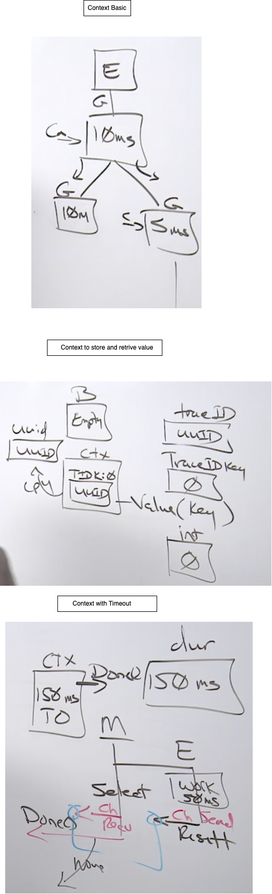

# Context package
https://github.com/ardanlabs/gotraining/blob/master/topics/go/packages/context/README.md

The Context package in Go is a very important package because its really where we are gonna implement cancellation and deadlines. Remember the server can not take forever to do things. The package context defines the Context type, which carries deadlines, cancellation signals, and other request-scoped values across API boundaries and between processes.

Any API that you have that does any sort of AI, any sort of IO or eventually will do IO, should be taking Context as its first parameter. One of the other things that the Context package has is a generic value bag. The way the value bag works is, data is stored inside the context with a combination of a key, and a value. But the key is not just some value, its also gonna be based on type. 

- Incoming requests to a server should create a Context.
- Outgoing calls to servers should accept a Context.
- The chain of function calls between them must propagate the Context.
- Replace a Context using WithCancel, WithDeadline, WithTimeout, or WithValue.
- When a Context is canceled, all Contexts derived from it are also canceled.
- Do not store Contexts inside a struct type; instead, pass a Context explicitly to each function that needs it.
- Do not pass a nil Context, even if a function permits it. Pass context.TODO if you are unsure about which Context to use.
- Use context Values only for request-scoped data that transits processes and APIs, not for passing optional parameters to functions.
- The same Context may be passed to functions running in different goroutines; Contexts are safe for simultaneous use by multiple goroutines.

## Store and Retrieve value from a Context
```
// Sample program to show how to store and retrieve
// values from a context.
package main

import (
	"context"
	"fmt"
)

// TraceID is represents the trace id.
type TraceID string

// TraceIDKey is the type of value to use for the key. The key is
// type specific and only values of the same type will match.
type TraceIDKey int

func main() {

	// Create a traceID for this request.
	traceID := TraceID("f47ac10b-58cc-0372-8567-0e02b2c3d479")

	// Declare a key with the value of zero of type userKey.
	const traceIDKey TraceIDKey = 0

	// Store the traceID value inside the context with a value of
	// zero for the key type.
	ctx := context.WithValue(context.Background(), traceIDKey, traceID)

	// Retrieve that traceID value from the Context value bag.
	if uuid, ok := ctx.Value(traceIDKey).(TraceID); ok {
		fmt.Println("TraceID:", uuid)
	}

	// Retrieve that traceID value from the Context value bag not
	// using the proper key type.
	if _, ok := ctx.Value(0).(TraceID); !ok {
		fmt.Println("TraceID Not Found")
	}
}

O/P:
TraceID: f47ac10b-58cc-0372-8567-0e02b2c3d479
TraceID Not Found
```

 If we're gonna work with Context we need a context and when we don't have a context we gotta start with a parent context. Now there's two ways to get to a parent context. We can use a function called `Background` out of the Context package, or we can use what's called `TODO` out of the Context package. 

 When would you use one over the other? When you know you need a context but you're not sure where it's gonna come from, or how it's gonna be initially initialized, use TODO. It's a marker in your code to say, I've gotta come back here and TODO this, right? And a lot of times you don't really know what your timeout value should be at. You don't really know how things are gonna work with Context but you know you need it, you wanna lay it in early, very early. So TODO is something I probably use more than Background. But Background is your base parent context. You can think of Background from our perspective, as a value that's just kind of initialized and setup as an empty context. 
 
 Context uses value semantics. We pass a context in, we make changes to it, we get a new context out. One of the reason we use value semantics with Context is, is because a context can change throughout a function call change. In other words, at the root of any particular set of function calls, you might start with that empty Background context. Then we're gonna pass over these program boundaries. Maybe we make another function call, and then this function, even though it starts with the empty, maybe it adds some timeout information like 10 milliseconds. Maybe we pass this context around to two different goroutines. Now we went from this one goroutine, to two goroutines right? We split this path of execution in parallel, and now things might be changing here. Now this side of the processing only wants to start using maybe five millisecond timeouts. So the value semantics are important because, as a context is changing, we get a new context, and then the way cancellation eventually starts to work, is if we cancel here, then we're gonna cancel down both paths. Or maybe we just cancel here, and we're only gonna cancel down this path.

## Wait with Timeout (Cancellation/Timeout Pattern)

Basically there are 2 kinds of timeout. duration based timeout and deadline based timeout. In duration based timeout, we provide a duration, so that timeout will happen after that duration passed. Whereas in deadline based timeout, we provide an actual moment in time, so that timeout will happen once that moment in time passed.

### WithTimeout()
```
// Sample program to show how to use the WithTimeout function
// of the Context package.
package main

import (
	"context"
	"fmt"
	"time"
)

type data struct {
	UserID string
}

func main() {

	// Set a duration.
	duration := 150 * time.Millisecond

	// Create a context that is both manually cancellable and will signal
	// a cancel at the specified duration.
	ctx, cancel := context.WithTimeout(context.Background(), duration)
	defer cancel()

	// Create a channel to received a signal that work is done.
	ch := make(chan data, 1)

	// Ask the goroutine to do some work for us.
	go func() {

		// Simulate work.
		time.Sleep(200 * time.Millisecond)

		// Report the work is done.
		ch <- data{"123"}
	}()

	// Wait for the work to finish. If it takes too long move on.
	select {
	case d := <-ch:
		fmt.Println("work complete", d)

	case <-ctx.Done():
		fmt.Println("work cancelled")
	}
}

O/P:
work cancelled
```

Here we have a child goroutine which does some work and signal the parent goroutine with the data. This child goroutine has some amount of duration within which it has to complete its work. To make this we have created a context, where we set 150 milliseconds of timeout to get things done, and after that it would report the time is over. Here calling defer function on the cancel is very critical, else this will create a memory leak. 

The parent goroutine listen both the child channel and the context Done() channel. Whichever channel gets the signal first the corresponidng select case will be executed. So in the above code, if the child goroutine does not send the signal within the duration which is set in the context, the parent go routine continue its execution without waiting for the child go routine. Since we are using a buffer channel of 1, the chil dgoroutine also does not get blocked, it will send its data to this buffered channel, which will eliminate any go routine leaks.

This is how we do `deadline` or `timeout`. A deadline is when we do not give any duration, but we give an actual moment in time, that we want things to happen. 

### WithDeadline()

```
// Set a deadline.
deadline := time.Now().Add(150 * time.Millisecond)

// Create a context that is both manually cancellable and will signal
// a cancel at the specified date/time.
ctx, cancel := context.WithDeadline(context.Background(), deadline)
defer cancel()
```


### WithCancel()

In case of `cancel`, we don't pass any duration to the cancel function, so that we need to manually call the cancel funtion to trigger the timeout. 

```
// Sample program to show how to use the WithCancel function.
package main

import (
	"context"
	"fmt"
	"time"
)

func main() {
	// Create a context that is cancellable only manually.
	// The cancel function must be called regardless of the outcome.
	ctx, cancel := context.WithCancel(context.Background())
	defer cancel()

	// Ask the goroutine to do some work for us.
	go func() {

		// Wait for the work to finish. If it takes too long move on.
		select {
		case <-time.After(100 * time.Millisecond):
			fmt.Println("moving on")

		case <-ctx.Done():
			fmt.Println("work complete")
		}
	}()

	// Simulate work.
	time.Sleep(150 * time.Millisecond)

	// Report the work is done.
	cancel()

	// Just hold the program to see the output.
	time.Sleep(time.Second)
	fmt.Println("done")
}

O/P:
moving on
done
```




# Timers
Timer can be used for below purposes
- Timeouts
- Delays
- Periodic Tasks

**Timeout**
```
package main

import (
	"fmt"
	"time"
)

func main() {
	timer := time.NewTimer(2 * time.Second)
	// We can use time.sleep() instead of the above time.NewTimer()
	// But time.sleep is blocking in nature

	fmt.Println("Waiting for timer.c")
	// timer.Stop() -> we can use this function so that timer wont send signal to channel
	// timer.Reset(time.Second) -> start the time again
	<-timer.C // Blocking
	// We can use above timer.C in a sepaarte goroutine also
	// So that main goroutine continue
	fmt.Println("Time expired")
}
```

```
package main

import (
	"fmt"
	"time"
)

func longRunningOp() {
	for i := range 20 {
		fmt.Println(i)
		time.Sleep(time.Second)
	}
}

func main() {
	timeout := time.After(2 * time.Second)
	done := make(chan bool)

	go func() {
		longRunningOp()
		done <- true
	}()

	select {
	case <-done:
		fmt.Println("Operation is completed")
	case <-timeout:
		fmt.Println("Operation times out")
	}
}

O/P:
0
1
Operation times out
```

# Tickers
A triger in go is a mechanism for producing ticks at regular intervals. Tickers are useful for performing periodic tasks or operations on a consistent schedule. Tickers are often used in scenarios where tasks need to be repeated at fixed intervals, such as polling, periodic logging, or regular updates. Using tickers ensures operations occur at regular intervals, maintaining a consistent schedule. Using tickers also simplifies the implementation of recurring tasks without manually handling timing logic.

```
package main

import (
	"fmt"
	"time"
)

func periodicTask() {
	fmt.Println("Periodic Task")
}

func main() {
	ticker := time.NewTicker(1 * time.Second)
	defer ticker.Stop()
	stop := time.After(5 * time.Second)

	for {
		select {
		case <-ticker.C:
			go periodicTask()
		case <-stop:
			fmt.Println("Stopped")
			return
		}
	}
}

```

# WorkerPool Pattern

```
package main

import (
	"fmt"
	"sync"
	"time"
)

func worker(id int, tasks <-chan int, results chan<- int, wg *sync.WaitGroup) {
	defer wg.Done()
	for task := range tasks {
		fmt.Printf("Worker %d processing task %d\n", id, task)
		// Simulate work
		time.Sleep(time.Second)
		results <- task * 2
	}
}

func main() {
	wg := sync.WaitGroup{}
	numWorkers := 3
	numTasks := 10

	wg.Add(numWorkers)

	tasks := make(chan int)
	results := make(chan int, numTasks)

	// Create workers
	for i := range numWorkers {
		go worker(i, tasks, results, &wg)
	}

	// Send values to the tasks channel
	for i := range numTasks {
		tasks <- i
	}

	close(tasks)

	go func() {
		wg.Wait()
		close(results)
	}()

	// Collect the results
	for res := range results {
		fmt.Println("Result:", res)
	}
}

O/P:
Worker 2 processing task 0
Worker 0 processing task 1
Worker 1 processing task 2
Worker 1 processing task 3
Worker 0 processing task 4
Worker 2 processing task 5
Worker 0 processing task 6
Worker 2 processing task 8
Worker 1 processing task 7
Worker 1 processing task 9
Result: 4
Result: 2
Result: 0
Result: 8
Result: 6
Result: 10
Result: 14
Result: 16
Result: 12
Result: 18
```

# Mutex

A mutex, which is short for mutual exclusion, is a synchronization primitive used to prevent multiple go routines from simultaneously accessing shared resources or executing critical sections of code. It ensures that only one go routine can hold the mutex at a time, thus avoiding race conditions and data corruption.

'''
package main

import (
	"fmt"
	"sync"
)

func main() {
	var counter int
	var wg sync.WaitGroup
	var mu sync.Mutex

	numGoroutines := 5
	wg.Add(numGoroutines)

	for range numGoroutines {
		go func() {
			defer wg.Done()
			for range 1000 {
				mu.Lock()
				counter++
				mu.Unlock()
			}
		}()
	}

	wg.Wait()
	fmt.Printf("Final counter value: %d\n", counter)
}
'''

```
package main

import (
	"fmt"
	"sync"
)

type counter struct {
	mu    sync.Mutex
	count int
}

func (c *counter) increment() {
	c.mu.Lock()
	defer c.mu.Unlock()
	c.count++
}

func (c *counter) getValue() int {
	c.mu.Lock()
	defer c.mu.Unlock()
	return c.count
}

func main() {

	wg := sync.WaitGroup{}
	counter := &counter{}
	numGoroutines := 10

	wg.Add(numGoroutines)

	for range numGoroutines {
		go func() {
			defer wg.Done()
			for range 1000 {
				counter.increment()
			}
		}()
	}

	wg.Wait()
	fmt.Printf("Final counter value: %d\n", counter.getValue())

}

```

# RW-Mutex

It allows multiple concurent for reads while ensuring exclucsive access for write. 

RW mutex, which stands for read write mutex, is a synchronization primitive in go that allows multiple readers to hold the lock simultaneously while ensuring exclusive access for a single writer. It provides an efficient way to handle concurrent read and write operations, particularly when read Operations are frequent and writes are infrequent. 

So the read lock, which is rlock, allows multiple goroutines to acquire the read lock simultaneously. It is used when a goroutine needs to read shared data without modifying it while write lock, which is just the lock method, there is no prefix to it. However, for read lock, there is a prefix r associated with lock. So it was R lock. nd here for writing it's just simple lock.

So write lock ensures exclusive access to the shared resource And only one go routine can hold the right lock at a time. Moreover, all readers and writers are blocked until the write lock is released.

And we also should know about the write lock behavior that only one goroutine can acquire the write lock at a time. Also, while a goroutine holds the write lock, no other goroutine can acquire either a read or write lock. However, for the read lock behavior, it's simple. Multiple go routines can acquire the read lock simultaneously, provided no go routine holds the write lock.

```
package main

import (
	"fmt"
	"sync"
)

var (
	rwmu    sync.RWMutex
	counter int
)

func readCounter(wg *sync.WaitGroup) {
	defer wg.Done()
	rwmu.RLock()
	fmt.Println("Read Counter:", counter)
	rwmu.RUnlock()
}

func writeCounter(wg *sync.WaitGroup, value int) {
	defer wg.Done()
	rwmu.Lock()
	counter = value
	fmt.Printf("Written value %d for counter.\n", value)
	rwmu.Unlock()
}

func main() {
	var wg sync.WaitGroup
	for range 5 {
		wg.Add(1)
		go readCounter(&wg)
	}

	wg.Add(1)
	go writeCounter(&wg, 18)

	wg.Wait()
	fmt.Println("Value of counter ", counter)
}

O/P:
Written value 18 for counter.
Read Counter: 18
Read Counter: 18
Read Counter: 18
Read Counter: 18
Read Counter: 18
Value of counter  18

```

# Atomic Counter

```
package main

import (
	"fmt"
	"sync"
	"sync/atomic"
)

type AtomicCounter struct {
	count int64
}

func (ac *AtomicCounter) increment() {
	atomic.AddInt64(&ac.count, 1)
}

func (ac *AtomicCounter) getValue() int64 {
	return atomic.LoadInt64(&ac.count)
}

func main() {
	var wg sync.WaitGroup
	numGoroutines := 10
	counter := &AtomicCounter{}
	// value := 0

	for range numGoroutines {
		wg.Add(1)
		go func() {
			defer wg.Done()
			for range 1000 {
				counter.increment()
				// value++
			}
		}()
	}

	wg.Wait()
	fmt.Printf("Final counter value: %d\n", counter.getValue())
	// fmt.Printf("Final counter value: %d\n", value)
}

```

# Statefull Goroutine

```
package advanced

import (
	"fmt"
	"time"
)

type StatefulWorker struct {
	count int
	ch    chan int
}

func (w *StatefulWorker) Start() {
	go func() {
		for {
			select {
			case value := <-w.ch:
				w.count += value
				fmt.Println("Current count:", w.count)

			}
		}
	}()
}

func (w *StatefulWorker) Send(value int) {
	w.ch <- value
}

func main() {

	stWorker := &StatefulWorker{
		ch: make(chan int),
	}

	stWorker.Start()

	for i := range 5 {
		stWorker.Send(i)
		time.Sleep(500 * time.Millisecond)
	}

}

O/P:
Current count: 0
Current count: 1
Current count: 3
Current count: 6
Current count: 10
```

# for-select statement

```
package main

import (
	"fmt"
	"time"
)

func main() {

	ticker := time.NewTicker(1 * time.Second)
	quit := make(chan string)

	go func() {
		time.Sleep(5 * time.Second)
		close(quit)
	}()

	for {
		select {
		case <-ticker.C:
			fmt.Println("Tick")
		case <-quit:
			fmt.Println("Quitting...")
			return
		}
	}
}

O/P:
Tick
Tick
Tick
Tick
Tick
Quitting...
```

# Sync-once

Sync once ensures that a piece of code is executed only once, regardless of how many go routines attempt to execute it. It is useful for initializing shared resources or performing setup tasks.

```
package main

import (
	"fmt"
	"sync"
)

var once sync.Once

func initialize() {
	fmt.Println("This will not be repeated no matter how mahy times you call this function using once.Do.")
}

func main() {

	var wg sync.WaitGroup
	for i := range 5 {
		wg.Add(1)
		go func() {
			defer wg.Done()
			fmt.Println("Goroutine # ", i)
			once.Do(initialize)
			// initialize()
		}()
	}
	wg.Wait()
}

O/P:
Goroutine #  0
This will not be repeated no matter how mahy times you call this function using once.Do.
Goroutine #  4
Goroutine #  1
Goroutine #  3
Goroutine #  2
```

## Sync.NewCond
To allow a goroutine to hold a lock until a condition is met

## Sync.Pool
The primary purpose of sync.pool is to reduce the overhead of allocating and deallocating objects, frequently by providing a pool where objects can be reused.
