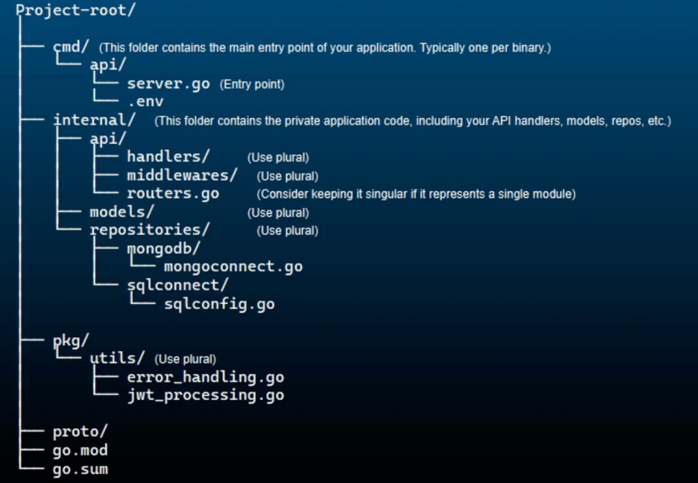

# http client

```
package main

import (
	"fmt"
	"io"
	"net/http"
)

func main() {
	client := &http.Client{}

	resp, err := client.Get("https://jsonplaceholder.typicode.com/posts/1")
	if err != nil {
		fmt.Println("Error making get request. Error ", err)
	}
	defer resp.Body.Close()

	data, err := io.ReadAll(resp.Body)
	if err != nil {
		fmt.Println("Error reading response body. Error:  ", err)
	}
	fmt.Println(string(data))
}

```

# http server
```
package main

import (
	"fmt"
	"log"
	"net/http"
)

func main() {

	http.HandleFunc("/", func(resp http.ResponseWriter, req *http.Request) {
		fmt.Fprintln(resp, "Hello Server!")
	})
	const port = ":8000"

	fmt.Println("Server listening on port ", port)
	err := http.ListenAndServe(port, nil)
	if err != nil {
		log.Fatalln("error starting server ", err)
	}
}

```

# Https/Http2 support along with TLS

Private key `key.pem` is used to decrypt data encrypted with the corresponding public key, and to sign data to prove its origin. The key `cert.pem` contains the public key and the certificate. This certificate includes information about the key, the owner and the issuer of the certificate. And this is used by the clients to encrypt data to be sent to the server and to verify the server's identity.

So how are these files used in Https. Well the server uses the key.pem file to prove its identity and establish a secure connection. And then the cert.pem file is provided to clients to verify the server's identity and to encrypt the data sent to the server.

In summary, PEM files are just text files containing cryptographic keys and certificates encoded in base64 with specific headers and footers, and key.pem contains the private key for decryption and signing, while cert.pem contains the public key and certificate for encryption and identity verification.

```
package main

import (
	"crypto/tls"
	"crypto/x509"
	"fmt"
	"log"
	"net/http"
	"os"

	"golang.org/x/net/http2"
)

func loadClientCAs() *x509.CertPool {
	clientCAs := x509.NewCertPool()
	caCert, err := os.ReadFile("cert.pem")
	if err != nil {
		log.Fatalln("Could not load client CA:", err)
	}
	clientCAs.AppendCertsFromPEM(caCert)
	return clientCAs
}

func main() {

	http.HandleFunc("/orders", func(w http.ResponseWriter, r *http.Request) {
		logRequestDetails(r)
		fmt.Fprintf(w, "Handling incoming orders")
	})

	http.HandleFunc("/users", func(w http.ResponseWriter, r *http.Request) {
		logRequestDetails(r)
		fmt.Fprintf(w, "Handling users")
	})

	port := 3000

	// Load the TLS cert and key
	cert := "cert.pem"
	key := "key.pem"

	// Configure TLS
	tlsConfig := &tls.Config{
		MinVersion: tls.VersionTLS12,
		ClientAuth: tls.RequireAndVerifyClientCert, // enforce mTLS
		ClientCAs:  loadClientCAs(),
	}

	// Create a custom Server
	server := &http.Server{
		Addr:      fmt.Sprintf(":%d", port),
		Handler:   nil,
		TLSConfig: tlsConfig,
	}

	// Enable http2
	http2.ConfigureServer(server, &http2.Server{})

	fmt.Println("Server is running on port:", port)

	err := server.ListenAndServeTLS(cert, key)
	if err != nil {
		log.Fatalln("Could not start server", err)
	}

	// HTTP 1.1 Server without TLS
	// err := http.ListenAndServe(fmt.Sprintf(":%d", port), nil)
}

func logRequestDetails(r *http.Request) {
	httpVersion := r.Proto
	fmt.Println("Received request with HTTP version:", httpVersion)

	if r.TLS != nil {
		tlsVersion := getTLSVersionName(r.TLS.Version)
		fmt.Println("Received request with TLS version:", tlsVersion)
	} else {
		fmt.Println("Received request without TLS")
	}
}

func getTLSVersionName(version uint16) string {
	switch version {
	case tls.VersionTLS10:
		return "TLS 1.0"
	case tls.VersionTLS11:
		return "TLS 1.1"
	case tls.VersionTLS12:
		return "TLS 1.2"
	case tls.VersionTLS13:
		return "TLS 1.3"
	default:
		return "Unknown TLS version"
	}
}
```

# Serialization and Deserialization
Convert go struct to json and vice versa
- json.marshal and json.unmarshal for the inmemory json conversions
- json.NewDecoder and json.NewEncoder, these methods are used for streaming JSON data. These are ideal for handling large data sets or working with network connections.

```
package main

import (
	"bytes"
	"encoding/json"
	"fmt"
	"log"
	"strings"
)

type User struct {
	Name  string `json:"name"`
	Email string `json:"email"`
}

func main() {
	user := User{Name: "Alice", Email: "alice@example.com"}
	fmt.Println(user)
	jsonData, err := json.Marshal(user)
	if err != nil {
		log.Fatal(err)
	}
	fmt.Println(string(jsonData))

	var user1 User
	err = json.Unmarshal(jsonData, &user1)
	if err != nil {
		log.Fatal(err)
	}

	fmt.Println("User created from json data", user1)

	jsonData1 := `{"name": "John", "email": "john@example.com"}`
	reader := strings.NewReader(jsonData1)
	decoder := json.NewDecoder(reader)

	var user2 User
	err = decoder.Decode(&user2)
	if err != nil {
		log.Fatal(err)
	}
	fmt.Println(user2)

	var buf bytes.Buffer
	encoder := json.NewEncoder(&buf)

	err = encoder.Encode(user)
	if err != nil {
		log.Fatal(err)
	}
	fmt.Println("Encoded json string:", buf.String())

}
```

# API Folder Structure



# Complete project in Go:

https://github.com/codeovation/GoBootcamp/tree/main/rest_api_go