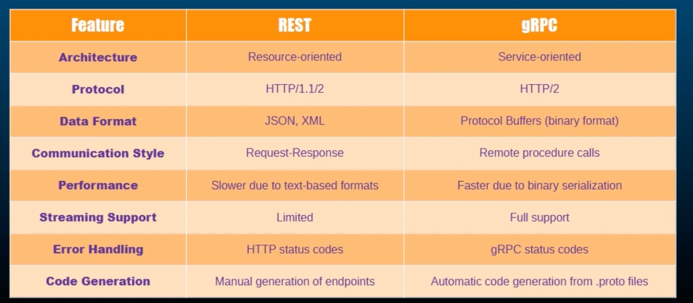

# Protocol Buffers (ProtoBuf)

- Protocol buffers produce a smaller binary representation of data compared to text based formats like JSON or XML. This leads to reduced network bandwidth usage while transfering data over the network compared to JSON or XML type data transfer and protobuf helps faster data processing.
- The serialization and deserialization process with Protocol Buffers are significantly faster than with traditional text formats.
- Protocol buffers are designed to work seamlessly across different programming languages and platforms.
- Serialization is the process of converting a data structure or object into a byte stream.

## How protocol buffers works?

- Define your data structure in a `.proto` file. This file describes the schema of the data you want to serialize.
- After creating the `.proto` file, you use a any type of Protoc compiler to generate source code in various programming languages.
- This generated source code includes classes or structures that can be used to serialize and deserialize your data.

## Basic structure of a .proto file

```
syntax = "proto3";
package example;

message Person {
	string name = 1;
	int32 id = 1;
	string email = 3;
}
```

- Basic available field types are: int32, int64, uint32, uint64, float, double, bool, string, byte
- We can have following field options:
	- repeated 
	- required
	- optional
```
message Person {
	repeated string phone_numbers = 1; // List of phone numbers
}
```
- We can have enumerations like below:
```
enum Gender {
	MALE = 0;
	FEMALE = 1;
	OTHER = 2;
}
```
- Nested messages:
```
message Address {
	string street = 1;
	string city = 2;
}

message Person {
	string name = 1;
	Address address = 2;
}
```

## Packages
	- Each .proto file will be created under a package
	- If any other packages it needs, it can import it
	- The generated source code will also have the same package name

```
person.proto file

syntax = "proto3"
package example
message Person { // THIS IS A MESAGE
	string name = 1; // THESE ARE FIELDS
	int32 id = 2;
}
---
main.proto file

syntax = "proto3"
package main
import "example/person.proto"
message Company {
	repeated example.Person employees = 1;
}
```

## protoc compiler
- Install the protoc compiler in mac by `brew install protobuf`
- Check the version `protoc --version`
- Now, apart from Protoc compiler, we will also need a plugin for the go language because proto compiler serves many languages and we need to apply a plugin specific to the language that we will be using with Protocol Buffers compiler.
- Install the below pugins/executables into local machine inorder to use grpc with golang
```
go install google.golang.org/protobuf/cmd/protoc-gen-go@latest
go install google.golang.org/grpc/cmd/protoc-gen-go-grpc@latest
```

## Complete proto file example
```
syntax = "proto3"
package person

message Greeting {
	string first_name = 1;
}

message GreetRequest {
	Greeting greeting = 1;
}

message GreetResponse {
	string result = 1;
}

service GreetService {
	rpc Greet(GreetRequest) returns (GreetResponse) {}
}

```

## RPC (Remote Procedure Call)
Its a protocol that enables a program to call a procedures/functions on a remote machines as of they are on the local server.

## gRPC
gRPC is one of the implementer of RPC which by default uses protobuf and HTTP2 for the communication. ALso, it is secure by default which uses SSL protocol by default.

gRPC supports four types of communication:
- Unary: Single request, single response.
- Server Streaming: Single request, multiple responses.
- Client Streaming: Multiple requests, single response.
- Bidirectional Streaming: Multiple requests and responses in both directions

Using the protoc compiler, gRPC automatically generates client and server code in multiple programming languages, ensuring consistency and reducing boilerplate. 

gRPC supports TLS for encrypted communication and provides mechanisms for authentication and authorization.

```
service GreetService {
	// Unary
	rpc Greet(GreetRequest) returns (GreetResponse) {}

	// Server Streaming
	rpc GreetManyTimes(GreetRequest) returns (stream GreetResponse) {}

	// Client Streaming
	rpc LongGreet(stream GreetRequest) returns (GreetResponse) {}

	// Bi directional streaming
	rpc GreetEveryone(stream GreetRequest) returns (stream GreetResponse) {}
}

```



# Creating a simple GRPC project

## Create a below 3 folders by initializing go module
- greet 
	- client
	- server
	- proto
- go.mod file (created by command `go mod init example`)
	- Add the below modules
		- google.golang.org/grpc
		- google.golang.org/protobuf

## Write a simple proto file under proto folder
- greet.proto

```
syntax = "proto3";

package greet;

option go_package = "example/proto";

message GreetRequest {
    string first_name = 1;
}

message GreetResponse {
    string result = 1;
}

service GreetService {
	// Unary`
    rpc Greet(GreetRequest) returns (GreetResponse) {}
}
```

## Run the below protoc command to create pb files from root folder

```
protoc -Igreet/proto --go_out=. --go_opt=module=example --go-grpc_out=. --go-grpc_opt=module=example greet/proto/*.proto
```

This will generates 2 more below files under proto folder
- greet.pb.go: contains structure for proto messages
- greet_grpc.pb.go: contains structure for proto services with client and server codes

## Create a server go files
Go to folder server and create a main.go file with below content

```
package main

import (
	"log"
	"net"

	"google.golang.org/grpc"
)

const ADDR = "0.0.0.0:50051"

func main() {
	list, err := net.Listen("tcp", ADDR)
	if err != nil {
		log.Fatalf("Failed to listen: %v\n", err)
	}

	defer list.Close()
	log.Printf("Listening at %s\n", ADDR)

	s := grpc.NewServer()
	if err := s.Serve(list); err != nil {
		log.Fatalf("Failed to serve: %v\n", err)
	}
}
```

Run `go mod tidy` which will download the google protoc and protobuf plugins to go.mod file

Build the above server code with command, which will generates the binary under the mentioned path:
- go build -o bin/greet/server ./greet/server

Run the server binary with the command from bin/greet folder
- ./server

O/P:
2025/05/13 14:23:07 Listening at 0.0.0.0:50051

## Create a client go files
Go to folder client and create a main.go file with below content:

```
package main

import (
	"log"

	"google.golang.org/grpc"
	"google.golang.org/grpc/credentials/insecure"
)

const ADDR = "localhost:50051"

func main() {
	conn, err := grpc.NewClient(ADDR, grpc.WithTransportCredentials(insecure.NewCredentials()))
	//  grpc.WithTransportCredentials(insecure.NewCredentials()): needed to tell grpc to not to use secured ssl protocol, otherwise client will not start

	if err != nil {
		log.Fatalf("Did not connect: %v", err)
	}

	defer conn.Close()
}

```

Build the above server code with command, which will generates the binary under the mentioned path:
- go build -o bin/greet/client ./greet/client

Run the server binary with the command from bin/greet folder
- ./client

## Running both client and server binaries
- Run the server under the path bin/server `./server`
- Run the server under the path bin/client `./client`
O/P:
Server:
2025/05/13 14:32:18 Listening at 0.0.0.0:50051

Client:
Run without any output

## Registering our own server and client instances to grpc
We will implement all the methods of this service in our own client and server instances

- main.go under server folder
	- Add a new type Server which has a reference to grpc service
	- Add register the new instance of this Server

```
package main

import (
	"log"
	"net"

	pb "example/greet/proto"

	"google.golang.org/grpc"
)

const ADDR = "0.0.0.0:50051"

type Server struct { ==> NEW
	pb.GreetServiceServer
}

func main() {
	list, err := net.Listen("tcp", ADDR)
	if err != nil {
		log.Fatalf("Failed to listen: %v\n", err)
	}

	defer list.Close()
	log.Printf("Listening at %s\n", ADDR)

	s := grpc.NewServer()
	pb.RegisterGreetServiceServer(s, &Server{}) ==> NEW

	if err := s.Serve(list); err != nil {
		log.Fatalf("Failed to serve: %v\n", err)
	}
}

```

- Create a new go file under server folder, which implements all the methods

file name greet.go

```
package main

import (
	"context"
	pb "example/greet/proto"
	"log"
)

func (s *Server) Greet(ctx context.Context, in *pb.GreetRequest) (*pb.GreetResponse, error) {
	log.Printf("Greet was invoked with %v\n", in)
	return &pb.GreetResponse{Result: "Hello " + in.FirstName}, nil
}

```

- Register our client to grpc in main.go file under client folder and call the rpc server endpoint

```
package main

import (
	"log"

	"google.golang.org/grpc"
	"google.golang.org/grpc/credentials/insecure"

	pb "example/greet/proto" // ==> NEW
)

const ADDR = "localhost:50051"

func main() {
	conn, err := grpc.NewClient(ADDR, grpc.WithTransportCredentials(insecure.NewCredentials()))

	if err != nil {
		log.Fatalf("Did not connect: %v", err)
	}

	c := pb.NewGreetServiceClient(conn) // ==> NEW
	doGreet(c)                          // ==> NEW

	defer conn.Close()
}

```

- Create a new go file under client folder, which implements all the methods

file greet.go

```
package main

import (
	"context"
	pb "example/greet/proto"
	"log"
)

func doGreet(c pb.GreetServiceClient) {
	log.Println("doGreet was invoked")
	r, err := c.Greet(context.Background(), &pb.GreetRequest{FirstName: "Clement"})

	if err != nil {
		log.Fatalf("Could not greet: %v\n", err)
	}

	log.Printf("Greeting: %s\n", r.Result)
}

```

## Run now both client and server after building
- Server Output
```
2025/05/13 15:01:17 Listening at 0.0.0.0:50051
2025/05/13 15:01:21 Greet was invoked with first_name:"Prasanna"
```

- Client Output
```
2025/05/13 15:01:21 Listening at localhost:50051
2025/05/13 15:01:21 doGreet was invoked
2025/05/13 15:01:21 Greeting: Hello Prasanna
```

## Server Streaming 

greet.proto
```
service GreetService {
    rpc Greet(GreetRequest) returns (GreetResponse) {}
    rpc GreetManyTimes(GreetRequest) returns (stream GreetResponse) {}
}
```

greet.go in server
```
func (s *Server) GreetManyTimes(in *pb.GreetRequest, stream grpc.ServerStreamingServer[pb.GreetResponse]) error {
	log.Printf("Greet many times invoked with %v", in)

	for i := range 10 {
		value := fmt.Sprintf("Hello %s, number %d", in.FirstName, i)

		stream.Send(&pb.GreetResponse{
			Result: value,
		})
	}
	return nil
}
```

greet.go in client
```
func doGreetManyTimes(c pb.GreetServiceClient) {
	log.Println("doGreetManyTimes invoked")

	request := &pb.GreetRequest{
		FirstName: "Prasanna",
	}

	stream, err := c.GreetManyTimes(context.Background(), request)
	if err != nil {
		log.Fatalf("Error: %v", err)
	}

	for {
		msg, err := stream.Recv()

		if err == io.EOF {
			break
		}

		if err != nil {
			log.Fatalf("Error from stream %v", err)
		}

		log.Println("Response: ", msg)
	}
}
```

main.go in client
```
func main() {
	conn, err := grpc.NewClient(ADDR, grpc.WithTransportCredentials(insecure.NewCredentials()))
	if err != nil {
		log.Fatalf("Error %v", err)
	}

	c := pb.NewGreetServiceClient(conn)
	//doGreet(c)
	doGreetManyTimes(c)

	defer conn.Close()

}
```

O/P
Server:
2025/05/13 16:23:15 Greet many times invoked with first_name:"Prasanna"

Client:
2025/05/13 16:23:15 doGreetManyTimes invoked
2025/05/13 16:23:15 Response:  Result:"Hello Prasanna, number 0"
2025/05/13 16:23:15 Response:  Result:"Hello Prasanna, number 1"
2025/05/13 16:23:15 Response:  Result:"Hello Prasanna, number 2"
2025/05/13 16:23:15 Response:  Result:"Hello Prasanna, number 3"
2025/05/13 16:23:15 Response:  Result:"Hello Prasanna, number 4"
2025/05/13 16:23:15 Response:  Result:"Hello Prasanna, number 5"
2025/05/13 16:23:15 Response:  Result:"Hello Prasanna, number 6"
2025/05/13 16:23:15 Response:  Result:"Hello Prasanna, number 7"
2025/05/13 16:23:15 Response:  Result:"Hello Prasanna, number 8"
2025/05/13 16:23:15 Response:  Result:"Hello Prasanna, number 9"

## Client streaming

greet.go in server
```
func (s *Server) LongGreet(stream grpc.ClientStreamingServer[pb.GreetRequest, pb.GreetResponse]) error {
	log.Printf("Long greet invoked with %v", stream)

	res := ""

	for {
		req, err := stream.Recv()
		if err == io.EOF {
			return stream.SendAndClose(&pb.GreetResponse{
				Result: res,
			})
		}

		if err != nil {
			log.Fatalf("Error while reading client stream %v", err)
		}

		res += fmt.Sprintf("Hello %s!\n", req.FirstName)
	}

}
```

greet.go in client
```
func doLongGreet(c pb.GreetServiceClient) {
	log.Println("LongGreet invoked")

	reqs := []pb.GreetRequest{
		{FirstName: "Prasanna"},
		{FirstName: "Adiga"},
	}

	stream, err := c.LongGreet(context.Background())
	if err != nil {
		log.Fatalf("Error while calling LongGreet %v", err)
	}

	for _, req := range reqs {
		fmt.Printf("Sending request: %v\n", req)
		stream.Send(&req)
		time.Sleep(time.Second)
	}

	resp, err := stream.CloseAndRecv()
	if err != nil {
		log.Fatalf("Error while receiving response from LongGreet %v", err)
	}

	log.Println("Received: ", resp.Result)
}
```

## Bidirectional streaming

greet.go in server

```
func (s *Server) GreetEveryone(stream grpc.BidiStreamingServer[pb.GreetRequest, pb.GreetResponse]) error {
	log.Println("GreetEveryone was invoked")

	for {
		req, err := stream.Recv()

		if err == io.EOF {
			return nil
		}

		if err != nil {
			log.Fatalf("Error while reading client stream: %v\n", err)
		}

		res := "Hello " + req.FirstName + "!"

		err = stream.Send(&pb.GreetResponse{
			Result: res,
		})

		if err != nil {
			log.Fatalf("Error while sending data to client: %v\n", err)
		}
	}
}
```

greet.go client
```
func doGreetEveryone(c pb.GreetServiceClient) {
	log.Println("doGreetEveryone was invoked")

	stream, err := c.GreetEveryone(context.Background())

	if err != nil {
		log.Fatalf("Error while creating stream: %v\n", err)
	}

	requests := []*pb.GreetRequest{
		{FirstName: "Clement"},
		{FirstName: "Marie"},
		{FirstName: "Test"},
	}

	waitc := make(chan struct{})
	go func() {
		for _, req := range requests {
			log.Printf("Sending message: %v\n", req)
			stream.Send(req)
			time.Sleep(1 * time.Second)
		}
		stream.CloseSend()
	}()

	go func() {
		for {
			res, err := stream.Recv()
			if err == io.EOF {
				break
			}
			if err != nil {
				log.Printf("Error while receiving: %v\n", err)
				break
			}
			log.Printf("Received: %v\n", res.Result)
		}
		close(waitc)
	}()

	<-waitc
}
```
