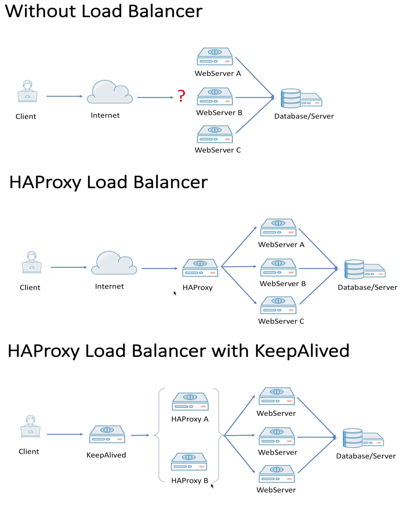

# HAProxy LoadBalancer

Without a LoadBalancer, lets say if customer has deployed 3 instances of their application and when user requests for their application, which of these instances should server this request? 

One option is to make WebServerA as a Master one and other webservers as StandBy servers. But in this scenario, all the request goes to WebserverA and of this webserver goes down, then we need to handle the fail over process to make another webserver as Master. There are tools available for this like **keepalived** or **pacemaker**, which ensure service availability by routing network traffic to a backup server if the primary server fails.

So in this master-standby architecture we can not hanlde situations like high incoming user traffic(if traffic increases scale out webserver instances) or filtering specific user traffic etc

That's why we need something in the front that will control/filter all the connections, before we send the traffic to application layer. For this we can use HaProxy Loadbalancer. We can also scale out this Haproxy to handle additional traffic, by using Keepalived so that if master HaProxy goes down, it will make the standby one as master to server the traffic, which will ensure high availibility.

Haproxy is a ReverseProxy. Its not a forward proxy or a webserver or a firewall.



## Why HAProxy


## Benifits of Haproxy
- Reduce downtime
- Scalable
- Redundancy
- Flexibility
- Efficiency

## Haproxy Architecture and Components


## Haproxy Configuration

Haproxy configuration file will have four essential sections:
- Global: Global settings which contans configurations on log, performance, SSL security, user and group etc
- Default: Defaults settings for frontend and backend like default mode(http or tcp, https), client and server timeout, error messages. We can have more than one default section.
- Frontend: single or multiple frontends that can accepts request from client
- Backend: list of servers that fulfills the request

The configuration file is located in `/etc/haproxy/haproxy.conf` path in ubuntu.


## Install HAProxy in MAC M1 and Test

1. Install homebrew
2. Install haproxy through homebrew '`brew install haproxy`
3. It installs the haproxy under the directory `/opt/homebrew/opt/haproxy`

### Configure and Test HAProxy
1. create a new file `haproxy.cfg` file under the path `/opt/homebrew/etc`
2. Add the below content into the above haproxy.cfg file
```
defaults
    mode http
    timeout client 10s
    timeout connect 5s
    timeout server 10s
    timeout http-request 10s
frontend my_frontend
    bind 127.0.0.1:80
    default_backend my_backend
backend my_backend
    balance roundrobin
    server server1 127.0.0.1:8001
    server server2 127.0.0.1:8002
```
3. Create 2 different index.html file under the folder Desktop and Document. 

Open 2 separate terminal window and run  below 2 simple servers through python 
```
python3 -m http.server 8001 --bind 127.0.0.1 -d ~/Desktop
```
```
python3 -m http.server 8002 --bind 127.0.0.1 -d ~/Documents
```
4. Run haproxy through command `sudo haproxy -f haproxy.cfg`

5. Open a browser and type localhost:80 and hit enter multiple times. The output will be shown from both server1 and server2 in a round robin fashion. Link: https://ahmedyusuf.medium.com/installing-haproxy-on-osx-mojave-e49b048d063c

## Haproxy Installation in Linux/Ubuntu

Refer the github repo: https://github.com/PrasannaAdiga/my-first-haproxy

Follow the below steps:
- Install vagrant and virtual box
- Create a Vagrantfile 
    - Create a new file `Vagrantfile` and define 3 VMs in this Vagrantfile
    - 2 VMs are created based from Ubuntu, define its hostname and provaide a private IP and here we install apache server which are used as a backend member of LoadBalancer
    - 1 VM is created based from Centos, define its hostname and provaide a private IP and where here we install haproxy server where we can configure the haproxy and connect them to the above created backend member
- Create a apache.sh script where we download and install the apache server through `sudo apt-get install apache -y`
- Create a haproxy.sh script where we download and instal the haproxy server through `yum -y install haproxy`
- Finally we can ssh to each of these VM through vagrant like `vagrant ssh web1`, `vagrant ssh web2`, `vagrant ssh haproxy`
- Login to `haproxy` VM and check whether haproxy server is up and running through the command `systemctl status haproxy`. Also verify its configuration file in `/etc/haproxy/haproxy.cfg`. If its not started, start it by command `systemctl restart haproxy`. Later, if we change any of the config in haproxy.cfg file, then use the command `systemctl reload haproxy` so that existing connection in the haproxy will not be dropped.
- Also login to `web1` and `web2` Vm and check whether apache server is up and running through the command `systemctl status apache2`. Create 2 different index.html file for these 2 server with different content. This index.html file located in `/var/www/html`

## Enabling Haproxy logging

We can see the haproxy log in the path `/var/log/haproxy.log` after configuring the below:


## To test haproxy **TCP** mode
- One way is to just change mode value to tcp in both frontend and backend section and then send the http traffic to frontend.
- Another way is to have the frontend and backend section like below
```
frontend frontend_1
    mode tcp
    bind 10.20.30.0:2222
    default_backend backend_1

backend backend_1
    mode tcp
    balance roundrobin
    servcer server1 192.168.10.0:22 check
    servcer server1 192.168.10.1:22 check
```
- Now login to both the server and add a new below user
```
    sudo adduser -home /home/haproxy haproxy
```
- This will ask for a password and provide some default password
- Now try to connect haproxy over a ssh protocol like below
```
    ssh -p 2222 haproxy@10.20.30.0
```
- Now this will forward the ssh request one of the backend member and it will ask for the user `haproxy` password
- Now enter the user `haproxy` password which will allow us to login to that server through haproxy

## Layer 4 and Layer 7 load balancing

