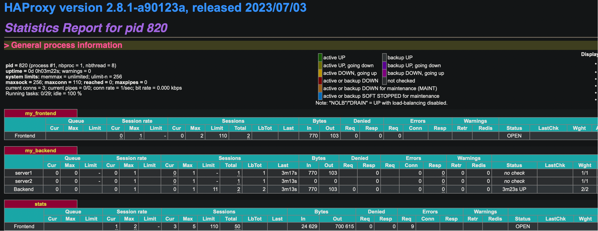

## Haproxy configuration details

### frontend <unique_ame_for_the_frontend>
```
frontend frontend_1
    mode http (or tcp or https) (use tcp mode if we want to simply forward the traffic to backend) (use http mode if we want to inspect http header, url path or query parameter ot to modify header etc)
    bind 196.128.3.50:80
    bind 196.128.3.50:443
    bind *:8080
    use_backend backend_1 { PATH_BEG /API/ }
    default_backend backend_2
```
- bind 10.0.2.4:80: Binds a specific frontend listener IP and Port for which user can send request. There can be single or multiple bind options with various ports.
- use_backend backend1 { PATH_BEG /API/ }: This is used along with ACL so that if the condition is met, the configured backend will be called 
- default_backend backend2: Default backend for which request will be forwarded

### backend <unique_ame_for_the_backend>
```
backend backend_1
    balance roundrobin
    cookie SRV insert indirect nocache
    default_server check maxconn 20
    server server1 10.20.10.0:80 cookei name1
    server server2 10.20.10.1:80 cookei name2
    server server3 10.20.10.2:80 cookei name3
```
- balance roundrobin: defines the Loadbalancer algorithm
- cookie SRV insert indirect nocache: Adds a cookie with name SRV. So when haproxy sends response back to client it will add a cookie in the reponse header. When the same client makes another new request, it adds the same cookie and send it to haproxy. Now haproxy based on this received cookie it will send the request to the same backend to which it sends the previous request of the same client. Also, it will not forward the cookie to backend member. This way it will forward all the request of the same client to same server in order to persist user session info. Finally we need to add `cookie <unique_name>` infront of each server. So haproxy will send a cookie with name `SRV` and value as for example `name1` which is the cookie name defined for server1.
- default-server check maxconn 20: the default configuration which will be applied to all the servers which are defined below. So here MAXCONN 20 config will be applied to all servers. Instead of defining this under each server, we can define it here one time. Also `check` means have a continuous health check for the defined servers
- server <server_name> <server_ip>:<application_port>: We can have single ot multiple server definitions here

## Haproxy Algorithms/Mechanism
- RoundRobin
    - Each server is used in turns
    - Smoothest and fairest algo
    - Dynamic round robin: server weights may be adjusted on the fly for slow starts(some server takes time to receives the traffic/warm up stage)
    - Limited by design to total of 4095 active servers per backend
- Static-RoundRobin
    - Each server is used in turns, according to their weights
    - Similar to round robin
    - Static: Changing a server's weight on the fly will have no effect
    - No limit
    - Server always immediately reintroduced into the farm/pool
    - Example
    ```
    baceknd backend_1
        default-server check
        server web1 192.168.1.25:80 weight 10
        server web2 192.168.1.26:8080 weight 10
        server web3 192.168.1.27:8081 weight 20 (web3 server gets 2 times higher traffic than other 2 servers since its weight is 20. Because may be this server is much more powerfull than the others)
    ```
- LeastConnection
    - The server with the lowest number of connections receives the request
    - ROund robin is performed within groups of servers of the same load
    - Dynamic
- Source(IP/Session based mechanism in TCP mode)
    - The source IP address is hashed and divided by the total weight of the running servers to designate which server will receive the request
    - Same client Ip address will always reach the same server as long as no server goes down or up
    - Used in TCP mode
    - Dynamic
- URI
    

    - This algorithm hashes either the left part of the URI(before the question mark) which means the path section or the whole URI and devides the hash value by the total weight of the running servers
    - HTTP mode
    - Static
    - Example
        ```
        Backend BK_URI
            balance URI (takes the path part)
            hash-type consistent
        Backend BK_URI
            balance URI WHOLE (Takes the whole URI)
            hash-type consistent    
        ```
- URL_PARAM
    - The URL Parameter specified means this will works with the query part of the URI
    - Static
    - If no query parameters exists in the URI, then round robin will be used
    - Example
        - url_param is - /image.php?width=512&id=12&length=256
        ```
        backend bk_url_param
            balancer URL_PARAM ID (This applies for the id query param value. id with value 12 always ends up in one server, id with value 10 ends up in another server etc)
            hash-type consistent    
        backend bk_host
            balancer hdr(host)

        ```
- HDR(<NAME>): 
    - The HTTP header <NAME> will be looked. Same header name will be forwared to same server always
    - Example:
        ```
        backend bk_host
            balance HDR(HOST) (Header with name host)
        ```
     - User can also set customer header on the fly and use it for the routing decision. They can even modify the http header.
     - Example
        ```
        http-request set-header x-lb %[req.hdr(host), lower]%[request.url,lower]
            balancer HDR(x-lb)
            hash-type consistent 
        ```   
- Random
    - A random number will be used as the key for the consistent hashing function.


## Haproxy stats page
A haproxy stats provides a near real time feed of data about the state of your proxy. Data like how many bytes in or out, how many backend servers are up and running etc

The configuratioin can be like below in the haproxy.cfg file
```
frontend stats
    bind *:8000
    stats enable
    stats uri /monitoring
    stats refresh 10s
    stats auth admin:admin
```
- Reload the haproxy config through `systemctl reload haproxy`
- Open the browser and hit `localhost:8000/monitoring`, this will open a popup where enter the username and password as admin
- Now the stats page will open



