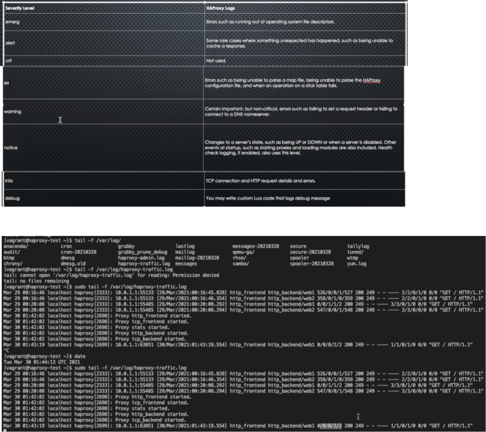
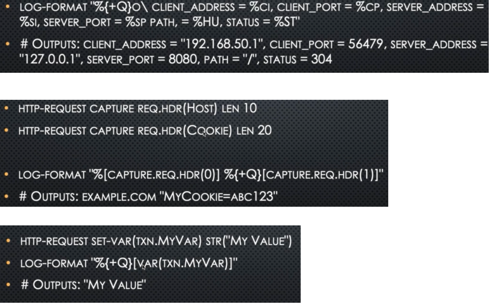

## Haproxy logging

We need to enabled the logging in Haproxy explicitly and then we can send these logs to syslog or any other logging tool like Splunk, ELK etc

- In Linux the rsyslog.conf file which is a centralized log in linux, under the path `/etc` has below configuration
```
$IncludeConfig /etc/rsyslog.d/*.conf
```
- Now we can create a configuration file for the haproxy log like `haproxy_log.cfg` under the above path `/etc/rsyslog.d`
```
# Collect log with UDP
$ModLoad imudp
$UDPServerAddress 127.0.0.1
$UDPServerRun 514

# Creating separate log files based on severity
local0.* /var/log/haproxy-traffic.log (Logs of any severity levels)
local0.notice /var/log/haproxy-admin.log (Logs of notice level)
```

- Next, we need to have the below line in the haproxy.cfg file under the global section
```
log 127.0.0.1:514 local0 (This will redirect the logs to rsyslog which internally will redirect the logs to configured path)
```



### Advanced Logging
- We can fine tune to specific set of logs like below
```
frontend front_end1
    log 127.0.0.1:514 local0 notice (All the logs which are above of notice serverity including notice will be logged)

frontend front_end2
    log 127.0.0.1:514 local0 warning (All the logs which are above of warning serverity including warning will be logged)    
```
- We can discard some logs
```
frontend website
    http-request set-log-level silent unless { rand(100) lt 5 } # send logs only if the random number generated is less than 5
```
- Capturing fields
```
frontend website
    bind *:80
    http-request capture req.hdr(host) len 10 #take only first 10 character of host in the http request header and logs it
    http-request capture req.hdr(user-agent) len 100 #take only first 100 character of user-agent in the http request header and logs it
    default_backend servers
```
- Defining variables
```
    ACL is_api path_beg /API # is_api - access list name, path_beg - If path inside the request begins with /API, 
    http-request set-var(req.is_api) str("NOT API") # sets a variable with name is_api and value 'NOT API'
    http-request set-var(req.is_api) str("IS_ API") if is_api # if access list is_api defined above passes, which means the requested path begins with /API, then set a variable is_api with value as 'IS API'
    http-request capture var(req.is_api) len 10 # logs the above defined variable value as either NOT API or IS API with lenghth not more than 10
```

- Custom logs

