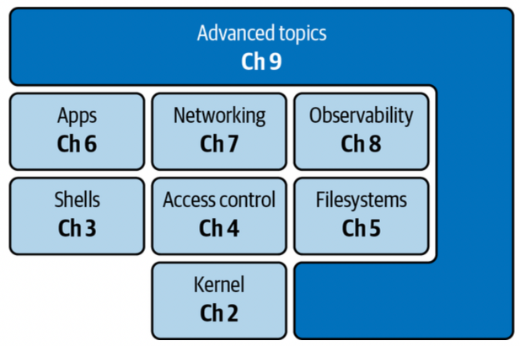

# Linux

Linux is the most widely used operating system, used in everything from mobile devices to the cloud.

### A Ten-Thousand-Foot View of Linux

- At its core, any Linux distro has the kernel, providing the API that everything else builds on
- The three core topics of files, networking, and observability follow you everywhere, and you can consider them the most basic building blocks above the kernel.
- From a pure usage perspective, you will soon learn that you will most often be dealing with the shell (Where is the output file for this app?) and things related to access control (Why does this app crash? Ah, the directory is read-only, doh!).

