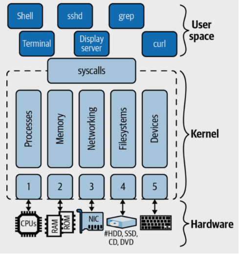

# Kernel

The main function of an operating system is to abstract over different hardware and provide us with an API. Programming against this API allows us to write applications without having to worry about where and how they are executed. In a nutshell, the kernel provides such an API to programs. While the kernel provides all the core functionality, on its own it is not the operating system but only a very central part of it.

There are three distinct layers you can group things into:

- Hardware

From CPUs and main memory to disk drives, network interfaces, and peripheral devices such as keyboards and monitors.

- The kernel

The focus of the rest of this chapter. Note that there are a number of components that sit between the kernel and user land, such as the init system and system services (networking, etc.), but that are, strictly speaking, not part of the kernel.

- User land(space)

Where the majority of apps are running, including operating system components such as shells (discussed in Chapter 3), utilities like ps or ssh, and graphical user interfaces such as X Window System–based desktops.

**Interfaces**
- Between the kernel and user land is the interface called system calls (syscalls for short).
- The interface between the hardware and the kernel  consists of a collection of individual interfaces, usually grouped by hardware:
    - The CPU interface
    - The interface with the main memory
    - Network interfaces and drivers (wired and wireless)
    - Filesystem and block devices driver interfaces
    - Character devices, hardware interrupts, and device drivers, for input devices like keyboards, terminals, and other I/O 

## Kernal

The main functional blocks you find in the kernel code base are as follows:

- Process management, such as starting a process based on an executable file
- Memory management, such as allocating memory for a process or map a file into memory
- Networking, like managing network interfaces or providing the network stack
- Filesystems providing file management and supporting the creation and deletion of files
- Management of character devices and device drivers

