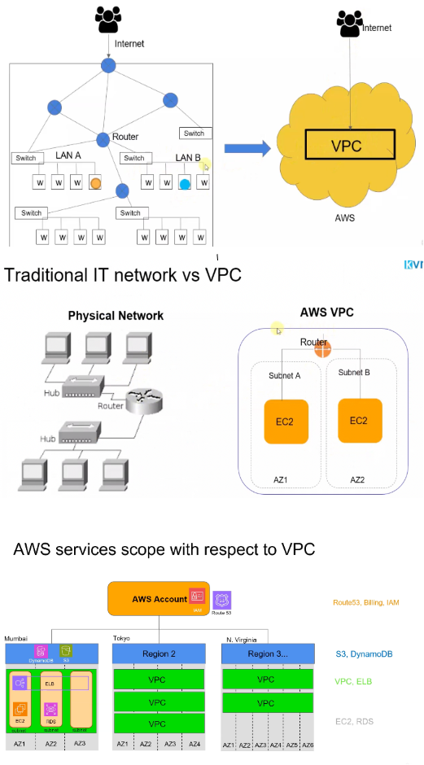

# Networking in AWS Overview

## How Things works in Physical World

- In any datacenter, there will be a lot of servers and the servers will be typically connected to
each other using Ethernet over the LAN. So this represent a couple of machines connected to each other using Internet cables which we call as LAN.
- Similarly, there will be multiple such LANs in your company network or in your datacenter networks, and
then there are different machines all the way talking to each other.
- Now what happens when I say one machine wants to talk to another machine within the same LAN connections? So as we know these machiens are connected to each other over a physical layer, we address these machines with something called Mac addresses and for that we need packet switching mechanism which switches provides. So there will be a switch device which actually works at layer 2 of OSA model i.e datalink layer.
- It understands the Mac addresses of these machines and then it can forward the traffic from one machine
to the other machine in the same line. 
- What happens when suppose a machine from one lan wants to talk to the machine in another lan? Now, in this case, we are actually crossing the network boundary. We are going out of the switch and going to some other LAN in this case, which won't really help. We need a somewhat intelligent which I can call and we call it a router.
- So what router does is it works at a third layer of OSA model that is IP layer. That means if your machines have the IP addresses, router learns, that a particular IP address belongs to a particular network and it can forward the packet that it receives to the corresponding network. That means traffic will goes through multiple routers and switches. We can configure a router as internal one or the public facing one.

## How Things works in Virtual World
- So if you want to have the same kind of network created in, say,AWS Cloud, we will have something called VPC that is virtual private cloud. And in a similar way it can interact with the Internet and you can actually create smaller networks inside these VPC. 
- You can configure routers, you can configure the routes and everything. Typically what you can do in physical work can be done inside of VPC.

## Accounts, Users, Region and Services
- Before using AWS cloud, we must have an AWS account. Account is in top level entity in AWS, which means once you have an established account, you get access to all the various regions so you can just select in which region you want to create. So Account is the top level and the second level is region.
- Now every region can have one or more VPCs. Why would you have multiple VPCs? Of course, because you want to segregate the network for different customers. You don't want machines, which belongs to different customer talk to each other. You want an isolated network. VPC are at the third level.
- Now there are some AWS services which works at the top level. That means at global level they are not bound to any region like Route 53 DNS service.
- Similarly, some services works at regional level like CDN or S3. Some services works at VPC level like Load Balancer. Some service works at Availabilty zone level like EC2 instance or RDS. 
- So everything is part of your AWS account. So once you get your AWS account you can deploy your workload in any of the available AWS regions. And as you know, every region has multiple AZS. Now some region can have like three AZS, some region can have 4 or 6. That really depends on the size of the region.
- Now, as I said, when you create a VPC, you create that in a particular region. So in different region there will be different VPC. Now you can create as many VPCs that you want in a given region.
- So if you talk about the Mumbai region, you can see here that there is a VPC and it is spanning across multiple availability zones. Now if you heard about the AWS service called EC2, which is a virtual machine, then EC2 sits into a particular AZ. That means one EC2 machine cannot be in two AZS at the same time.
- How do you make that decision in which AZ, the EC2 will be launched? Now that is decided using the subnets. So after you create the VPC. You can create multiple subnets inside the VPC, and while creating this subnet you decide in which AZ this subnet will be right. So here if you want to create EC2 instances in three different AZS, then you will need at least three subnets.
- So some of the AWS services will have the regional scope like S3, DynamoDB, which means they are not inside your VPC. If you talk about the AWS services like route 53, which is a DNS service, it has a global scope. It doesn't sit into a particular AWS region they operate at globally. Similarly other services, for example IAM, which is identity and access management. Through which you create multiple users into your AWS account. It also has the global scope, which means IAM users can access any resources across any AWS region.
- So AWS account is a top level entity. And then under that you get access to multiple AWS regions. And then in every region you can create one or more VPCs. And then in order to use multiple availability zone within the region, you have to create subnets inside that VPC.
- EC2, RDS are at subnet level. VPC, ALB are at VPC level. S3, DynamoDB at regional level. Route53, Billing, IAM are at globla level

## Overview of AWS Network Components
Lets say, we want to provision a network inside AWS. Then we need to follow below steps:
- The first thing that you will do is, choose a **Region** in AWS like Mumbai or any other region. Every region always comes with 2 or more **Availability Zone**.
- Now in order to put your own private network, what you do is you create a **VPC**, which is **Virtual Private Cloud**. It's a one big address space that you get, and it's a private address range. That means no one can get into your VPC unless you open that traffic to the internet. 
- In order to connect your VPC to the internet, install **Internet Gateway(IG)** at VPC level. Now, without internet gateway, you can't really directly reach to your machines because, VPC is a private network
- Now create **Subnets** which is the independent address ranges within the VPC. 
   - Now subnet will provide you the different networking controls whether you want to keep your machines in a public subnet, which means that the machines in public subnet can communicate with the internet directly. And from internet also, you can reach to those machines inside the public subnet. 
   - However, if you have say a databases, you would like to put that in a private subnet, because you can't reach to the machines in the private subnet directly from the internet.
- Now we can install **EC2 instances** within these subnet where we can deploy our applications.
- We can use one availability zone, but AWS recommends that for high availability, you should use at least two availability zone. If you want to really have your application architecture to be highly available, you should have at least two AZs, and then you should also launch your web servers and application server across these two AZs.
- Install **Load Balancer** if our applications which are deployed inside private subnets are needs to be reached from internet. 
- Lets say you want to deploy a 3 tire architecture in AWS then have a Public Load Balancer which will route the traffic to Wep Applications which are deployed in a public subnet, then have a Private Load Balancer which will route the traffic between Web Application to the Application Servers which are running in the private subnets and then finally have a database instances in a private subnet where one instance will act as primary and other one will be the secondary which is the replica of the primary for the high availabilty.
- Use **NAT Gateway**, if any of the servers would like to reach to internet to download some security patches etc, but the same servers should only be reachable through Load Balancer. What it does is, all the outbound traffic from your instances in a private subnet, it will be routed through the NAT gateway. NAT Gateway itself is in a public subnet, which will then route its traffic from internet gateway to the internet.
- If customer wants to access your VPC from their own VPC privately, without routing the traffic over the internet, then use **VPC Peering**, which is like connecting two VPC one-to-one. The good thing about VPC peering is that you can even connect the VPCs across multiple AWS regions. 
- But the problem with VPC Peering is, every VPC has to be connected one-to-one to any other VPCs because VPC peering connections are non transitive. For this, have a **Transit Gateway** which allows you to connect
different networks together, including the VPC, as well as your on-premise network, without a need for one to one connection. Tansit Gateway will have central connection to manage all these components.
- So you can connect your on-premise network to transit gateway using a **VPN connection** or a **Direct Connect** connection. And then if you connect this transit gateway to your VPC, you get a complete mesh kind of connectivity. Any VPC can communicate to any VPC as well as with the on-premise network. So in short, transit gateway greatly simplifies your network complexities.
- So in short, transit gateway greatly simplifies your network complexities. If you see that number of VPCs in your account is growing and you need to have the hybrid kind of connectivity, I would rather recommend to go with the transit gateway than going through the VPC peering connection or individual VPN connections.
- Imagine that you have an web application in a subnet, which also needs to upload or download some data from the S3 bucket. S3 is a managed service from AWS And when you create an S3 bucket, you create them inside a specific region. Now, if your application VPC is in the same region as S3, what AWS says is that you don't need to go over the internet to access the S3, because you can get something like **VPC Endpoint of type Gateway**.
- Now, without this VPC endpoint, all the traffic from your application server will actually go through the internet gateway to the S3 because S3 is a public service and same with the DynamoDB. But the problem is traffic is going to internet, there is additional cost for that, and as well as the latency problems would be there. But VPC endpoint allows you to access the S3 and DynamoDB service privately from your VPC. Now the condition is, the S3 and DynamoDB should be in the same region as your VPC.
- If we want to communicate from your application which is in a subnet to other AWS service like SQS Queue, SNS, Lambda functions, or an API call to EC2 instance without going throuh internet then use **VPC Endpoint of type Interface**. The problem these VPC Endpoints solves is that there is a consistent bandwidth you get, and all the traffic remains on the AWS network.
- Lets say you have a customer and customer has one service. And what customer says is that he wants to allow
only you to access his service. So for example, there is some web based application customer has.And then now what customer can also do that expose these services over the internet, and then you can access from your VPC, these services over the internet. But you don't want to expose your services to the internet
but provide a private connectivity from your VPC to this customer service. Now for this, AWS has launched a networking service called a **PrivateLink**.
- Now, what PrivateLink means is that let customer expose their application services via the load balancer
and in a service consumer VPC, you create a VPC endpoint, and this endpoint will privately connect you
to the network load balancer of the service provider VPC. And now this connection from your VPC endpoint
to the network load balancer is private, through the Private Link. And this is how you can now provide your services privately to as many customers you want.
- Now, you would also think that maybe I don't want to do this, but rather I want to just connect my VPC to my customer's VPC like we did before in case of peering connection or in a transit gateway, but the problem is, as soon as you do this connectivity, you can now reach from any machine to any machine, right? And you don't want to do that. Maybe you just want to provide one service from your AWS VPC to other customers, and that's where the PrivateLink will help you do that.
- If you want to use a DNS instead of IP address, AWS also provide the **Route 53** as a service. So if end user is accessing your web server, using the domain name, end user will put the domain name in the browser, say example.com. And if you have a Route 53 hosted zone for example.com, the query will go to the Route 53 and it will respond with the IP address of your web server. Now, in this case, the IP address will be of the load balancer and dynamically you will get one IP address for this load balancer. So user gets the IP address and then user can reach to your load balancer over to the internet.
- Now for better performance, you can also use **AWS CloudFront** service, which is a CDN, Content Delivery Network. What CloudFront does is two things, it can cache your static content if there are a lot of images in your web server, then it will cache to the nearest edge locations for the user. And second, it also connects you to the AWS VPC over the dedicated network that AWS has, which means this CloudFront locations are already connected to AWS regions, with the private connectivity of AWS, so your end user latency will be reduced if you leverage CloudFront here. So the request will go to the CloudFront and then CloudFront will connect to the load balancer, and then to the applications like that.
- And now on the troubleshooting side or audit side, if you want to see all the packets flowing in and out of your VPC, you want to capture those packets, then you can enable the **VPC flow logs**, and these flow logs can be then dumped to the CloudWatch or S3 for later analysis.
- In real world, if there is an enterprise, they want to often operate in a hybrid mode. Now, when I say hybrid mode, that means some of the workload might be running in Cloud and some of the workload might be running in on-premise network. Now, how do you connect your VPC to the on-premise data center, for this kind of connectivity? Now for that, AWS provides you a couple of options.
- Very simple option is using the **Site-to-Site VPN connection**. Now for that, on VPC site, you need something called Virtual Private Gateway, you attach it to your VPC, and then using this virtual private gateway, you can establish IPsec VPN to the on-premise router. Now this is a good option, but understand that all this traffic goes over to the internet, and you don't always want that for the reason that the traffic is not consistent. So this is called a Site-to-Site VPN, that means you are connecting two networks, and in this case, then any machine inside your corporate data center can talk to any machine in a VPC over its private IP address. The traffic is not going really over to the internet gateway.
- And now if you know, in a COVID world typically you are working from home, and you want to get access to your company's private machines or servers, you would have to first connect to the company VPN, and then you get access to those machine. Now, this is called **client-to-site VPN**, that means client can be a part of this VPC and can access any machine privately inside this VPC.
- If you are connecting corporate data center to VPC over an internet, you can't guarantee the stability of that connection because there could be multiple hops as you reach to them, from data center to AWS network. And that's where some customers need a dedicated connection. And in that case, AWS provides a **Direct Connect** service, which actually is a physical connection from AWS VPC to your corporate data center.

## Detailed overview of AWS Network Components

Let's assume that we have some application which has a application server or a web server. And it has a database. And we want to deploy this application in AWS. And of course you will have users who will be accessing this application over the internet. So that's the scenario. Now we want to see how we build the AWS networking architecture to support this application deployment.

So everything starts with the user and user have access to the internet. And of course user wants to connect to some web application out there on the internet. And you have built your application and now you want to deploy that in AWS.

- So first thing that you will do is choose which AWS region you want to use. Typically the region is a geographic area which AWS has, and there are 32 regions at the moment and this number will grow. Now how do you choose region? So it will be typically based on where your users are located. So if you are developing an app for which the users are in the US primarily, you will choose any of the US region.
- Let's say you have chosen some region in India or US. And every region comes with multiple availability zone.And this is designed for high availability. So AZS or availability zones are the data centers. And at any moment if there is a failure in one data center, you should be able to continue operating from another data center. That's where the concept of AZ has been implemented.
- And now if you want to deploy an application, you need a private network space. Now that private network space is called VPC Virtual Private Cloud. This is very similar to your on premises network where it's a close network. And then you have your all intranet networking inside that. So nobody from outside can get access to any machine inside your network. Exactly the same concept here. VPC is a private network for you so that you can deploy your application.
- Now, when you create a VPC, there is always a local router. Now this router does the routing between the VPC resources. So if you launch now some machines within the VPC, then this local router will route traffic between them.
- But there should be something which tells router how to route the traffic. Now this is done using the VPC main route table. So main route table has a route entry which says if the destination IP address is within the VPC CIDR range, then take this particular local route to route the traffic within the VPC accross any available AZs.
- VPC address space is a big address space, but then you should divide that in the form of subnets. And subnet has 1 to 1 mapping with the availability zone. That means one subnet can be in only one availability zone at any moment.However one AZ can have multiple subnets.

### Internet Gateway

- Now this VPC is currently completely isolated. That means it cannot communicate with the internet. So you should have a component called Internet Gateway which attaches your VPC to the internet. However, this traffic doesn't flow by default. Of course, you need to modify the main route table and you have to say if the traffic is going to the internet, that is 0.0.0.0/0. Then it should be routed through this internet gateway.
- Now you have your application bundled in a machine, so you will launch a machine called EC2. That's a basic compute service from AWS and you will install your application. Or you will create a local database in that.And then this machine will have a public IP. And users from outside can then connect to this machine using this public IP.
- Now you must be wondering is it always like users will have to use IP address, which doesn't seems right because most of the time you access application using some name, for example Amazon.com or google.com. So for that you need a DNS service. Now you can use either your own DNS or third party DNS service, or AWS has its own DNS service called route 53.

### route53

- Now this Route53 you configure the hosted zones and you create a record. Say my application name is example.com and the IP of that is 11.22.33.44. So you create that record in your route 53 hosted zone. And now if user in their browser hits example.com it will return that IP address. And then user browser will then connect to this machine. So this is how a DNS resolution happens okay.
- Now you must be wondering if there is just this main route table. Then how can I have different kind of routing logic for different subnets? Because you know that in a big application you will have databases, you will have application server, web server and all these servers have different routing requirement. For example, your databases should not be accessible from the internet. They should only be accessible from within your VPC. That is your application server. Now if you put this main route table for all the subnets, then your machines will be exposed to the internet. So rather best practice is rather than having this main route table, you can create custom route table for your subnets.
- Now you are currently in development. But now you want to deploy your application in production. And you think that your application need scaling. And typically it will be horizontal scaling. That means instead of one machine you want to deploy your application on two machines so that if there are more users, there is no outage with respect to the compute that require for this instance here.
- And for that you will launch another machine in another subnet and it will have another public IP. Now the problem is in simple world this Route53 DNS will always provide you one IP address. But now you have another new IP address. So either you do something with the DNS so that some users get this IP and some users get this IP,which is called client side load balancing.
- But ideal way to handle this situation is to do server side load balancing. What I mean, instead of exposing this machines directly, you put a load balancer in front of them and then load balancer distributes traffic to these machines.
- So let's try to modify this architecture accordingly. So here now we are saying that we will have two more subnets because now this machine need not be exposed to the internet. And then all these machines are in a private subnet. That means nobody can access this machine from outside. Neither this machine can access internet.And this means that this subnet has different routing requirement. So I should not associate this route table here with this subnets. But rather we should create another route table which has just this local route entry. So in this route table there is no entry for sending or receiving traffic from the internet. So you associate this route table with these two private subnets.

### Application Load Balancer

- Now once you do that you launch an application load balancer which is again a service from AWS. And this application load balancer sits in the public subnet because it is exposed to the internet directly. And now in this case we will just modify this route table entry and say if someone asks for IP address of example.com now, instead of those public IPS of EC2, you will provide the public IPS of the application load balancer. So DNS service will respond with application load balancer IPS.
And now user can connect to ALB. And depending on the algorithm typically round robin one Alb will distribute traffic to one of the instance. So this is how now you can have multiple application server behind the Alb.
- Now how about isolating your database from your application logic which is always a good practice because
then you can have more control over those machines. So now instead of putting everything in the application server, let's take out the database. And as you might have guessed, database should be in a private subnet because they need not be accessed from the outside. So we'll create two more private subnets. Again we can attach the same route table with these subnets because routing requirements are the same.
- And at this point you must be asking why don't you just create the databases in the same subnet as application server? Now technically we can, but it's always good to have the subnet with a specific purpose because you are launching the databases. They have kind of, you know, security requirement. So you can isolate your networking in that sense. So it's always good that you create different subnets for your databases. And now you create a database, say my SQL database with a primary instance in one of the subnet and all your application server access that database okay.

### Resiliency

- Now with respect to the resiliency of this architecture, is it good enough. Now when I say resiliency I mean the resiliency at the availability zone level. What if one of the data centers of AWS goes down out of power, right. Or there are floods, right. So one of the AC will be gone. For example. So is your application still accessible?
- So imagine there is an outage for this single AZ. And in this case your application load balancer is still accessible. Your application is still accessible but your database is gone because it was launched in this single AZ which is down. So it's not as of now resilient to the AZ level failure. Now what do you do for this.
- So luckily this kind of databases also provides a mechanism called synchronous replication. So what you can have is you can have a secondary replica of the database, and you can have synchronous replication of all the data from primary to the secondary.Now typically network latency will be an issue here. But this availability zones are typically maximum 100km from each other. So there is like less than ten milliseconds of latency with respect to the network between two AZS. So this replication is synchronous. It happens almost in real time. So all the data you can see from here is replicated to the secondary database copy.
- Now if you see this architecture and if the outage happens all the components of your architecture are still accessible. So user won't see any outage into your application. So this is much, much better design with respect to the high availability of your application. And that's how I said networking greatly affects your architecture high availability and the security. So if we wouldn't have this kind of architecture and we would have been put everything into a single subnet and subnet is mapped to a single AZ, then if one of the AZ goes down, all your application component would have been gone down, which means that you should take into consideration all the network architecture in order to deploy your application.

### Nat Gateway

- Now, you know that these application servers are in a private subnet, but most often or not your application server would have to say download some packages from the internet, or they want to make an API call to some third party SaaS service. Now, because they are in private subnet, they can't access the internet. Right? Now what will you do.
- So for this, of course if you want to access the outbound internet there is a service called Nat gateway.
- Nat gateway provides the outbound internet access to your machines in the private subnet. So the application server instance can access internet through the Nat gateway. And of course, for that you need to modify the custom route table of this subnet and say if the traffic is going to internet, let's route it through the Nat gateway. Which means that this application server can access internet. But internet cannot access this application instance because it still sits in the private subnet. And this is a typical architecture you will see when you deploy two tier or three tier web applications.

### S3 bucket
- If you have this kind of application, maybe this application serves some kind of images or videos. And in AWS world you will typically use AWS service like Simple Storage service or S3. And this S3 bucket sits in the AWS region. So you have services like S3 and DynamoDB.

### VPC Endpoint (type gateway)
- Now how do you access S3 from your application server? Now if you see this architecture, it will happen through the Nat gateway because these services(s3/dynomo db) have the public endpoint. And then your instance will go through the Nat gateway through the internet Gateway and access this S3 service. So even though you are operating in AWS network, you are still using this longer path, right?
- So what AWS did, it says if your S3 buckets or DynamoDB tables are in the same region as your VPC, then rather you can create a networking component called VPC endpoint, and then your application can access these services privately through this VPC endpoint.So now this longer route is taken off. And then you just access this privately through the shorter route.
- And another benefit of this architecture is that you save a lot of cost on the Nat gateway, because there is a cost per GB of data processed through the Nat gateway. So imagine that either you are uploading or downloading, say, terabytes of data from this S3 bucket. Then it will go through this Nat gateway and there will be additional charge. But with this VPC gateway endpoint, there is no charge for that data processing. And this component is highly available. And the bandwidth is also managed by AWS. So this is particularly useful for S3 and DynamoDB as a service.

### VPC Endpoint (type interface)

- But many a times you also need to access other AWS services. For example SQS which is simple queue service or Kinesis or API gateways from within this application server. So there are more than 100 such services which you would want to access from your application machines.
- Again, as I said, you can always access these services through the internet route, but AWS provides another way to access other AWS services through VPC endpoint of type interface. So there is a difference between VPC endpoint interface and VPC endpoint gateway.
- But ultimately the point is whether VPC gateway endpoint or an interface endpoint, you can access AWS services privately within only that region from your VPC resources. And this VPC endpoints are backed by something called AWS Private Link, so it's always a good practice to access AWS services using VPC endpoints.

### Accessing services deployed in customer VPC within AWS 
#### Private Link

- Now, if you go beyond the AWS services, maybe you are accessing your SaaS application, which are also deployed inside a VPC, but they reside in your customer's VPC or your SaaS service providers VPC. Also, if this SaaS service exposes their services over the internet, then your application can still access through the Nat gateway and the internet. There is no problem with that.
- But because they have also launched these services inside their VPC, which sits in the AWS network, and your VPC is also in this AWS network. These SaaS services can also be accessed over this private link.
- But because they have also launched these services inside their VPC, which sits in the AWS network, and your VPC is also in this AWS network. These SaaS services can also be accessed over this private link. So you can have this private connection. And then this traffic doesn't flow over the internet route. So that is another purpose of VPC private links.

### Connecting different VPCs
#### VPC Peering connection

- Now with that let's now move beyond the single VPC. Because in the real world you will have many, many VPCs to work together. This is because typically VPCs should be created based on the applications. So if there is a finance application there is a HR application. There is some different IT applications. They should be sitting in different VPCs because different teams will be managing those applications. And all these applications would want to communicate with each other. So in that case how do you handle that connectivity.
- So imagine you have another VPC. And the machines inside this VPC wants to communicate with the machines in your VPC. So again one way is to expose to the internet. But there is a better way.
- What you can do is you can pair this two VPCs using VPC peering connection. And then resources within these VPCs can communicate with each other over the private IP addresses. Nothing needs to go over the internet route.

#### Transit Gateway

- But what if there are many VPCs? what if there are hundreds of VPCs and all the resources within all those 100 VPCs wants to communicate with each other? Now, if you talk about the VPC peering connection, there are 1 to 1. That means if there are 100 VPCs, every VPC will needs to be connected with every other VPC. So it's all mesh of kind of network connectivity. And there will be ultimately 100 and thousands of VPC peering connections because it's 1 to 1.
- But then AWS simplified that complexity by launching something called Transit Gateway. So Transit Gateway acts as a hub of the network. So you connect all the VPCs to the other transit gateway, and then you connect your VPC to the transit gateway as well. Now all these VPCs, which are connected to the transit gateway can communicate with each other.
- And the benefit is you can also attach this transit gateway with your on premises network. So you can have either a VPN or a DD that is direct connect connection with the transit gateway. And now all these networks can communicate with each other through this transit gateway.

### Connecting VPC and On-Premise
#### Site to Site VPN

- Now let's also talk about the hybrid networking. What if you are a big enterprise and you have this application deployed inside a VPC. And this application also needs to communicate with some of the applications which are deployed on premises.
- Now one of the route is this transit gateway that we have seen. But if you don't want to get into the complexity of transit gateways, because also there is a lot of cost, you can directly connect your VPC to on premise network over IPsec VPN.
- So for that, you will need to have the virtual private gateway attached to your VPC and customer gateway,which is kind of router into your corporate data center. And then you can set up an IPsec VPN tunnel between these two. So essentially you are doing site to site VPN connection between VPC and corporate data center.
- But this traffic still goes over the internet. That means your connection may not be reliable because there are a lot of hops. This bandwidth is not consistent and you may face some challenges, but imagine the workloads like high performance computing where you need maybe GBS of consistent traffic between your on prem data center and your workloads deployed inside AWS VPC. In that case, you can't really rely on the IPsec traffic. Rather, you want a physical connectivity between your data center and AWS network. And exactly for that, you can use something called Direct Connect.

#### Direct Connect
- So direct Connect is a layer one physical connectivity between the AWS network and your data center network. And this comes in a range of 50 Mbps up to 100 Gbps. And it's a dedicated link. That means you get all that bandwidth between these two networks.

### Client side VPN

- Now if you remember the Covid time, most of the people worked from home and they want to access the application within the company network. Then what we do we do something called a VPN connection.
- Now, in this case, our machines acts as a VPN client. And this network that is VPC acts as a company network. And then we log in to the VPN, and then we can access resources privately.
- Now in AWS world also this is supported over the client VPN network. So you create a client VPN endpoint and associate this VPC with that endpoint. And if client installs the VPN client on their machines, then they can securely access AWS VPC resources privately over this client VPN. So this is called client VPN.

### AWS CloudFront

- Now let's go back to our application again. And this time let's imagine that our application is kind of social media application, where it is also serving some kind of videos and images, something called say Facebook or Instagram. And typically for this kind of media content you will store it in S3. Bucket S3 is a simple storage service.
- And if your users want to access this video file with this architecture, whenever they access that video, of course they will access your application first. So this EC2 instance here will serve the user request. So this application server will actually get the content of the video file and stream it over the channel to the user. So user will watch the video, but the traffic will be from S3 to your EC2 machine through this application load balancer, through the internet it reaches the end users. So this works well if your user base is really small and users are located in a particular geography.
- But now try to multiply this by number of users. And also what if you have global users, which means your users are located across the world, and all these users are trying to get access to the same video through your application. So now the traffic flow will be as many users are there. This EC2 machine that is your application server will download or access this video from the S3. So multiple invocation. It will then send the traffic back to Load balancer and through load balancer they will be served to this users. Now this is still possible, but if you see there are multiple problems in this flow, can you think of those problems.
- So let's try to decode right. So very first problem is you would have to scale this application server. Because now there are many many user requests. Let's quote a number of civilian users. And this simple single EC2 machine cannot serve that traffic. You need to scale this horizontally or vertically right?
- And as you scale it, you need to pay more for this application server. Now, logically thinking this application server at this moment is doing nothing very fancy, right? It's pulling the data from S3 and serving to your users because these are the static content though we are calling it as a video. Video is a static video doesn't change on every invocation or there is a image. It is also a static content. But all these contents are being served through your application server and through the load balancer.So that's one problem with respect to the compute resources required to serve this traffic.
- Second, now you have chosen one of the AWS region, let's say Mumbai. So latency for other users in US or Japan might be much higher. And imagine your video size is say one GB. It will take a lot of time for this users to get that video streamed right. So they might not have the great experience watching this video, because it's a law of physics that there will be additional latency.
- And third, and most important is the cost. As you scale this, there will be more cost. And in AWS world there is also cost of data transfer out from the VPC to the end user. So there will be a lot of cost around application load balancer processing and the data transfer cost. So how do you solve this problem.
- So interestingly AWS does give you some mechanism to better design this kind of application. And here instead of serving this videos through this application server you can directly serve through S3 bucket. That means user can directly access S3 bucket to watch this video. But still there is a latency issue right. Because users are accessing S3 bucket from different geographies.
- Now S3 bucket sits into a particular region let's say Mumbai. So maybe users in India might have good experience, but users in USA will still won't have the great experience. So for that you can use AWS edge services. So there is a AWS service called AWS CloudFront. And CloudFront has edge locations.
- Edge locations are like, you know, there are caching devices in different cities. So there are more than, I think 400 edge locations as of today. So like India has three edge locations in Mumbai, Delhi, Chennai and maybe Bangalore as well. And likewise across the world in different cities, there are these edge locations.
- Now what they do. Whenever a user now try to access this video files, they access through the nearest edge location. So people in USA will connect to the nearest edge location. And these locations are already connected with AWS Backbone network to all other AWS regions.
- So user will request to the nearest edge location, and then the video from this S3 file will be cached in this edge location. So it will go and sit into the every edge location. And now if other users in the USA will access that video, it will be served right from that edge location, which is probably few hundred miles from the user.
- So this video is now not fetched from the Mumbai region, but from the nearest edge location. So that's the functionality of the CloudFront edge location, which greatly improves the end user experience whenever you want to serve the static content.

**NOTE: Always check Route Table which is attached to a sunet which is responsible to route a traffic and then check ACL & SG which are attached to an instance and subnet, since these 2 are responsible to either allow/deny the traffic**

## Summary

### VPC Components
- Region, VPC, AZ(data centers)
- CIDR
- Subnet
- Main route table and local route table
- Security Group
- Network Access Control List
- Internet Gateway
- NAT gateway and NAT Instance

### To connect other AWS services privately
- VPC Endpoint of type gateway to connect AWS services like S3 Bucket, Dynamo DB etc
- VPC Endpoint of type interface(PrivateLink) to access other AWS services or any other services which are exposed as a SaaS service or some applications exposed over Load Balancer

### To connect multiple VPCs
- VPC peering connection to connect few couple of VPCs accross multiple regions
- Transist Gateway to connect any number of VPCs within a single region
- Transist Gateway Peering to onnect any number of VPCs accross multiple regions
- Transit Gateway along with VPN to connect VPCs to on-primises networks

### To connect hybrid networks
- Site to site VPN to connect on-primise network to VPC network
- Client to site VPN to connect single client machine to VPC network
- Direct Connect to connect on-primise network to VPC network with a dedicated physical layer1 connection

