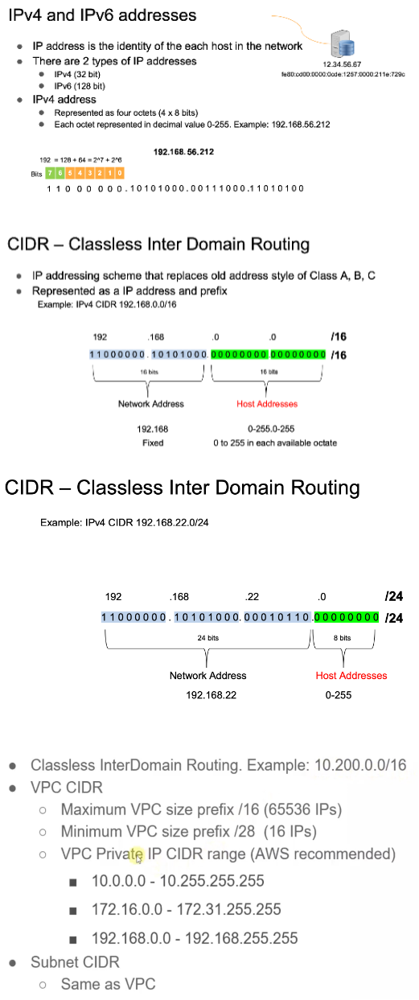
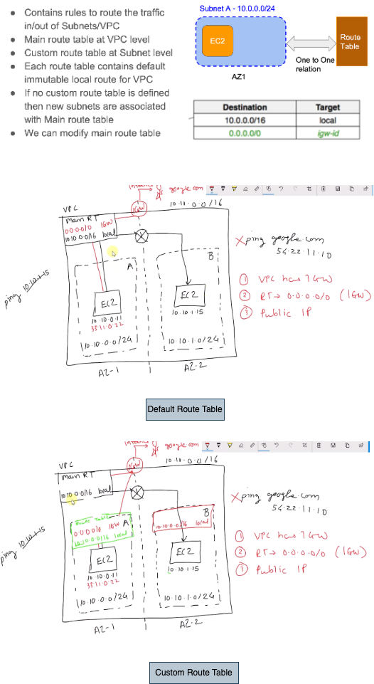
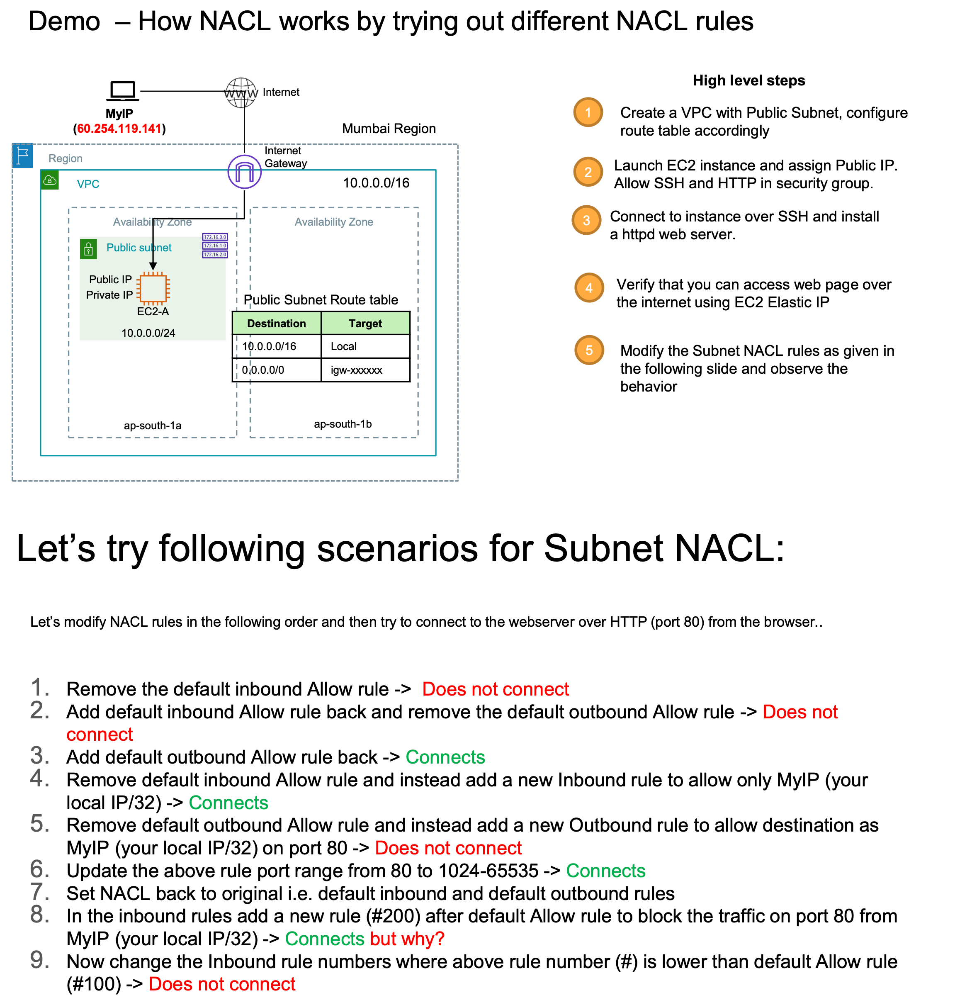

## VPC
VPC is virtual private cloud. And it means that you get your own private networking space inside AWS where you can launch machines.

## VPC Analogy

## VLAN

- Over the time you know that offices has a global presence. There are teams who are distributed across the countries or cities or offices. And they still want to be able to communicate with each other.
- And maybe some application team developers are sitting in one office and some developers are working remotely, and they want to make sure that they still have access to the same network.
- So in that case, if you see this, there are three machines which are part of one network, and the host D should also be a part of the same network. Now if you see at a physical layer, they are part of different LAN. But with the virtual networking, it is possible that all these hosts are part of the same LAN and that is essentially called virtual LAN or Vlan. So it is very well possible that they are part of the same Vlan network.

## VPC Components

## CIDR
### Classless Inter Domain Routing
- There are 2 types of IP addresses IPv4 and IPv6. IPv4 addresses are going to exaust soon, so that we have to use IPv6 addresses in future. IPv4 are 32 bit length where as IPv6 128 bit of length.
- IP address is the identity of the each host in the network. 

Here Network Addess is the VPC address and host adresses are the addresses which we can provide to different host or EC2.

We can not assign the first 4 and the last one IP address to any of the host because they are reserved.

## Route Tables and Internet Gateway

- Any EC2 instance can talk to any other EC2 instance within the same VPC through the default local route of Route Table
- If any of the EC2 instance would like to talk to outside internet like google.com, then following things needs to be configured.
    - Attach a new Internet Gateway(IGW) to the VPC
    - Add a new configuration in the default router to allow any other traffic apart from VPC goes through IGW `0.0.0.0/0 - IGW`
    - Attach a public IP to the instance, so that the return traffic can reach to that EC2 instance
- We can also attach an custom route table to each of the Subnets, so that it can override the default route table for that particular subnet. We can have different subnet for each of the layer(like web, application and database) and have different custom route table for each of the layer. So that we should not have IGW entry in the main route table, instead it should be there in specific route table.

## Subnets

- If a subnet route table has an route to go to Internet via AGW, it is called a public subnet.
And if a subnet route table does not have a route to go to Internet through AGW, then it is called
a private subnet.
- If we attach a custom route table to a subnet, then its stop following main route table. Its best practice to use a separate custom route table for each of the subnets.
- We can attach the custom route table to as many as subnets, so that all of them will follow the same rule.
- AWS reserves 5 IPs(first 4 and last 1 IP addess) in each subnet, so that we can not use them.

## Private, Public and Elastic IP(EIP)

- Private IP addresses, so whenever you launch an EC2 instance, they get a private IP address from the VPC range and further in which subnets they are launching right to whatever subnet ranges. One dynamic IP address will be given to your instance. Actually the Elastic Network Interface(**ENI**) which is attached to EC2 instance will get this IP adress. So EC2 instances will get its IP addresses from the attached ENI interface. If you stop the instance or start the instance this private IP address will be there until we terminate the instance. Once we terminate, this private IP will be returned to pool, so that next EC2 instance may get the same private IP.
- For any EC2 instance to be reached from internet we need to attach a Public IP address to it. So if you see the machine has a public IP and it is in a public subnet, you can reach from the Internet and the public IP when you stop the instance and start again, your public IP changes. So it is better not to use the public IP for the communication since it may change over the EC2 instance life cycle.
- Solution for the above public IP changes is the Elastic IP, which gets a static Public IP address over the EC2 life cycle. 

## Routing vs Firewall

- Routing is about how to route the traffic from source to destination whereas Firewall is about whether that packet is allowed to go to that destination after the packet is reached the destination. 
- Route can be considered as roads in your city where as firewall can be considered as security checkpost(at the country or city level) or the security gurads(at the apartmnet level) who can either allow or deny depending on the security check.
- In VPC, we have similar kind of firewall one is Network ACL which can check the incoming IP packets at the subnet level and another one is Security Group which adds a security at each EC2 instance level.

## Security Group (SG)

- Security Groups are most basic, native and important firewall for EC2 instances (ENIs)
- Security groups are attached to ENIs and the same ENI is attached to a specific EC2 instance.
- Security group has Inbound and Outbound rules
- Security group has only ALLOW rules. Does not support DENY/Block rules.
- By default denies all the incoming traffic for both IPv4 and IPv6. Need to write inbound rule to allow specific set of source or any source. Either allow specific individual or allow all. It can not deny specific individual or deny all.
- By default allows all the outgoing traffics. But if you want to restrict, you cad define specific outbound rule so that traffic originated from this EC2 instace can be reach to only those mentioned destination in the outbound rule.
- Security groups are stateful, means whatever the traffic it allows, by default it automaticlaly allows the return traffic. No need to add any rules in SG explicitly for the return traffic.
- You can reference another Security group as a source
- We can assign 5 SG to an instance and all the rules defined in all of the SG should be executed as TRUE to allow the inbound/outbound traffic. One SG can be assigned to multiple EC2 instances.
- Security Group comes by default in any of the EC2 instance
- It is always better to have all the control at security group level only. No need to touch any of the NACL, since the default NACL will allow all inbound and outbound traffic.
- Every VPC will have one default security group which by default deny all incoming traffic and allow all outgoing traffic. And when we launch EC2 machine and we do not create any SG, this default SG will be attached to intstance. 
- Single Security Group can be attached to multiple instances. ALso, Single Instance can have multiple Security groups
- In security group all the defined rules are evaluated before making a decision. If any one of the rule is not authorized, then SG will not allow the traffic.

### Security group scenarios

## Network Access Control List (NACL)
- If we need to add rules for all instances inside a subnet, then go with NACL. Works at Subnet level – Hence automatically applied to all instances.
- NACL are stateless, which means we need to define a rule for both inbound and outbound traffic. For example:
   - inbound rule: 22(port) 54.11.22.33(IP) ALLOW
   - outbound rule: 80(port) 54.11.22.33(IP) ALLOW
- Where as in case of SG, traffic are statefull which means it is enough to define only th einbound rule for a particular traffic.
- NACL will come by default in any of the subnet
- Contains both Allow and Deny rules. Rules are numbered.
- Rules are evaluated in the order of rule number (1 to 32766)
- Default NACL allows all inbound and outbound traffic
- NACL are a great way of blocking a specific IP at the subnet level
- By default ACL will have deny rule for at the end of inboud and outbound rules, so that if the traffic does not match any of the mentioned rules above it, then the traffic will get denied. This rule can not be deleted.
- In case NACL, rules are evaluated in the order(lower rule number to higher) and first matching rule will be applied so that rest of the rule will not be evaluated even though those rest of the rule does not qualify.
- There are certain limits in both SG and ACL like how many rules we can define in SG and ACL, how many SG we can attach to an EC2 instance etc. These limits will keep changes. 

## Default VPC
- AWS has created a default VPC in every region with default one IGW, one main route table and one local route table, one subnet in each AZ which looks like the below one:

- If we want to create a EC2 instance without creating any VPC, then it will by default use this default VPC. So we no need to create any VPC.
- So whenever we want to do any execise in AWS, use the default VPC or create one and install an EC2 instance in it by attaching a public IP to it.

## Exercises

### VPC with single public subnet
- Create a VPC in any region
- Create an IGW and attach it to the above VPC
- Create a subnet in the above region
- Create a new custom route table with route to the above IGW and associate it with the above subnet
- Change the setting in subnet to assign a default public IP for all of the EC2 instances within it
- Create a new EC2 insatnce within the above Subnet, which will automaticlaly get one public and one private IP address
- Update the Security Group of the above EC2 instancee to allow SSH from a specific IP address
- Finally SSH into this EC2 insatnce from local system by provding the SSH keys

### VPC with public and private subnet
- We can not go to EC2 instance which is created in the private subnet because it is not attached to IGW and it does not have any public IP. Only way to reach this EC2 insatnce is from EC2 instance which is available in the public subnet
- Note that we need to add a Security Group to instance B with inbound rule which can accept the SSH from insatnce A's Security Group.

### Network ACL example

