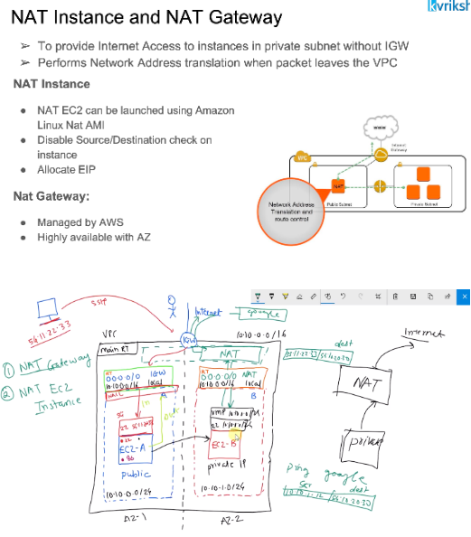
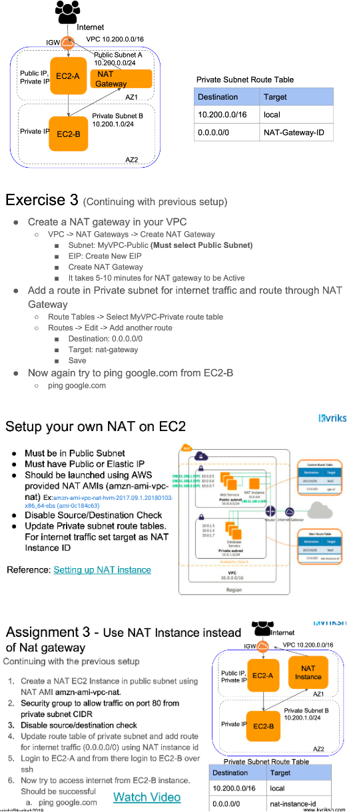

# NAT(Network Address Tanslation) Gateway

- We install web servers in public subnet wheras it is good practice to install application servers in a private subnet. But these application servers needs to talk to internet may be for downloading something or to make an exteranl API call etc. Inorder to help these servers which are in private subnet to communicate with internet we use NAT Instance or Gateway.
- NAT will have a single public IP address which will hides all the private IP addresses of instances. EC2 instacce will talk to NAT which will talk to internet over IGW and the return traffic will also flows to EC2 instance via NAT single public address.
- AWS managed NAT, higher bandwidth, better availability, no admin
- Pay by the hour for usage and bandwidth
- 5 Gbps of bandwidth with automatic scaling up to 100 Gbps
- No security groups
- NACL at subnet level applies to NAT Gateway.
- Supported protocols: TCP, UDP, and ICMP
- Uses ports 1024–65535 for outbound connection
- For outbound internet access, NAT Gateway should be created in Public Subnet so that it can communicate with the Internet
- NAT Gateway should be allocated Elastic IP
- NAT Gateways are highly available within a single AZ. For HA across multiple AZs, multiple NAT gateways can be launched

# NAT Instance
- Must be in a Public Subnet
- We use EC2 instance and install NAT AMI image which is provided by AWS itself to turn this instance as NAT instance
- ust have Public or Elastic IP
- Should be launched using AWS provided NAT AMIs
- Disable Source/Destination Check, this is because when an intsance which is available in a private subnet sends a traffic, its destination IP will be one of the IP which resides in an internet. But NAT instance can accept only those traffic whose destination IP is NAT instance's IP. So in order to accept this traffic by NAT instance, this EC2 instance must disable checking source/destination IP.
- NAT instances will have security group since its our own EC2 instance which we manage, we need to allow http/s or ICMP traffic from private subnet.

### Execise

VPC with public, private subnet and NAT

