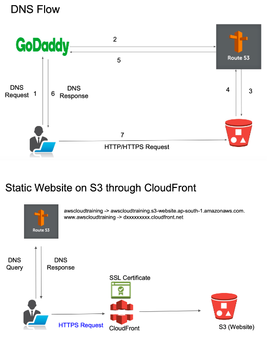

# Route 53 DNS Service

## DNS Flow
- Lets say we have bought a domain from GoDaddy server and we have hosted a sattic website in AWS S3. Now, we can access our static applicatin from our own domain name through AWS Route 53 DNS service.
- So the end user, when he hits a website domain in its browser, say AWS cloud Training.com As the domain is purchased from GoDaddy, the DNS request will go go to GoDaddy server. And what we will do is we will tell GoDaddy, don't manage yourself, but let Route 53 service manage the DNS. So the request for DNS will from there will go to AWS, DNS service that is Route 53 and Route 53 will host all the DNS for our website and as website is hosted on S3, it will get the DNS IP address from the S3 and ultimately we will get the response back with the given IP address and then end user browser will directly connect over Http or Https to the S3 back end where our website is hosted.

## CloudFront
- So now in order to make our website https, we need digital certificates.
- Now, as you know, S3 is a storage service and that's where it cannot really you cannot deploy your digital certificate on the S3 You need some other component there.  And in AWS world for this you need CloudFront, which is a content delivery network. 
- So you need to bring in a cloudfront for two reasons. One, if you want to host a website with Https, you can deploy your SSL certificate. Second, CloudFront also enables the caching for your static content.
- That means if you in your S3, you have an content like a media files, pictures or videos. Now CloudFront can cache that to the nearest edge locations from where the user is accessing your web content so that user gets the required content from the nearest edge locations so that your request does not always hit the S3 buckets for all the content.

