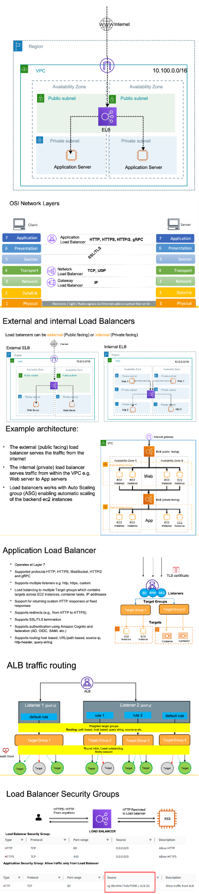

# Elastic Load Balancer (Reverse Proxy)
- Load Balancer distributes incoming traffic to multiple downstream servers (e.g. EC2 instances, Containers, IP addresses and Lambda functions)
- Supports protocols like HTTP, HTTPS, HTTP/2, TCP, UDP, gRPC
- Expose a single point of access (DNS) to your application
- Seamlessly handle failures of downstream instances by performing health checks to the instances
- Provide SSL/TLS termination for your websites and web applications
- High availability across Availability zones
- Separate public traffic from private traffic
- Supports various routing mechanisms
- We can use Haproxy or Nginx to configure as Load Balancer

## Why to use ELB
It’s a fully managed AWS service which means AWS takes care of upgrades, maintenance, high availability , reliability and scaling
- AWS provides configurations and mechanism for traffic engineering
- We can also setup our load balancer on EC2 instance(s) but we have to then take care of high availability, scalability and maintenance.
- ELB is integrated with AWS services
    - EC2
    - Auto Scaling Groups
    - Amazon ECS
    - AWS Certificate Manager (ACM)
    - Amazon CloudWatch
    - Amazon Route 53
    - AWS WAF
    - AWS Global Accelerator

## Types of load balancer
AWS offers following types of Load Balancers 
- Classic Load Balancer (CLB)
    - HTTP, HTTPS, TCP, SSL/TLS (secure TCP)
- Application Load Balancer (ALB) 
    - HTTP, HTTPS, WebSocket
- Network Load Balancer (NLB) 
    - TCP, TLS (secure TCP), UDP
- Gateway Load Balancer (GWLB) 
    - Operates at layer 3 – IP Protocol
    

## Exercise 

