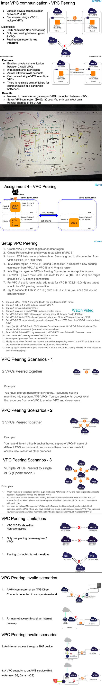
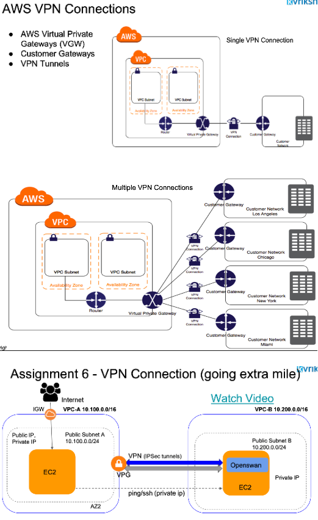
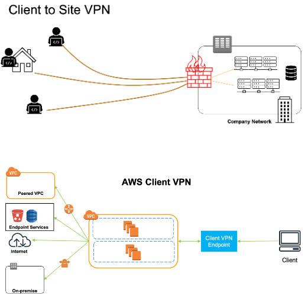
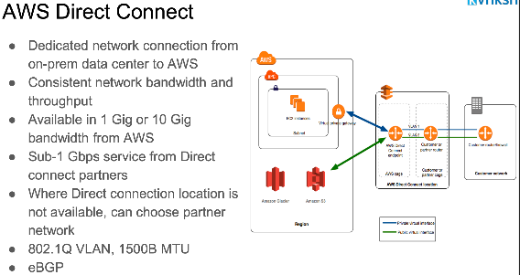
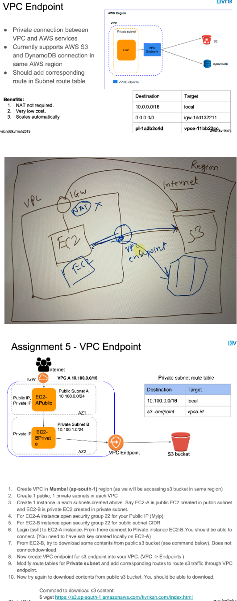
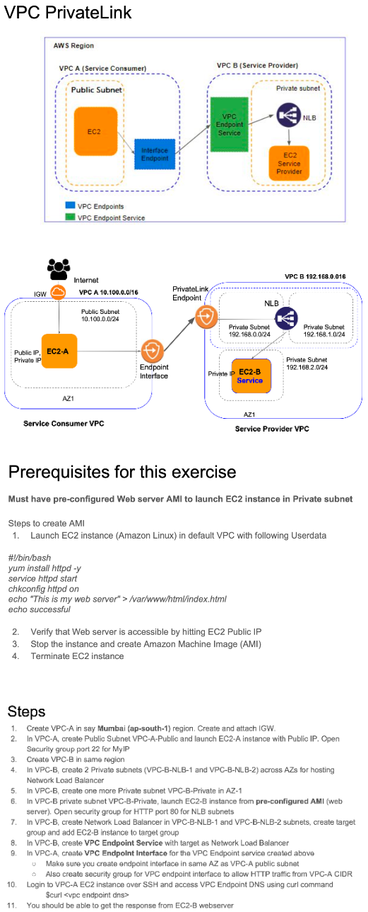
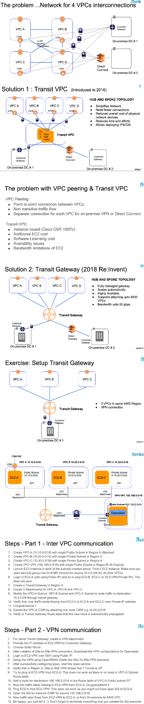

# Advanced VPC Components

# VPC Peering

- So if EC2 instances are into different Vpcs wants to talk to each other with a private network, then you
can have a VPC peering setup. That means now EC2 instance A and B in different VPC can communicate.
- So if there is a EC2 instance in a private subnet within some VPC in some region and this VPC does not have any IGW, then we can connect to this private EC2 instance from any EC2 instances which are available in other private/public subnet of another VPC and region through VPC Peering. 

# VPN Connection
## Site-To-Site VPN 
- So why Site to Site VPN? When you have to connect your on premises data center to Amazon VPC, you can have an VPN connection which flows over the internet, but this is a secure communication. It's encrypted channel.
- So for this on Amazon side, you require an virtual private gateway(VGW) and on the other side you require
a customer gateway. And then these two gateways can talk to each other over a VPN where Amazon, create two VPN tunnels for high availability between these two.
- You can also have one virtual private gateway connect to multiple customer gateways using separate VPN
connections. This is like if your company has a branches across the cities or say, locations, then still a single VPC can be connected. And once this connection is established. Now EC2 machine inside your VPC can talk to a physical machine or a virtual machine which are there inside your data center over a private IP addresses.
- One thing is VPN connection flows over the internet. That means you are limited by the bandwidth that you get over the internet and also the reliability of the Internet. Sometimes if Internet connection is not working, you won't be able to connect this two or there will be interruptions. 

## Client-To-Site VPN
- When you are working remotely, typically in Covid 19 like situation, you must be accessing your intranet website from your company. Now for that, what you do is actually you do client to site VPN in that case you connect to your VPN server, which is hosted on premises or in your company's network, and then you can access all the internal website and server from your home. Now, that's what is a client to site VPN where it's not a network, but you get access to network via this VPN connection.
- So till 2019, there was no special service from AWS for this. And if you have to have the client to site VPN, typically it used to be done using EC2 instance inside your VPC where you could install a VPN software, VPN server and then you can connect to that VPN server using any of the VPN client and then that VPN server can then route your traffic to rest of the VPC machines.
-

# Direct Connect
- But if you don't want a network to flow over VPN, you have another option, which is direct connect,
which means the traffic does not flow over the internet, but there are actually physical lines, A cable which can take your connect these two data centers. And this is a dedicated network so that you get a consistent bandwidth.
- It's a dedicated network, but of course, it requires a lot of money because you have to physically
set up the connection. And this connection is not over Internet, but a private connection through a private lines. And you can opt for a bandwidth up to one gigabit or a ten gigabit network.
- Many times it's possible that you require a size of, say, two gigabits. In that case, you can what you can do. You probably have a brokers in between. So you connect your data center up to the brokers data centers, and then brokers would have their network already connected to Amazon data centers so they can lease you this lines and they act as like middleman. So that is also possible.
- So when you need a dedicated and consistent connection, go for direct connect. But of course there is a cost involved and it takes some time, up to three months probably to set this up. If you want a quick solution and you are okay to flow, allow the traffic to flow over internet but in a secure manner, then you can have an VPN connection.

# VPC Endpoint

- A lot of times, you would deploy an application inside your VPC, say for example, an application like probably an Instagram or Facebook where people upload a lot of videos and photos. Now this videos and photos has to be uploaded to a storage like S3. Now S3 is a storage over Internet. They are accessible over Internet. So if this EC2 machine wants to upload some data to S3, the traffic by default flows over the internet. Now that means when this happens, you are being charged for the data out because traffic is flowing
through the Internet. Also you are limited by this bandwidth of the Internet connection.
- Now if your VPC and your S3 buckets are in same region, for example, say in Mumbai region, then you don't need to go through this path to go to the S3, but instead you can directly go over some private connection.
And for that you need a device like VPC endpoint.
- With VPC Endpoint, the traffic does not go over internet, so maybe you don't need Nat If the EC2 instances are in a private subnet, you don't require that. So it also saves you some cost. And also it's a automatically scales this VPC endpoint if traffic is more so, there are multiple EC2 machines who are accessing your S3 buckets.

# VPC FLow Logs

# VPC Private Link
- AWS Privatelink is a way in which you can have your application of services exposed to the other
Vpcs or other AWS services through Privatelink endpoint.
- So assume like you are providing some services to your customers in AWS and you have your service hosted
on a specific EC2 instance as a Service Provider and you want to provide this service to the customer applications which are there in customers VPC and Customer is also having their own application which wants to consume our service.
- Then you want to expose your service to these customer applications privately, which means you don't wantto expose your service publicly over the internet, but only your customer VPC application should be
able to access your services.
- Now, as we have seen in earlier lecture, this can also be done using VPC peering connection. But VPC peering is a broader network route. It allows all EC2 instances probably from one VPC to talk to other VPC if there are route configured. Otherwise, VPC Privatelink is a solution where you can expose your services in controlled manner.
- For using Privatelink endpoint, It is required that we must have our services behind the network load balancer and for the same reason, we also need to create network load balancer in VPC and then create Privatelink endpoint, which then we can expose.
- Once we do this on VPC side, we need to create an VPC Endpoint interface which talks to Privatelink endpoint and then EC2 instance in A which is service consumer can access our application using this endpoint interface.

# Transit Gateway and Transit Gateway
- We need this TG, when your network grows. And this will eventually happen in any AWS account as the workload increases.
- So let's take a simple use case where Suppose you start with 4 VPCs and you want all these VPCs to talk to each other. Now the obvious choice would be to have the VPC peering connections where every VPC is connected
to every other VPC. Now how many connections you need here? If you followed the lecture. VPC peering is not transitive and that means connecting A to B and then B to C does not enable the communication between A to C and hence in order to enable this connection. You have to explicitly create the VPC peering connection between A to C and that's where for four VPCs to communicate with each other you need at least six VPC peering connections like this.
- Now let's add some more complexity to this. And suppose you also have your on-premise network and you want to enable the connectivity between your onpremise and all these four VPCs. Now again coming back to the same question if you connect say your onpremise to any of these VPCs you cannot really go to other VPCs like that.
That means for on-premise connection to every other VPC you need to have in individual VPN connection with every other VPC. So you require at least four connections here with four VPCs through Virtual Private Gateway.
- And if you have multiple branches of your on-premises data centers and you have to have a direct connect then with each one of them. Now this is really bad and you can't just keep doing the same thing as your number of data center grows or your number of VPCs grows so its a big problem to solve. So the solution is TG

## Transit VPC
- As the name suggest the transit VPC is something which is a centralized piece here and all the communication happens through this transit VPC. So one thing to note here that transit VPC is not a service from AWS but it is a solution which means you can design your network and topology in such a way that you don't need to have individual links between these VPC and on-premise network It would be handled by this centralized VPC which acts as a transit VPC.

## Transit Gateway
- It overcomes the disadvantages which Transit VPC has
- It was launched in 2018, Reinvent, and it was well appreciated by the people because it greatly reduces how you manage your networks. Now, the same use case we have for Vpcs, we have on premise networks and if you just need a centralized entity called Transit Gateway and it will handle all the routing, whether it's between Vpcs or within VPC and on premise or between two different data centers if the network has to flow.
- The obvious benefits of using transit gateway is that it is fully managed. You don't have to deal with its capacity, its availability, its scalability.

