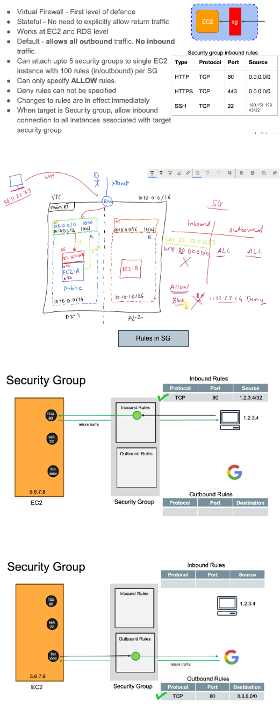

# VPC Components

## CIDR
### Classless Inter Domain Routing

We can not assign the first 4 and the last one IP address to any of the host because they are reserved.

## Route Tables

- Any EC2 instance can talk to any other EC2 instance within the same VPC through the default local route of Route Table
- If any of the EC2 instance would like to talk to outside internet like google.com, then following things needs to be configured.
    - Attach a new Internet Gateway(IGW) to the VPC
    - Add a new configuration in the default router to allow any other traffic apart from VPC goes through IGW `0.0.0.0/0 - IGW`
    - Attach a public IP to the instance, so that the return traffic can reach to that EC2 instance
- We can also attach an custom route table to each of the Subnets, so that it can override the default route table for that particular subnet. We can have different subnet for each of the layer(like web, application and database) and have different custom route table for each of the layer. So that we should not have IGW entry in the main route table, instead it should be there in specific route table.

## Subnets

- If a subnet route table has an route to go to Internet via AGW, it is called a public subnet.
And if a subnet route table does not have a route to go to Internet through AGW, then it is called
a private subnet.

## Security Group (SG)

- 2 types of Firewall in AWS. One is Security Group(SG) and other one is Access Control List(ACL)
- We can assign 5 SG to an instance and all the rules defined in all of the SG should be executed as TRUE to allow the inbound/outbound traffic. One SG can be assigned to multiple EC2 instances.
- Security Group comes by default in any of the EC2 instance
- It is always better to have all the control at security group level only. No need to touch any of the NACL, since the default NACL will allow all inbound and outbound traffic.

## Network Access Control List (NACL)
- If we need to add rules for all instances inside a subnet, then go with NACL.
- NACL are stateless, which means we need to define a rule for both inbound and outbound traffic. For example:
   - inbound rule: 22(port) 54.11.22.33(IP) ALLOW
   - outbound rule: 80(port) 54.11.22.33(IP) ALLOW
- Where as in case of SG, traffic are statefull which means it is enough to define only th einbound rule for a particular traffic.
- NACL will come by default in any of the subnet

## VPC Analogy

## Private, Public and Elastic IP(EIP)

- Private IP addresses, so whenever you launch an EC2 instance, they get a private IP address from the VPC range and further in which subnets they are launching right to whatever subnet ranges. One dynamic IP address will be given to your instance. If you stop the instance or start the instance this private IP address will be there until we terminate the instance. Once we terminate, this private IP will be returned to pool, so that next EC2 instance may get the same private IP.
- For any EC2 instance to be reached from internet we need to attach a Public IP address to it. So if you see the machine has a public IP and it is in a public subnet, you can reach from the Internet and the public IP when you stop the instance and start again, your public IP changes. So it is better not to use the public IP for the communication since it may change over the EC2 instance life cycle.
- Solution for the above public IP changes is the Elastic IP, which gets a static Public IP address over the EC2 life cycle. 

## Default VPC
- AWS has created a default VPC in every region with default IGW, route table, subnets which looks like the below one:

- So whenever we want to do any execise in AWS, use the default VPC or create one and install an EC2 instance in it by attching a public IP to it.

## Execises

### VPC with single public subnet
- Create a VPC in any region
- Create an IGW and attach it to the above VPC
- Create a subnet in the above region
- Create a new custom route table with route to the above IGW and associate it with the above subnet
- Change the setting in subnet to assign a default public IP for all of the EC2 instances within it
- Create a new EC2 insatnce within the above Subnet, which will automaticlaly get one public and one private IP address
- Update the Security Group of the above EC2 instancee to allow SSH from a specific IP address
- Finally SSH into this EC2 insatnce from local system by provding the SSH keys

### VPC with public and private subnet
- We can not go to EC2 instance which is created in the private subnet because it is not attached to IGW and it does not have any public IP. Only way to reach this EC2 insatnce is from EC2 instance which is available in the public subnet
- Note that we need to add a Security Group to instance B with inbound rule which can accept the SSH from insatnce A's Security Group.

### Network ACL example

