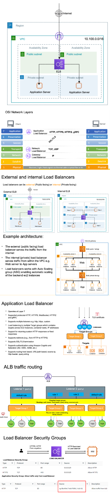

# Load Balancer
- AWS supports three kinds of load balancers, classic load balancer, application load balancer and network load balancer out of which classic load balancer is now old age and it is not recommended to be used,However, for application working at layer seven at Http and Https, it is recommended to use application load balancer and if your application works at TCP layer, then use network load balancer.
- 

