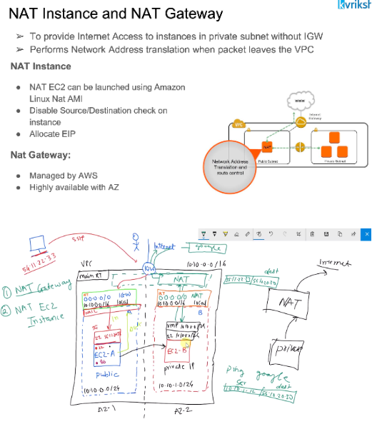
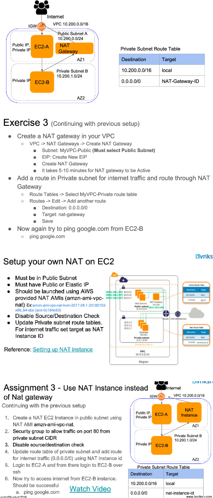

# NAT(Network Address Tanslation) Gateway and NAT Instance

- We install web servers in public subnet wheras it is good practice to install application servers in a private subnet. But these application servers needs to talk to internet may be for downloading something or to make an exteranl API call etc. Inorder to help these servers which are in private subnet to communicate with internet we use NAT Instance or Gateway.
- NAT will have a single public IP address which will hides all the provate IP addresses of instances. EC2 instacce will talk to NAT which will talk to internet over IGW and the return traffic will also flows to EC2 instance via NAT singl epublic address.

### Execise

VPC with public, private subnet and NAT

