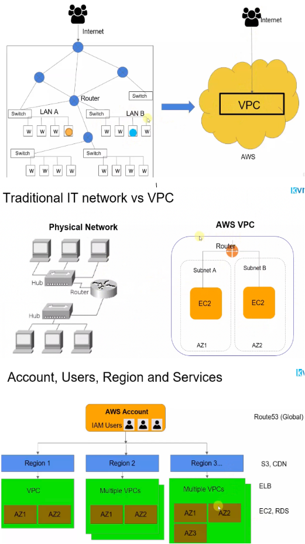
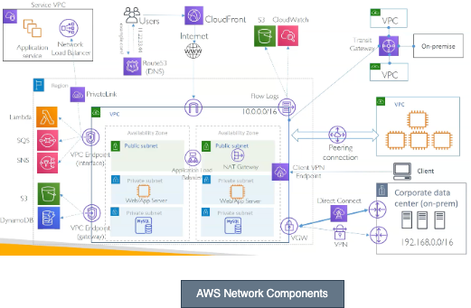

# Networking in AWS Overview

## How Things works in Physical World

- In any datacenter, there will be a lot of servers and the servers will be typically connected to
each other using Ethernet over the LAN. So this represent a couple of machines connected to each other using Internet cables which we call as LAN.
- Similarly, there will be multiple such LANs in your company network or in your datacenter networks, and
then there are different machines all the way talking to each other.
- Now what happens when I say one machine wants to talk to another machine within the same LAN connections? So as we know these machiens are connected to each other over a physical layer, we address these machines with something called Mac addresses and for that we need packet switching mechanism which switches provides. So there will be a switch device which actually works at layer 2 of OSA model i.e datalink layer.
- It understands the Mac addresses of these machines and then it can forward the traffic from one machine
to the other machine in the same line. 
- What happens when suppose a machine from one lan wants to talk to the machine in another lan? Now, in this case, we are actually crossing the network boundary. We are going out of the switch and going to some other LAN in this case, which won't really help. We need a somewhat intelligent which I can call and we call it a router.
- So what router does is it works at a third layer of OSA model that is IP layer. That means if your machines have the IP addresses, router learns, that a particular IP address belongs to a particular network and it can forward the packet that it receives to the corresponding network. That means traffic will goes through multiple routers and switches. We can configure a router as internal one or the public facing one.

## How Things works in Virtual World
- So if you want to have the same kind of network created in, say,AWS Cloud, we will have something called VPC that is virtual private cloud. And in a similar way it can interact with the Internet and you can actually create smaller networks inside these VPC. 
- You can configure routers, you can configure the routes and everything. Typically what you can do in physical work can be done inside of VPC.

## Accounts, Users, Region and Services
- Before using AWS cloud, we must have an AWS account. Account is in top level entity in AWS, which means once you have an established account, you get access to all the various regions so you can just select in which region you want to create. So Account is the top level and the second level is region.
- Now every region can have one or more VPCs. Why would you have multiple VPCs? Of course, because you want to segregate the network for different customers. You don't want machines, which belongs to different customer talk to each other. You want an isolated network. VPC are at the third level.
- Now there are some AWS services which works at the top level. That means at global level they are not bound to any region like Route 53 DNS service.
- Similarly, some services works at regional level like CDN or S3. Some services works at VPC level like Load Balancer. Some service works at Availabilty zone level like EC2 instance or RDS. 

## Overview of AWS Network Components
Lets say, we want to provision a network inside AWS. Then we need to follow below steps:
- The first thing that you will do is, choose a **Region** in AWS like Mumbai or any other region. Every region always comes with 2 or more **Availability Zone**.
- Now in order to put your own private network, what you do is you create a **VPC**, which is **Virtual Private Cloud**. It's a one big address space that you get, and it's a private address range. That means no one can get into your VPC unless you open that traffic to the internet. 
- In order to connect your VPC to the internet, install **Internet Gateway(IG)** at VPC level. Now, without internet gateway, you can't really directly reach to your machines because, VPC is a private network
- Now create **Subnets** which is the independent address ranges within the VPC. 
   - Now subnet will provide you the different networking controls whether you want to keep your machines in a public subnet, which means that the machines in public subnet can communicate with the internet directly. And from internet also, you can reach to those machines inside the public subnet. 
   - However, if you have say a databases, you would like to put that in a private subnet, because you can't reach to the machines in the private subnet directly from the internet.
- Now we can install **EC2 instances** within these subnet where we can deploy our applications.
- We can use one availability zone, but AWS recommends that for high availability, you should use at least two availability zone. If you want to really have your application architecture to be highly available, you should have at least two AZs, and then you should also launch your web servers and application server across these two AZs.
- Install **Load Balancer** if our applications which are deployed inside private subnets are needs to be reached from internet. 
- Lets say you want to deploy a 3 tire architecture in AWS then have a Public Load Balancer which will route the traffic to Wep Applications which are deployed in a public subnet, then have a Private Load Balancer which will route the traffic between Web Application to the Application Servers which are running in the private subnets and then finally have a database instances in a private subnet where one instance will act as primary and other one will be the secondary which is the replica of the primary for the high availabilty.
- Use **NAT Gateway**, if any of the servers would like to reach to internet to download some security patches etc, but the same servers should only be reachable through Load Balancer. What it does is, all the outbound traffic from your instances in a private subnet, it will be routed through the NAT gateway. NAT Gateway itself is in a public subnet, which will then route its traffic from internet gateway to the internet.
- If customer wants to access your VPC from their own VPC privately, without routing the traffic over the internet, then use **VPC Peering**, which is like connecting two VPC one-to-one. The good thing about VPC peering is that you can even connect the VPCs across multiple AWS regions. 
- But the problem with VPC Peering is, every VPC has to be connected one-to-one to any other VPCs because VPC peering connections are non transitive. For this, have a **Transit Gateway** which allows you to connect
different networks together, including the VPC, as well as your on-premise network, without a need for one to one connection. Tansit Gateway will have central connection to manage all these components.
- So you can connect your on-premise network to transit gateway using a **VPN connection** or a **Direct Connect** connection. And then if you connect this transit gateway to your VPC, you get a complete mesh kind of connectivity. Any VPC can communicate to any VPC as well as with the on-premise network. So in short, transit gateway greatly simplifies your network complexities.
- So in short, transit gateway greatly simplifies your network complexities. If you see that number of VPCs in your account is growing and you need to have the hybrid kind of connectivity, I would rather recommend to go with the transit gateway than going through the VPC peering connection or individual VPN connections.
- Imagine that you have an web application in a subnet, which also needs to upload or download some data from the S3 bucket. S3 is a managed service from AWS And when you create an S3 bucket, you create them inside a specific region. Now, if your application VPC is in the same region as S3, what AWS says is that you don't need to go over the internet to access the S3, because you can get something like **VPC Endpoint of type Gateway**.
- Now, without this VPC endpoint, all the traffic from your application server will actually go through the internet gateway to the S3 because S3 is a public service and same with the DynamoDB. But the problem is traffic is going to internet, there is additional cost for that, and as well as the latency problems would be there. But VPC endpoint allows you to access the S3 and DynamoDB service privately from your VPC. Now the condition is, the S3 and DynamoDB should be in the same region as your VPC.
- If we want to communicate from your application which is in a subnet to other AWS service like SQS Queue, SNS, Lambda functions, or an API call to EC2 instance without going throuh internet then use **VPC Endpoint of type Interface**. The problem these VPC Endpoints solves is that there is a consistent bandwidth you get, and all the traffic remains on the AWS network.
- Lets say you have a customer and customer has one service. And what customer says is that he wants to allow
only you to access his service. So for example, there is some web based application customer has.And then now what customer can also do that expose these services over the internet, and then you can access from your VPC, these services over the internet. But you don't want to expose your services to the internet
but provide a private connectivity from your VPC to this customer service. Now for this, AWS has launched a networking service called a **PrivateLink**.
- Now, what PrivateLink means is that let customer expose their application services via the load balancer
and in a service consumer VPC, you create a VPC endpoint, and this endpoint will privately connect you
to the network load balancer of the service provider VPC. And now this connection from your VPC endpoint
to the network load balancer is private, through the Private Link. And this is how you can now provide your services privately to as many customers you want.
- Now, you would also think that maybe I don't want to do this, but rather I want to just connect my VPC to my customer's VPC like we did before in case of peering connection or in a transit gateway, but the problem is, as soon as you do this connectivity, you can now reach from any machine to any machine, right? And you don't want to do that. Maybe you just want to provide one service from your AWS VPC to other customers, and that's where the PrivateLink will help you do that.
- If you want to use a DNS instead of IP address, AWS also provide the **Route 53** as a service. So if end user is accessing your web server, using the domain name, end user will put the domain name in the browser, say example.com. And if you have a Route 53 hosted zone for example.com, the query will go to the Route 53 and it will respond with the IP address of your web server. Now, in this case, the IP address will be of the load balancer and dynamically you will get one IP address for this load balancer. So user gets the IP address and then user can reach to your load balancer over to the internet.
- Now for better performance, you can also use **AWS CloudFront** service, which is a CDN, Content Delivery Network. What CloudFront does is two things, it can cache your static content if there are a lot of images in your web server, then it will cache to the nearest edge locations for the user. And second, it also connects you to the AWS VPC over the dedicated network that AWS has, which means this CloudFront locations are already connected to AWS regions, with the private connectivity of AWS, so your end user latency will be reduced if you leverage CloudFront here. So the request will go to the CloudFront and then CloudFront will connect to the load balancer, and then to the applications like that.
- And now on the troubleshooting side or audit side, if you want to see all the packets flowing in and out of your VPC, you want to capture those packets, then you can enable the **VPC flow logs**, and these flow logs can be then dumped to the CloudWatch or S3 for later analysis.
- In real world, if there is an enterprise, they want to often operate in a hybrid mode. Now, when I say hybrid mode, that means some of the workload might be running in Cloud and some of the workload might be running in on-premise network. Now, how do you connect your VPC to the on-premise data center, for this kind of connectivity? Now for that, AWS provides you a couple of options.
    - Very simple option is using the **Site-to-Site VPN connection**. Now for that, on VPC site, you need something called Virtual Private Gateway, you attach it to your VPC, and then using this virtual private gateway, you can establish IPsec VPN to the on-premise router. Now this is a good option, but understand that all this traffic goes over to the internet, and you don't always want that for the reason that the traffic is not consistent. So this is called a Site-to-Site VPN, that means you are connecting two networks, and in this case, then any machine inside your corporate data center can talk to any machine in a VPC over its private IP address. The traffic is not going really over to the internet gateway.
    - And now if you know, in a COVID world typically you are working from home, and you want to get access to your company's private machines or servers, you would have to first connect to the company VPN, and then you get access to those machine. Now, this is called **client-to-site VPN**, that means client can be a part of this VPC and can access any machine privately inside this VPC.
    - If you are connecting corporate data center to VPC over an internet, you can't guarantee the stability of that connection because there could be multiple hops as you reach to them, from data center to AWS network. And that's where some customers need a dedicated connection. And in that case, AWS provides a **Direct Connect** service, which actually is a physical connection from AWS VPC to your corporate data center.

## OSI Model

- Layer 1: Physical Layer
- Layer 2: Data Link Layer - Switches
- Layer 3: Network Layer - Routers
- Layer 4: Transport Layer
- Layer 5: Physical Layer
- Layer 6: Presentation Layer
- Layer 7: Application Layer

