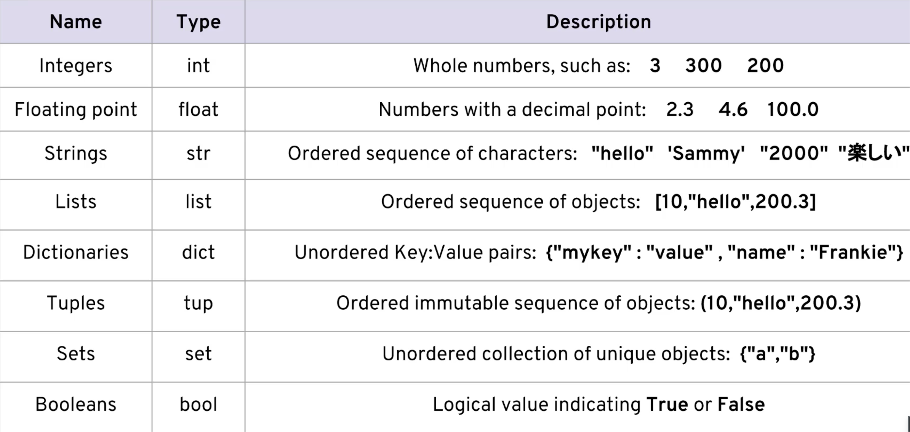

# Python

By default python3 will be installed on Mac OS M1.

## Writing hello python
- Create a new file hello.py with below content
```
#!/usr/bin/python3
print("Hello!")
```
- Run the python. If needed change the permission to executable
```
./hello.py
```
- Output
```
Hello!
```

## Variables
- Variables are storage locations that have a name.
- Variables are name, value pairs
- Pythin uses Dynamic Typing not a Statically Typed, this means we can reasign variables to different data types
- Example:
```
 fruit = 'apple'
 fruit = 'oragne'
```
- Variable names are case sensitive. Fruit and fruit are different.
- Must start with a letter
- Underscores allowed in variable names
- Not allowed
    - `+`
    - `-`

## Python Data types



## Strings
- Strings represent text
- Surrounded by quotes
- Example:
```
fruit = 'apple' // single quote
fruit = "apple" // double quote
```
- Use double quotes to enclose a string if we need to use single quote in a string and vice versa
- If we need both single and double quote use `\` backslash

### Indexing
```
string: apple
Index:  01234

a = 'apple'[0]
e = 'apple'[4]

fruit = "apple"
first_character = fruit[0]
```

### print, length, lower and upper function
```
fruit = "Apple"
print(fruit) // Apple
print(len(fruit)) // 5
print(fruit.lower()) // apple
print(fruit.upper()) // APPLE
```

### String methods
- Everything in Python is an object
- Every object has a type
- 'apple' is an object of type "str"
- 'apple' is a string object
- fruit = 'apple', fruit is a string object
- Methods are functions run against an object
    - object.method()

### String concatenation
```
print('I' + 'love' + 'Python')

first = 'I'
second = 'Love'
third = 'Python'
sentance = first + ' ' + second + ' ' + third
print(sentance)
```

### Repeating strings
```
print('-' * 10) // O/P: prints `-` 10 times

happiness = 'happy ' * 3
print(happienes) // O/P: happy happy happy
```

### Convert number to string
```
version = 3
print('I Love Python ' + str(version) + '.') // O/P: I Love Python 3
```
Integer object can not be converted to string implicitly by Python (No Implicit conversion)

### Formatiing string by using placeholder({}) and format() function
```
print('I {} Python.'.format('Love')) // O/P: I Love Python.
print('{} {} {}'. format('I', 'Love', 'Python.')) //  O/P: I Love Python.

print('I {0} {1}. {1} {0}s me.'.format('love', 'python')) // OP: I love python. Python loves me.

first = 'I'
second = "Love"
third = "Python"
print('{} {} {}'.format(first, second, third)) //OP: I Love Python

version=3
print('I love python {}.'.format(version)) //OP: I love python 3. Note that here no need to use conversion from int to string

print('{0:8} | {1:8}'.format('Fruit', 'Quantity')) // Take the first variable and make it 8th character wide. Take the second variable and make it 8th character wide
print('{0:8} | {1:8}'.format('Apple', '3'))
O/P:
Fruit   | Quantity   
Apple   | 3
```

### Formatting strings allignment
- Use `<` for left allignment of text
- Use `^` for center allignment of text
- Use `>` for right allignment of text
```
print('{0:8} | {1:<8}'.format('Fruit', 'Quantity'))
```

### Formatting strings data type
- Use f for float data types
- .Nf => N = The number of decimal places
```
print('{0:8} | {1:<8}'.format('Fruit', 'Quantity'))
print('{0:8} | {1:8.2f}'.format('Apple', '2.3333'))
print('{0:8} | {1:8.2f}'.format('Orange', '10'))
O/P
Fruit   | Quantity   
Apple   | 2.33
Orange  | 10
```

### Getting user input
- Use input() function: `input("What is your name?")`
```
fruit = input('Enter a name of the fruit: ')
print('{} is a lovely fruit!'.format(fruit))
O/P:
Enter a name of the fruit: Apple
Apple is a lovely fruit!
```

## Numbers and Math
Use numbers directly without using any quatation marks
```
result = 10 // Integer(data type is int)
money = 30.35 // Float(data type is float)
```

### Numeric operations
- `+`
- `-`
- `*`
- `/`
- `%` (modulo) ex: 3 % 2 = 1
- `**` (exponentiate) ex: 2 ** 4 = 2*2*2*2 = 16

```
8 / 2 = 4.0 //division results into float number always
1 + 2.0 = 3.0
```


### Strings and numbers
- use str() function to convert int to string
- use int() function to convert string to int
- use float() function to convert string or int to float
```
quantity = 3
quantity_string = '3'
total = quantity_string + 2
```
Error: can not convert int to string. We have to convert int to string explicitly through `str(2)`

```
quantity_string = '3'
total =  int(quantity_string) + 2
print(total) // 5
```

```
quantity_string = '3'
quantity_float = float(quantity_string)
print(quantity_float) //3.0
```

## Comments
- Use `#` to add any single line comment
- Use `"""` at the begining and end of multi line comments
```
"""
comment 1
comment 2
"""
```

## Boolean
- Boolean can only be true or flase
```
a_boolean = True
the_other_boolean = False
print(a_boolean)
print(the_other_boolean)
O/P:
True
False
```

### Comparator operators
- `==` 
- `>`
- `>=`
- `<`
- `<=`
- `!=`

### Boolean operators
- and: `37 > 10 and 37 < 40` O/P: True
- or: `37 > 10 or 37 < 10` O/P: True
- not: `not 1` O/P: False, `not 37 > 29` O/P: False

### Order of operations for Booleans
- not
- and
- or
```
True and False or not False O/P: True
```

### Controlling order of the operations
Anything surrounded by paranthesis is evaluated first and as its own unit
```
(True and False) or (not False) OP: True
```

## Conditionals

### if, if/elif/else
```
#!/usr/bin/python3
distance = int(input('How far would you like to travel in miles?'))

if distance < 3:
    mode_of_transport = 'walking'
elif distance < 300:
     mode_of_transport = 'driving'
else:
     mode_of_transport = 'flaying'

print('I suggest {} to your destination.'.format(mode_of_transport))         
```

## Looping

### for-in loop
```
for item_variable in list_name:
    # code block    
```

```
animals = ['man', 'bear', 'pig']

for animal in animals:
    print(animal.upper())

//OP
MAN
BEAR
PIG
```

### While loop
```
while condiiton:
    # code block
```

```
animals = ['man', 'bear', 'pig']

index = 0

while index < len(animals):
    print(animals[index])
    index++

O/P:
man
bear
pig    
```


## Functions
- Functions are helpful in achieving DRY(Dont Repeat Youself)
- Write one time, use many times
- Define a function before calling it
- We can define single or multiple parameters to a function and pass the value accordingly while calling it
- We can have default value for each parameter in function
- We can also pass the value to a function through parameter name
- Required and optional parameter we can define in function
- Function can return single or multiple data through return sattement
- We can call another function in a function
```
def function_name():
    # code block

def say_hi(first = 'Mr.', last): // first is optional with default value `Mr.`, last is required field
    print('Hi {} {}'.format(first, last)) 

say_hi(last = 'adiga', first = 'prasanna') // Passing arguments with named parameter in any order
```

### Functions doc string
- We can define documentation string in every function which will provide documentation needed for the function
- We can check the documentation of each function through `help(function_name)` command

```
def say_hi(first, last = 'Doe'):
    """ Say hello. """
    print('Hi {} {}!'.format(first, last))

help(say_hi)

O/P:
Help on function say_hi in module __main__:

say_hi(first, last='Doe')
    Say hello.
```

## Exception handling
```
try:
    f = open('testfile', 'w')
    f.write("write a test line")
except TypeError:
    print("there was a type error")
except OSError:
    print("OS error")
finally:
    print("I always run")        


```