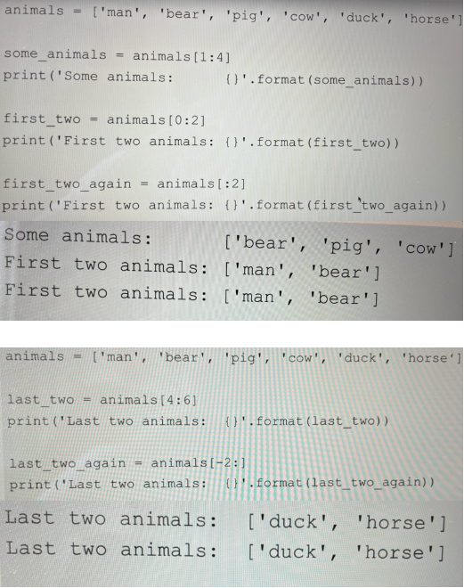
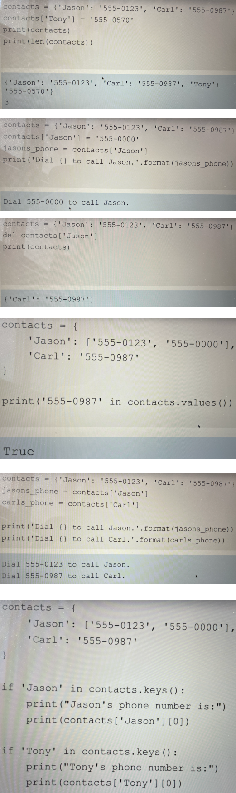
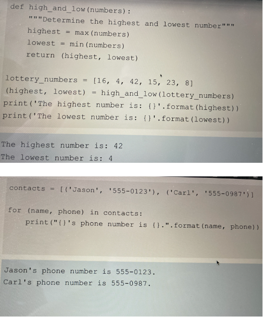

# Data Structure

# List
- List is a data type that holds an ordered(in the order how we insert data) collection of items
- The items can be of various data types
- We can even have lists of lists

### Create, edit and get list
- We can fetch value from list through their index. We can also set it through index
```
animals = ['man', 'bear', 'pig']
print(animals[0]) // man
animals[0] = 'cat'
print(animals[0]) // cat
len(animals) // 3
```

### Access items from end of list
- We can access items starting from end of the list through negative numbers
```
animals = ['man', 'bear', 'pig']
print(animals[-1]) // pig
print(animals[-2]) // bear
```

### To append a new item at the end of the list - append() function
```
animals = ['man', 'bear', 'pig']
animlas.append('cow')
print(animals[-1]) // cow
```

### To add multiple items at the end of the list - extend() function
```
animals = ['man', 'bear', 'pig']
animlas.extend(['cow', 'duck'])
print(animals[-1]) // duck
```

### To insert a item at any point in the list - insert() function
```
animals = ['man', 'bear', 'pig']
animals.insert(1, 'duck')
print(animals) //OP: ['man', 'duck', 'bear', 'pig']
```

### Finding an item in a list
```
animals = ['man', 'bear', 'pig']
bear_index = animals.index('bear')
print(bear_index) // If `bear` not found, then python will raise an exception
```

## Slices to access a portion of a list
- We can fetch portion of index through slices

```
list[index1:index2] //from index1 till index2 excluding index2. Index2 is the number of items.
list[:index2] // from begining to till index2 excluding it
list[index1:] // from index1 to till end
```


- Slices with strings
```
part = 'horse'[1:3] OP: or
```

## Sorting
- Built in sort() function will sort the same list in ascending order
- Built in sorted() function will create a brand new list and sort it in the ascending order
```
animals = ['man', 'bear', 'pig']
sorted_animals = sorted(animals)

print('Animal list {}'.format(animals))
print('Sorted animal list {}'.format(sorted_animals))

animals.sort()
print('Animal list after sort method {}'.format(animals))

O/P:
Animal list ['man', 'bear', 'pig']
Sorted animal list ['bear', 'man', 'pig']
Animal list after sort method ['bear', 'man', 'pig']
```
- Use concatiniation to join 2 lists
```
animals = ['man', 'bear', 'pig']
more_animals = ['cow', 'duck', 'horse']
all_animals = animals + more_animals
print(all_animals)
```

## Built in Range() function to generates a list of numbers
```
for number in range(3): // range starts with 0.
    print(number)
```

- With start and stop
```
for number in range(1, 3): // Provide start and end.
    print(number) 
O/P:
1
2    
```
- With step value
```
for number in range(1, 10, 2): // Provide start and end with step value
    print(number) 
O/P:
1
3
5
7
9
```

```
animals = ['man', 'bear', 'pig']
for number in range(0, len(animals), 2):
    print(animals[numer])
O/P
man
pig    
```

## Exception handling in list (try & except)
```
animals = ['man', 'bear', 'pig']
try:
    cat_index = animals.index('cat')
except:
    cat_index = 'No cat found'

print(cat_index)
OP:
No cat found
```

# Dictionaries
- Hold key-value pairs called items
- We can access values or set values by key
- Add new values through assignment
- Delete a value from dictionary through del statement
- Value stored in the dictionary no need of same type
- We can check whether a key exist in dictionary by using keys() function and value exist by using values() function
- Use the same for-in to loop over maps same as list. But the order is not guaranteed.
- Looping with 2 variables
```
contacts = {
    'Json': '111-222',
    'Carl': '333-444'
}

for person,contact in contacts.items() {
    print('The number for {0} is {1}. '.format(person, contact))
}
```




# Set

# Tupples
- A tupple is an immutable list, once it is created can not be changed
- Can be used if we want to hold any data which should not be changed anytime
- Tupples are ordered
- Values access by index
- Iteration, looping, concatenation
- Use when data should not change
```
tupple_name = (item1, item2, item3)
```
- Switching between tupples and list
    - list(): built in functin returns a list
    - tupple(): built in function returns a tupple
    - type(): built in function returns an object's type
- We can pass tupples to functions and return tupples from function


