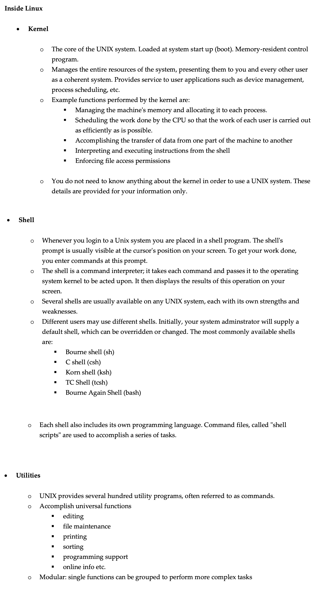

# Linux

Linux is the most widely used operating system, used in everything from mobile devices to the cloud.

## Operating System (OS)

An operating system or OS is a software program that enables the computer hardware to communicate and operate with the computer software. Without a computer operating system, a computer and software programs would be useless.

An operating system (sometimes abbreviated as "OS") is the program that, after being initially loaded into the computer by a boot program, manages all the other programs in a computer. The other programs are called applications or application programs. The application programs make use of the operating system by making requests for services through a defined application program interface (API). In addition, users can interact directly with the operating system through a user interface such as a command language or a graphical user interface (GUI).

An operating system performs these services for applications:
- In a multitasking operating system where multiple programs can be running at the same time,
the operating system determines which applications should run in what order and how much
time should be allowed for each application before giving another application a turn.
- It manages the sharing of internal memory among multiple applications.
- It handles input and output to and from attached hardware devices, such as hard disks, printers,
and dial-up ports.
- It sends messages to each application or interactive user (or to a system operator) about the status
of operation and any errors that may have occurred.
- It can offload the management of what are called batch jobs (for example, printing) so that the
initiating application is freed from this work.
- On computers that can provide parallel processing, an operating system can manage how to
divide the program so that it runs on more than one processor at a time.

- In simple words
    - An operating system (OS) is software that acts as a middleman or a bridge between computer hardware and the computer user. It provides a user interface and controls the computer hardware so that software can function

## Types of OS
- Desktop OS
    - Microsoft Windows
    - macOS
    - Linux such as Ubuntu
- Server OS
    - Windows Server
    - Linux distributions like CentOS, Redhat enterprise linux
- Mobile OS
    - Android
    - iOS
    - Windows mobile
- Embedded OS
    - Used in devices like Router, smart TV/watches, automobiles, home appliances  
- Real time OS
    - Used in critical systems like medical equipment, car ECUs, aerospace, defense, network firewall, home security, and so on.

## What is Linux
- Linux, in simple terms, is a free and open-source operating system
- It’s similar to Windows and macOS, but it's different in several ways
- Linux is very popular for its stability, security, and flexibility. It can be modified and distributed by anyone, which has led to many different versions, known as "distributions," and each distribution is tailored for different uses
- Its open-source nature means that a community of developers and users contribute to its development

## Why Learn Linux or its importance?
- Widely used in servers and cloud computing • Free software philosophy
- Strong command line interface
- Faster processing
- Enhanced security
- Customization because of open-source nature • Community support
- Understanding of other operating systems
- Career opportunities.

## Linux vs Unix

- Origins and Development:
    - Unix: Originated in the 1970s at AT&T's Bell Labs. It was developed by Ken Thompson, Dennis Ritchie, and others
    - Linux: Created in the early 1990s by Linus Torvalds. It's free and open-source, meaning its source code can be used, modified, and distributed by anyone
- OS Distribution:
    - Unix: Solaris, HP-UX, AIX. BSD etc.
    - Linux: Red Hat, CentOS, Fedora, Ubuntu, SUSE, Kali etc.
- Licensing and Cost:
    - Unix: Generally requires a paid license, especially for commercial use
    - Linux: Free to use, modify, and distribute
- Community and Development:
    - Unix: Development and updates are controlled by the owning organization
    - Linux: Maintained and developed by a global community of developers
- Hardware Support:
    - Unix: Traditionally supports less hardware variety compared to Linux
    - Linux: Known for its broad hardware support, including both traditional PCs and servers as well as embedded devices.

## Important Things to Remember in Linux

- Linux has super-user account called root
    - root is the most powerful account that can create, modify, delete accounts and make changes to system configuration files
- Linux is case-sensitive system
    - ABC is NOT same as abc
- Avoid using spaces when creating files and directories
- Linux kernel is not an operating system. It is a small software within Linux
operating system that takes commands from users and pass them to system
hardware or peripherals
- Linux is mostly CLI not GUI
- Linux is very flexible as compared to other operating systems.

## Inside Linux

