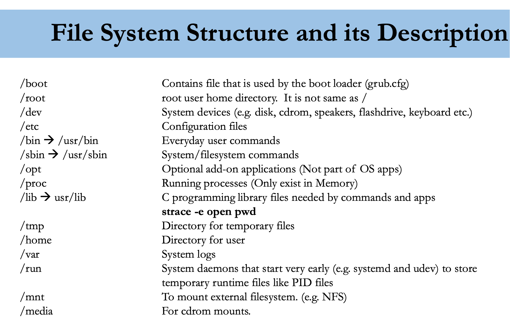
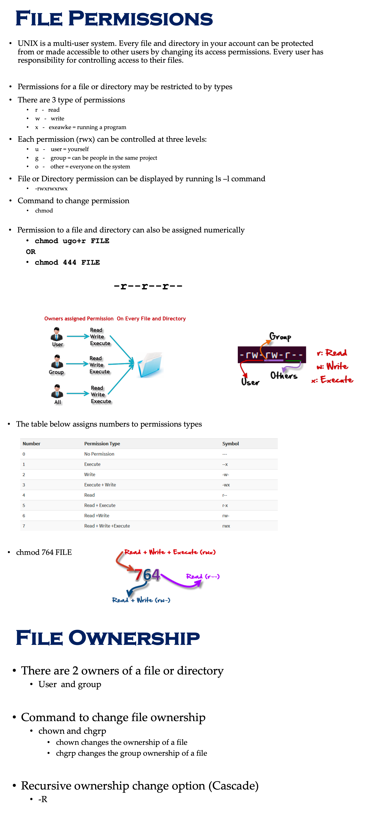
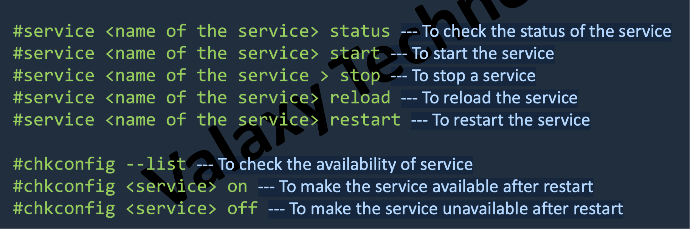
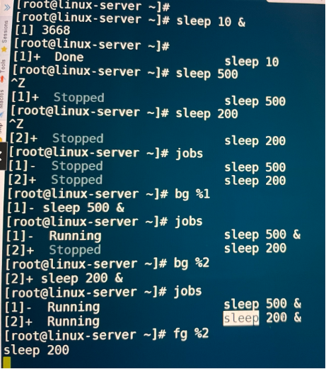
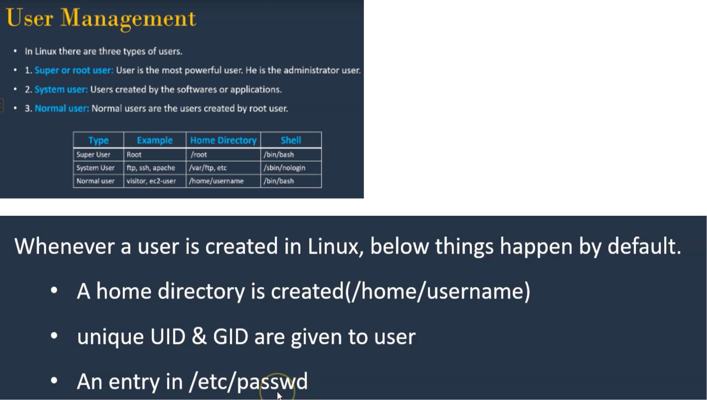

# Linux Fundamentals

It is a system used by an operating system to manage files. The system controls how data is saved or retrieved. 

## File System

### File navigation
- We can use commands like `cd`, `ls` and `pwd` for navigating file system

### Types of root on Linux system
- Root account: root is an account or a username on Linux machine and it is the
most powerful account which has access to all commands and files
- Root as /: the very first directory in Linux is also referred as root directory
- Root home directory: the root user account also has a directory located in /root which is called root home directory

### Paths to navigate to a filesystem 
- Absolute Path
- Relative Path
- An absolute path always begins with a "/". This indicates that the path starts at the root directory. An example of an absolute path is
    - cd /var/log/httpd
- A relative path does not begin with a "/". It identifies a location relative to your current position. An example of a relative path is:
    - cd /var cd log cd httpd

### Creating Files
- touch
- cp 
- vi

### Creating Directories 
- mkdir

### Copying directories
- Command to copy a directory 
    - cp
- To copy a directory on Linux, you have to execute the “cp” command with the “-R” option for recursive and specify the source and destination directories to be copied
    - cp -R <source_folder> <destination_folder>

### Find Files and Directories
Two main commands are used to find files/directories
- find
    - Example: find .(relative path - in this directory or absolute path - /) -name "example.txt"
- locate  
    - Example: locate example.txt

### Searching for a word in a file
- grep lesson myfirstfile.txt
- In VI editor type `/` and then the `word` and hit enter. Then type `n` which will go to the enxt occurance of the word in the file

### Difference Between find and locate
- locate uses a prebuilt database, which should be regularly updated, while find iterates over a filesystem to locate files. Thus, locate is much faster than find , but can be inaccurate if the database (can be seen as a cache) is not updated
- To update locate database run updatedb

### File Permissions
- To change the permission of a file we can also use the following approach
    - chmod u+rw example.txt (Adds user permission with read and write)
    - chmod g+rwe example.txt (Adds group permission with read, write and execute)
    - chmod o+rw example.txt (Adds other permission with read)
    - chmod a-rw example.txt (Removes the read and write permission from all users)
- We can also change the ownership of user or the ownership of the group throught a root user.
    - To login to root user type `su -` and type the root user password
    - To logout from root user type `exit`
    - To check current logged in user type `whoami`
    - chown root username (change user of this file from current user `username` to root)
    - chgrp root username (change group of this file from current `root` user to`username` user)
    - If a directory has a read, write and execute permission in your /home/username directory, then any file inside of it can be read,write and execute by the user irrespective of each files ownership and group
    - So basically depending on the ownership, group and permissions combo, user can either read/write/execute the files 

### Add text to a file
- Use `vi` editor and add or delete anything from it
- `echo "add this text to a file" > example.txt` -> This will add the provided text inside the file. If you use this single `>` it will override the previous text
- `echo "add this text to a file" >> example.txt` -> This will add the provided text inside the file. This `>>` will not override the previous text, isntead just appends.
- `ls -ltr > text.txt` -> This will output the entire output of the command `ls -ltr` to a text file
- We can use the command `touch` to create a new file

### File Maintenance Commands
- cp
- rm
- mv
- mkdir
- rmdir or rm -r 
- chgrp
- chown

### File Display Commands
- cat filename => view file content
- more => page by page
- less => line by line or page by page
- head => first number of lines => head -20 sample.txt
- tail => last number of lines => tail -20 sample.txt

### Create & Delete file/directory
- touch => create a 0 bites or empty file
- cat > filename => create file and allow to write. Deletes all the existing content of the file
- cat >> filename => create file and allow to write. If file already exists and it has some data, this will append the new data
- nano => create a file if filename doesn’t exist
- vi => create a file if filename doesn’t exist
- rm => remove a file
- mkdir => Create a directory
- rmdir => Remove a empty directory
- rm -rf => Remove a directory

### Managing files or directories
- cp => Copy a file
- mv => Move a file
- find => Find a file => find / -name example.txt
- grep => Search for a pattern in a file => grep -i "hello user!" filename => ls -l | grep filename => ls -l | grep ^d (search only directories, starting of the line is d)
- cd => Switch between directories
- diff => Find content difference in 2 files => diff file2 file3
- sed => search and replace particular pattern in a file. It will only modify the output, not the orizinal file
- chmod => Change file permissions
- chown => Change Ownership of a file
- file => Show what kind of file it is

## System Management

- history: list all commands executed by a user
- free: Free memory of a server
- /proc/meminfo: Displays memory information
- /proc/cpuinfo: Displays CPU information
- uname -a: show kernel information
- du: show directory space usage
- whereis: show possible locations of app
- which: show which app will be run by default

## Networking
- IP Address: An IP address can be thought of as being similar to a phone number. Just as every person who communicates with a telephone is using a phone with a unique phone number, every computer that is on the Internet has a unique IP address. Not only on internet but within an organization every computer is assigned an IP address so that they can communicate with each other.
- hostname: lists host name of the server
- ping <ip>: availability of destination server over the network
- wget: download packages/softwars onto Linux system
- ifconfig -a: lists IP address(es) of the server
- ip addr
- telnet: connect to remote host / check port availability status => `telnet 13.1227.93.20 80`
- curl: acces the application as from browser
- netstat: To check which are all servers are running on which ports => `netstat -tulpn`

### Port Numbers
- 21: FTP
- 22: SSH
- 23: TELNET
- 25: SMTP
- 53: DNS
- 80: HTTP
- 443: HTTPS

## Software Management
yum is the primary tool for getting, installing, deleting, querying, and managing RedHat Enterprise Linux RPM software packages from official RedHat software repositories, as well as other third-party repositories.

Commands:
- yum install <package name>
- yum remove <package name>
- yum update <package name>
- yum info <package name>
- yum list available
- yum list installed

## Services
service - This controls the starting and stopping of services 

chkconfig - This controls which services are set to start on boot

## Process Management
- When you start a program or running an application in Linux, it actually run as a process
- A Linux process (a daemon), running in foreground or in the background, uses memory and CPU resources.
- Commands
    - ps -ef: list the process which are running in the system => `ps -ef | grep httpd`
    - kill / kill -9: kill a process or service
    - fg: run the program in the foreground
    - bg: Run the service in the back group
    - top: List top 20 process which are consuming more CPU

 

## Archiving files or directories
- gzip: Create a compressed file => gzip file1
- gunzip: Unzip a file => gunzip file1.gz
- tar: extract tar file  => tar -cvf dir1.tar dir1(archive) => tar -xvf dir1.tar(unarchive) => tar -xvzf dir1.tar.gz

## Compress and un-Compress Files
- tar
- gzip
- gzip –d OR gunzip

## Pipes
A pipe is used by the shell to connect the output of one command directly to the input of another command.

Example:
    - ls -ltr | more -> This will display output page by page. Use `spacebar` to move to the next page.
    - ls -l | tail -1 -> This will give the last line of ls -l command

## `sed` command
- Replace a string in a file with a newstring => `sed -i(insert the changes into file) 's(substitute)/Kenny/Lenny/g(entire Kenny)' samplefile`
- Find and delete a line => `sed -i '/Kenny/d' samplefile`
- Remove empty lines => `sed -i '/^$(anything ends with nothing)/d' samplefile`
- Remove the first or n lines in a file => `sed -i '1,2d' samplefile`
- To replace tabs with spaces or spaces with tabs => `sed -i 's/\t/ /g' samplefile`
- Show defined lines from a file => `sed -n 12,18p samplefile`
- Substitute within vi editor

## User Account Management(Needs to be in root user through command `su -`)
- useradd => `useradd spiderman` => to verify go to `/home/` directory where spiderman file will be created with user as spiderman and group as spiderman
- groupadd => `groupadd superheroes` => to verify open the file `/etc/group` where this new group will be appended
- userdel => `userdel -r spiderman`
- groupdel => `groupdel superheroes`

## Switch Users and sudo Access
- su – spiderman => Will switch to spiderman user
- su - => will switch to root user. From root user we can switch to any other user without entering any password.
- sudo commands => to run any command as a root user

## Monitor Users
- who => lists all the logged in users
- last => lists all the user who logged from begining
- w => similar to who but it gives more informations
- id username => provides more details of the user

## Talking to Users
- users => this will list all the logged in users
- wall => this will broadcast a message to all the logged in user. We need to hit enter and then type the needed message like I am going to reboot the system and again hit the enter to send the message.
- write => `write spider` => here we are braodcasting the message only to one specific logged in user. And then the other user can respond back to the broadcasted user.

## CronTab

In any operating system, it is possible to create jobs that you want to reoccur. This process known as job scheduling, is usually done based on user-defined jobs. For RedHat or any other Linux, this process is handled by the cron service or a daemon called crond, which can be used to schedule tasks
- commands
    - crontab -l => to list all the avaiable crontab
    - crontab -e => to edit and add a new crontab

