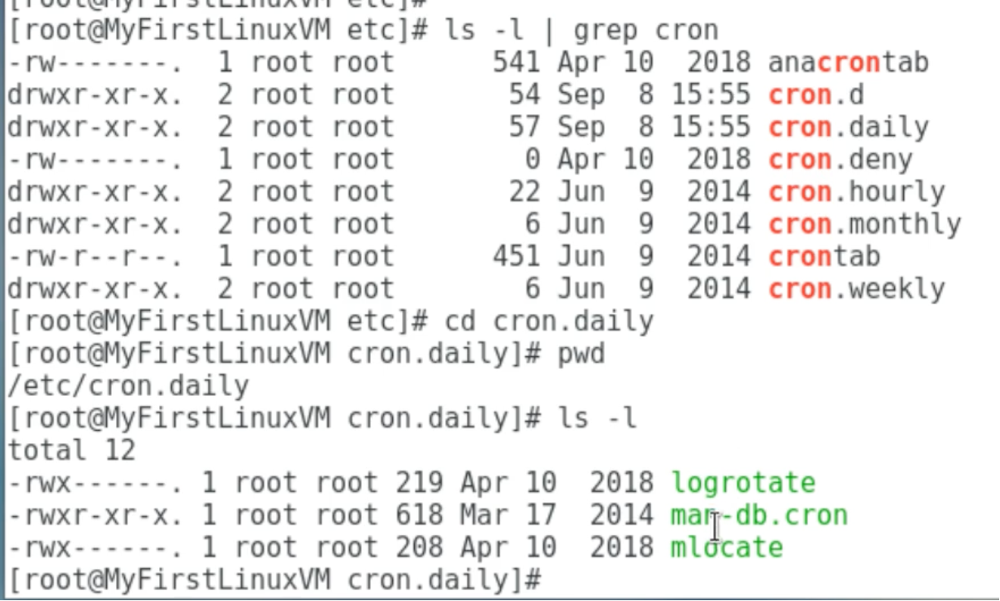
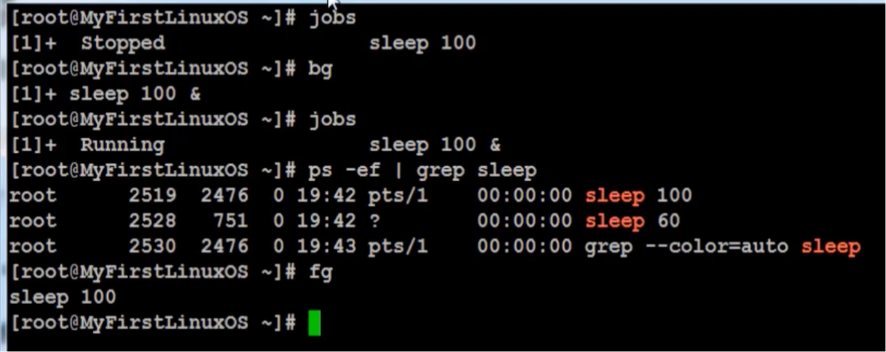

# System administration

## Linux account authentication
What if a system admin need to create user account on 1000 of servers. It will be dificult to login to each of the server and add the user account. It will also be difficult to manage the account or delete the account on all those 1000 of servers.

### Types of accounts
- Local accounts => system admin manages adding a new users and adding them to particular group to provide the permission 
- Domain/Directory accounts => This is a database where we store all the user account details in one place. Now there will be another server called directory server which connects to this database to fetch each user details. Now each of the 1000 clients(or the linux machine), try to authenticate against this directory server by providing authentication details, and once the authentication is passed, then only each of those linux machine will allow the user to login. So here we do not store any of the user account locally.
- In Windows we have built-in `Active directory` and we have a protocol called `LDAP` and redhat has a built in Identity Manager(IDM) for this purpose
- Lets say you login to facebook and do you think your account info will be saved in linux machine where facebook application is running? No. This will be saved in some kind of active directory databases against which we are authenticated. 
- WinBind protocol => This is used in Linux to communicate with Windows, so that windows active directory user can login to linux machine. The famous tool for this purpose is `samba`
- OpenLDAP => This is one of the implementation of the LDAP protocol which is free to use and specifically used in Linux

## System Utility Commands
- date => shows current date and tine
- uptime => how long the system is up and how many users have logged into the system and average load of the system
- hostname => shows hostname of the system 
- uname => shows which OS system is using. Linux or Solaries etc
- which => this command shows where the particular command is localted. For ex `which pwd` command returns the value as `/usr/bin/pwd` script
- cal => shows the calender
- bc => binary calculator to do some simple calculations

## Processes and Job
- Application/Service => its a program running on your computer which does some specific functionality. Ex: PowerPoint, Chrome, Photos, Apache etc
- Script => A script is something that is written in a file and then packaged it to in a way that it will execute. So any application that is running in your computer, for example, Apache, you would have to run that as a script and that will run in the background.
- Process => When you run an application or when you start up an application, it actually generates process with it's process ID. Now processes could be one associated to that application, or it could be multiple processes.
- Daemon => The daemon is, I could tell you when I compare it with the process, is something that continuously runs in the background or it doesn't stops. So when you run a daemon, which is also a process but it keeps on running the background and it keeps listening to the incoming traffic or outgoing traffic.
- Threads => Every process could have multiple threads associated with it.
- Job => A job is something that is created by scheduler like a work order to run those application and services.

## Process/Services Commands and CronJob (Systemd and Crond)
- **Systemd** is a tool that controls several systems in Linux: systemctl(new system) or service(old system) is one of the systemd utility which controls(configure/start/stop) the system and services/application
    - **systemctl** command is a new tool to control system services/applications, or third party applications
    - Example:
        - systemctl start|stop|status servicename.service => `systemctl status apache2`
        - systemctl enable/disable servicename.service => This will make sure the service to start during the linux boot
        - systemctl restart|reload servicename.service => to relaod any configuration changes
        - systemctl list-units --all => lists all the services 
    - To add any third party service under systemctl management:
        - Create a unit file in /etc/systemd/system/servicename.service or /usr/lib/systemd/system/servicename.servic
    - To control system with systemctl
        - systemctl poweroff => power off the linux system
        - systemctl halt
        - systemctl reboot => reboots the linux system
- ps command stands for process status 
    - It displays all the currently running processes in the Linux system
    - Ex: `ps -aux`
- top => You'll see all your processes running in your system depending on which process you want to see first, based on its load, and it also tells you your memory information, CPU information that is being used by that process
- kill => It kills by the process name or kills by the process id. Ex: `kill -9 PID`, to forcefully kill
- crontab or **crond service** => **Crontab** command is used to schedule these applications or these process or these services for you in your system. 
    - `crontab -e` hit enter and type `21 16 * 10 * echo “This is my first crontab entry” > crontab-entry` save and close. This will create a new file after a second with the file name crontab-entry and the provided text value.
    - `crontab -l` to list all the entry in a crontab
    - `crontab -r` to remove all the entry
    - To check the status of this cron type `systemctl status crond`
- at => At command is just like crontab. The only difference between at and crontab is at is schedule as one time basis or as an ad hoc process.

### Additional cron jobs
Through `corntab -e` we can set the cron jobs through regular expressions manually. Another way is to have different script under these 4 types of cronjobs as per requirement.
- By default, there are 4 different types of cronjobs 
    - Hourly => we can keep multiple scripts under **`/etc/cron.hourly`** folder which will run automatically every hour.
    - Daily
    - Weekly 
    - Monthly
- All the above crons are setup in 
    - /etc/cron.___ (directory). Ex: /etc/cron.hourly, /etc/cron.daily
- The timing when to run the scripts, for each are set in
    - /etc/anacrontab -- except hourly
- For hourly
    - /etc/cron.d/0hourly

### Process Management
Anything that has to do with the process, how we manage it, how we start it, how we stop it, and how we bring it in the foreground, how we bring it in the background; all that stuff is process management.

- To run in the background by providing the command prompt back: Commands are Ctrl-z, combination of jobs and bg
- Foreground = fg
- Run process even after exiting the terminal = `nohup <process name> &`. Ex: `nohup sleep 100 &`
    - OR we can use `nohup process > /dev/null 2>&1 &`
- Kill a process by name = pkill. Ctrl+c also kills the process.
- Process priority = nice (e.g. nice –n 5 process)
    - The niceness scale goes from -20 to 19. The lower the number more
- Process monitoring = top 
- List process = ps.

## System Monitoring command
- top
- df => DF gives you your disk partition information.
- dmesg => Dmesg gives you the output of the system related warnings, error messages, failures or anything like that
- iostat 1 => IO stands for input and output statistics, what's coming in, what's going out, how we are communicating with our system peripheral devices or system internal devices, even if it's a disk or network.
- netstat -rnv => to find out my gateway information, my subnet mask and what interface it is going through etc
- cat /proc/cpuinfo => contains cpu information
- cat /proc/meminfo => contains memory information

## System Log Monitoring command
Log Directory is `/var/log`
- boot
- cron
- maillog 
- secure
- messages 
- httpd

## System Maintenance Commands
- shutdown 
- init 0-6
- reboot
- halt
- halt brings the system down to its lowest state, but leaves it powered on. Shutdown brings the system down to its lowest state, and will turn off the power

## Changing System Hostname
- hostnamectl => set-hostname newhostname
- Filepath is `/etc/hostname

## System architecture

Differences between a 32-bit and 64-bit CPU

- A big difference between 32-bit processors and 64-bit processors is the number of calculations per second they can perform, which affects the speed at which they can complete tasks. 64-bit processors can come in dual core, quad core, six core, and eight core versions for home computing. Multiple cores allow for an increased number of calculations per second that can be performed, which can increase the processing power and help make a computer run faster. Software programs that require many calculations to function smoothly can operate faster and more efficiently on the multi-core 64-bit processors
- type the command `arch` to check the architecture of the system

## Terminal Control Keys
- CTRL-u => erase everything you've typed on the command line
• CTRL-c => stop/kill a command
• CTRL-z => suspend a command
• CTRL-d => exit from an interactive program (signals end of data).

## Terminal Commands
- clear => Clears your screen
- exit => Exit out of the shell, terminal or a user session
- script => The script command stores terminal activities in a log file that can be named by a user, when a name is not provided by a user, the default file name, typescript is used. So that all the history of typed command will be logged in the mentioned file

## Environment Variables
- To view all environment variables 
    - printevn OR env
- To view ONE environment variable 
    - echo $SHELL
- To set the environment variables
    - export TEST=1
    - echo $TEST
- To set environment variable permanently(only ti my user)
    - vi .bashrc
    - TEST=‘123’
    - export TEST
- To set global environment variable permanently(to everyone else who logs into the system)
    - vi/etc/profileor/etc/bashrc
    - Test=‘123’
    - export TEST