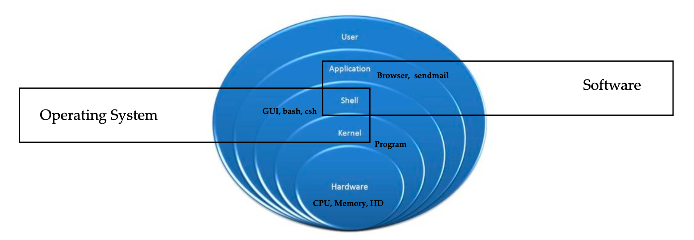

# Shell Script

## Linux Architecture
 
- At the innermost layer we have hardware like CPU, memory and disk.
- Then we have a Kernel which is an interface between hardware and Software. A kernel is a program that is stored inside of your operating system. It's like a program, a command that keeps on running. And what it does is it takes the commands from shell.
- A shell is anything like a GUI that we have in Windows, or a GUI in Linux. Or if you don't have GUI in Linux, we have terminal that runs bash shell or C shell.
- So when we are in that bash or C shell terminal environment, we execute commands. The commands are being forwarded to kernel. And it's kernel's responsibility to talk to the hardware that's inside of your computer.
- And then, on top of that, you have a browser, Sendmail, all the applications that we run, like calculator, calendar, Office, or any Linux-related applications.
- Finally we have user who interact with these applications
- So shell and kernel together, that software built together in one package, and that is called operating system. And that operating system is any operating system, like Linux, Unix, Mac, or Windows.
- And anything that is a shell, which is written in C programming language as well, that shell or those applications are actually the software.



## Shell

### What is a Shell?
- Its like a container
- Interface between users and Kernel/OS
- CLI is a Shell
- Windows GUI is a shell
- Linux KDE GUI is a shell
- Linux sh, bash etc. is a shell

### Find your Shell
- echo $0 => O/P bash. By default it uses bash shell and we can configure it to use different ones.
- Available Shells “cat /etc/shells” 
    - /bin/sh
    - /bin/bash
    - /bin/tcsh
    - /bin/csh
    - /sbin/nologin
    - /usr/bin/sh
    - /usr/bin/bash
- Your Shell? /etc/passwd

### Types of Shell
- sh (Bourne shell)
- bash (Bourne again shell) => It has a lot of enhanced features and it is very user friendly. It is widely used in linux system
- ksh (Korn shell) => Most of the time it is used in Solaries
- csh and tcsh => written in C and C++
- GUI shells like KDE and Gnome

### Starting a Shell
- Type shell name e.g. csh
- Type exit to exit out of shell

### Shell Scripting
What is a Shell Script?
- A shell script is an executable file containing multiple shell commands that are executed sequentially. - The file can contain:
    - Shell(#!/bin/bash) => always first line of file contian definition of shell script
    - Comments(#comments)
    - Commands(echo,cp,grepetc.)
    - Statements(if,while,foretc.)
- Shell script should have executable permissions (e.g. -rwx r-x r-x)
- Shell script has to be called from absolute path (e.g /home/userdir/script.bash)
- If called from current location then ./script.bash

### Basic Scripts example
- Output to screen using “echo”.
    - Create a new file `example`   
    - Type the below lines into it
    ```
    #!/bin/bash

    echo hello world
    ```
    - Change the permisison of this file to executable. `chmod a+x example`
    - Run this file `./example`
- Defining tasks
```
#!/bin/bash
# define small tasks

whoami
echo
pwd
echo
hostname
echo
ls -ltr
echo
```
- Defining variables and log it
```
#!/bin/bash
# Example of defining variables

a=Prasanna
b=Adiga
c='Linux class'

echo "My first name is $a" # use $ sign for variable
echo "My last name is $b"
echo "My clas is $c"

```    

- Input/Output
```
#!/bin/bash

# Author
# Date
# Description

a=`hostname` #If you want to run a variable, we have to enclose it with ``
echo Hello, my server name is $a
echo
echo What is your name?
read yourname
echo
echo Hello $yourname
echo
```

### if-then
```
#!/bin/bash

count=100
if [ $count -eu 100 ]
then 
    echo count is 100
else 
    echo count is not 100
fi 
```       
    
```    
#!/bin/bash
if [ -e /home/prasanna/hello.txt ] # -e means exist
    then 
        echo "file exist"
    else 
        echo "file does not exist"
fi
``` 

```
#!/bin/bash
if [ "$arg1" = "$arg2" ] && [ "$arg1" != "$arg3" ]
then 
    echo "Two of the provided args are equal."
    exit 3
elif [ $arg1 = $arg2 ] && [ $arg1 = $arg3 ]
then
    echo "All of the specified args are equal"
    exit 0
else
    echo "All of the specified args are different"
    exit 4 
fi
```

### For loop

```
#!/bin/bash

for i in 1 2 3 4 5
do
echo "Welcome $i times"
done
```

```
#!/bin/bash

for i in eat run jump play
do
echo See prasanna $i
done
```

```
#!/bin/bash

for i in {0..10..2} # {start end increment}
do
  echo "Welcome $i times"
done
```

### do-while loop
```
#!/bin/bash
c=1
while [ $c -le 5 ]
do
	echo "Welcone $c times"
	(( c++ ))
done
```

### Case statement
```
#!/bin/bash

echo 
echo Please choose one of the option below
echo
echo 'a = Display date and time'
echo 'b = Lise files and directories'
echo 'c = List users logged in'
echo 'd = Check system uptime'
echo
    read choices
    case $choices in
a) date;;
b)ls;;
c)who;;
d)updtime;;
e echo Invalid choice - bye    
```

### Aliases
Aliases is a very popular command that is used to cut down on lengthy and repetitive commands

Examples:
- alias ls="ls -al“
- alias pl=“pwd; ls”
- alias tell=“whoami; hostname; pwd”
- alias dir="ls -l | grep ^d"
- alias lmar=“ls –l | grep Mar”
- alias wpa= "chmod a+w"

### Creating User or Global Aliases
- User = Applies only to a specific user profile
- Global = Applies to everyone who has account on the system
- User = /home/user/.bashrc 
- Global = /etc/bashrc